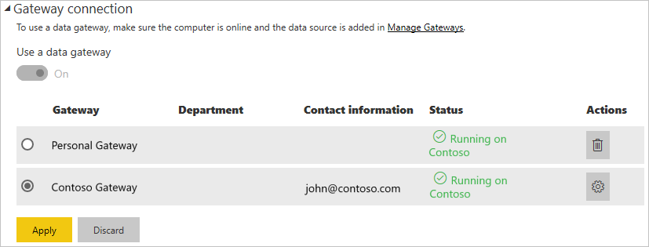

# Manage your data source - Oracle

Once you've [installed the on-premises data gateway](/data-integration/gateway/service-gateway-install), you'll need to [add data sources](service-gateway-data-sources.md#add-a-data-source) that can be used with the gateway. This article will look at how to work with gateways and Oracle data sources either for scheduled refresh or for DirectQuery.

## Installing the Oracle client

In order for the gateway to be able to connect to your Oracle server, the Oracle Data Provider for .NET (ODP.NET) needs to be installed and configured. This is part of the Oracle Data Access Components (ODAC).

For **32-bit** versions of Power BI Desktop, use the following link to download and install the **32-bit** Oracle client:

* [32-bit Oracle Data Access Components (ODAC) with Oracle Developer Tools for Visual Studio (12.1.0.2.4)](http://www.oracle.com/technetwork/topics/dotnet/utilsoft-086879.html)

For **64-bit** versions of Power BI Desktop, or for the on-premises data gateway, use the following link to download and install the **64-bit** Oracle client:

* [64-bit ODAC 12.2c Release 1 (12.2.0.1.0) for Windows x64](http://www.oracle.com/technetwork/database/windows/downloads/index-090165.html)

Once that is installed, you'll need to configure your tnsnames.ora file with the proper information for your database. Power BI Desktop and the gateway will go off of the net_service_name defined in the tnsnames.ora file. If it isn't configured, you won't be able to connect. The default path for tnsnames.ora is `[Oracle Home Directory]\Network\Admin\tnsnames.ora`. For more information about how to configure tnsnames.ora files, see [Oracle: Local Naming Parameters (tnsnames.ora)](https://docs.oracle.com/cd/B28359_01/network.111/b28317/tnsnames.htm).

### Example tnsnames.ora file entry

The basic format of an entry in tnsname.ora is the following.

```
net_service_name=
 (DESCRIPTION=
   (ADDRESS=(protocol_address_information))
   (CONNECT_DATA=
     (SERVICE_NAME=service_name)))
```

Here is an example of the server and port information filled in.

```
CONTOSO =
  (DESCRIPTION =
    (ADDRESS = (PROTOCOL = TCP)(HOST = oracleserver.contoso.com)(PORT = 1521))
    (CONNECT_DATA =
      (SERVER = DEDICATED)
      (SERVICE_NAME = CONTOSO)
    )
  )
```

## Add a data source

For information about how to add a data source, see [Add a data source](service-gateway-data-sources.md#add-a-data-source). Select Oracle for the **Data Source Type**.


Once you've selected the Oracle data source type, you'll then fill in the information for the data source, which includes the **Server** and the **Database**.  

You'll also need to choose an **Authentication Method**.  This can either be **Windows** or **Basic**.  You'll want to choose **Basic** if you're going to use an account that's created within Oracle instead of Windows Authentication. Then enter the credentials that will be used for this data source.

> [!NOTE]
> All queries to the data source will run using these credentials. To learn more about how credentials are stored, see [Storing encrypted credentials in the cloud](service-gateway-data-sources.md#storing-encrypted-credentials-in-the-cloud).


Select **Add** after you have everything filled in. You can now use this data source for scheduled refresh, or DirectQuery, against an Oracle server that is on-premises. You'll see *Connection Successful* if it succeeded.


### Advanced settings

Optionally, you can configure the privacy level for your data source. This controls how data can be combined. This is only used for scheduled refresh. It does not apply to DirectQuery. To learn more about privacy levels for your data source, see [Privacy levels (Power Query)](https://support.office.com/article/Privacy-levels-Power-Query-CC3EDE4D-359E-4B28-BC72-9BEE7900B540).


## Using the data source

After you have created the data source, it will be available to use with either DirectQuery connections, or through scheduled refresh.

> [!WARNING]
> The server and database name have to match between Power BI Desktop and the data source within the on-premises data gateway.

The link between your dataset and the data source within the gateway is based on your server name and database name. These have to match. For example, if you supply an IP Address for the server name within Power BI Desktop, you'll need to use the IP Address for the data source within the gateway configuration. This name also has to match an alias defined within the tnsnames.ora file. For more information about the tnsnames.ora file, see [Installing the Oracle Client](#installing-the-oracle-client).

This is the case for both DirectQuery and scheduled refresh.

### Using the data source with DirectQuery connections

You'll need to make sure the server and database name matches between Power BI Desktop and the configured data source for the gateway. You'll also need to make sure your user is listed in the **Users** tab of the data source in order to publish DirectQuery datasets. The selection, for DirectQuery, occurs within Power BI Desktop when you first import data. For more information about using DirectQuery, see [Use DirectQuery in Power BI Desktop](desktop-use-directquery.md).

After you publish, either from Power BI Desktop or **Get Data**, your reports should start working. It may take several minutes, after creating the data source within the gateway, for the connection to be usable.

### Using the data source with scheduled refresh

If you're listed in the **Users** tab of the data source configured within the gateway, and the server and database name match, you'll see the gateway as an option to use with scheduled refresh.



## Troubleshooting

You may encounter several errors from Oracle when the naming syntax is either incorrect or not configured properly.

* ORA-12154: TNS: could not resolve the connect identifier specified  
* ORA-12514: TNS listener does not currently know of service requested in connect descriptor  
* ORA-12541: TNS: no listener  
* ORA-12170: TNS:Connect timeout occurred  
* ORA-12504: TNS listener was not given the SERVICE_NAME in CONNECT_DATA  

These errors could occur if either the Oracle client isn't installed, or if it isn't configured properly. If it is installed, you'll want to verify the tnsnames.ora file is properly configured and you're using the proper net_service_name. You'll also need to make sure that the net_service_name is the same between the machine using Power BI Desktop and the machine that is running the gateway. For more information, see [Installing the Oracle Client](#installing-the-oracle-client).

> [!NOTE]
> You may also be hitting an issue due to compatability between the Oracle server version and the Oracle client version. Typically you want these to match.

For additional troubleshooting information relating to the gateway, see [Troubleshooting the on-premises data gateway](/data-integration/gateway/service-gateway-tshoot).

## Next steps

* [Troubleshoot gateways - Power BI](service-gateway-onprem-tshoot.md)
* [Power BI Premium](service-premium.md)

More questions? [Try asking the Power BI Community](http://community.powerbi.com/)

