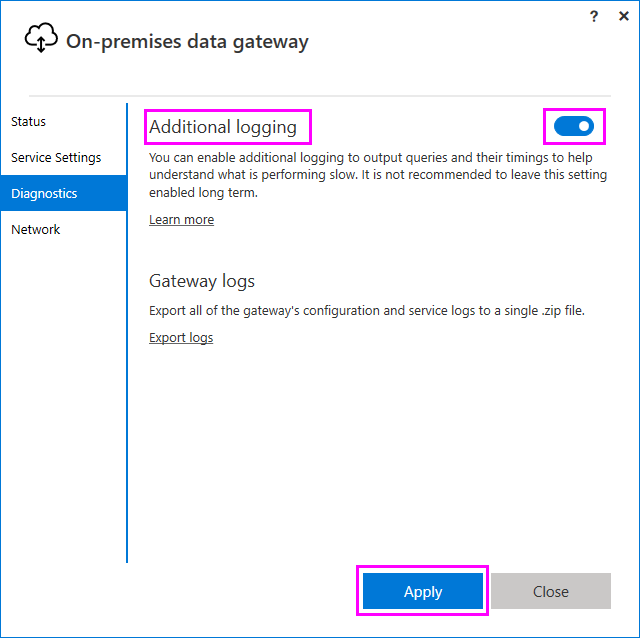
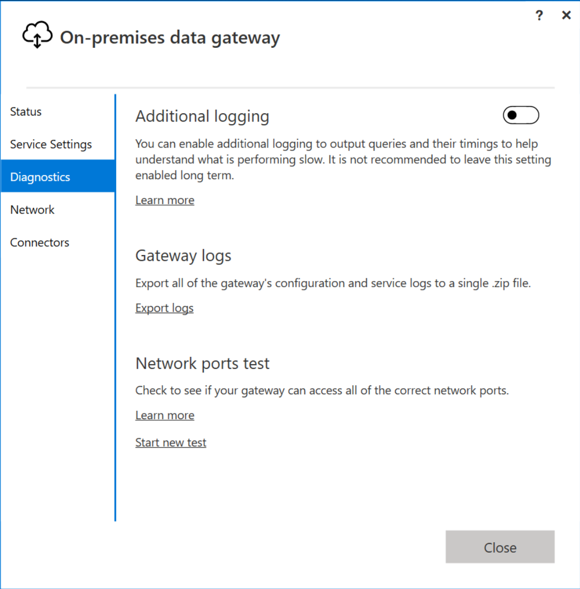
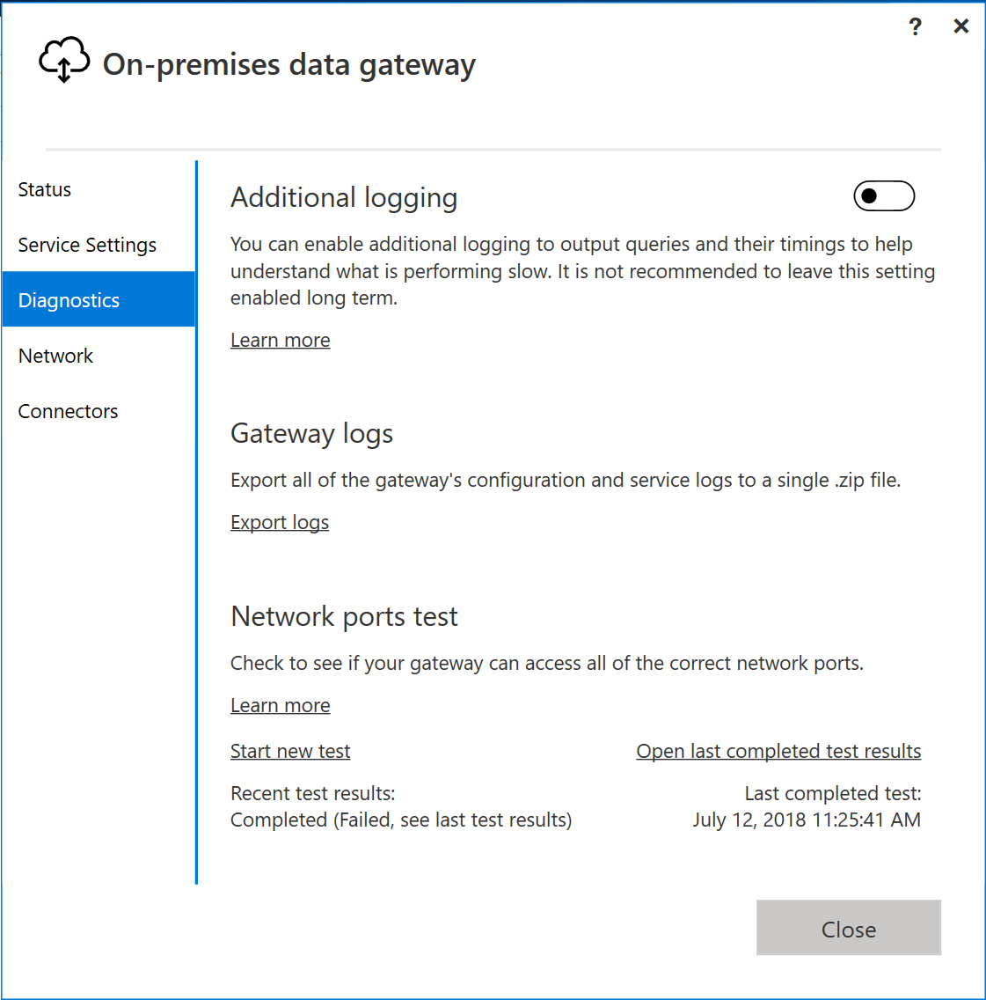
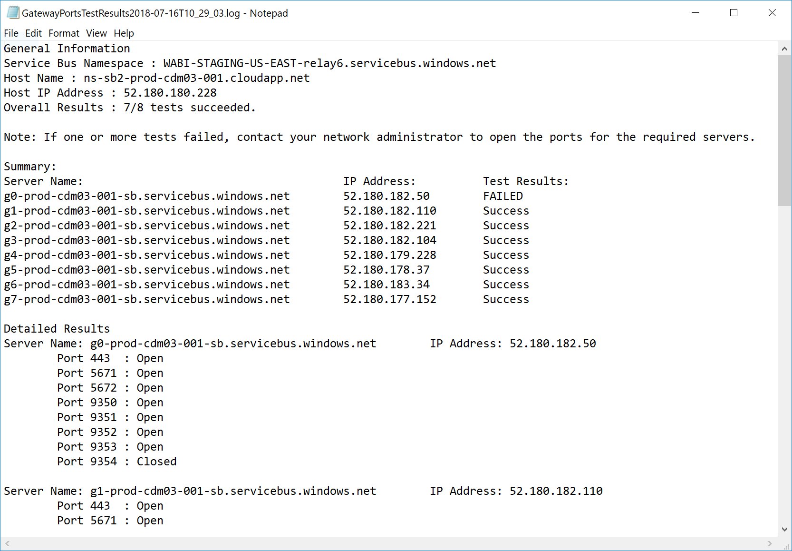

# Troubleshooting the On-premises data gateway

This article discusses some common issues when using the **On-premises data gateway**.

<!-- Shared Community & support links Include -->
[!INCLUDE [gateway-onprem-tshoot-support-links-include](./includes/gateway-onprem-tshoot-support-links-include.md)]

<!-- Shared Troubleshooting Install Include -->
[!INCLUDE [gateway-onprem-tshoot-install-include](./includes/gateway-onprem-tshoot-install-include.md)]

## Configuration

### How to restart the gateway

The gateway runs as a Windows service, so you can start and stop it in a few ways. For example, you can open a command prompt with elevated permissions on the machine where the gateway is running and then run either of these commands:

* To stop the service, run this command:

    '''
    net stop PBIEgwService
    '''

* To start the service, run this command:

    '''
    net start PBIEgwService
    '''

### Log file configuration

The gateway service logs are categorized into three buckets: information, error, and network. This categorization provides a better troubleshooting experience that allows you to focus on a specific area, depending on the error or issue. You can see the three categories in the following snippet from the gateway configuration file: `GatewayInfo.log,GatewayErrors.log,GatewayNetwork.log`.

```xml
  <system.diagnostics>
    <trace autoflush="true" indentsize="4">
      <listeners>
        <remove name="Default" />
        <add name="ApplicationFileTraceListener"
             type="Microsoft.PowerBI.DataMovement.Pipeline.Common.Diagnostics.RotatableFilesManagerTraceListener, Microsoft.PowerBI.DataMovement.Pipeline.Common"
             initializeData="%LOCALAPPDATA%\Microsoft\On-premises data gateway\,GatewayInfo.log,GatewayErrors.log,GatewayNetwork.log,20,50" />
      </listeners>
    </trace>
  </system.diagnostics>
```

This file is located by default at: *\Program Files\On-premises data gateway\Microsoft.PowerBI.EnterpriseGateway.exe.config*. To configure the number of log files to retain, change the first number (20 in this example): `GatewayInfo.log,GatewayErrors.log,GatewayNetwork.log,20,50`.

### Error: Failed to create a gateway. Try again

All of the details are available, but the call to the Power BI service returned an error. The error and an activity id are displayed. This could happen for different reasons. You can collect, and review, the logs, as mentioned below, to get more details.

This could also be due to proxy configuration issues. The user interface does now allow for proxy configuration. You can learn more about making [proxy configuration changes](service-gateway-proxy.md)

### Error: Failed to update gateway details. Please try again

Information was received from the Power BI service to the gateway. The information was passed onto the local windows service, but it failed to return. Alternatively, a symmetric key generation failed. The inner exception is displayed under **Show details**. To get more details, you can collect and review the logs mentioned below.

### Error: Power BI service reported local gateway as unreachable. Restart the gateway and try again

At the end of configuration, the Power BI service is called again to validate the gateway. The Power BI service does not report the gateway as *live*. Restarting the windows service may allow the communication to be successful. You can collect, and review, the logs, as mentioned below, to get more details.

### Script error during sign into Power BI

You may receive a script error when signing into Power BI as part of the On-premises data gateway configuration. Installing the following security update resolves the issue. This can be installed via Windows Update.

[MS16-051: Security update for Internet Explorer: May 10, 2016 (KB 3154070)](https://support.microsoft.com/kb/3154070)

### Gateway configuration failed with a null reference exception

You may encounter an error similar to the following.

        Failed to update gateway details.  Please try again.
        Error updating gateway configuration.

This includes a stack trace, and that stack trace may include the following message.

        Microsoft.PowerBI.DataMovement.Pipeline.Diagnostics.CouldNotUpdateGatewayConfigurationException: Error updating gateway configuration. ----> System.ArgumentNullException: Value cannot be null.
        Parameter name: serviceSection

If you are upgrading from an older gateway, we preserve the config file. There may be a section that is missing. When the gateway tries to read it, we can get the above null reference exception.

To correct this, do the following steps.

1. Uninstall the gateway.
2. Delete the following folder.

        c:\Program Files\On-premises data gateway
3. Reinstall the gateway.
4. Optionally apply the recovery key to restore an existing gateway.

## Support for TLS 1.2

By default, the On-premises data gateway uses Transport Layer Security (TLS) 1.2 to communicate with the Power BI service. To ensure all gateway traffic uses TLS 1.2, you might have to add or modify the following registry keys on the machine running the gateway service:

```
[HKEY_LOCAL_MACHINE\SOFTWARE\Microsoft\.NETFramework\v4.0.30319]"SchUseStrongCrypto"=dword:00000001
[HKEY_LOCAL_MACHINE\SOFTWARE\Wow6432Node\Microsoft\.NETFramework\v4.0.30319]"SchUseStrongCrypto"=dword:00000001
```

> [!NOTE]
> Adding or modifying these registry keys applies the change to all .NET applications. For information about registry changes that affect TLS for other applications, see [Transport Layer Security (TLS) registry settings](https://docs.microsoft.com/windows-server/security/tls/tls-registry-settings).

## Data sources

### Error: Unable to Connect. Details: "Invalid connection credentials"

Within **Show details**, it displays the error message received from the data source. For SQL Server, you see something like the following.

    Login failed for user 'username'.

Verify that you have the correct username and password. Also, verify that those credentials can successfully connect to the data source. Make sure the account being used matches the **Authentication Method**.

### Error: Unable to Connect. Details: "Cannot connect to the database"

We were able to connect to the server, but not to the database supplied. Verify the name of the database, and that the user credential as the proper permission to access that database.

Within **Show details**, it displays the error message received from the data source. For SQL Server, you see something like the following.

    Cannot open database "AdventureWorks" requested by the login. The login failed. Login failed for user 'username'.

### Error: Unable to Connect. Details: "Unknown error in data gateway"

This error could occur for different reasons. Be sure to validate that you can connect to the data source from the machine hosting the gateway. This could be the result of the server not being accessible.

Within **Show details**, you can see an error code of **DM_GWPipeline_UnknownError**.

You can also look in the Event Logs > **Applications and Services Logs** > **On-premises data gateway Service** for more details.

### Error: We encountered an error while trying to connect to <server>. Details: "We reached the data gateway, but the gateway can't access the on-premises data source."

We were unable to connect to the specified data source. Be sure to validate the information provided for that data source.

Within **Show details**, you can see an error code of **DM_GWPipeline_Gateway_DataSourceAccessError**.

If the underlying error message is similar to the following, this means that the account you are using for the data source is not a server admin for that Analysis Services instance. [Learn more](https://docs.microsoft.com/sql/analysis-services/instances/grant-server-admin-rights-to-an-analysis-services-instance)

    The 'CONTOSO\account' value of the 'EffectiveUserName' XML for Analysis property is not valid.

If the underlying error message is similar to the following, it could mean that the service account for Analysis Services may be missing the [token-groups-global-and-universal](https://msdn.microsoft.com/library/windows/desktop/ms680300.aspx) (TGGAU) directory attribute.

    The username or password is incorrect.

Domains with Pre-Windows 2000 compatibility access have the TGGAU attribute enabled. However, most newly created domains do not enable this attribute by default. You can read more about this [here](https://support.microsoft.com/kb/331951).

You can confirm this by doing the following.

1. Connect to the Analysis Services machine within SQL Server Management Studio. Within the Advanced connection properties, include EffectiveUserName for the user in question and see if this reproduces the error.
2. You can use the dsacls Active Directory tool to validate whether the attribute is listed. This is a tool found on a domain controller. You need to know what the distinguished domain name is for the account and pass that to the tool.

        dsacls "CN=John Doe,CN=UserAccounts,DC=contoso,DC=com"

    You want to see something similar to the following in the results.

            Allow BUILTIN\Windows Authorization Access Group
                                          SPECIAL ACCESS for tokenGroupsGlobalAndUniversal
                                          READ PROPERTY

To correct this issue, you need to enable TGGAU on the account used for the Analysis Services windows service.

#### Another possibility for username or password incorrect

This error could also be caused if the Analysis Services server is in a different domain than the users and there is not a two-way trust established.

You need to work with your domain administrators to verify the trust relationship between domains.

#### Unable to see the data gateway data sources in the 'Get Data' experience for Analysis Services from the Power BI service

Make sure that your account is listed in the **Users** tab of the data source within the gateway configuration. If you don't have access to the gateway check with the administrator of the gateway and ask them to verify. Only accounts in the **Users** list can see the data source listed in the Analysis Services list.

### Error: You don't have any gateway installed or configured for the data sources in this dataset

Ensure that you have added one or more data sources to the gateway, as described in [Add a data source](service-gateway-manage.md#add-a-data-source). If the gateway doesn't appear in the admin portal under **Manage gateways**, try clearing your browser cache or signing out of the service then signing back in.

## Datasets

### Error: There is not enough space for this row

This occurs if you have a single row greater than 4 MB in size. You need to determine what the row is from your data source and attempt to filter it out or reduce the size for that row.

### Error: The server name provided doesn't match the server name on the SQL Server SSL Certificate

This can occur when the certificate CN is for the servers fully qualified domain name (FQDN), but you only supplied the NetBIOS name for the server. This causes a mismatch for the certificate. To resolve this issue, you need to make the server name within the gateway data source, and the PBIX file, to use the FQDN of the server.

### I don't see the On-premises data gateway present when configuring scheduled refresh

This could be because of a few different scenarios.

1. The server and database name don't match between what was entered in Power BI Desktop and the data source configured for the gateway. These need to be the same values. They are not case-sensitive.
2. Your account is not listed in the **Users** tab of the data source within the gateway configuration. You need to get with the administrator of the gateway to be added to that list.
3. Your Power BI Desktop file has multiple data sources within it and not all of those data sources are configured with the gateway. You need to have each data source defined with the gateway for the gateway to show up within Scheduled Refresh.

### Error: The received uncompressed data on the gateway client has exceeded the limit

The exact limitation is 10 GB of uncompressed data per table. If you are hitting this issue, there are good options to optimize and avoid the issue. In particular, reducing the use of highly constant, long string values and instead using a normalized key or removing the column (if not in use) helps.

## Reports

### Report could not access the data source because you do not have access to our data source via an On-premises data gateway

This is usually caused by one of the following.

1. The data source information does not match what is in the underlying dataset. The server and database name need to match between the data source defined for the On-premises data gateway and what you supply within Power BI Desktop. If you use an IP Address in Power BI Desktop, the data source, for the On-premises data gateway, needs to use an IP Address as well.
2. There is not a data source available on any gateway within your organization. You can configure the data source on a new, or existing On-premises data gateway.

### Error: Data source access error. Please contact the gateway administrator

If this report is making use of a live Analysis Services connection, you could be encountering an issue with a value being passed to EffectiveUserName that is either not valid or doesn't have permissions on the Analysis Services machine. Typically, an authentication issue is due to the fact that the value being passed for EffectiveUserName doesn't match a local user principal name (UPN).

To confirm this, you can do the following.

1. Find the effective username within the [gateway logs](#logs).
2. Once you have the value being passed, validate that it is correct. If it is your user, you can use the following command from a command prompt to see the UPN. The UPN looks like an email address.

        whoami /upn

Optionally, you can see what Power BI gets from Azure Active Directory.

1. Browse to [https://developer.microsoft.com/graph/graph-explorer](https://developer.microsoft.com/graph/graph-explorer).
2. Select **Sign in** in the upper right.
3. Run the following query. You see a rather large JSON response.

        https://graph.windows.net/me?api-version=1.5
4. Look for **userPrincipalName**.

If your Azure Active Directory UPN doesn't match your local Active Directory UPN, you can use the [Map usernames](service-gateway-enterprise-manage-ssas.md#map-user-names) feature to replace it with a valid value. Or you can work with either your tenant admin or local Active Directory admin, to get your UPN changed.

<!-- Shared Troubleshooting Firewall/Proxy Include -->
[!INCLUDE [gateway-onprem-tshoot-firewall-include](./includes/gateway-onprem-tshoot-firewall-include.md)]

You can find the data center region you are in by doing the following:

1. Select the **?** in the upper right of the Power BI service.
2. Select **About Power BI**.
3. Your data region is listed in **Your data is stored in**.

    

If you are still not getting anywhere, you could try getting a network trace using a tool like [fiddler](#fiddler) or netsh, although these are advanced collection methods and you may need assistance in analyzing the collected data. You can contact [support](https://support.microsoft.com) for assistance.

## Performance

<iframe width="560" height="315" src="https://www.youtube.com/embed/IJ_DJ30VNk4?showinfo=0" frameborder="0" allowfullscreen></iframe>

### Performance Counters

There are a number of performance counters that can be used to gauge the activities for the gateway. These can be helpful to understand if we have a large load of activity and may need to make a new gateway. These counters do not reflect how long something takes.

These counters can be accessed through the Windows Performance Monitor tool.


There are general groupings of these counters.

| Counter Type | Description |
| --- | --- |
| ADO.NET |This is used for any DirectQuery connection. |
| ADOMD |This is used for Analysis Services 2014 and earlier. |
| OLEDB |Certain data sources use this. This includes SAP HANA and Analysis Service 2016 or later. |
| Mashup |This includes any imported data source. If you are scheduling refresh or doing an on-demand refresh, it goes through the mashup engine. |

Here is a listing of the available performance counters.

| Counter | Description |
| --- | --- |
| # of ADO.NET open connection executed / sec |Number of ADO.NET open connection actions executed per second (succeeded or failed). |
| # of ADO.NET open connection failed / sec |Number of ADO.NET open connections actions failed per second. |
| # of ADO.NET queries executed / sec |Number of ADO.NET queries executed per second (succeeded or failed). |
| # of ADO.NET queries failed / sec |Number of ADO.NET failed queries executed per second. |
| # of ADOMD open connection executed / sec |Number of ADOMD open connection actions executed per second (succeeded or failed). |
| # of ADOMD open connection failed / sec |Number of ADOMD open connection actions failed per second. |
| # of ADOMD queries executed / sec |Number of ADOMD queries executed per second (succeeded or failed). |
| # of ADOMD queries failed / sec |Number of ADOMD failed queries executed per second. |
| # of all open connection executed / sec |Number of open connection actions executed per second (succeeded or failed). |
| # of all open connection failed / sec |Number of failed open connection actions executed per second. |
| # of all queries executed / sec |Number of queries executed per second (succeeded or failed). |
| # of items in the ADO.NET connection pool |Number of items in the ADO.NET connection pool. |
| # of items in the OLEDB connection pool |Number of items in the OLEDB connection pool. |
| # of items in the Service Bus pool |Number of items in the Service Bus pool. |
| # of Mashup open connection executed / sec |Number of Mashup open connection actions executed per second (succeeded or failed). |
| # of Mashup open connection failed / sec |Number of Mashup open connection actions failed per second. |
| # of Mashup queries executed / sec |Number of Mashup queries executed per second (succeeded or failed). |
| # of Mashup queries failed / sec |Number of Mashup failed queries executed per second |
| # of OLEDB multiple result set queries failed / sec |Number of multiple result sets of OLEDB failed queries executed per second. |
| # of OLEDB multiple result sets of queries executed / sec |Number of OLEDB multiple result sets of queries executed per second (succeeded or failed). |
| # of OLEDB open connection executed / sec |Number of OLEDB open connection actions executed per second (succeeded or failed). |
| # of OLEDB open connection failed / sec |Number of OLEDB open connection actions failed per second. |
| # of OLEDB queries executed / sec |Number of OLEDB multiple result sets of queries executed per second (succeeded or failed). |
| # of OLEDB queries failed / sec |Number of OLEDB multiple result sets of failed queries executed per second. |
| # of OLEDB single result set queries executed / sec |Number of OLEDB single result set queries executed per second (succeeded or failed). |
| # of queries failed / sec |Number of failed queries executed per second. |
| # of single result set OLEDB queries failed / sec |Number of single result set OLEDB failed queries executed per second. |

## Reviewing slow performing queries

You may find that response through the gateway is slow. This could be for DirectQuery queries or when refreshing your imported dataset. You can enable additional logging to output queries and their timings to help understand what is performing slow. When you find a long-running query, it may require additional modification on your data source to tune query performance. For example, adjusting indexes for a SQL Server query.

You need to modify two configuration files to determine the duration of a query.

### Microsoft.PowerBI.DataMovement.Pipeline.GatewayCore.dll.config

Within the *Microsoft.PowerBI.DataMovement.Pipeline.GatewayCore.dll.config* file, change the `EmitQueryTraces` value from `False` to `True`. This file is located, by default, at *C:\Program Files\On-premises data gateway*. Enabling `EmitQueryTraces` begins to log queries that are sent from the gateway to a data source.

> [!IMPORTANT]
> Enabling EmitQueryTraces could increase the log size significantly depending on gateway usage. Once you are done reviewing the logs, you can need to set EmitQueryTraces to False. It is not recommended to leave this setting enabled long term.

```
<setting name="EmitQueryTraces" serializeAs="String">
    <value>True</value>
</setting>
```

**Example query entry**

```
DM.EnterpriseGateway Information: 0 : 2016-09-15T16:09:27.2664967Z DM.EnterpriseGateway    4af2c279-1f91-4c33-ae5e-b3c863946c41    d1c77e9e-3858-4b21-3e62-1b6eaf28b176    MGEQ    c32f15e3-699c-4360-9e61-2cc03e8c8f4c    FF59BC20 [DM.GatewayCore] Executing query (timeout=224) "<pi>
SELECT
TOP (1000001) [t0].[ProductCategoryName],[t0].[FiscalYear],SUM([t0].[Amount])
 AS [a0]
FROM
(
(select [$Table].[ProductCategoryName] as [ProductCategoryName],
    [$Table].[ProductSubcategory] as [ProductSubcategory],
    [$Table].[Product] as [Product],
    [$Table].[CustomerKey] as [CustomerKey],
    [$Table].[Region] as [Region],
    [$Table].[Age] as [Age],
    [$Table].[IncomeGroup] as [IncomeGroup],
    [$Table].[CalendarYear] as [CalendarYear],
    [$Table].[FiscalYear] as [FiscalYear],
    [$Table].[Month] as [Month],
    [$Table].[OrderNumber] as [OrderNumber],
    [$Table].[LineNumber] as [LineNumber],
    [$Table].[Quantity] as [Quantity],
    [$Table].[Amount] as [Amount]
from [dbo].[V_CustomerOrders] as [$Table])
)
 AS [t0]
GROUP BY [t0].[ProductCategoryName],[t0].[FiscalYear] </pi>"
```

### Microsoft.PowerBI.DataMovement.Pipeline.Diagnostics.dll.config

Within the *Microsoft.PowerBI.DataMovement.Pipeline.Diagnostics.dll.config* file, change the `TracingVerbosity` value from `4` to `5`. This file is located, by default, at *C:\Program Files\On-premises data gateway*. Changing this setting begins to log verbose entries to the gateway log. This includes entries that show duration. You can also enable verbose entries by enabling the "Additional Logging" button in the On-Premises Gateway application.

   

> [!IMPORTANT]
> Enabling TracingVerbosity to `5` could increase the log size significantly depending on gateway usage. Once you are done reviewing the logs, you need to set TraceVerbosity to `4`. It is not recommended to leave this setting enabled long term.

```
<setting name="TracingVerbosity" serializeAs="String">
    <value>5</value>
</setting>
```

<a name="activities"></a>

### Activity Types

| Activity Type | Description |
| --- | --- |
| MGEQ |Queries executed over ADO.NET. This includes DirectQuery data sources. |
| MGEO |Queries executed over OLEDB. This includes SAP HANA and Analysis Services 2016. |
| MGEM |Queries executed from the Mashup engine. This is used with imported datasets that use scheduled refresh or refresh on-demand. |

### Determine the duration of a query
To determine the time it took to query the data source, you can do the following.

1. Open the gateway log.
2. Search for an [Activity Type](#activities) to find the query. An example of this would be MGEQ.
3. Make a note of the second GUID as this is the request id.
4. Continue to search for MGEQ until you find the FireActivityCompletedSuccessfullyEvent entry with the duration. You can verify the entry has the same request id. Duration is in milliseconds.

        DM.EnterpriseGateway Verbose: 0 : 2016-09-26T23:08:56.7940067Z DM.EnterpriseGateway    baf40f21-2eb4-4af1-9c59-0950ef11ec4a    5f99f566-106d-c8ac-c864-c0808c41a606    MGEQ    21f96cc4-7496-bfdd-748c-b4915cb4b70c    B8DFCF12 [DM.Pipeline.Common.TracingTelemetryService] Event: FireActivityCompletedSuccessfullyEvent (duration=5004)

   > [!NOTE]
   > FireActivityCompletedSuccessfullyEvent is a verbose entry. This entry is not logged unless TraceVerbosity is at level 5.

## Firewall or Proxy

For information on providing proxy information for your gateway, see [Configuring proxy settings for the Power BI gateways](service-gateway-proxy.md).

You can test to see if your firewall, or proxy, may be blocking connections by running [Test-NetConnection](https://docs.microsoft.com/powershell/module/nettcpip/test-netconnection) from a PowerShell prompt. This tests connectivity to the Azure Service Bus. This only tests network connectivity and don't have anything to do with the cloud server service or the gateway. It helps to determine if your machine can actually get out to the internet.

    Test-NetConnection -ComputerName watchdog.servicebus.windows.net -Port 9350

> [!NOTE]
> Test-NetConnection is only available on Windows Server 2012 R2 and later. It is also available on Windows 8.1 and later. On earlier OS versions, you can use Telnet to test port connectivity.

The results look similar to the following. The difference is with TcpTestSucceeded. If **TcpTestSucceeded** is not *true*, then you may be blocked by a firewall.

    ComputerName           : watchdog.servicebus.windows.net
    RemoteAddress          : 70.37.104.240
    RemotePort             : 5672
    InterfaceAlias         : vEthernet (Broadcom NetXtreme Gigabit Ethernet - Virtual Switch)
    SourceAddress          : 10.120.60.105
    PingSucceeded          : False
    PingReplyDetails (RTT) : 0 ms
    TcpTestSucceeded       : True

If you want to be exhaustive, substitute the **ComputerName** and **Port** values with those listed for [ports](https://docs.microsoft.com/power-bi/service-gateway-onprem#ports)

The firewall may also be blocking the connections that the Azure Service Bus makes to the Azure data centers. If that is the case, you want to whitelist (unblock) the IP addresses for your region for those data centers. You can get a list of Azure IP addresses [here](https://www.microsoft.com/download/details.aspx?id=41653).

### Network Ports Test

The network ports test is a tool to check if your gateway can access the correct ports for all remote servers that are required by your gateway for transferring data. If the network ports test fails to connect to any of the ports, your gateway may experience network issues. If you are currently experiencing network issues with your gateway, run a network ports test to ensure that you have the optimal network environment.  

#### Start a new test

To run a new network ports test, in the On-premises data gateway user interface.



When executing the network ports test, your gateway retrieves a list of ports and servers from Azure Service Bus and then it attempts to connect to all the servers and ports. When the Start new test link reappears, the network ports test has finished executing.  

#### Test results

A summary of the test can be seen below the Start new test link as Recent test results. The two results are Completed (Succeeded) and Completed (Failed, see last test results). If the test succeeded, then your gateway successfully connected to all the required ports. If the test failed, then your network environment may be blocking these required ports and servers. 



To view the results of the last completed test, select the Open last completed test results link, as seen below. The test results open in Windows’ default text editor.  

The test results list all the servers, ports, and IP addresses that are required by your gateway. If the test results display Closed for any ports as shown below, ensure that your network environment is not blocking the connection. You may need to contact your network administrator to open the required ports.



## Kerberos

If the underlying database server and On-premises data gateway are not appropriately configured for [Kerberos Constrained Delegation](service-gateway-sso-kerberos.md), enable [verbose logging](#microsoftpowerbidatamovementpipelinediagnosticsdllconfig) on the gateway, and investigate based on the errors/traces in the gateway’s log files as a starting point for troubleshooting.

### ImpersonationLevel

The ImpersonationLevel is related to the SPN setup or the local policy setting.

```
[DataMovement.PipeLine.GatewayDataAccess] About to impersonate user DOMAIN\User (IsAuthenticated: True, ImpersonationLevel: Identification)
```

**Solution**

Follow these steps to solve the issue:
1. Setup an SPN for the On-Premises Gateway
2. Setup constrained delegation in your Active Directory (AD)

### FailedToImpersonateUserException: Failed to create windows identity for user userid

The FailedToImpersonateUserException happens if you are not able to impersonate on behalf of another user. This could also happen if the account you are trying to impersonate is from another domain than the one the gateway service domain is on (this is a limitation).

**Solution**

* Verify that the configuration is correct as per the steps in the ImpersonationLevel section above
* Ensure that the userid it's trying to impersonate is a valid AD Account

### General error; 1033 error while parsing the protocol

You get the 1033 error when your external ID that is configured in SAP HANA is not matching the login if the user is impersonated using the UPN (alias@domain.com). In the logs you see the “Original UPN 'alias@domain.com' replaced with a new UPN 'alias@domain.com' at the top of the error logs as seen below.”

```
[DM.GatewayCore] SingleSignOn Required. Original UPN 'alias@domain.com' replaced with new UPN 'alias@domain.com.'
```

**Solution**

* SAP HANA requires the impersonated user to use the sAMAccountName attribute in AD (user alias). If this is not correct, you see the 1033 error.

    

* In the logs you see the sAMAccountName (alias) and not the UPN, which is the alias followed by the domain (alias@doimain.com)

    

```
      <setting name="ADUserNameReplacementProperty" serializeAs="String">
        <value>sAMAccount</value>
      </setting>
      <setting name="ADServerPath" serializeAs="String">
        <value />
      </setting>
      <setting name="CustomASDataSource" serializeAs="String">
        <value />
      </setting>
      <setting name="ADUserNameLookupProperty" serializeAs="String">
        <value>AADEmail</value>
```

### [SAP AG][LIBODBCHDB DLL][HDBODBC] Communication link failure;-10709 Connection failed (RTE:[-1] Kerberos error. Major: "Miscellaneous failure [851968]", minor: "No credentials are available in the security package

You get the -10709 Connection failed error message if your delegation is not configured correctly in AD.

**Solution**

* Ensure you have the SAP Hana server on the delegation tab in AD for the gateway service account

   

<!-- Shared Troubleshooting tools Include -->
[!INCLUDE [gateway-onprem-tshoot-tools-include](./includes/gateway-onprem-tshoot-tools-include.md)]

### Refresh History

When using the gateway for a scheduled refresh, **Refresh History** can help you see what errors have occurred, as well as provide useful data if you need to create a support request. You can view both scheduled, as well as on-demand, refreshes. Here is how you can get to the **Refresh History**.

1. In the Power BI navigation pane, in **Datasets**, select a dataset &gt; Open Menu &gt; **Schedule Refresh**.

    
2. In **Settings for...** &gt; **Schedule Refresh**, select **Refresh History**.

    

    

For additional information about troubleshooting refresh scenarios, take a look at the [Troubleshooting Refresh Scenarios](refresh-troubleshooting-refresh-scenarios.md) article.

## Next steps
[Configuring proxy settings for the Power BI gateways](service-gateway-proxy.md)  
[On-premises data gateway](service-gateway-onprem.md)  
[On-premises data gateway - in-depth](service-gateway-onprem-indepth.md)  
[Manage your data source - Analysis Services](service-gateway-enterprise-manage-ssas.md)  
[Manage your data source - SAP HANA](service-gateway-enterprise-manage-sap.md)  
[Manage your data source - SQL Server](service-gateway-enterprise-manage-sql.md)  
[Manage your data source - Import/Scheduled refresh](service-gateway-enterprise-manage-scheduled-refresh.md)  
More questions? [Try the Power BI Community](http://community.powerbi.com/)
