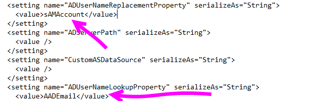

# Troubleshoot gateways - Power BI

[!INCLUDE [gateway-rewrite](includes/gateway-rewrite.md)]

This article discusses some common issues when using the **on-premises data gateway** with Power BI. If you encounter an issue that is not listed below, you can use the Power BI [communities](http://community.powerbi.com) site or you can create a [support ticket](http://powerbi.microsoft.com/support).

## Configuration

### Error: Power BI service reported local gateway as unreachable. Restart the gateway and try again

At the end of configuration, the Power BI service is called again to validate the gateway. The Power BI service does not report the gateway as live. Restarting the windows service may allow the communication to be successful. You can collect and review the logs, as described in [Collect logs from the on-premises data gateway app](/data-integration/gateway/service-gateway-tshoot#collect-logs-from-the-on-premises-data-gateway-app), to get more details.

## Data sources

### Error: Unable to Connect. Details: "Invalid connection credentials"

Within **Show details**, it displays the error message received from the data source. For SQL Server, you see something like the following.

    Login failed for user 'username'.

Verify that you have the correct username and password. Also, verify that those credentials can successfully connect to the data source. Make sure the account being used matches the **Authentication Method**.

### Error: Unable to Connect. Details: "Cannot connect to the database"

We were able to connect to the server, but not to the database supplied. Verify the name of the database, and that the user credential as the proper permission to access that database.

Within **Show details**, it displays the error message received from the data source. For SQL Server, you see something like the following.

    Cannot open database "AdventureWorks" requested by the login. The login failed. Login failed for user 'username'.

### Error: Unable to Connect. Details: "Unknown error in data gateway"

This error could occur for different reasons. Be sure to validate that you can connect to the data source from the machine hosting the gateway. This could be the result of the server not being accessible.

Within **Show details**, you can see an error code of **DM_GWPipeline_UnknownError**.

You can also look in the Event Logs > **Applications and Services Logs** > **On-premises data gateway Service** for more details.

### Error: We encountered an error while trying to connect to \<server\>. Details: "We reached the data gateway, but the gateway can't access the on-premises data source."

We were unable to connect to the specified data source. Be sure to validate the information provided for that data source.

Within **Show details**, you can see an error code of **DM_GWPipeline_Gateway_DataSourceAccessError**.

If the underlying error message is similar to the following, this means that the account you are using for the data source is not a server admin for that Analysis Services instance. [Learn more](https://docs.microsoft.com/sql/analysis-services/instances/grant-server-admin-rights-to-an-analysis-services-instance)

    The 'CONTOSO\account' value of the 'EffectiveUserName' XML for Analysis property is not valid.

If the underlying error message is similar to the following, it could mean that the service account for Analysis Services may be missing the [token-groups-global-and-universal](https://msdn.microsoft.com/library/windows/desktop/ms680300.aspx) (TGGAU) directory attribute.

    The username or password is incorrect.

Domains with Pre-Windows 2000 compatibility access have the TGGAU attribute enabled. However, most newly created domains do not enable this attribute by default. You can read more about this [here](https://support.microsoft.com/kb/331951).

You can confirm this by doing the following.

1. Connect to the Analysis Services machine within SQL Server Management Studio. Within the Advanced connection properties, include EffectiveUserName for the user in question and see if this reproduces the error.
2. You can use the dsacls Active Directory tool to validate whether the attribute is listed. This is a tool found on a domain controller. You need to know what the distinguished domain name is for the account and pass that to the tool.

        dsacls "CN=John Doe,CN=UserAccounts,DC=contoso,DC=com"

    You want to see something similar to the following in the results.

            Allow BUILTIN\Windows Authorization Access Group
                                          SPECIAL ACCESS for tokenGroupsGlobalAndUniversal
                                          READ PROPERTY

To correct this issue, you need to enable TGGAU on the account used for the Analysis Services windows service.

#### Another possibility for username or password incorrect

This error could also be caused if the Analysis Services server is in a different domain than the users and there is not a two-way trust established.

You need to work with your domain administrators to verify the trust relationship between domains.

#### Unable to see the data gateway data sources in the 'Get Data' experience for Analysis Services from the Power BI service

Make sure that your account is listed in the **Users** tab of the data source within the gateway configuration. If you don't have access to the gateway check with the administrator of the gateway and ask them to verify. Only accounts in the **Users** list can see the data source listed in the Analysis Services list.

### Error: You don't have any gateway installed or configured for the data sources in this dataset

Ensure that you have added one or more data sources to the gateway, as described in [Add a data source](service-gateway-data-sources.md#add-a-data-source). If the gateway doesn't appear in the admin portal under **Manage gateways**, try clearing your browser cache or signing out of the service then signing back in.

## Datasets

### Error: There is not enough space for this row

This occurs if you have a single row greater than 4 MB in size. You need to determine what the row is from your data source and attempt to filter it out or reduce the size for that row.

### Error: The server name provided doesn't match the server name on the SQL Server SSL Certificate

This can occur when the certificate CN is for the servers fully qualified domain name (FQDN), but you only supplied the NetBIOS name for the server. This causes a mismatch for the certificate. To resolve this issue, you need to make the server name within the gateway data source, and the PBIX file, to use the FQDN of the server.

### I don't see the on-premises data gateway present when configuring scheduled refresh

This could be because of a few different scenarios.

1. The server and database name don't match between what was entered in Power BI Desktop and the data source configured for the gateway. These need to be the same values. They are not case-sensitive.
2. Your account is not listed in the **Users** tab of the data source within the gateway configuration. You need to get with the administrator of the gateway to be added to that list.
3. Your Power BI Desktop file has multiple data sources within it and not all of those data sources are configured with the gateway. You need to have each data source defined with the gateway for the gateway to show up within Scheduled Refresh.

### Error: The received uncompressed data on the gateway client has exceeded the limit

The exact limitation is 10 GB of uncompressed data per table. If you are hitting this issue, there are good options to optimize and avoid the issue. In particular, reducing the use of highly constant, long string values and instead using a normalized key or removing the column (if not in use) helps.

## Reports

### Report could not access the data source because you do not have access to our data source via an on-premises data gateway

This is usually caused by one of the following.

1. The data source information does not match what's in the underlying dataset. The server and database name need to match between the data source defined for the on-premises data gateway and what you supply within Power BI Desktop. If you use an IP Address in Power BI Desktop, the data source for the on-premises data gateway needs to use an IP Address as well.
2. There is no data source available on any gateway within your organization. You can configure the data source on a new or existing on-premises data gateway.

### Error: Data source access error. Please contact the gateway administrator

If this report is making use of a live Analysis Services connection, you could be encountering an issue with a value being passed to EffectiveUserName that is either not valid or doesn't have permissions on the Analysis Services machine. Typically, an authentication issue is due to the fact that the value being passed for EffectiveUserName doesn't match a local user principal name (UPN).

To confirm this, you can do the following.

1. Find the effective username within the [gateway logs](/data-integration/gateway/service-gateway-tshoot#collect-logs-from-the-on-premises-data-gateway-app).
2. Once you have the value being passed, validate that it is correct. If it is your user, you can use the following command from a command prompt to see the UPN. The UPN looks like an email address.

        whoami /upn

Optionally, you can see what Power BI gets from Azure Active Directory.

1. Browse to [https://developer.microsoft.com/graph/graph-explorer](https://developer.microsoft.com/graph/graph-explorer).
2. Select **Sign in** in the upper right.
3. Run the following query. You see a rather large JSON response.

        https://graph.windows.net/me?api-version=1.5
4. Look for **userPrincipalName**.

If your Azure Active Directory UPN doesn't match your local Active Directory UPN, you can use the [Map user names](service-gateway-enterprise-manage-ssas.md#mapping-usernames-for-analysis-services-data-sources) feature to replace it with a valid value. Or you can work with either your tenant admin or local Active Directory admin, to get your UPN changed.

## Kerberos

If the underlying database server and on-premises data gateway are not appropriately configured for [Kerberos Constrained Delegation](service-gateway-sso-kerberos.md), enable [verbose logging](/data-integration/gateway/service-gateway-performance#slow-performing-queries) on the gateway, and investigate based on the errors/traces in the gateway’s log files as a starting point for troubleshooting. To collect the gateway logs for viewing, see [Collect logs from the on-premises data gateway app](/data-integration/gateway/service-gateway-tshoot#collect-logs-from-the-on-premises-data-gateway-app).

### ImpersonationLevel

The ImpersonationLevel is related to the SPN setup or the local policy setting.

```
[DataMovement.PipeLine.GatewayDataAccess] About to impersonate user DOMAIN\User (IsAuthenticated: True, ImpersonationLevel: Identification)
```

**Solution**

Follow these steps to solve the issue:

1. Setup an SPN for the On-Premises Gateway.
2. Setup constrained delegation in your Active Directory (AD).

### FailedToImpersonateUserException: Failed to create windows identity for user userid

The FailedToImpersonateUserException happens if you're not able to impersonate on behalf of another user. This could also happen if the account you're trying to impersonate is from another domain than the one the gateway service domain is on (this is a limitation).

**Solution**

* Verify that the configuration is correct as per the steps in the ImpersonationLevel section above.
* Ensure that the userid it's trying to impersonate is a valid AD Account.

### General error; 1033 error while parsing the protocol

You get the 1033 error when your external ID that is configured in SAP HANA doesn't match the login if the user is impersonated using the UPN (alias@domain.com). In the logs you will see "Original UPN 'alias@domain.com' replaced with a new UPN 'alias@domain.com'" at the top of the error logs, as seen below.

```
[DM.GatewayCore] SingleSignOn Required. Original UPN 'alias@domain.com' replaced with new UPN 'alias@domain.com.'
```

**Solution**

* SAP HANA requires the impersonated user to use the sAMAccountName attribute in AD (user alias). If this is not correct, you see the 1033 error.

    

* In the logs you see the sAMAccountName (alias) and not the UPN, which is the alias followed by the domain (alias@doimain.com).

    

```xml
      <setting name="ADUserNameReplacementProperty" serializeAs="String">
        <value>sAMAccount</value>
      </setting>
      <setting name="ADServerPath" serializeAs="String">
        <value />
      </setting>
      <setting name="CustomASDataSource" serializeAs="String">
        <value />
      </setting>
      <setting name="ADUserNameLookupProperty" serializeAs="String">
        <value>AADEmail</value>
```

### [SAP AG][LIBODBCHDB DLL][HDBODBC] Communication link failure;-10709 Connection failed (RTE:[-1] Kerberos error. Major: "Miscellaneous failure [851968]", minor: "No credentials are available in the security package

You get the -10709 Connection failed error message if your delegation is not configured correctly in AD.

**Solution**

* Ensure you have the SAP Hana server on the delegation tab in AD for the gateway service account.

   

## Refresh History

When using the gateway for a scheduled refresh, **Refresh History** can help you see what errors have occurred, as well as provide useful data if you need to create a support request. You can view both scheduled, as well as on-demand, refreshes. The following steps show how you can get to the **Refresh History**.

1. In the Power BI navigation pane, in **Datasets**, select a dataset &gt; Open Menu &gt; **Schedule Refresh**.

    

2. In **Settings for...** &gt; **Schedule Refresh**, select **Refresh History**.

    

    

For additional information about troubleshooting refresh scenarios, take a look at the [Troubleshooting Refresh Scenarios](refresh-troubleshooting-refresh-scenarios.md) article.

## Fiddler Trace

[Fiddler](http://www.telerik.com/fiddler) is a free tool from Telerik that monitors HTTP traffic. You can see the back and forth with the Power BI service from the client machine. This may show errors and other related information.


## Next steps

* [Troubleshoot the on-premises data gateway](/data-integration/gateway/service-gateway-tshoot)
* [Configuring proxy settings for the on-premises data gateway](/data-integration/gateway/service-gateway-proxy)  
* [Manage your data source - Analysis Services](service-gateway-enterprise-manage-ssas.md)  
* [Manage your data source - SAP HANA](service-gateway-enterprise-manage-sap.md)  
* [Manage your data source - SQL Server](service-gateway-enterprise-manage-sql.md)  
* [Manage your data source - Import/Scheduled refresh](service-gateway-enterprise-manage-scheduled-refresh.md)  

More questions? [Try the Power BI Community](http://community.powerbi.com/)
