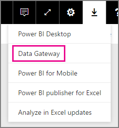
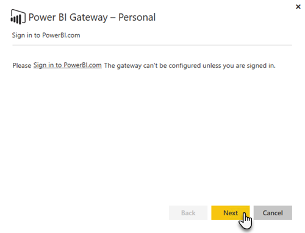

# On-premises data gateway

The On-premises data gateway acts as a bridge, providing quick and secure data transfer between on-premises data (data that is not in the cloud) and the Power BI, Microsoft Flow, Logic Apps, and PowerApps services.

You can use a single gateway with different services at the same time. If you are using Power BI as well as PowerApps, a single gateway can be used for both. It is dependent on the account you sign in with.

> [!NOTE]
> The On-premises data gateway implements data compression, and transport encryption, in all modes.

<!-- Shared Requirements Include -->
[!INCLUDE [gateway-onprem-requirements-include](./includes/gateway-onprem-requirements-include.md)]

### Limitations of Analysis Services live connections

You can use a live connection against tabular or multidimensional instances.

| **Server version** | **Required SKU** |
| --- | --- |
| 2012 SP1 CU4 or later |Business Intelligence and Enterprise SKU |
| 2014 |Business Intelligence and Enterprise SKU |
| 2016 |Standard SKU or higher |

* Cell level Formatting and translation features are not supported.
* Actions and Named Sets are not exposed to Power BI, but you can still connect to multidimensional cubes that also contain Actions or Named sets and create visuals and reports.

<!-- Shared Install steps Include -->
[!INCLUDE [gateway-onprem-datasources-include](./includes/gateway-onprem-datasources-include.md)]

## Download and install the On-premises data gateway

To download the gateway, select **Data Gateway** under the Downloads menu. Download the [On-premises data gateway](http://go.microsoft.com/fwlink/?LinkID=820925).

Note that you update the On-premises data gateway by installing the gateway again, as described in this section. As long as you install a newer version of the gateway, your existing settings are retained. If you install the same version, it treats this as a complete reinstall, and your settings are not retained.

<!-- Shared Install steps Include -->
[!INCLUDE [gateway-onprem-install-include](./includes/gateway-onprem-install-include.md)]

## Install the gateway in personal mode

> [!NOTE]
> The Personal version of gateway only works with Power BI.

After the personal gateway is installed, you will need to launch the **Power BI Gateway - Personal Configuration Wizard**.

You will then need to sign into Power BI to register the gateway with the cloud service.

You will also need to supply the windows user name and password that the windows service will run as. You can specify a different Windows account from your own. The gateway service will run using this account.

After the installation is complete, you will need to go to your datasets within Power BI and make sure credentials are entered for your on-premises data sources.

## Storing encrypted credentials in the cloud

When you add a data source to the gateway, you need to provide credentials for that data source. All queries to the data source will run using these credentials. The credentials are encrypted securely, using asymmetric encryption so that they cannot be decrypted in the cloud, before they are stored in the cloud. The credentials are sent to the machine, running the gateway, on-premises where they are decrypted when the data sources are accessed.

<!-- Account and Port information -->
[!INCLUDE [gateway-onprem-accounts-ports-more](./includes/gateway-onprem-accounts-ports-more.md)]

<!-- How the gateway works -->
[!INCLUDE [gateway-onprem-how-it-works-include](./includes/gateway-onprem-how-it-works-include.md)]

## Limitations and Considerations

* [Azure Information Protection](https://docs.microsoft.com/microsoft-365/enterprise/protect-files-with-aip
) is not currently supported.
* [Access Online](https://products.office.com/en-us/access) is not currently supported.
* R scripts are supported only when the gateway is run in personal mode.

## Tenant level administration

As a tenant admin, you can see all On-premises data gateways installed within your tenant and manage them. This capability is currently in public preview. For more information,see the [Power Platform Admin Center documentation](/power-platform/admin/onpremises-data-gateway-management).
Alternatively, If you’re a tenant administrator, we recommend that you ask the users in your organization to add you as an administrator to every gateway they install. This allows you to manage all the gateways in your organization through the Gateway Settings page or through [PowerShell commands](service-gateway-high-availability-clusters.md#powershell-support-for-gateway-clusters). 

## Enabling outbound Azure connections

The On-premises data gateway relies on Azure Service Bus for cloud connectivity and correspondingly establishes outbound connections to its associated Azure region. By default, this is the location of your Power BI tenant. See Where is my [Power BI tenant located?](https://powerbi.microsoft.com/en-us/documentation/powerbi-admin-where-is-my-tenant-located/)
If a firewall is blocking outbound connections, you must configure the firewall to allow outbound connections from the On-premises data gateway to its associated Azure region. See [Microsoft Azure Datacenter IP Ranges](https://www.microsoft.com/download/details.aspx?id=41653) for details about the IP address ranges of each Azure data center.
> [!NOTE]
> The IP address ranges might change over time, so make sure you download the latest information on a regular basis. 

## Troubleshooting

If you’re having trouble when installing and configuring a gateway, be sure to see [Troubleshooting the On-premises data gateway](service-gateway-onprem-tshoot.md). If you think you are having an issue with your firewall, see the [firewall or proxy](service-gateway-onprem-tshoot.md#firewall-or-proxy) section in the troubleshooting article.

If you think you are encountering proxy issues, with the gateway, see [Configuring proxy settings for the Power BI gateways](service-gateway-proxy.md).

## Next steps

[Manage your data source - Analysis Services](service-gateway-enterprise-manage-ssas.md)  
[Manage your data source - SAP HANA](service-gateway-enterprise-manage-sap.md)  
[Manage your data source - SQL Server](service-gateway-enterprise-manage-sql.md)  
[Manage your data source - Oracle](service-gateway-onprem-manage-oracle.md)  
[Manage your data source - Import/Scheduled refresh](service-gateway-enterprise-manage-scheduled-refresh.md)  
[On-premises data gateway in-depth](service-gateway-onprem-indepth.md)  
[On-premises data gateway (personal mode) - the new version of the personal gateway](service-gateway-personal-mode.md)  
[Configuring proxy settings for the On-premises data gateway](service-gateway-proxy.md)  

More questions? [Try the Power BI Community](http://community.powerbi.com/)
