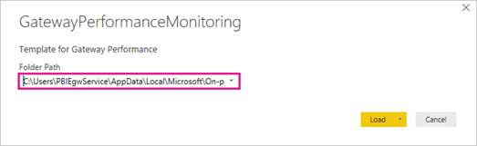

# Gateway performance monitoring (public preview)

To monitor performance, gateway admins have traditionally depended on manually monitoring performance counters through the Windows Performance Monitor tool. We now offer additional query logging and a [Gateway Performance PBI template file](http://download.microsoft.com/download/D/A/1/DA1FDDB8-6DA8-4F50-B4D0-18019591E182/GatewayPerformanceMonitoring.pbit) to visualize the results. This feature provides new insights into gateway usage and allows you to troubleshoot slow performing queries.

> [!NOTE]
> This feature is currently available only for the on-premises data gateway in the standard mode and not for the personal mode.

## Log files

When you turn this feature on, we create three new log files:

- The Query Execution Report
- The Query Execution Aggregation Report
- The System Counter Aggregation Report

The Query Execution Report contains detailed query execution information. We capture the following attributes:

|Attribute |Description |
| ---- | ---- |
|**GatewayObjectId** |Unique identifier for the gateway. |
|**RequestId** |Unique identifier for a gateway request. It could be the same for multiple queries. |
|**DataSource** |Contains both the data source type and data source. |
|**QueryTrackingId** |Unique identifier for a query. |  
|**QueryExecutionEndTimeUTC** |Time when the query execution completed. |
|**QueryExecutionDuration**(ms) |Duration for a query execution. |
|**QueryType** |Type of query - for instance, the query passed could be a Power BI refresh/DirectQuery or queries from PowerApps and Microsoft Flow. |
|**DataProcessingEndTimeUTC** |Time when data processing activities like spooling, data retrieval, compression, data processing, and so on completed. |
|**DataProcessingDuration**(ms) |Duration for data processing activities like spooling, data retrieval, compression, data processing, and so on. |
|**Success** |Indicates if the query succeeded or failed. |
|**ErrorMessage** |If the query failed, indicates the error message. |
| | |

The Query Execution Aggregation Report contains query information aggregated to a time interval by **GatewayObjectId**, **DataSource**, **Success**, and **QueryType**. The default value is 5 minutes, but you can adjust it as described below. We capture the following attributes:

|Attribute |Description |
| ---- | ---- |
|**GatewayObjectId** |Unique identifier for the gateway. |
|**AggregationStartTimeUTC** |Start of the time window for which query attributes were aggregated. |
|**AggregationEndTimeUTC** |End of the time window for which query attributes were aggregated. |
|**DataSource** |Contains both the data source type and data source. |
|**Success** |Indicates if the query succeeded or failed. |
|**AverageQueryExecutionDuration**(ms) |Average query execution time for the aggregation time window. |
|**MaxQueryExecutionDuration**(ms) |Maximum query execution time for the aggregation time window. |
|**MinQueryExecutionDuration**(ms) |Minimum query execution time for the aggregation time window. |
|**QueryType** |Type of query - for instance, the query passed could be a Power BI refresh/DirectQuery or queries from PowerApps and Microsoft Flow. |
|**AverageDataProcessingDuration**(ms) |Average time for data processing activities like spooling, data retrieval, compression, data processing, and so on for the aggregation time window. |
|**MaxDataProcessingDuration**(ms) |Maximum time for data processing activities like spooling, data retrieval, compression, data processing, and so on for the aggregation time window. |
|**MinDataProcessingDuration**(ms) |Minimum time for data processing activities like spooling, data retrieval, compression, data processing, and so on for the aggregation time window. |
|**Count** |Number of queries. |
| | |

The System Counter Aggregation Report contains system counter values aggregated to a time interval. The default value is 5 minutes, but you can adjust it as described below. We capture the following attributes:

|Attribute |Description |
| ---- | ---- |
|**GatewayObjectId** |Unique Identifier for the gateway. |
|**AggregationStartTimeUTC** |Start of the time window for which system counters have been aggregated. |
|**AggregationEndTimeUTC** |End of the time window for which system counters have been aggregated. |
|**CounterName** |System counters, including memory and CPU usage by the gateway, mashup, and overall by the machine hosting the gateway. |
|**Max** |Maximum value for the system counter for the aggregation time window. |
|**Min** |Minimum value for the system counter for the aggregation time window. |
|**Average** |Average value for the system counter for the aggregation time window. |
| | |

## Enable logging

To enable this feature, make the following changes to the *Microsoft.PowerBI.DataMovement.Pipeline.GatewayCore.dll.config* file in the "\Program Files\On-premises data gateway" folder:

1. Update **QueryExecutionReportOn** to _True_ to enable additional logging for queries executed using the gateway. Enabling this option creates both the Query Execution Report and the Query Execution Aggregation Report files.

   ``` xml
   <setting name="QueryExecutionReportOn" serializeAs="String">
     <value>True</value>
   </setting>
   ```

1. Update **SystemCounterReportOn** to _True_ to enable additional logging for memory and CPU system counters. Enabling this option creates the System Counter Aggregation Report file.

   ```xml
   <setting name="SystemCounterReportOn" serializeAs="String">
     <value>True</value>
   </setting>
   ```

1. There are other values in the config file that you can update as needed.

    - **ReportFilePath**: Determines the path where the three log files are stored. By default, this path is either "\Users\PBIEgwService\AppData\Local\Microsoft\On-premises data gateway\Report" or "Windows\ServiceProfiles\PBIEgwService\AppData\Local\Microsoft\On-premises data gateway\Report", depending on the OS version. If you use a service account for the gateway other than _PBIEgwService_, replace this part of the path with the service account name.
    - **ReportFileCount**: Determines the number of log files of each kind to retain. The default value is 10.
    - **ReportFileSizeInBytes**: Determines the size of the file to maintain. The default value is 104857600.
    - **QuerExecutionAggregationTimeInMinutes**: Determines the number of minutes for which the query execution information is aggregated. The default value is 5.
    - **SystemCounterAggregationTimeInMinutes**: Determines the number of minutes for which the system counters is aggregated. The default value is 5.

1. After you've made the changes to the config file, restart the gateway for these config values to take effect. You'll now start seeing the report files being generated in the location you specified for **ReportFilePath**.

    > [!NOTE]
    > Please wait for 5 minutes until the aggregate files start showing up in the folder.

## Visualize log file data

Now, you can visualize the data that's in the log files.

1. Download the [Gateway Performance PBI template](http://download.microsoft.com/download/D/A/1/DA1FDDB8-6DA8-4F50-B4D0-18019591E182/GatewayPerformanceMonitoring.pbit) and open it using Power BI desktop.

1. In the dialog box that opens, check that the folder path matches the value in **ReportFilePath**.

    

1. Select **Load**, and the template file starts loading the data from your log files. All visuals should then be populated using the data in the reports.

1. Optionally save this file as a PBIX and publish it to your service for automatic refreshes.

Additionally, you can customize this template file to suit your needs. For more information on Power BI templates, see this [Microsoft Power BI Blog post](https://powerbi.microsoft.com/en-us/blog/deep-dive-into-query-parameters-and-power-bi-templates/).