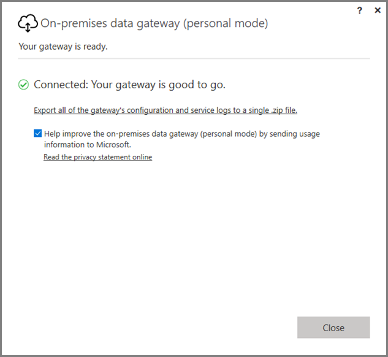
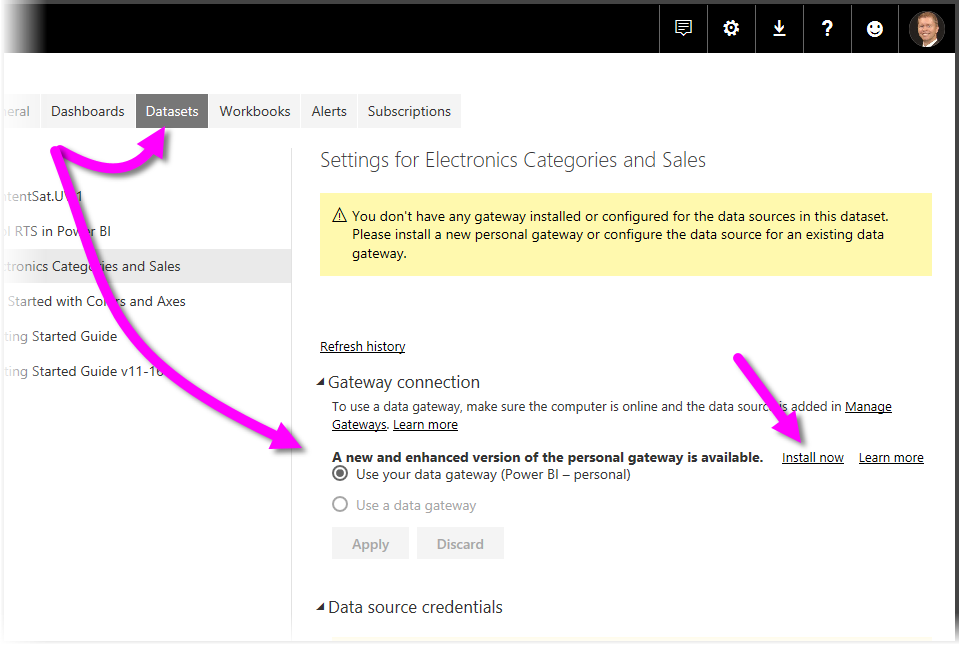

# On-premises data gateway (personal mode)
You can use on-premises data sources, and create Power BI reports and dashboards, using a gateway. A **gateway** is software that facilitates access to data that is stored on a private, on-premises network, then enables you to use that data in online services like the **Power BI service**. The **On-premises data gateway (personal mode)** is a recently released update to the Power BI gateway that allows individuals to install a gateway on their own computer, and gain access to on-premises data.



> [!NOTE]
> The **On-premises data gateway (personal mode)** replaces the previously supported version of the personal gateway, which is called **Power BI Gateway - Personal**. The previous personal gateway will continue working only until July 31, 2017. See the sections below for information on how to update to the new version.
> 
> 

## Features of the On-premises data gateway (personal mode)
With the release of the **On-premises data gateway (personal mode)**, a collection of improvements and features are now available. In the previous version of the personal gateway (which is called **Power BI Gateway - Personal**), its implementation imposed some limitations. As with many Power BI products, we listened to customer needs, requests, and how they used the product. As a result, the **On-premises data gateway (personal mode)** has been redesigned from the ground up, and includes the following features and improvements:

* **Improved reliability** - the new version of the personal gateway has improved reliability over the previous version, due to code and structural software improvements.
* **Enhanced extensibility** - as part of the structural software improvements, additional features can easily be added to the personal gateway as they become available.
* **Delete personal gateway from the Power BI service** - with the new version, you can now delete your personal gateway from within the **Power BI service**.
* **Configuration and service logs** - the new version lets you easily export configuration and service logs to a .zip file, with a single click.

## Installing On-premises data gateway (personal mode)
To install the  **On-premises data gateway (personal mode)** without having the previous version of the gateway installed, select the gear icon in the **Power BI service** and select **Data Gateway**.


You can also download the gateway from [this location](https://go.microsoft.com/fwlink/?LinkId=820925&clcid=0x409). You can follow the installation steps, and since the installation process allows you to install either version of the gateway (the standard gateway, which can be shared with others, or personal mode), make sure you select **On-premises data gateway (personal mode)** when prompted for which version of the gateway you want to install.

### Updating from the previous personal gateway
If you already have the **Power BI Gateway - personal** gateway installed, you'll be prompted to install the new and enhanced version of the personal gateway when you view **Datasets** under **Settings** in the **Power BI service**.


When you select a dataset, and then select **Gateway connection** you're notified that the new and enhanced version of the personal gateway is available. When you do, select **Install now**.



> [!NOTE]
> If you're running the previous version of **Power BI Gateway - personal** as an elevated process, make sure you start the new gateway installation process elevated as well, so your dataset credentials can be automatically updated. Otherwise, you'll have to update dataset credentials manually.
> 
> 

You'll be taken through the update process, after which you'll see that the installation was successful. Don't close things out yet, there's one last step.


Here's the last step. Once the new personal gateway is installed (and the last installation screen still visible), sign in to the **Power BI service**, and wait until you see that the gateway is online, as shown in the following image.


If you've updated the personal gateway on the same machine as the previous gateway is installed, your credentials will update automatically, and all refresh activities will go through the new gateway. If the previous gateway was installed on a different machine, you'll be asked to update your credentials on certain datasets. In the previous image, notice the list of datasets in the window; the list will show datasets that might require updated credentials. Each dataset listed is a direct link that you simply click on to easily update your credentials.

That's it - almost. With the new gateway installed, you no longer need to previous version installed on your machine, so you should uninstall it. You can do this by searching for **Power BI Gateway - personal** on your machine, and uninstalling it.

### Determining which version of the personal gateway you have installed
To determine which version of the personal gateway you currently have installed, you can do the following:

* The previous version of the personal gateway is called **Power BI Gateway - Personal** and uses the Power BI icon in its installation dialog.
* The new version of the personal gateway is called **On-premises data gateway (personal mode)** and uses the gateway icon (a cloud with an up-and-down arrow along the bottom).

You can go to **Add/Remove Programs** and see whether **Power BI Gateway - Personal** appears on the list, and if so, you have the previous version of the personal gateway installed.

## Using Fast Combine with the personal gateway
If you were using **Fast Combine** with the previous gateway, you'll need to take the following steps to re-enable **Fast Combine** to work with the **On-premises data gateway (personal mode)**:

1. Using File Explorer, open the following file:
   
   ```
   %localappdata%\Microsoft\On-premises data gateway (personal mode)\Microsoft.PowerBI.DataMovement.Pipeline.GatewayCore.dll.config
   ```
2. At the bottom of the file, add the following text:
   
       ```
       <setting name="EnableFastCombine" serializeAs="String">```
       <value>true</value>
       </setting>
       ```
3. Once complete, the setting will take effect in approximately one minute. To check that it's working properly, try an on-demand refresh in the **Power BI service** to confirm that **Fast Combine** is working.

## Limitations and considerations
There are a few things to consider when using the **On-premises data gateway (personal mode)**, as described in the following list.

* If you're using **Windows Hello** or a pin to sign in to Windows, you might run into the following error: 
  * *The user account you selected does not match the requirements of the application. Please use a different account.*
  * To remedy that error, select *Use a different account* and sign in again. 

The following data sources are currently not supported for the **On-premises data gateway (personal mode)**:

* ADO.NET 
* CurrentWorkbook
* FTP
* HDFS
* SAP BusinessObjects         
* Spark

Support for Spark is planned for the second half of the 2017 calendar year.

## Frequently Asked Questions (FAQ)
* Can I run the **On-premises data gateway (personal mode)** side by side with the **On-premises data gateway** (previously known as the Enterprise version of the gateway)?
  
  * **Answer**: Yes, with the new version, both can run simultaneously.
* Can I run the **On-premises data gateway (personal mode)** as a service?
  
  * **Answer**: No. the **On-premises data gateway (personal mode)** can only run as an application. If you need to run the gateway as a service and/or in admin mode, you'll need to consider the [**On-premises data gateway**](service-gateway-onprem.md) (previously known as the Enterprise gateway).
* How often is the **On-premises data gateway (personal mode)** updated?
  
  * **Answer**: We plan to update the personal gateway monthly.
* Why am I asked to update my credentials?
  
  * **Answer**: Many situations can trigger a request for credentials. The most common is that you've re-installed the **On-premises data gateway (personal mode)** on a different machine than your **Power BI - personal** gateway. It could also be an issue in the data source, and Power BI failed to perform a test connection, or a timeout or a system error occurred. You can update your credentials in the **Power BI service** by going to the **gear icon** and selecting **Settings** then **Datasets**, and finding the dataset in question and clicking on *update credentials*.
* How much time will my previous personal gateway be offline during the upgrade?
  
  * **Answer**: Upgrading the personal gateway to the new version should only take few minutes. 
* What happens if I don't migrate to the new personal gateway by July 31st, 2017?
  
  * **Answer**: If you’re refreshing your reports with the current gateway, your refreshes will stop. The only way to set up a new refresh schedule will be by installing and configuring the new gateway.
* I'm using R script. Is that supported?
  
  * **Answer**: R scripts are supported for personal mode.​
* Why am I not seeing the message to update my gateway in the **Power BI service**?
  
  * **Answer**: Most likely, this is because you have one or more datasets that include a data source that is still currently not supported.

## Next steps
[Configuring proxy settings for the Power BI Gateways](service-gateway-proxy.md)  
More questions? [Try the Power BI Community](http://community.powerbi.com/)

