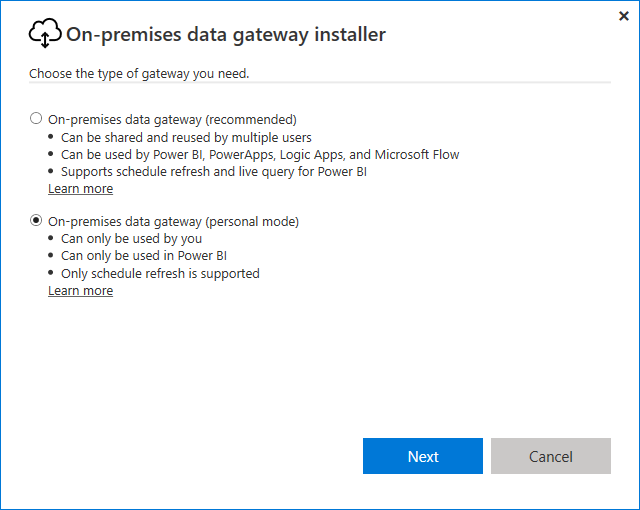
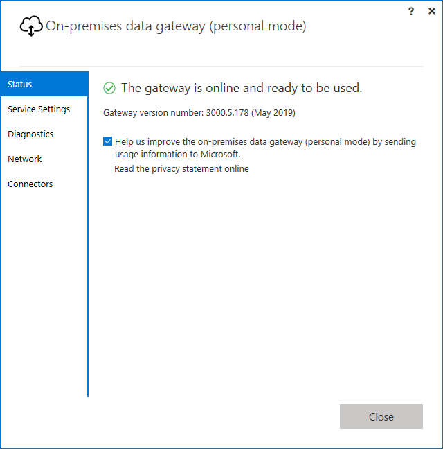

# Use personal gateways in Power BI

[!INCLUDE [gateway-rewrite](includes/gateway-rewrite.md)]

The on-premises data gateway (personal mode) is a version of the on-premises data gateway that works only with Power BI. A personal gateway allows individuals to install a gateway on their own computer, and gain access to on-premises data.

> [!NOTE]
> You can only have one personal mode gateway running for each Power BI user. If you install another personal mode gateway for the same user, even on a different computer, the most recent installation replaces the existing previous installation.

## On-premises data gateway vs. on-premises data gateway (personal mode)

The following table describes differences between an on-premises data gateway and an on-premises data gateway (personal mode).

|   |On-premises data gateway | On-premises data gateway (personal mode) |
| ---- | ---- | ---- |
|Cloud services supported |Power BI, PowerApps, Azure Logic Apps, Microsoft Flow, Azure Analysis Services, Data Flows |Power BI |
|Runs |As configured by users who have access to the gateway |As you for Windows authentication and as configured by you for other authentication types |
|Can install only as computer admin |Yes |No |
|Centralized gateway and data source management |Yes |No |
|Import data and schedule refresh |Yes |Yes |
|DirectQuery support |Yes |No |
|LiveConnect support for Analysis Services |Yes |No |

## Install the on-premises data gateway (personal mode)

To install the on-premises data gateway (personal mode):

1. [Download the on-premises data gateway](https://go.microsoft.com/fwlink/?LinkId=820925&clcid=0x409).

2. In the installer, select the on-premises data gateway (personal mode), and then select the **Next** button.

   

Once the installation completes successfully and you've signed in, you'll see the following screen.



## Using Fast Combine with the personal gateway

Fast Combine on a personal gateway helps you ignore specified privacy levels while executing queries. To enable Fast Combine to work with the on-premises data gateway (personal mode):

1. Using File Explorer, open the following file:

   `%localappdata%\Microsoft\On-premises data gateway (personal mode)\Microsoft.PowerBI.DataMovement.Pipeline.GatewayCore.dll.config`

2. At the bottom of the file, add the following text:

    ```xml
    <setting name="EnableFastCombine" serializeAs="String">
       <value>true</value>
    </setting>
    ```

3. Once complete, the setting will take effect in approximately one minute. To check that it's working properly, try an on-demand refresh in the **Power BI service** to confirm that **Fast Combine** is working.

## Frequently Asked Questions (FAQ)

**Question:** Can I run the **on-premises data gateway (personal mode)** side by side with the **on-premises data gateway** (previously known as the Enterprise version of the gateway)?
  
**Answer:** Yes, both can run simultaneously.

**Question:** Can I run the **on-premises data gateway (personal mode)** as a service?
  
**Answer:** No. the **on-premises data gateway (personal mode)** can only run as an application. If you need to run the gateway as a service and/or in admin mode, you'll need to consider the [**on-premises data gateway**](/data-integration/gateway/service-gateway-onprem) (previously known as the Enterprise gateway).

**Question:** How often is the **on-premises data gateway (personal mode)** updated?
  
**Answer:** We plan to update the personal gateway monthly.

**Question:** Why am I asked to update my credentials?
  
**Answer:** Many situations can trigger a request for credentials. The most common is that you've re-installed the **on-premises data gateway (personal mode)** on a different machine than your **Power BI - personal** gateway. It could also be an issue in the data source, and Power BI failed to perform a test connection, or a timeout or a system error occurred. You can update your credentials in the **Power BI service** by going to the **gear icon** and selecting **Settings** then **Datasets**, and finding the dataset in question and selecting **Data source credentials**.

**Question:** How much time will my previous personal gateway be offline during the upgrade?
  
**Answer:** Upgrading the personal gateway to the new version should only take few minutes.

**Question:** I'm using R and Python scripts. Is that supported?
  
**Answer:** R and Python scripts are supported for personal mode.​

## Next steps

* [Configuring proxy settings for the on-premises data gateway](/data-integration/gateway/service-gateway-proxy)  

More questions? [Try the Power BI Community](http://community.powerbi.com/)

