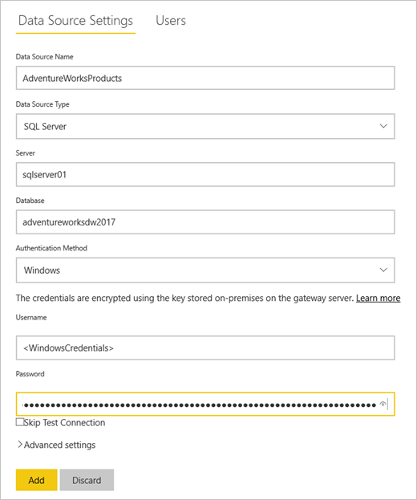
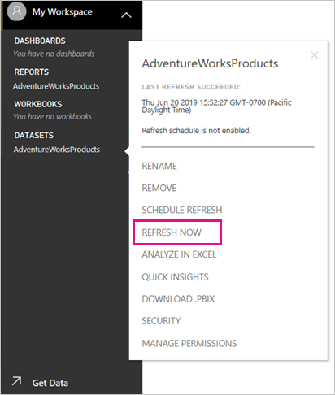

# Tutorial: Connect to on-premises data in SQL Server

An on-premises data gateway is software that you install within an on-premises network; it facilitates access to data in that network. In this tutorial you build a report in Power BI Desktop based on sample data imported from SQL Server. You then publish the report to the Power BI service, and configure a gateway so the service can access the on-premises data. This access means the service can refresh the data to keep the report up to date.

In this tutorial, you learn how to:
> [!div class="checklist"]
> * Create a report from data in SQL Server
> * Publish the report to the Power BI Service
> * Add SQL Server as a gateway data source
> * Refresh the data in the report

If you're not signed up for Power BI, [sign up for a free trial](https://app.powerbi.com/signupredirect?pbi_source=web) before you begin.


## Prerequisites

* [Install Power BI Desktop](https://powerbi.microsoft.com/desktop/)
* [Install SQL Server](https://docs.microsoft.com/sql/database-engine/install-windows/install-sql-server) on a local computer 
* [Install an on-premises data gateway](service-gateway-install.md) on the same local computer (in production, it would typically be a different computer)


## Set up sample data

You start by adding sample data to SQL Server, so you can use that data in the rest of the tutorial.

1. In SQL Server Management Studio (SSMS), connect to your instance of SQL Server and create a test database.

    ```sql
    CREATE DATABASE TestGatewayDocs
    ```

2. In the database you created, add a table and insert data.

    ```sql
    USE TestGatewayDocs

    CREATE TABLE Product (
        SalesDate DATE,
        Category  VARCHAR(100),
        Product VARCHAR(100),
        Sales MONEY,
        Quantity INT
    )

    INSERT INTO Product VALUES('2018-05-05','Accessories','Carrying Case',9924.60,68)
    INSERT INTO Product VALUES('2018-05-06','Accessories','Tripod',1350.00,18)
    INSERT INTO Product VALUES('2018-05-11','Accessories','Lens Adapter',1147.50,17)
    INSERT INTO Product VALUES('2018-05-05','Accessories','Mini Battery Charger',1056.00,44)
    INSERT INTO Product VALUES('2018-05-06','Accessories','Telephoto Conversion Lens',1380.00,18)
    INSERT INTO Product VALUES('2018-05-06','Accessories','USB Cable',780.00,26)
    INSERT INTO Product VALUES('2018-05-08','Accessories','Budget Movie-Maker',3798.00,9)
    INSERT INTO Product VALUES('2018-05-09','Digital video recorder','Business Videographer',10400.00,13)
    INSERT INTO Product VALUES('2018-05-10','Digital video recorder','Social Videographer',3000.00,60)
    INSERT INTO Product VALUES('2018-05-11','Digital','Advanced Digital',7234.50,39)
    INSERT INTO Product VALUES('2018-05-07','Digital','Compact Digital',10836.00,84)
    INSERT INTO Product VALUES('2018-05-08','Digital','Consumer Digital',2550.00,17)
    INSERT INTO Product VALUES('2018-05-05','Digital','Slim Digital',8357.80,44)
    INSERT INTO Product VALUES('2018-05-09','Digital SLR','SLR Camera 35mm',18530.00,34)
    INSERT INTO Product VALUES('2018-05-07','Digital SLR','SLR Camera',26576.00,88)
    ```

3. Select the data from the table to verify it.

    ```sql
    SELECT * FROM Product
    ```

    


## Build and publish a report

Now that you have sample data to work with, you connect to SQL Server in Power BI Desktop and build a report based on that data. You then publish the report to the Power BI service.

1. In Power BI Desktop, on the **Home** tab, select **Get Data** > **SQL Server**.

2. Under **Server** enter your server name, and under **Database** enter "TestGatewayDocs". Select **OK**. 

    

3. Verify your credentials, then select **Connect**.

4. Under **Navigator**, select the **Product** table, then select **Load**.

    

5. In the Power BI Desktop **Report** view, in the **Visualizations** pane, select the **Stacked column chart**.

        

6. With the column chart selected in the report canvas, in the **Fields** pane select the **Product** and **Sales** fields.  

    

    The chart should now look like the following.

    

    Notice that **SLR Camera** is the current sales leader. This will change when you update data and refresh the report later in this tutorial.

7. Save the report with the name "TestGatewayDocs.pbix".

8. On the **Home** tab select **Publish** > **My Workspace** > **Select**. Sign in to the Power BI service if you're asked to do so. 

    

9. On the **Success** screen, select **Open 'TestGatewayDocs.pbix' in Power BI**.


## Add SQL Server as a gateway data source

In Power BI Desktop, you connect directly to SQL Server, but the Power BI service requires a gateway to act as a bridge. Now you add your instance of SQL Server as a data source for the gateway you created in a previous article (listed under [Prerequisites](#prerequisites)). 

1. In the upper-right corner of the Power BI service, select the gear icon  > **Manage gateways**.

    

2. Select **Add data source**, and enter "test-sql-source" for **Data Source Name**.

    

3. Select a **Data Source Type** of **SQL Server**, then enter other values as shown.

    


   |          Option           |                                               Value                                                |
   |---------------------------|----------------------------------------------------------------------------------------------------|
   |   **Data Source Name**    |                                          test-sql-source                                           |
   |   **Data Source Type**    |                                             SQL Server                                             |
   |        **Server**         | The name of your SQL Server instance (must be identical to what you specified in Power BI Desktop) |
   |       **Database**        |                                          TestGatewayDocs                                           |
   | **Authentication Method** |                                              Windows                                               |
   |       **Username**        |             The account, such as michael@contoso.com, you use to connect to SQL Server             |
   |       **Password**        |                   The password for the account you use to connect to SQL Server                    |


4. Select **Add**. You see *Connection Successful* when the process succeeds.

    

    You can now use this data source to include data from SQL Server in your Power BI dashboards and reports.


## Configure and use data refresh

You have a report published to the Power BI service, and the SQL Server data source configured. With these in place, you now make a change in the Product table, and that change flows through the gateway to the published report. You also configure scheduled refresh to handle any future changes.

1. In SSMS, update data in the Product table.

    ```sql
    UPDATE Product
    SET Sales = 32508, Quantity = 252
    WHERE Product='Compact Digital'     

    ```

2. In the Power BI Service, in the left navigation pane, select **My Workspace**.

3. Under **Datasets**, for the **TestGatewayDocs** dataset select **more** (**. . .**) > **Refresh now**.

    

4. Select **My Workspace** > **Reports** > **TestGatewayDocs**. See how the update flowed through, and the sales leader is now **Compact Digital**. 

    

5. Select **My Workspace** > **Reports** > **TestGatewayDocs**. Select **more** (**. . .**) > **Schedule refresh**.

6. Under **Schedule refresh**, set refresh to **On**, then select **Apply**. The dataset is refreshed daily by default.

    

## Clean up resources
If you don't want to use the sample data anymore, run `DROP DATABASE TestGatewayDocs` in SSMS. If you don't want to use the SQL Server data source, [remove the data source](service-gateway-manage.md#remove-a-data-source). 


## Next steps
In this tutorial, you learned how to:
> [!div class="checklist"]
> * Create a report from data in SQL Server
> * Publish the report to the Power BI Service
> * Add SQL Server as a gateway data source
> * Refresh the data in the report

Advance to the next article to learn more
> [!div class="nextstepaction"]
> [Manage a Power BI gateway](service-gateway-manage.md)

