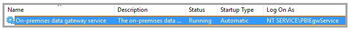
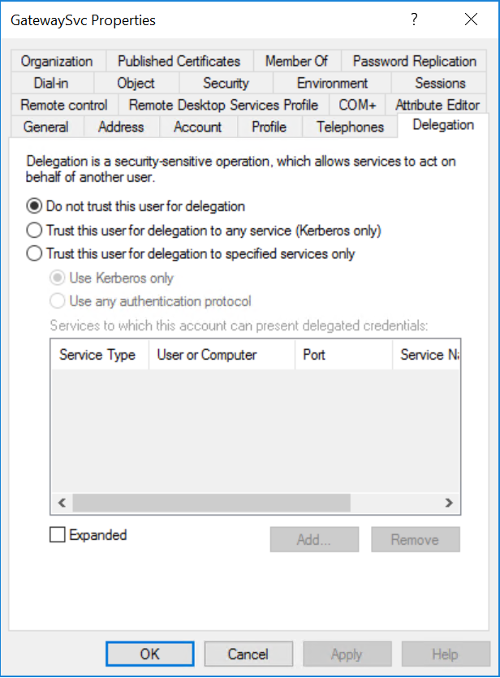
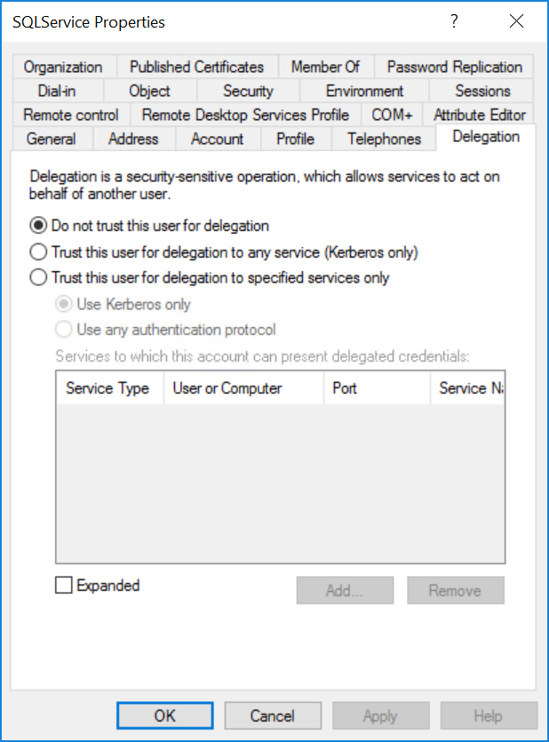
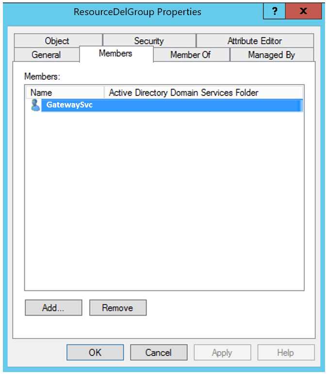
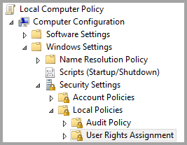
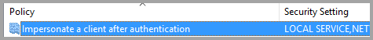
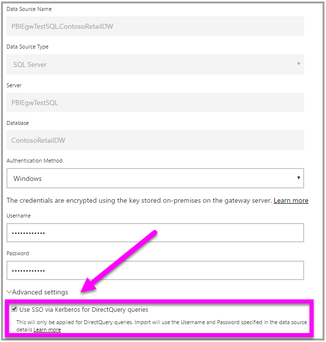

# Use resource-based Kerberos for single sign-on (SSO) from Power BI to on-premises data sources

Use [resource-based Kerberos constrained delegation](/windows-server/security/kerberos/kerberos-constrained-delegation-overview) to enable single sign-on connectivity for Windows Server 2012 and later versions, permitting front-end and back-end services to be in different domains. For this to work, the back-end service domain needs to trust the front-end service domain.

## Preparing for resource-based Kerberos constrained delegation

Several items must be configured for Kerberos Constrained Delegation to work properly, including _Service Principal Names_ (SPN) and delegation settings on service accounts.

### Prerequisite 1: Operating system requirements

Resource-based constrained delegation can only be configured on a domain controller running Windows Server 2012 R2 or Windows Server 2012 or higher.

### Prerequisite 2: Install and configure the On-premises data gateway

This release of the On-premises data gateway supports an in-place upgrade, and _settings takeover_ of existing gateways.

### Prerequisite 3: Run the gateway Windows service as a domain account

In a standard installation, the gateway runs as a machine-local service account (specifically, _NT Service\PBIEgwService_) such as what's shown in the following image:



To enable **Kerberos Constrained Delegation, the gateway must run as a domain account, unless your Azure AD is already synchronized with your local Active Directory (using Azure AD DirSync/Connect). If you need to switch the account to a domain account, see [Switching the gateway to a domain account](service-gateway-sso-kerberos.md#switching-the-gateway-to-a-domain-account) later in this article.

If Azure AD DirSync / Connect is configured and user accounts are synchronized, the gateway service does not need to perform local AD lookups at runtime. You can use the local Service SID (instead of requiring a domain account) for the gateway service. The Kerberos Constrained Delegation configuration steps outlined in this article are the same as that configuration (they are simply applied to the gateway's computer object in Active Directory, instead of the domain account).

### Prerequisite 4: Have domain admin rights to configure SPNs (SetSPN) and Kerberos constrained delegation settings

While it is technically possible for a domain administrator to temporarily or permanently allow rights to someone else to configure SPNs and Kerberos delegation without requiring domain admin rights, that's not the recommended approach. In the following section, we cover the configuration steps necessary for **Prerequisite 3** in detail.

## Configuring Kerberos constrained delegation for the gateway and data source

To properly configure the system, we need to configure or validate the following two items:

1. If needed, configure an SPN for the gateway service domain account.

1. Configure delegation settings on the gateway service domain account.

Note that you must be a domain administrator to perform those two configuration steps.

The following sections describe these steps in turn.

### Configure an SPN for the gateway service account

First, determine whether an SPN was already created for the domain account used as the gateway service account, but following these steps:

1. As a domain administrator, launch **Active Directory Users and Computers**.

1. Right-click on the domain, select **Find**, and type in the account name of the gateway service account

1. In the search result, right-click on the gateway service account and select **Properties**.

1. If the **Delegation** tab is visible on the **Properties** dialog, then an SPN was already created and you can jump ahead to the next subsection about configuring Delegation settings.

    If there is no **Delegation** tab on the **Properties** dialog, you can manually create an SPN on that account, which adds the **Delegation** tab (that is the easiest way to configure delegation settings). Creating an SPN can be done using the [setspn tool](https://technet.microsoft.com/library/cc731241.aspx) that comes with Windows (you need domain admin rights to create the SPN).

    For example, imagine the gateway service account is "PBIEgwTest\GatewaySvc", and the machine name with the gateway service running is called **Machine1**. To set the SPN for the gateway service account for that machine in this example, you would run the following command:

      

    With that step completed, we can move on to configuring delegation settings.

### Configure delegation settings

In the following steps, we assume an on-premises environment with two machines in different domains: a gateway machine and a database server running SQL Server. For the sake of this example, we also assume the following settings and names:

- Gateway machine name: **PBIEgwTestGW**
- Gateway service account: **PBIEgwTestFrontEnd\GatewaySvc** (account display name: Gateway Connector)
- SQL Server data source machine name: **PBIEgwTestSQL**
- SQL Server data source service account: **PBIEgwTestBackEnd\SQLService**

Given those example names and settings, use the following configuration steps:

1. Using **Active Directory Users and Computers**, which is a Microsoft Management Console (MMC) snap-in, on the domain controller for **PBIEgwTestFront-end** domain, make sure no delegation settings are applied for the gateway service account.

    

1. Using **Active Directory Users and Computers**, on the domain controller for **PBIEgwTestBack-end** domain, make sure no delegation settings are applied for the back-end service account. In addition, make sure that the "msDS-AllowedToActOnBehalfOfOtherIdentity" attribute for this account is also not set. You can find this attribute in the "Attribute Editor", as shown in the following image:

    

1. Create a group in **Active Directory Users and Computers**, on the domain controller for **PBIEgwTestBack-end** domain. Add the gateway service account to this group as shown in the following image. The image shows a new group called _ResourceDelGroup_ and the gateway service account **GatewaySvc** added to this group.

    

1. Open command prompt and run the following commands n the domain controller for **PBIEgwTestBack-end** domain to update msDS-AllowedToActOnBehalfOfOtherIdentity attribute of the back-end service account:

    ```powershell
    $c=get-adgroupResourceDelGroup
    set-aduser **SQLService** -principalsAllowedToDelegateToAccount$c
    ```

1. You can verify that the update is reflected in the "Attribute Editor" tab in the properties for the back-end service account in **Active Directory Users and Computers.**

Finally, on the machine running the gateway service (**PBIEgwTestGW**  in our example), the gateway service account must be granted the local policy "Impersonate a client after authentication". You can perform/verify this with the Local Group Policy Editor (**gpedit**).

1. On the gateway machine, run: _gpedit.msc_.

1. Navigate to  **Local Computer Policy > Computer Configuration > Windows Settings > Security Settings > Local Policies > User Rights Assignment**, as shown in the following image.

    

1. From the list of policies under  **User Rights Assignment**, select  **Impersonate a client after authentication**.

    

1. Right-click and open the  **Properties**  for  **Impersonate a client after authentication**, and check the list of accounts. It must include the gateway service account ( **PBIEgwTestFront-end**  **\GatewaySvc** ).

1. From the list of policies under  **User Rights Assignment**, select **Act as part of the operating system (SeTcbPrivilege)**. Ensure that the gateway service account is included in the list of accounts as well.

1. Restart the  **On-premises data gateway**  service process.

## Running a Power BI report

After all the configuration steps outlined earlier in this article have been completed, you can use the **Manage Gateway** page in Power BI to configure the data source. Then under its **Advanced Settings** enable SSO, and publish reports and datasets binding to that data source.



This configuration will work in most cases. However, with Kerberos there can be different configurations depending on your environment. If the report still won't load, you'll need to contact your domain administrator to investigate further.

## Next steps

For more information about the **On-premises data gateway** and **DirectQuery**, check out the following resources:

- [On-premises data gateway](service-gateway-onprem.md)
- [DirectQuery in Power BI](desktop-directquery-about.md)
- [Data sources supported by DirectQuery](desktop-directquery-data-sources.md)
- [DirectQuery and SAP BW](desktop-directquery-sap-bw.md)
- [DirectQuery and SAP HANA](desktop-directquery-sap-hana.md)