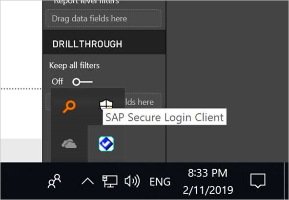

> [!NOTE]
> Complete the steps on this page in addition to the steps in [Configure Kerberos SSO](service-gateway-sso-kerberos.md) before attempting to refresh a SAP BW-based report that uses Kerberos SSO.

## Configure SAP BW for SSO using CommonCryptoLib

> [!NOTE]
> These instructions cover SSO setup for SAP BW **Application** Servers. Microsoft does not currently support SSO connections to SAP BW **Message** Servers.

1. Ensure that your BW server is correctly configured for Kerberos SSO. If it is, you should be able to use SSO to access your BW server with an SAP tool like SAP GUI. For more information on setup steps, see [SAP Single Sign-On: Authenticate with Kerberos/SPNEGO](https://blogs.sap.com/2017/07/27/sap-single-sign-on-authenticate-with-kerberosspnego/). Your BW server should be using CommonCryptoLib as its SNC Library and have an SNC name that starts with "CN=", such as "CN=BW1". For more information on SNC name requirements, see [SNC Parameters for Kerberos Configuration](https://help.sap.com/viewer/df185fd53bb645b1bd99284ee4e4a750/3.0/en-US/360534094511490d91b9589d20abb49a.html) (specifically, the snc/identity/as parameter).

1. If you haven't already done so, install the x64-version of the [SAP .NET Connector](https://support.sap.com/en/product/connectors/msnet.html) on the computer the gateway has been installed on. You can check whether the component has been installed by attempting to connect to your BW server in  Power BI Desktop. If you can't connect using the 2.0 implementation, the .NET Connector isn't installed.

1. Ensure that SAP Secure Login Client (SLC) isn't running on the computer the gateway is installed on. SLC caches Kerberos tickets in a way that can interfere with the gateway's ability to use Kerberos for SSO. If SLC is installed, uninstall it or make sure you exit SAP Secure Login Client: right-click the icon in the system tray and select Log Out and Exit before attempting an SSO connection using the gateway. SLC is not supported for use on Windows Server machines. For more information, see [SAP Note 2780475](https://launchpad.support.sap.com/#/notes/2780475) (s-user required).

    

    If you uninstall SLC or select **Log Out** and **Exit** , open a cmd window and enter `klist purge` to clear any cached Kerberos tickets before attempting an SSO connection through the gateway.

1. Download 64-bit CommonCryptoLib (sapcrypto.dll) version **8.5.25 or greater** from the SAP Launchpad, and copy it to a folder on your gateway machine. In the same directory where you copied sapcrypto.dll, create a file named sapcrypto.ini, with the following content:

    ```
    ccl/snc/enable_kerberos_in_client_role = 1
    ```

    The .ini file contains configuration information required by CommonCryptoLib to enable SSO in the gateway scenario.

    > [!NOTE]
    > These files must be stored in the same location; in other words, _/path/to/sapcrypto/_ should contain both sapcrypto.ini and sapcrypto.dll.

    Both the gateway Service User and the Active Directory (AD) user that the Service User will impersonate need read and execute permissions for both files. We recommend granting permissions on both the .ini and .dll files to the Authenticated Users group. For testing purposes, you can also explicitly grant these permissions to both the gateway Service User and the Active Directory user you'll use for testing. In the screenshot below we've granted the Authenticated Users group **Read &amp; execute** permissions for sapcrypto.dll:

    

1. If you don't have an SAP Business Warehouse Server data source, on the **Manage gateways** page in the Power BI service, add a data source. If you already have a BW data source associated with the gateway you want the SSO connection to flow through, prepare to edit it.

    For **SNC Library**, select either **SNC\_LIB or SNC\_LIB\_64 environmental variable** or **Custom**. If you select the **SNC\_LIB** option, you must set the value of the SNC\_LIB\_64 environment variable on the gateway machine to the absolute path of the copy of sapcrypto.dll on the gateway machine, e.g. C:\Users\Test\Desktop\sapcrypto.dll. If you choose **Custom** , paste the absolute path to the sapcrypto .dll into the Custom SNC Library Path field that appears on the **Manage gateways** page. For **SNC Partner Name**, enter the SNC Name of the BW server. Under **Advanced settings**, ensure that **Use SSO via Kerberos for DirectQuery queries** is checked.

1. Create a CCL\_PROFILE system environment variable and point it at sapcrypto.ini:

    

    Remember that the sapcrypto .dll and .ini files must exist in the same location. In the example shown above where sapcrypto.ini is located on the desktop, sapcrypto.dll should also be located on the desktop.

1. Restart the gateway service:

    

1. [Run a Power BI report](service-gateway-sso-kerberos.md#run-a-power-bi-report)

### Troubleshooting

If you're unable to refresh the report in the Power BI service, you can use gateway tracing, CPIC tracing, and CommonCryptoLib tracing to help diagnose the issue. CPIC tracing and CommonCryptoLib are SAP products, so Microsoft can't provide any direct support for them. For Active Directory users that will be granted SSO access to BW, some Active Directory configurations may require the users to be members of the Administrators group on the machine where the gateway is installed.

1. **Gateway logs:** Simply reproduce the issue, open the [gateway app](https://docs.microsoft.com/data-integration/gateway/service-gateway-app), go to the **Diagnostics** tab, and select **Export logs** :

    

1. **CPIC Tracing:** To enable CPIC tracing, set two environment variables: CPIC\_TRACE and CPIC\_TRACE\_DIR. The first variable sets the trace level, and the second variable sets the trace file directory. The directory must be a location that  members of the Authenticated Users group can write to. Set CPIC\_TRACE to 3 and CPIC\_TRACE\_DIR to whichever directory you want the trace files written to.

    

    Reproduce the issue and check that CPIC\_TRACE\_DIR contains trace files.

1. **CommonCryptoLib Tracing:** Turn on CommonCryptoLib tracing by adding two lines to the sapcrypto.ini file you created earlier:

    ```
    ccl/trace/level=5
    ccl/trace/directory=<drive>:\logs\sectrace
    ```

    Make sure to change the _ccl/trace/directory_ option to a location members of the Authenticated Users group can write to. Alternatively, create a new .ini file to change this behavior. In the same directory as sapcrypto.ini and sapcrypto.dll, create a file named sectrace.ini, with the content below. Replace the DIRECTORY option with a location on your machine that Authenticated User can write to:

    ```
    LEVEL = 5

    DIRECTORY = <drive>:\logs\sectrace
    ```

    Now, reproduce the issue and check that the location pointed to by DIRECTORY contains trace files. Make sure to turn off CPIC and CCL tracing when you are finished.

    For more information on CommonCryptoLib tracing, see [SAP Note 2491573](https://launchpad.support.sap.com/#/notes/2491573) (s-user required).

## Next steps

For more information about the **on-premises data gateway** and **DirectQuery**, check out the following resources:

* [What is an on-premises data gateway?](/data-integration/gateway/service-gateway-getting-started)
* [DirectQuery in Power BI](desktop-directquery-about.md)
* [Data sources supported by DirectQuery](desktop-directquery-data-sources.md)
* [DirectQuery and SAP BW](desktop-directquery-sap-bw.md)
* [DirectQuery and SAP HANA](desktop-directquery-sap-hana.md)
