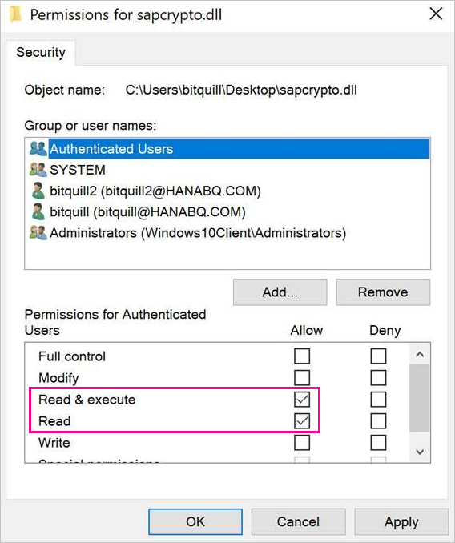
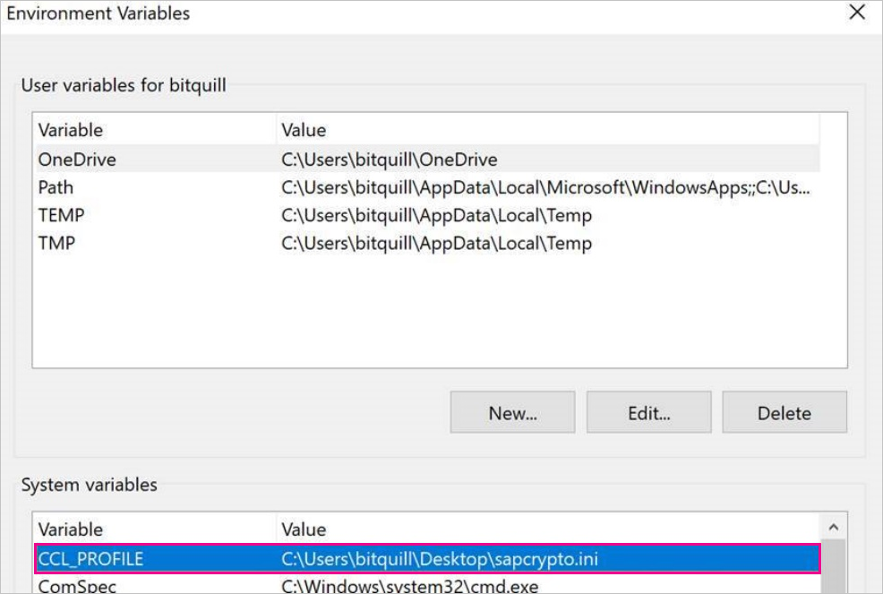

# Use Kerberos single sign-on for SSO to SAP BW using CommonCryptoLib (sapcrypto.dll)

This article describes how to configure your SAP BW data source to enable SSO from the Power BI service by using CommonCryptoLib (sapcrypto.dll).

> [!NOTE]
> Before you attempt to refresh a SAP BW-based report that uses Kerberos SSO, complete both the steps in this article and the steps in [Configure Kerberos SSO](service-gateway-sso-kerberos.md). Using CommonCryptoLib as your SNC library enables SSO connections to both SAP BW Application Servers and SAP BW Message Servers.

## Configure SAP BW to enable SSO using CommonCryptoLib

> [!NOTE]
> The on-premises data gateway is 64-bit software and therefore requires the 64-bit version of CommonCryptoLib (sapcrypto.dll) to perform BW SSO. If you plan to test the SSO connection to your SAP BW server in SAP GUI prior to attempting an SSO connection through the gateway (recommended), you'll also need the 32-bit version of CommonCryptoLib, as SAP GUI is 32-bit software.

1. Ensure that your BW server is correctly configured for Kerberos SSO using CommonCryptoLib. If it is, you can use SSO to access your BW server (either directly or through an SAP BW Message Server) with an SAP tool like SAP GUI that has been configured to use CommonCryptoLib. 

   For more information on setup steps, see [SAP Single Sign-On: Authenticate with Kerberos/SPNEGO](https://blogs.sap.com/2017/07/27/sap-single-sign-on-authenticate-with-kerberosspnego/). Your BW server should use CommonCryptoLib as its SNC Library and have an SNC name that starts with *CN=*, such as *CN=BW1*. For more information on SNC name requirements (specifically, the snc/identity/as parameter), see [SNC Parameters for Kerberos Configuration](https://help.sap.com/viewer/df185fd53bb645b1bd99284ee4e4a750/3.0/en-US/360534094511490d91b9589d20abb49a.html).

1. If you haven't already done so, install the x64-version of the [SAP .NET Connector](https://support.sap.com/en/product/connectors/msnet.html) on the computer the gateway has been installed on. 
   
   You can check whether the component has been installed by attempting to connect to your BW server in  Power BI Desktop from the gateway computer. If you can't connect by using the 2.0 implementation, the .NET Connector isn't installed or hasn't been installed to the GAC.

1. Ensure that SAP Secure Login Client (SLC) isn't running on the computer the gateway is installed on. 

   SLC caches Kerberos tickets in a way that can interfere with the gateway's ability to use Kerberos for SSO. 

1. If SLC is installed, uninstall it or make sure you exit SAP Secure Login Client. Right-click the icon in the system tray and select **Log Out** and **Exit** before you attempt an SSO connection by using the gateway. 

   SLC isn't supported for use on Windows Server machines. For more information, see [SAP Note 2780475](https://launchpad.support.sap.com/#/notes/2780475) (s-user required).

   

1. If you uninstall SLC or select **Log Out** and **Exit**, open a cmd window and enter `klist purge` to clear any cached Kerberos tickets before you attempt an SSO connection through the gateway.

1. Download 64-bit CommonCryptoLib (sapcrypto.dll) version *8.5.25 or greater* from the SAP Launchpad, and copy it to a folder on your gateway machine. In the same directory where you copied sapcrypto.dll, create a file named sapcrypto.ini, with the following content:

    ```
    ccl/snc/enable_kerberos_in_client_role = 1
    ```

    The .ini file contains configuration information required by CommonCryptoLib to enable SSO in the gateway scenario.

    > [!NOTE]
    > These files must be stored in the same location; in other words, _/path/to/sapcrypto/_ should contain both sapcrypto.ini and sapcrypto.dll.

    Both the gateway Service User and the Active Directory (AD) user that the service user impersonates need read and execute permissions for both files. We recommend granting permissions on both the .ini and .dll files to the Authenticated Users group. For testing purposes, you can also explicitly grant these permissions to both the gateway Service User and the Active Directory user you use for testing. In the following screenshot we've granted the Authenticated Users group **Read &amp; execute** permissions for sapcrypto.dll:

    

1. If you don't already have an SAP BW data source associated with the gateway you want the SSO connection to flow through, add one on the **Manage gateways** page in the Power BI service. If you already have such a data source, edit it: 
    - Choose **SAP Business Warehouse** as the **Data Source Type** if you want to create an SSO connection to a BW Application Server. 
    - Select **Sap Business Warehouse Message Server** if you want to create an SSO connection to a BW Message Server.

1. For **SNC Library**, select either the **SNC\_LIB** or **SNC\_LIB\_64** environment variable, or **Custom**. 

   - If you select **SNC\_LIB**, you must set the value of the **SNC\_LIB\_64** environment variable on the gateway machine to the absolute path of the 64-bit copy of sapcrypto.dll on the gateway machine. For example, *C:\Users\Test\Desktop\sapcrypto.dll*.

   - If you choose **Custom**, paste the absolute path to *sapcrypto.dll* into the Custom SNC Library Path field that appears on the **Manage gateways** page. 

1. For **SNC Partner Name**, enter the SNC Name of the BW server. Under **Advanced settings**, ensure that **Use SSO via Kerberos for DirectQuery queries** is checked. Fill in the other fields as if you were establishing a Windows Authentication connection from PBI Desktop.

1. Create a **CCL\_PROFILE** system environment variable and set its value to the path to sapcrypto.ini.

    

    The sapcrypto .dll and .ini files must exist in the same location. In the above example, sapcrypto.ini and sapcrypto.dll are both located on the desktop.

1. Restart the gateway service.

    

1. [Run a Power BI report](service-gateway-sso-kerberos.md#run-a-power-bi-report)

## Troubleshooting

If you're unable to refresh the report in the Power BI service, you can use gateway tracing, CPIC tracing, and CommonCryptoLib tracing to diagnose the issue. Because CPIC tracing and CommonCryptoLib are SAP products, Microsoft can't provide support for them. For Active Directory users that are granted SSO access to BW, some Active Directory configurations might require the users to be members of the Administrators group on the machine where the gateway is installed.

### Gateway logs

1. Reproduce the issue.

2. Open the [gateway app](https://docs.microsoft.com/data-integration/gateway/service-gateway-app), and select **Export logs** from the **Diagnostics** tab.

      

### CPIC tracing

1. To enable CPIC tracing, set two environment variables: **CPIC\_TRACE** and **CPIC\_TRACE\_DIR**. 

   The first variable sets the trace level and the second variable sets the trace file directory. The directory must be a location that  members of the Authenticated Users group can write to. 
 
2. Set **CPIC\_TRACE** to *3* and **CPIC\_TRACE\_DIR** to whichever directory you want the trace files written to. For example:

   

 3. Reproduce the issue and ensure that **CPIC\_TRACE\_DIR** contains trace files.

### CommonCryptoLib tracing 

1. Turn on CommonCryptoLib tracing by adding these lines to the sapcrypto.ini file you created earlier:

    ```
    ccl/trace/level=5
    ccl/trace/directory=<drive>:\logs\sectrace
    ```

2. Change the `ccl/trace/directory` option to a location to which members of the Authenticated Users group can write. 

3. Alternatively, create a new .ini file to change this behavior. In the same directory as sapcrypto.ini and sapcrypto.dll, create a file named sectrace.ini, with the following content. Replace the `DIRECTORY` option with a location on your machine that members of the Authenticated Users group can write to:

    ```
    LEVEL = 5
    DIRECTORY = <drive>:\logs\sectrace
    ```

4. Reproduce the issue and verify that the location pointed to by **DIRECTORY** contains trace files. 

5. When you're finished, turn off CPIC and CCL tracing.

    For more information on CommonCryptoLib tracing, see [SAP Note 2491573](https://launchpad.support.sap.com/#/notes/2491573) (SAP s-user required).

## Next steps

For more information about the on-premises data gateway and DirectQuery, see the following resources:

* [What is an on-premises data gateway?](/data-integration/gateway/service-gateway-onprem)
* [DirectQuery in Power BI](desktop-directquery-about.md)
* [Data sources supported by DirectQuery](desktop-directquery-data-sources.md)
* [DirectQuery and SAP BW](desktop-directquery-sap-bw.md)
* [DirectQuery and SAP HANA](desktop-directquery-sap-hana.md)
