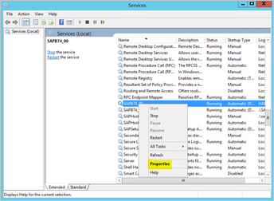
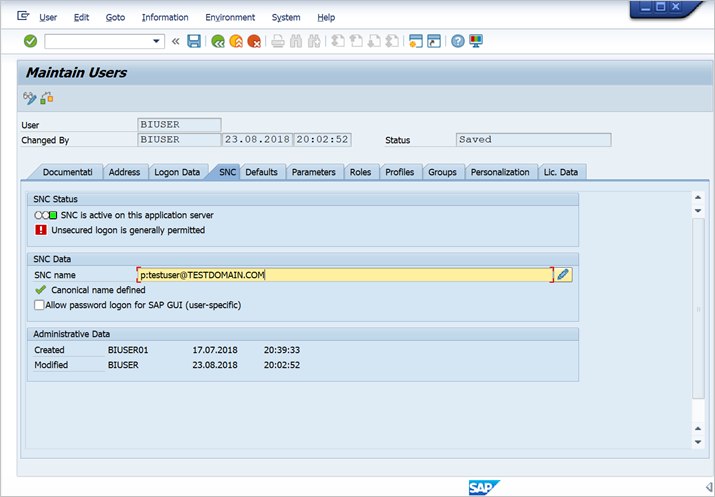
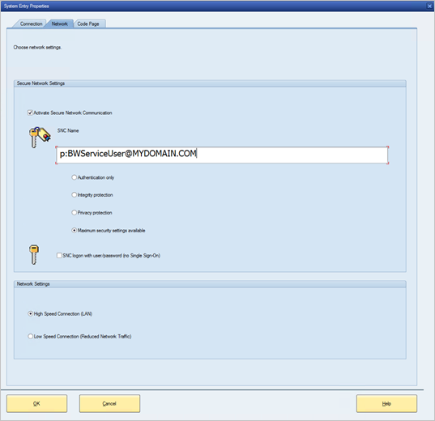

# Use Kerberos for single sign-on (SSO) to SAP BW using gx64krb5

This article describes how to configure your SAP BW data source to enable SSO from the Power BI service using gx64krb5.

> [!NOTE]
> You can complete the steps in this article in addition to the steps in [Configure Kerberos SSO](service-gateway-sso-kerberos.md) to enable SSO-based refresh for SAP BW Application Server-based reports in Power BI service. However, Microsoft recommends the use of CommonCryptoLib, not gx64krb5 as your SNC library. SAP no longer offers support for gx64krb5 and the steps required to configure it for use with the gateway are significantly more complex compared to CommonCryptoLib. See [Configure SAP BW for SSO using CommonCryptoLib](service-gateway-sso-kerberos-sap-bw-commoncryptolib.md) for how to configure SSO using CommonCryptoLib. You should complete the configuration for CommonCryptoLib _or_ gx64krb5. Do not complete the configuration steps for both libraries.

### Set up gx64krb5 on gateway machine and the SAP BW server
This guide attempts to be as comprehensive as possible. If you've already completed some of these steps, you can skip them. For example, you might have already configured your SAP BW server for SSO using gx64krb5.

### Set up gx64krb5 on the gateway machine and the SAP BW server

> [!NOTE]
> `gx64krb5` is no longer actively supported by SAP. For more information, see [SAP Note 352295](https://launchpad.support.sap.com/#/notes/352295). Also note that `gx64krb5` doesn't allow for SSO connections from the data gateway to SAP BW Message Servers. Only connections to SAP BW Application Servers are possible. This Application Server-only restriction does not exist if you use [CommonCryptoLib](service-gateway-sso-kerberos-sap-bw-commoncryptolib.md) as your SNC library. Other SNC libraries might also work for BW SSO but they are not officially supported by Microsoft.

`gx64krb5` must be in use by both the client and server to complete an SSO connection through the gateway. That is, both the client and server must be using the same SNC library.

1. Download `gx64krb5` from [SAP Note 2115486](https://launchpad.support.sap.com/) (SAP s-user required). Ensure you have at least version 1.0.11.x. Also, download `gsskrb5` (the 32-bit version of the library) if you want to test the SSO connection in SAP GUI before you attempt the SSO connection through the gateway (recommended). The 32-bit version is required to test with SAP GUI because SAP GUI is only available in 32-bit.

1. Put `gx64krb5` in a location on your gateway machine that is accessible by your gateway service user. If you want to test the SSO connection using SAP GUI, also put a copy of `gsskrb5` on the machine and set the **SNC_LIB** environment variable to point at it. Both the gateway Service User and the Active Directory (AD) users that the Service User will impersonate need read and execute permissions for the copy of `gx64krb5`. We recommend granting permissions on the .dll to the Authenticated Users group. For testing purposes, you can also explicitly grant these permissions to both the gateway Service User and the Active Directory user you'll use to test.

1. If your BW server hasn't already been configured for SSO using gx64krb5, put another copy of the .dll on your SAP BW server machine in a location accessible by the SAP BW server. For more information on configuring gx64krb5 for use with an SAP BW server, see [SAP documentation](https://launchpad.support.sap.com/#/notes/2115486) (s-user required).

1. On the client and server machines, set the **SNC_LIB** and/or **SNC_LIB_64** environment variables. If you use gsskrb5, set the **SNC_LIB** variable to the absolute path of gsskrb5.dll. If you use gx64krb5, set the **SNC_LIB_64** variable to the absolute path of gx64krb5.dll.

### Configure an SAP BW service user and enable SNC communication on the BW server

Complete this section if you haven't already configured your SAP BW server for SNC communication (for example, SSO) by using gx64krb5.

> [!NOTE]
> This section assumes that you've already created a Service User for BW and bound a suitable SPN to it (that is, a name that begins with *SAP/*).

1. Give the service user access to your SAP BW Application Server:

    1. On the SAP BW server machine, add the Service User to the Local Admin group. Open the Computer Management program and identify the Local Admin group for your server. For example:

        

    1. Double-click the Local Admin group, and select **Add** to add your service user to the group. Select **Check Names** to ensure you've entered the name correctly. Select **OK**.

1. Set the SAP BW server's Service User as the user that starts the SAP BW server service on the SAP BW server machine.

    1. Open **Run**, and then enter **Services.msc**. Find the service corresponding to your SAP BW Application Server instance, right-click it, and then select **Properties**.

        

    1. Switch to the **Log on** tab, and change the user to your SAP BW service user. Enter the user's password, and select **OK**.

1. Sign in to your server in SAP Logon and set the following profile parameters by using the RZ10 transaction:

    1. Set the **snc/identity/as** profile parameter to *p:<the SAP BW service user you've created>*, such as  *p:BWServiceUser\@MYDOMAIN.COM*. Note the p: that precedes the service user's UPN. It's not p:CN= like when Common Crypto Lib is used as the SNC library.

    1. Set the **snc/gssapi\_lib** profile parameter to *<path to gx64krb5.dll on the BW server machine>*. Place the library in a location the SAP BW Application Server can access.

    1. Set the following additional profile parameters, changing the values as required to fit your needs. The last five options enable clients to connect to the SAP BW server by using SAP Logon without having SNC configured.

        | **Setting** | **Value** |
        | --- | --- |
        | snc/data\_protection/max | 3 |
        | snc/data\_protection/min | 1 |
        | snc/data\_protection/use | 9 |
        | snc/accept\_insecure\_cpic | 1 |
        | snc/accept\_insecure\_gui | 1 |
        | snc/accept\_insecure\_r3int\_rfc | 1 |
        | snc/accept\_insecure\_rfc | 1 |
        | snc/permit\_insecure\_start | 1 |

    1. Set the property **snc/enable** to 1.

1. After setting these profile parameters, open the SAP Management Console on the server machine and restart the SAP BW instance. If the server won't start, confirm that you've set the profile parameters correctly. For more on profile parameter settings, see the [SAP documentation](https://help.sap.com/saphelp_nw70ehp1/helpdata/en/e6/56f466e99a11d1a5b00000e835363f/frameset.htm). You can also consult the troubleshooting information later in this section if you encounter problems.

### Map an SAP BW user to an Active Directory user

If you haven't already, map an Active Directory user to an SAP BW Application Server user and test the SSO connection in SAP Logon.

1. Sign in to your SAP BW server by using SAP Logon. Run transaction SU01.

1. For **User**, enter the SAP BW user you want to enable SSO connections for (in the screenshot below, we're preparing to set permissions for BIUSER). Select the **Edit** icon (the image of a pen) near the top left of the SAP Logon window.

    

1. Select the **SNC** tab. In the SNC name input box, enter *p:<your Active Directory user>@<your domain>*. For the SNC name, *p:* must precede the Active Directory user's UPN. The Active Directory user you specify should belong to the person or organization for whom you want to enable SSO access to the SAP BW Application Server. For example, if you want to enable SSO access for the user *testuser\@TESTDOMAIN.COM*, enter *p:testuser\@TESTDOMAIN.COM*.

    

1. Select the **Save** icon (floppy disk image) near the top left of the screen.

### Test sign in via SSO

Verify that you can sign in to the server by using SAP Logon through SSO as the Active Directory user for whom you've enabled SSO access.

1. As the Active Directory user you just enabled SSO access for, sign in to a machine in your domain on which SAP Logon is installed. Launch SAP Logon, and create a new connection.

1. Copy the `gsskrb5` .dll you downloaded earlier to a location on the machine you signed-on to. Set the `SNC_LIB` environment variable to the absolute path of this location.

1. Launch SAP Logon, and create a new connection.

1. In the **Create New System Entry** screen, select **User Specified System**, then **Next**.

    

1. Fill in the appropriate details on the next screen, including the application server, instance number, and system ID. Then, select **Finish**.

1. Right-click the new connection and select **Properties**. Select the **Network** tab. In the **SNC Name** text box, enter *p:<the SAP BW service user's UPN>*, such as *p:BWServiceUser\@MYDOMAIN.COM*. Then select **OK**.

    

1. Double-click the connection you just created to attempt an SSO connection to your SAP BW server. If this connection succeeds, continue to the next step. Otherwise, review the earlier steps in this document to make sure they've been completed correctly, or review the troubleshooting section below. If you can't connect to the SAP BW server via SSO in this context, you won't be able to connect to the SAP BW server by using SSO in the gateway context.

### Add registry entries to the gateway machine

Add required registry entries to the registry of the machine that the gateway is installed on, and to machines intended to connect from Power BI Desktop. Here are the commands to run:

1. ```REG ADD HKLM\SOFTWARE\Wow6432Node\SAP\gsskrb5 /v ForceIniCredOK /t REG_DWORD /d 1 /f```

1. ```REG ADD HKLM\SOFTWARE\SAP\gsskrb5 /v ForceIniCredOK /t REG_DWORD /d 1 /f```

### Add a new SAP BW Application Server data source to the Power BI service, or edit an existing one

1. In the data source configuration window, enter the Application Server's **Hostname**, **System Number**, and **client ID**, as you would to sign in to your SAP BW server from Power BI Desktop.

1. In the **SNC Partner Name** field, enter *p:<the SPN you mapped to your SAP BW service user>*. For example, if the SPN is **SAP/BWServiceUser\@MYDOMAIN.COM**, you should enter *p:SAP/BWServiceUser\@MYDOMAIN.COM* in the **SNC Partner Name** field.

1. For the SNC Library, select **SNC\_LIB** or **SNC\_LIB\_64**. Make sure that **SNC\_LIB\_64** on the gateway machine points to gx64krb5.dll. Alternatively, you can select the "Custom" option and provide the absolute path the gx64krb5.dll (on the gateway machine).

1. Select the **Use SSO via Kerberos for DirectQuery queries** box, and select **Apply**. If the test connection is not successful, verify that the previous setup and configuration steps were completed correctly.

1. [Run a Power BI report](service-gateway-sso-kerberos.md#run-a-power-bi-report)

## Troubleshooting

### Troubleshoot gx64krb5 configuration

If you encounter any problems, follow these steps to troubleshoot the gx64krb5 installation and SSO connections.

* Viewing the server logs (…work\dev\_w0 on the server machine) can be helpful to troubleshoot any errors you encounter when you complete the gx64krb5 setup steps. This is particularly true if the SAP BW server won't start after the profile parameters have been changed.

* If you're unable to start the SAP BW service due to a sign-on failure, you might have provided the wrong password when setting the SAP BW "start-as" user. Verify the password by logging in to a machine in your Active Directory environment as the SAP BW service user.

* If you get errors about underlying data source credentials (for example, SQL Server) preventing the server from starting, verify that you've granted the service user access to the SAP BW database.

* You might get the following message: *(GSS-API) specified target is unknown or unreachable.* This error usually means you have the wrong SNC name specified. Make sure to use *p:* only, not *p:CN=* or anything else in the client application, other than the service user's UPN.

* You might get the following message: *(GSS-API) An invalid name was supplied.* Make sure "p:" is in the value of the server's SNC identity profile parameter.

* You might get the following message: *(SNC error) the specified module could not be found.* This error is often caused by putting `gx64krb5.dll` somewhere that requires elevated privileges (administrator rights) to access.

### Troubleshoot gateway connectivity issues

1. Check the gateway logs. Open the gateway configuration application, and select **Diagnostics**, then **Export logs**. The most recent errors are at the bottom of any log files you examine.

    

1. Turn on SAP BW tracing, and review the generated log files. There are several different types of SAP BW tracing available (for example, CPIC tracing). For more information, see the SAP documentation.

## Next steps

For more information about the on-premises data gateway and DirectQuery, see the following resources:

* [What is an on-premises data gateway?](/data-integration/gateway/service-gateway-onprem)
* [DirectQuery in Power BI](desktop-directquery-about.md)
* [Data sources supported by DirectQuery](desktop-directquery-data-sources.md)
* [DirectQuery and SAP BW](desktop-directquery-sap-bw.md)
* [DirectQuery and SAP HANA](desktop-directquery-sap-hana.md)
