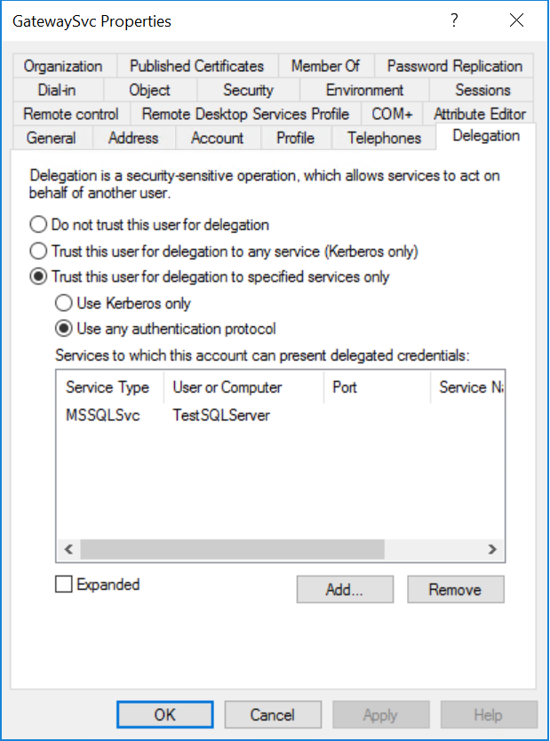
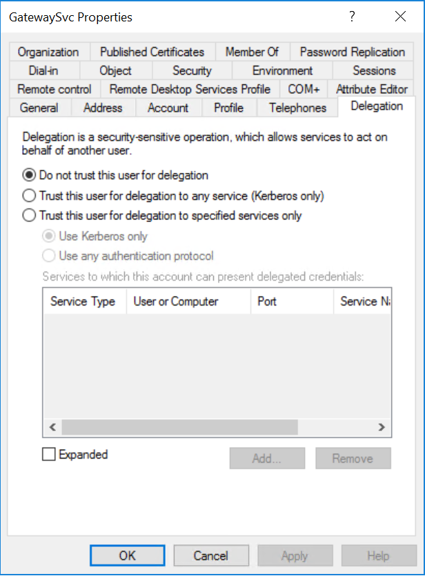

# Configure Kerberos-based SSO from Power BI service to on-premises data sources

Use [Kerberos constrained delegation](/windows-server/security/kerberos/kerberos-constrained-delegation-overview) to enable seamless SSO connectivity. Enabling SSO makes it easy for Power BI reports and dashboards to refresh data from on-premises sources.

Several items must be configured for Kerberos constrained delegation to work properly, including _Service Principal Names_ (SPN) and delegation settings on service accounts.

### Prerequisite 1: Install and configure the Microsoft on-premises data gateway

The on-premises data gateway supports an in-place upgrade, and _settings takeover_ of existing gateways.

### Prerequisite 2: Run the gateway Windows service as a domain account

In a standard installation, the gateway runs as a machine-local service account (specifically, _NT Service\PBIEgwService_), as shown in the following image:


To enable Kerberos constrained delegation, the gateway must run as a domain account, unless your Azure Active Directory (Azure AD) instance is already synchronized with your local Active Directory instance (using Azure AD DirSync/Connect). To switch to a domain account, see [change the gateway service account](/data-integration/gateway/service-gateway-service-account).

> [!NOTE]
> If Azure AD Connect is configured and user accounts are synchronized, the gateway service doesn't need to perform local Azure AD lookups at runtime. Rather, you can simply use the local service SID for the gateway service to complete all required configuration in Azure Active Directory. The Kerberos constrained delegation configuration steps outlined in this article are the same as the configuration steps required in the Azure Active Directory context. They are simply applied to the gateway's computer object (as identified by the local service SID) in Azure AD instead of the domain account.

### Prerequisite 3: Have domain admin rights to configure SPNs (SetSPN) and Kerberos constrained delegation settings

We don't recommended that a domain administrator temporarily or permanently grant rights to someone else to configure SPNs and Kerberos delegation settings without requiring that person to have domain admin rights. In the following section, we cover the recommended configuration steps in more detail.

## Configure Kerberos constrained delegation for the gateway and data source

As a domain administrator, configure an SPN for the gateway service domain account (if required), and configure delegation settings on the gateway service domain account.

### Configure an SPN for the gateway service account

First, determine whether an SPN was already created for the domain account used as the gateway service account:

1. As a domain administrator, launch **Active Directory Users and Computers**.

2. Right-click on the domain, select **Find**, and enter the account name of the gateway service account.

3. In the search result, right-click on the gateway service account and select **Properties**.

4. If the **Delegation** tab is visible on the **Properties** dialog, then an SPN was already created and you can skip to [Decide on resource-based or standard Kerberos constrained delegation](#decide-on-resource-based-or-standard-kerberos-constrained-delegation).

    If there is no **Delegation** tab on the **Properties** dialog box, you can manually create an SPN on the account to enable it. Use the [setspn tool](https://technet.microsoft.com/library/cc731241.aspx) that comes with Windows (you need domain admin rights to create the SPN).

    For example, imagine the gateway service account is **Contoso\GatewaySvc**), and the name of the machine the gateway service is running on is **MyGatewayMachine**. To set the SPN for the gateway service account you would run the following command:

    

    You can also set the SPN using the Active Directory Users and Computers MMC (Microsoft Management Console) snap-in.

### Decide on resource-based or standard Kerberos constrained delegation

Delegation settings can be configured for _either_ resource-based constrained Kerberos delegation or standard Kerberos constrained delegation. Use resource-based delegation if your data source belongs to a different domain than your gateway, but note that this approach requires Windows Server 2012 or later. See the [constrained Kerberos delegation overview page](/windows-server/security/kerberos/kerberos-constrained-delegation-overview) for more information on the differences between the two approaches to delegation.

 Once you have decided which approach you want to use, proceed to _either_ the [Configure the gateway service account for standard Kerberos constrained delegation](#configure-the-gateway-service-account-for-standard-kerberos-constrained-delegation) _or_ [Configure the gateway service account for resource-based Kerberos constrained delegation](#configure-the-gateway-service-account-for-resource-based-kerberos-constrained-delegation) section. Do not complete both subsections.

## Configure the gateway service account for standard Kerberos constrained delegation

> [!NOTE]
> Complete the steps in this section if you want to enable standard Kerberos constrained delegation. If you want to enable resource-based Kerberos constrained delegation complete the steps in the [Configure the gateway service account for resource-based Kerberos constrained delegation](#configure-the-gateway-service-account-for-resource-based-kerberos-constrained-delegation) subsection.

We will now set the delegation settings for the gateway service account. There are multiple tools you can use to perform these steps. Here, we'll use Active Directory Users and Computers, which is a Microsoft Management Console (MMC) snap-in to administer and publish information in the directory. It's available on domain controllers by default, but you can also enable it through Windows Feature configuration on other machines.

We need to configure Kerberos constrained delegation with protocol transiting. With constrained delegation, you must be explicit about which services you want to allow the gateway to present delegated credentials to. For example, only SQL Server or your SAP HANA server accepts delegation calls from the gateway service account.

This section assumes you have already configured SPNs for your underlying data sources (such as SQL Server, SAP HANA, SAP BW, Teradata, or Spark). To learn how to configure those data source server SPNs, refer to technical documentation for the respective database server. You can also see the heading *What SPN does your app require?* in the [My Kerberos Checklist](https://techcommunity.microsoft.com/t5/SQL-Server-Support/My-Kerberos-Checklist-8230/ba-p/316160) blog post.

In the following steps, we assume an on-premises environment with two machines: a gateway machine and a database server running SQL Server that has already been configured for Kerberos-based SSO. The steps can be adopted for one of the other supported data sources, so long as the data source has already been configured for Kerberos-based single sign-on. For the sake of this example, we'll also assume the following settings and names:

* Active Directory Domain (Netbios): Contoso
* Gateway machine name: **MyGatewayMachine**
* Gateway service account: **Contoso\GatewaySvc**
* SQL Server data source machine name: **TestSQLServer**
* SQL Server data source service account: **Contoso\SQLService**

Here's how to configure the delegation settings:

1. With domain administrator rights, open **Active Directory Users and Computers**.

2. Right-click the gateway service account (**Contoso\GatewaySvc**), and select **Properties**.

3. Select the **Delegation** tab.

4. Select **Trust this computer for delegation to specified services only** > **Use any authentication protocol**.

5. Under **Services to which this account can present delegated credentials**, select **Add**.

6. In the new dialog box, select **Users or Computers**.

7. Enter the service account for the data source, for example, a SQL Server data source may have a service account like  **Contoso\SQLService**. Once the account has been added, select **OK**.

8. Select the SPN that you created for the database server. In our example, the SPN begins with **MSSQLSvc**. If you added both the FQDN and the NetBIOS SPN for your database service, select both. You might only see one.

9. Select **OK**. You should see the SPN in the list now.

    

Now, skip to [Grant the gateway service account local policy rights on the gateway machine](#grant-the-gateway-service-account-local-policy-rights-on-the-gateway-machine) to continue the setup process.

## Configure the gateway service account for resource-based Kerberos constrained delegation

> [!NOTE]
> Complete the steps in this section if you want to enable resource-based Kerberos constrained delegation. If you want to enable standard Kerberos constrained delegation complete the steps in the [Configure the gateway service account for standard Kerberos constrained delegation](#configure-the-gateway-service-account-for-standard-kerberos-constrained-delegation) subsection.

Use [resource-based Kerberos constrained delegation](/windows-server/security/kerberos/kerberos-constrained-delegation-overview) to enable single sign-on connectivity for Windows Server 2012 and later versions, permitting front-end and back-end services to be in different domains. For this to work, the back-end service domain needs to trust the front-end service domain.

In the following steps, we assume an on-premises environment with two machines in different domains: a gateway machine and a database server running SQL Server that has already been configured for Kerberos-based SSO. The steps can be adopted for one of the other supported data sources, so long as the data source has already been configured for Kerberos-based single sign-on. For the sake of this example, we also assume the following settings and names:

* Gateway machine name: **MyGatewayMachine**
* Gateway service account: **ContosoFrontEnd\GatewaySvc**
* SQL Server data source machine name: **TestSQLServer**
* SQL Server data source service account: **ContosoBackEnd\SQLService**

Given those example names and settings, complete the following configuration steps:

1. On the domain controller for **ContosoFrontEnd** domain, make sure no delegation settings are applied for the gateway service account using **Active Directory Users and Computers**, a Microsoft Management Console (MMC) snap-in.

    

2. Using **Active Directory Users and Computers** on the domain controller for the **ContosoBackEnd** domain, make sure no delegation settings are applied for the back-end service account. In addition, make sure that the **msDS-AllowedToActOnBehalfOfOtherIdentity** attribute for this account is also not set. You can find this attribute in the **Attribute Editor**, as shown in the following image:

    

3. Create a group in **Active Directory Users and Computers**, on the domain controller for **ContosoBackEnd** domain. Add the gateway service account to this group as shown in the following image. The image shows a new group called _ResourceDelGroup_ and the gateway service account, **GatewaySvc**, added to this group.

    

4. Open a command prompt and run the following commands in the domain controller for **ContosoBackEnd** domain to update the **msDS-AllowedToActOnBehalfOfOtherIdentity** attribute of the back-end service account:

    ```powershell
    $c = Get-ADGroup ResourceDelGroup
    Set-ADUser SQLService -PrincipalsAllowedToDelegateToAccount $c
    ```

5. You can verify that the update is reflected in the "Attribute Editor" tab in the properties for the back-end service account in **Active Directory Users and Computers.**

## Grant the gateway service account local policy rights on the gateway machine

Finally, on the machine running the gateway service (**MyGatewayMachine** in our example), you must grant the gateway service account the local policy **Impersonate a client after authentication** and **Act as part of the operating system (SeTcbPrivilege)**. You can perform and verify this configuration with the Local Group Policy Editor (**gpedit**).

1. On the gateway machine, run: *gpedit.msc*.

2. Go to **Local Computer Policy** > **Computer Configuration** > **Windows Settings** > **Security Settings** > **Local Policies** > **User Rights Assignment**.

    

3. Under **User Rights Assignment**, from the list of policies, select **Impersonate a client after authentication**.

    

    Right-click, and open **Properties**. Check the list of accounts. It must include the gateway service account (**Contoso\GatewaySvc**).

4. Under **User Rights Assignment**, from the list of policies, select **Act as part of the operating system (SeTcbPrivilege)**. Ensure that the gateway service account is included in the list of accounts as well.

5. Restart the **On-premises data gateway** service process.

### Set user mapping configuration parameters on the gateway machine if required

If you don't have Azure AD Connect configured, follow these steps to map a Power BI service user to a local Active Directory user. Each Active Directory user mapped in this way needs to have SSO permissions for your data source. For more information, refer to this [Guy in a Cube video](https://www.youtube.com/watch?v=NG05PG9aiRw).

1. Open the main gateway configuration file, `Microsoft.PowerBI.DataMovement.Pipeline.GatewayCore.dll`. By default, this file is stored at C:\Program Files\On-premises data gateway.

1. Set the **ADUserNameLookupProperty** to an unused Active Directory attribute. We'll assume `msDS-cloudExtensionAttribute1` is used in the steps that follow, though this attribute is only available in Windows Server 2012 and later. Set the **ADUserNameReplacementProperty** to `SAMAccountName`. Save the configuration file.

1. From the **Services** tab of Task Manager, right-click the gateway service and select **Restart**.

    

1. For each Power BI service user you want to enable Kerberos SSO for, set the `msDS-cloudExtensionAttribute1` property of a local Active Directory user (with SSO permission to your data source) to the full username of the Power BI service user. For example, if you log in to Power BI service as `test@contoso.com` and you want to map this user to a local Active Directory user with SSO permissions, say, `test@LOCALDOMAIN.COM`, set `test@LOCALDOMAIN.COM`'s `msDS-cloudExtensionAttribute1` attribute to `test@contoso.com`.

You can set the `msDS-cloudExtensionAttribute1` property using the Active Directory Users and Computers Microsoft Management Console (MMC) snap-in.

1. As a domain administrator, launch Active Directory Users and Computers, an MMC snap-in.

1. Right-click on the domain, select Find, and type in the account name of the local Active Directory user you want to map to.

1. Select the **Attribute Editor** tab.

    Locate the `msDS-cloudExtensionAttribute1` property, and double-click it. Set the value to the full username of the user you use to sign in to the Power BI Service.

1. Select **OK**.

    

1. Select **Apply**. Verify that the correct value has been set in the **Value** column.

## Complete data source-specific configuration steps

SAP HANA and SAP BW have additional data-source specific configuration requirements and prerequisites that need to be met before you can establish an SSO connection through the gateway to these data sources. See [the SAP HANA configuration page](service-gateway-sso-kerberos-sap-hana.md) and [the SAP BW - CommonCryptoLib (sapcrypto.dll) configuration page](service-gateway-sso-kerberos-sap-bw-commoncryptolib.md) for details. It is also possible to [configure SAP BW for use with the gx64krb5 SNC library](service-gateway-sso-kerberos-sap-bw-gx64krb.md), but this library is not recommended by Microsoft because it's no longer supported by SAP. You should use CommonCryptoLib _or_ gx64krb5 as your SNC library. Do not complete configuration steps for both libraries.

> [!NOTE]
> Other SNC libraries might also work for BW SSO but they are not officially supported by Microsoft.

## Run a Power BI report

After completing all the configuration steps, you can use the **Manage Gateway** page in Power BI to configure the data source you'll use for SSO. If you have multiple gateways, ensure that you select the gateway you've configured for Kerberos SSO. Then, under **Advanced Settings** for the data source, ensure "Use SSO via Kerberos for DirectQuery queries" is checked.


 Publish a **DirectQuery-based** report from Power BI Desktop. This report must use data that is accessible to the user that is mapped to the (Azure) Active Directory user that signs in to the Power BI service. You must use DirectQuery instead of import, because of how refresh works. When refreshing import-based reports, the gateway uses the credentials that you entered into the **Username** and **Password** fields when you created the data source. In other words, Kerberos SSO is **not** used. Also, when publishing, make sure you select the gateway you've configured for SSO if you have multiple gateways. In the Power BI service you should now be able to refresh the report or create a new report based on the published dataset.

This configuration works in most cases. However, with Kerberos there can be different configurations depending on your environment. If the report still won't load, contact your domain administrator to investigate further. If your data source is SAP BW, you can also refer to the troubleshooting sections of the data source-specific configuration pages for [CommonCryptoLib](service-gateway-sso-kerberos-sap-bw-commoncryptolib.md#troubleshooting) and [gx64krb5/gsskrb5](service-gateway-sso-kerberos-sap-bw-gx64krb.md#troubleshooting).

## Next steps

For more information about the **on-premises data gateway** and **DirectQuery**, check out the following resources:

* [What is an on-premises data gateway?](/data-integration/gateway/service-gateway-getting-started)
* [DirectQuery in Power BI](desktop-directquery-about.md)
* [Data sources supported by DirectQuery](desktop-directquery-data-sources.md)
* [DirectQuery and SAP BW](desktop-directquery-sap-bw.md)
* [DirectQuery and SAP HANA](desktop-directquery-sap-hana.md)
