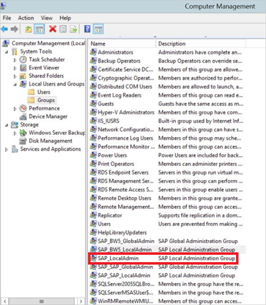

# Use Kerberos for single sign-on (SSO) from Power BI to on-premises data sources

Use [Kerberos constrained delegation](/windows-server/security/kerberos/kerberos-constrained-delegation-overview) to enable seamless single sign-on connectivity. Enabling SSO makes it easy for Power BI reports and dashboards to refresh data from on-premises sources.

## Supported data sources

We currently support the following data sources:

* SQL Server
* SAP HANA
* SAP BW
* Teradata
* Spark
* Impala

We also support SAP HANA with [Security Assertion Markup Language (SAML)](service-gateway-sso-saml.md).

### SAP HANA

To enable SSO for SAP HANA, follow these steps first:

* Ensure the SAP HANA server is running the required minimum version, which depends on your SAP Hana server platform level:
  * [HANA 2 SPS 01 Rev 012.03](https://launchpad.support.sap.com/#/notes/2557386)
  * [HANA 2 SPS 02 Rev 22](https://launchpad.support.sap.com/#/notes/2547324)
  * [HANA 1 SP 12 Rev 122.13](https://launchpad.support.sap.com/#/notes/2528439)
* On the gateway machine, install SAP’s latest HANA ODBC driver.  The minimum version is HANA ODBC version 2.00.020.00 from August 2017.

For more information about setting up and configuring single sign-on for SAP HANA using Kerberos, see the topic [Single Sign-on Using Kerberos](https://help.sap.com/viewer/b3ee5778bc2e4a089d3299b82ec762a7/2.0.03/en-US/1885fad82df943c2a1974f5da0eed66d.html) in the SAP HANA Security Guide and the links from that page, particularly SAP Note 1837331 – HOWTO HANA DBSSO Kerberos/Active Directory].

## Preparing for Kerberos Constrained Delegation

Several items must be configured in order for Kerberos Constrained Delegation to work properly, including *Service Principal Names* (SPN) and delegation settings on service accounts.

### Prerequisite 1: Install & configure the On-premises data gateway

This release of the On-premises data gateway supports an in-place upgrade, as well as settings take-over of existing gateways.

### Prerequisite 2: Run the gateway Windows service as a domain account

In a standard installation, the gateway runs as a machine-local service account (specifically, *NT Service\PBIEgwService*) such as what's shown in the following image:


To enable **Kerberos Constrained Delegation**, the gateway must run as a domain account, unless your Azure AD is already synchronized with your local Active Directory (using Azure AD DirSync/Connect). If you need to switch the account to a domain account, see [Switching the gateway to a domain account](#switching-the-gateway-to-a-domain-account) later in this article.

> [!NOTE]
> If Azure AD DirSync / Connect is configured and user accounts are synchronized, the gateway service does not need to perform local AD lookups at runtime, and you can use the local Service SID (instead of requiring a domain account) for the gateway service. The Kerberos Constrained Delegation configuration steps outlined in this article are the same as that configuration (they are simply applied to the gateway's computer object in Active Directory, instead of the domain account).

### Prerequisite 3: Have domain admin rights to configure SPNs (SetSPN) and Kerberos Constrained Delegation settings

While it is technically possible for a domain administrator to temporarily or permanently allow rights to someone else to configure SPNs and Kerberos delegation without requiring domain admin rights, that's not the recommended approach. In the following section, we cover the configuration steps necessary for **Prerequisite 3** in detail.

## Configuring Kerberos Constrained Delegation for the gateway and data source

To properly configure the system, we need to configure or validate the following two items:

1. If needed, configure an SPN for the gateway service domain account.

2. Configure delegation settings on the gateway service domain account.

Note that you must be a domain administrator to perform those two configuration steps.

The following sections describe these steps in turn.

### Configure an SPN for the gateway service account

First, determine whether an SPN was already created for the domain account used as the gateway service account, but following these steps:

1. As a domain administrator, launch **Active Directory Users and Computers**.

2. Right-click on the domain, select **Find**, and type in the account name of the gateway service account

3. In the search result, right-click on the gateway service account and select **Properties**.

4. If the **Delegation** tab is visible on the **Properties** dialog, then an SPN was already created and you can jump ahead to the next subsection about configuring Delegation settings.

    If there is no **Delegation** tab on the **Properties** dialog, you can manually create an SPN on that account, which adds the **Delegation** tab (that is the easiest way to configure delegation settings). Creating an SPN can be done using the [setspn tool](https://technet.microsoft.com/library/cc731241.aspx) that comes with Windows (you need domain admin rights to create the SPN).

    For example, imagine the gateway service account is “PBIEgwTest\GatewaySvc”, and the machine name with the gateway service running is called **Machine1**. To set the SPN for the gateway service account for that machine in this example, you would run the following command:

    

    With that step completed, we can move on to configuring delegation settings.

### Configure delegation settings on the gateway service account

The second configuration requirement is the delegation settings on the gateway service account. There are multiple tools you can use to perform these steps. In this article, we'll use **Active Directory Users and Computers**, which is a Microsoft Management Console (MMC) snap-in that you can use to administer and publish information in the directory. It's available on domain controllers by default. You can also enable it through **Windows Feature** configuration on other machines.

We need to configure **Kerberos Constrained Delegation** with protocol transiting. With constrained delegation, you must be explicit about which services you want to delegate to. For example, only your SQL Server or your SAP HANA server will accept delegation calls from the gateway service account.

This section assumes you have already configured SPNs for your underlying data sources (such as SQL Server, SAP HANA, Teradata, Spark, and so on). To learn how to configure those data source server SPNs, refer to technical documentation for the respective database server. You can also look at the blog post that describes [*What SPN does your app require?*](https://blogs.msdn.microsoft.com/psssql/2010/06/23/my-kerberos-checklist/)

In the following steps, we assume an on-premises environment with two machines: a gateway machine and a database server running SQL Server. For the sake of this example, we'll also assume the following settings and names:

* Gateway machine name: **PBIEgwTestGW**
* Gateway service account: **PBIEgwTest\GatewaySvc** (account display name: Gateway Connector)
* SQL Server data source machine name: **PBIEgwTestSQL**
* SQL Server data source service account: **PBIEgwTest\SQLService**

Given those example names and settings, the configuration steps are the following:

1. With domain administrator rights, launch **Active Directory Users and Computers**.

2. Right-click on the gateway service account (**PBIEgwTest\GatewaySvc**) and select **Properties**.

3. Select the **Delegation** tab.

4. Select **Trust this computer for delegation to specified services only.**

5. Select **Use any authentication protocol.**

6. Under the **Services to which this account can present delegated credentials**, select **Add**.

7. In the new dialog box, select **Users or Computers**.

8. Enter the service account for the SQL Server Database service (**PBIEgwTest\SQLService**) and select **OK**.

9. Select the SPN that you created for the database server. In our example, the SPN will begin with **MSSQLSvc**. If you added both the FQDN and the NetBIOS SPN for your database service, select both. You may only see one.

10. Select **OK**. You should see the SPN in the list now.

11. Optionally, you can select **Expanded** to show both the FQDN and NetBIOS SPN.

12. The dialog box will look similar to the following if you selected **Expanded**. Select **OK**.

    

Finally, on the machine running the gateway service (**PBIEgwTestGW** in our example), the gateway service account must be granted the local policy “Impersonate a client after authentication”. You can perform/verify this with the Local Group Policy Editor (**gpedit**).

1. On the gateway machine, run: *gpedit.msc*.

1. Navigate to **Local Computer Policy > Computer Configuration > Windows Settings > Security Settings > Local Policies > User Rights Assignment**, as shown in the following image.

    

1. From the list of policies under **User Rights Assignment**, select **Impersonate a client after authentication**.

    

    Right-click and open the **Properties** for **Impersonate a client after authentication**, and check the list of accounts. It must include the gateway service account (**PBIEgwTest\GatewaySvc**).

1. From the list of policies under **User Rights Assignment**, select **Act as part of the operating system (SeTcbPrivilege)**. Ensure that the gateway service account is included in the list of accounts as well.

1. Restart the **On-premises data gateway** service process.

If you're using SAP HANA, we recommend following these additional steps, which can yield a small performance improvement.

1. In the gateway installation directory find and open this configuration file: *Microsoft.PowerBI.DataMovement.Pipeline.GatewayCore.dll.config*.

1. Find the *FullDomainResolutionEnabled* property, and change its value to *True*.

    ```xml
    <setting name=" FullDomainResolutionEnabled " serializeAs="String">
          <value>True</value>
    </setting>
    ```

## Running a Power BI report

After all the configuration steps outlined earlier in this article have been completed, you can use the **Manage Gateway** page in Power BI to configure the data source. Then under its **Advanced Settings** enable SSO, and publish reports and datasets binding to that data source.


This configuration will work in most cases. However, with Kerberos there can be different configurations depending on your environment. If the report still won't load, you'll need to contact your domain administrator to investigate further.

## Switching the gateway to a domain account

Earlier in this article, we discussed switching the gateway from a local service account to run as a domain account, using the **On-premises data gateway** user interface. Here are the steps necessary to do so.

1. Launch the **On-premises data gateway** configuration tool.

   

2. Select the **Sign-in** button on the main page, and sign in with your Power BI account.

3. After sign-in is completed, select the **Service Settings** tab.

4. Select **Change account** to start the guided walk-through, as shown in the following image.

   

## Configuring SAP BW for SSO

Now that you understand how Kerberos works with a gateway, you can configure SSO for your SAP Business Warehouse (SAP BW). The following steps assume you've already [prepared for Kerberos constrained delegation](#preparing-for-kerberos-constrained-delegation), as described earlier in this article.

This guide attempts to be as comprehensive as possible. If you have already completed some of these steps, you can skip them: For example you’ve already created a Service User for your BW server and mapped an SPN to it, or you’ve already installed the gsskrb5 library.

### Setup gsskrb5 on client machines and the BW server

gsskrb5 must be in use by both the client and server to complete an SSO connection through the gateway. The Common Crypto Library (sapcrypto) is not currently supported.

1. Download gsskrb5/gx64krb5 from [SAP Note 2115486](https://launchpad.support.sap.com/) (SAP s-user required). Ensure you have at least version 1.0.11.x of gsskrb5.dll and gx64krb5.dll.

1. Put the library in a location on your gateway machine that is accessible by your gateway instance (and also by the SAP GUI if you want to test the SSO connection using SAP GUI / Logon).

1. Put another copy on your BW server machine in a location accessible by the BW server.

1. On the client and server machines, set the SNC\_LIB and SNC\_LIB\_64 environment variables to point to the locations of gsskrb5.dll and gx64krb5.dll, respectively.

### Create a BW Service User and enable SNC communication using gsskrb5 on the BW server

In addition to the gateway configuration you've already done, there are a few additional SAP BW-specific steps. The [**Configure delegation settings on the gateway service account**](#configure-delegation-settings-on-the-gateway-service-account) section of the documentation assumes you've already configured SPNs for your underlying data sources. To complete this configuration for SAP BW:

1. On an Active Directory Domain Controller server, create a Service User (initially just a plain Active Directory user) for your BW Application Server in your Active Directory environment. Then assign an SPN to it.

    SAP recommends starting the SPN with SAP/, but it should also be possible to use other prefixes such as HTTP/. What comes after the SAP/ is up to you; one option is to use the BW server's Service User's username. For example, if you create BWServiceUser@\<DOMAIN\> as your Service User, you could use the SPN SAP/BWServiceUser. One way to set the SPN mapping is the setspn command. For example, to set the SPN on the service user we just created, you would execute the following command from a cmd window on a Domain Controller machine: `setspn -s SAP/ BWServiceUser DOMAIN\ BWServiceUser`. For more information, see the SAP BW documentation.

1. Give the Service User access to your BW Application Server:

    1. On the BW server machine, add the Service User to the Local Admin group for your BW server: open the Computer Management program and double-click the Local Admin group for your server.

        

    1. Double-click the Local Admin group, then select **Add** to add your BW Service User to the group. Use the **Check Names** button to ensure you've typed in the name correctly. Select **OK**.

1. Set the BW Server's Service User as the user that starts the BW Server service on the BW server machine.

    1. Open the "Run" program and type in "Services.msc". Look for the service corresponding to your BW Application Server instance. Right-click it and select **Properties**.

        

    1. Switch to the **Log on** tab and change the user to your BW Service User, as specified above. Enter the user's password and select **OK**.

1. Sign in to your server in SAP GUI / Logon and set the following profile parameters using the RZ10 transaction:

    1. Set the snc/identity/as profile parameter to p:\<the BW service user you've created\>, such as p:BWServiceUser@MYDOMAIN.COM. Note the p: that precedes the Service User's UPN; it's not p:CN= like when Common Crypto Lib is used as the SNC library.

    1. Set the snc/gssapi\_lib profile parameter to \<path to gsskrb5.dll/gx64krb5.dll on the server machine (the library you'll use depends on OS bitness)\>. Remember to put the library in a location the BW Application Server can access.

    1. Also set the following additional profile parameters, changing the values as required to fit your needs. Note that the last five options enable clients to connect to the BW server using SAP Logon / GUI without having SNC configured.

        | **Setting** | **Value** |
        | --- | --- |
        | snc/data\_protection/max | 3 |
        | snc/data\_protection/min | 1 |
        | snc/data\_protection/use | 9 |
        | snc/accept\_insecure\_cpic | 1 |
        | snc/accept\_insecure\_gui | 1 |
        | snc/accept\_insecure\_r3int\_rfc | 1 |
        | snc/accept\_insecure\_rfc | 1 |
        | snc/permit\_insecure\_start | 1 |

    1. Set the property snc/enable to 1.

1. After setting these profile parameters, open the SAP Management Console on the server machine and restart the BW instance. If the server won't start, double-check that you've set the profile parameters correctly. For more on profile parameter settings, see the [SAP documentation](https://help.sap.com/saphelp_nw70ehp1/helpdata/en/e6/56f466e99a11d1a5b00000e835363f/frameset.htm). You can also consult section our troubleshooting information later in this section if you encounter problems.

### Map a BW user to an Active Directory user

Map an Active Directory user to an SAP BW Application Server user and test the SSO connection in SAP GUI / Logon.

1. Sign in to your BW server using SAP GUI / Logon. Execute transaction SU01.

1. For **User**, enter the BW user you want to enable SSO connections for (in the screenshot above we're setting permissions for BIUSER). Select the **Edit** icon near the top-left of the SAP Logon window (the image of a pen).

    

1. Select the **SNC** tab. In the SNC name input box, enter p:\<your active directory user\>@\<your domain\>. Note the mandatory p: that must precede the Active Directory user's UPN. The Active Directory user you specify should belong to the person or organization for whom you want to enable SSO access to the BW Application Server. For example, if you want to enable SSO access for the user [testuser@TESTDOMAIN.COM](mailto:testuser@TESTDOMAIN.COM), enter p:testuser@TESTDOMAIN.COM.

    

1. Select the save icon (the floppy disk near the top left corner of the screen).

### Test sign-in using SSO

Verify that you can sign in to the server using SAP Logon / SAP GUI via SSO as the Active Directory user for whom you've just enabled SSO access.

1. Sign in to a machine on which SAP Logon is installed *as the Active Directory user you just enabled SSO access for* and launch SAP GUI/Logon. Create a new connection.

1. In the **Create New System Entry** window, select **User Specified System** and select **Next**.

    

1. Fill in the appropriate details on the next page, including the application server, instance number, and system ID, then select **Finish**.

1. Right-click the new connection and select **Properties**. Select the **Network** tab. In the **SNC Name** window enter p:\<the BW service user's UPN\>, such as p:BWServiceUser@MYDOMAIN.COM, then select **OK**.

    

1. Double-click the connection you just created to attempt an SSO connection to your BW server. If this connection succeeds, proceed to the next step. Otherwise, review the earlier steps in this document to make sure they've been completed correctly, or review the troubleshooting section below. Note that if you can't connect to the BW server via SSO in this context you will not be able to connect to the BW server using SSO in the gateway context.

### Troubleshoot installation and connections

If you encounter any issues, follow these steps to troubleshoot the gsskrb5 installation and SSO connections from the SAP GUI / Logon.

1. Viewing the server logs (…work\dev\_w0 on the server machine) can be helpful in troubleshooting any errors you encounter in completing the gsskrb5 setup steps, particularly if the BW server won't start after the profile parameters have been changed.

1. If you're unable to start the BW service due to a "logon failure" you may have provided the wrong password when setting the BW "start-as" user. Verify the password by logging in to a machine in your Active Directory environment as the BW service user.

1. If you get errors about SQL credentials preventing the server from starting, verify that you've granted the Service User access to the BW database.

1. "(GSS-API) specified target is unknown or unreachable": this usually means you have the wrong SNC Name name specified. Make sure to use "p:" only, not "p:CN=" or anything else in the client application, other than the Service User's UPN.

1. "(GSS-API) An invalid name was supplied": make sure "p:" is in the value of the server's SNC identity profile parameter.

1. "(SNC error) the specified module could not be found": this is usually caused by putting the gsskrb5.dll/gx64krb5.dll somewhere that requires elevated privileges (administrator rights) to access.

### Add registry entries to the gateway machine

Add required registry entries to the registry of the machine that the gateway is installed on.

1. Execute the following commands in a cmd window:

    1. REG ADD HKLM\SOFTWARE\Wow6432Node\SAP\gsskrb5 /v ForceIniCredOK /t REG\_DWORD /d 1 /f

    1. REG ADD HKLM\SOFTWARE\SAP\gsskrb5 /v ForceIniCredOK /t REG\_DWORD /d 1 /f

### Set configuration parameters on the gateway machine

There are two options for setting configuration parameters, depending on whether you have Azure AD DirSync configured so that users can sign in to the Power BI service as an Azure Ad user.

If you have Azure AD DirSync configured, follow these steps.

1. Open the main Gateway configuration file, *Microsoft.PowerBI.DataMovement.Pipeline.GatewayCore.dll*. By default, this file is stored at *C:\Program Files\On-premises data gateway*.

1. Ensure the **FullDomainResolutionEnabled** property is set to True and **SapHanaSsoRemoveDomainEnabled** is set to False.

1. Save the configuration file.

1. Restart the Gateway service via the Services tab of Task Manager (right-click, Restart)

    

If you don't have Azure AD DirSync configured, follow these steps for **every Power BI service user that you want to map to an Azure AD user**. These steps manually link a Power BI Service user to an Active Directory user with permission to sign in to BW.

1. Open the main gateway configuration file, Microsoft.PowerBI.DataMovement.Pipeline.GatewayCore.dll. By default, this file is stored at C:\Program Files\On-premises data gateway.

1. Set the **ADUserNameLookupProperty** to msDS-cloudExtensionAttribute1 and **ADUserNameReplacementProperty** to SAMAccountName. Save the configuration file.

1. Restart the Gateway service via the **Services** tab of Task Manager (right-click, **Restart**).

    

1. Set the msDS-cloudExtensionAttribute1 property of the Active Directory user you mapped to a BW user to the Power BI service user for whom you want to enable Kerberos SSO. One way to set the msDS-cloudExtensionAttribute1 property is via the Active Directory Users and Computers MMC snap-in (note that other methods can also be used).

    1. Sign in to a Domain Controller machine as an administrator user.

    1. Open the **Users** folder in the snap-in window and double-click the Active Directory user you mapped to a BW user.

    1. Select the **Attribute Editor** tab.

        If you don't see this tab, you'll need to search for directions on how to enable it or use another method to set the msDS-cloudExtensionAttribute1 property. Select one of the attributes and then the 'm' key to navigate to the Active Directory properties that start with 'm'. Locate the msDS-cloudExtensionAttribute1 property and double-click it. Set the value to the username you use to sign in to the Power BI Service, in the form YourUser@YourDomain.

    1. Select **OK**.

        

    1. Select **Apply**. Verify that the correct value has been set in the Value column.

### Add a new BW Application Server data source to the Power BI Service

Add the BW data source to your gateway: Follow the instructions earlier in this article on [running a report](#running-a-power-bi-report).

1. In the data source configuration window, enter the Application Server's **Hostname**, **System Number**, and **client ID** as you would to sign in to your BW server from Power BI Desktop. For **Authentication Method**, select **Windows**.

1. In the **SNC Partner Name** field, enter p: \<the SPN you mapped to your BW Service User\>. For example, if the SPN is SAP/BWServiceUser@MYDOMAIN.COM, you should enter p:SAP/BWServiceUser@MYDOMAIN.COM in the **SNC Partner Name** field.

1. For the SNC Library, select SNC\_LIB or SNC\_LIB\_64.

1. The **Username** and **Password** should be the username and password of an Active Directory user with permission to sign in to the BW server via SSO (an Active Directory user that has been mapped to a BW user via the SU01 transaction). These credentials will only be used if the **Use SSO via Kerberos for DirectQuery queries** box is *not* checked.

1. Select the **Use SSO via Kerberos for DirectQuery queries** box and select **Apply**. If the test connection is not successful, verify that the previous setup and configuration steps were completed correctly.

    The gateway always use the typed-in credentials to establish a test connection to the server and to do scheduled refreshes of import-based reports. The gateway only attempts to establish an SSO connection if the **Use SSO via Kerberos for DirectQuery queries** is selected, and the user is accessing a direct query-based report or dataset.

### Test your setup

Publish a DirectQuery report from Power BI Desktop to the Power BI service to test your setup. Make sure you’re signed in to the Power BI service as either an Azure AD user or a user that you’ve mapped to the msDS-cloudExtensionAttribute1 property of an Azure AD user. If the setup has been completed successfully, you should be able to create a report based off the published dataset in the Power BI Service and pull data through visuals in the report.

### Troubleshooting Gateway Connectivity Issues

1. Check the gateway logs. Open the Gateway Configuration application, select **Diagnostics**, and select **Export Logs**. The most recent errors will be at the bottom of any log files you examine.

    

1. Turn on BW tracing and review the generated log files. There are several different types of BW tracing available. Consult the SAP documentation for more information.

## Errors from an insufficient Kerberos configuration

If the underlying database server and gateway are not configured properly for **Kerberos Constrained Delegation**, you may receive the following error message:


And the technical details associated with the error message (DM_GWPipeline_Gateway_ServerUnreachable) may look like the following:


The result is that the gateway could not impersonate the originating user properly, and the database connection attempt failed.

## Next steps

For more information about the **On-premises data gateway** and **DirectQuery**, check out the following resources:

* [On-premises data gateway](service-gateway-onprem.md)
* [DirectQuery in Power BI](desktop-directquery-about.md)
* [Data sources supported by DirectQuery](desktop-directquery-data-sources.md)
* [DirectQuery and SAP BW](desktop-directquery-sap-bw.md)
* [DirectQuery and SAP HANA](desktop-directquery-sap-hana.md)