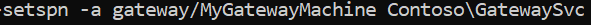

# Use Kerberos for single sign-on (SSO) from Power BI to on-premises data sources

Use [Kerberos constrained delegation](/windows-server/security/kerberos/kerberos-constrained-delegation-overview) to enable seamless single sign-on (SSO) connectivity. Enabling SSO makes it easy for Power BI reports and dashboards to refresh data from on-premises sources.

## Supported data sources

We currently support the following data sources:

* SQL Server
* SAP HANA
* SAP BW
* Teradata
* Spark
* Impala

We also support SAP HANA with [Security Assertion Markup Language (SAML)](service-gateway-sso-saml.md).

### SAP HANA

To enable SSO for SAP HANA, follow these steps first:

* Ensure the SAP HANA server is running the required minimum version, which depends on your SAP HANA server platform level:
  * [HANA 2 SPS 01 Rev 012.03](https://launchpad.support.sap.com/#/notes/2557386)
  * [HANA 2 SPS 02 Rev 22](https://launchpad.support.sap.com/#/notes/2547324)
  * [HANA 1 SP 12 Rev 122.13](https://launchpad.support.sap.com/#/notes/2528439)
* On the gateway machine, install SAP’s latest HANA ODBC driver.  The minimum version is HANA ODBC version 2.00.020.00 from August 2017.

For more information about setting up SSO for SAP HANA by using Kerberos, see [Single Sign-on Using Kerberos](https://help.sap.com/viewer/b3ee5778bc2e4a089d3299b82ec762a7/2.0.03/1885fad82df943c2a1974f5da0eed66d.html) in the SAP HANA Security Guide. Also see the links from that page, particularly SAP Note 1837331 – HOWTO HANA DBSSO Kerberos/Active Directory.

## Prepare for Kerberos constrained delegation

You must configure several items for Kerberos constrained delegation to work properly, including *Service Principal Names* (SPN) and delegation settings on service accounts.

### Prerequisite 1: Install and configure the Microsoft on-premises data gateway

This release of the on-premises data gateway supports an in-place upgrade, as well as settings take-over of existing gateways.

### Prerequisite 2: Run the gateway Windows service as a domain account

In a standard installation, the gateway runs as a machine-local service account (specifically, *NT Service\PBIEgwService*).


To enable Kerberos constrained delegation, the gateway must run as a domain account, unless your Azure Active Directory (Azure AD) instance is already synchronized with your local Active Directory instance (using Azure AD DirSync/Connect). To switch to a domain account, see [Change the gateway service account](/data-integration/gateway/service-gateway-service-account).

> [!NOTE]
> If Azure AD Connect is configured, and user accounts are synchronized, the gateway service doesn't need to perform local Azure AD lookups at runtime. You can use the local service SID (instead of requiring a domain account) for the gateway service. The Kerberos constrained delegation configuration steps outlined in this article are the same as that configuration. They are simply applied to the gateway's computer object in Azure AD, instead of the domain account.

### Prerequisite 3: Have domain admin rights to configure SPNs (SetSPN) and Kerberos constrained delegation settings

We don't recommended that a domain administrator temporarily or permanently allows rights to someone else to configure SPNs and Kerberos delegation without requiring domain admin rights. In the following section, we cover the recommended configuration steps in more detail.

## Configure Kerberos constrained delegation for the gateway and data source

As a domain administrator, configure an SPN for the gateway service domain account, and configure delegation settings on the gateway service domain account.

### Configure an SPN for the gateway service account

First, determine whether an SPN was already created for the domain account used as the gateway service account:

1. As a domain administrator, open **Active Directory Users and Computers**.

2. Right-click on the domain, select **Find**, and enter the account name of the gateway service account.

3. In the search result, right-click the gateway service account, and select **Properties**.

4. If the **Delegation** tab is visible on the **Properties** dialog box, then an SPN was already created. You can jump ahead to configuring delegation settings.

    If there is no **Delegation** tab on the **Properties** dialog box, you can manually create an SPN on that account. This adds the **Delegation** tab. Use the [setspn tool](https://technet.microsoft.com/library/cc731241.aspx) that comes with Windows (you need domain admin rights to create the SPN).

    For example, imagine the gateway service account is “PBIEgwTest\GatewaySvc”, and the machine name with the gateway service running is called **Machine1**. To set the SPN for the gateway service account for that machine in this example, run the following command:

    

    With that step completed, we can move on to configuring delegation settings.

### Configure delegation settings on the gateway service account

The second configuration requirement is the delegation settings on the gateway service account. There are multiple tools you can use to perform these steps. Here, we'll use Active Directory Users and Computers, which is a Microsoft Management Console (MMC) snap-in to administer and publish information in the directory. It's available on domain controllers by default. You can also enable it through Windows Feature configuration on other machines.

We need to configure Kerberos constrained delegation with protocol transiting. With constrained delegation, you must be explicit about which services you want to delegate to. For example, only SQL Server or your SAP HANA server accepts delegation calls from the gateway service account.

This section assumes you have already configured SPNs for your underlying data sources (such as SQL Server, SAP HANA, Teradata, and Spark). To learn how to configure those data source server SPNs, refer to technical documentation for the respective database server. You can also see the heading *What SPN does your app require?* in the [My Kerberos Checklist](https://techcommunity.microsoft.com/t5/SQL-Server-Support/My-Kerberos-Checklist-8230/ba-p/316160) blog post.

In the following steps, we assume an on-premises environment with two machines: a gateway machine and a database server running SQL Server. For the sake of this example, we'll also assume the following settings and names:

* Gateway machine name: **PBIEgwTestGW**
* Gateway service account: **PBIEgwTest\GatewaySvc** (account display name: Gateway Connector)
* SQL Server data source machine name: **PBIEgwTestSQL**
* SQL Server data source service account: **PBIEgwTest\SQLService**

Here's how to configure the delegation settings:

1. With domain administrator rights, open **Active Directory Users and Computers**.

2. Right-click the gateway service account (**PBIEgwTest\GatewaySvc**), and select **Properties**.

3. Select the **Delegation** tab.

4. Select **Trust this computer for delegation to specified services only** > **Use any authentication protocol**.

5. Under **Services to which this account can present delegated credentials**, select **Add**.

6. In the new dialog box, select **Users or Computers**.

7. Enter the service account for the data source, for example, a SQL Server data source may have a service account like  **PBIEgwTest\SQLService**. Once the account has been added, select **OK**.

8. Select the SPN that you created for the database server. In our example, the SPN begins with **MSSQLSvc**. If you added both the FQDN and the NetBIOS SPN for your database service, select both. You might only see one.

9. Select **OK**. You should see the SPN in the list now.

    Optionally, you can select **Expanded** to show both the FQDN and NetBIOS SPN. The dialog box looks similar to the following if you selected **Expanded**. Select **OK**.

    

Finally, on the machine running the gateway service (**PBIEgwTestGW** in our example), you must grant the gateway service account the local policy **Impersonate a client after authentication** and **Act as part of the operating system (SeTcbPrivilege)**. You can perform and verify this configuration with the Local Group Policy Editor (**gpedit**).

1. On the gateway machine, run: *gpedit.msc*.

1. Go to **Local Computer Policy** > **Computer Configuration** > **Windows Settings** > **Security Settings** > **Local Policies** > **User Rights Assignment**.

    

1. Under **User Rights Assignment**, from the list of policies, select **Impersonate a client after authentication**.

    

    Right-click, and open **Properties**. Check the list of accounts. It must include the gateway service account (**PBIEgwTest\GatewaySvc**).

1. Under **User Rights Assignment**, from the list of policies, select **Act as part of the operating system (SeTcbPrivilege)**. Ensure that the gateway service account is included in the list of accounts as well.

1. Restart the **On-premises data gateway** service process.

If you're using SAP HANA, we recommend following these additional steps, which can yield a small performance improvement.

1. In the gateway installation directory, find and open this configuration file: *Microsoft.PowerBI.DataMovement.Pipeline.GatewayCore.dll.config*.

1. Find the *FullDomainResolutionEnabled* property, and change its value to *True*.

    ```xml
    <setting name=" FullDomainResolutionEnabled " serializeAs="String">
          <value>True</value>
    </setting>
    ```

## Run a Power BI report

After completing all the configuration steps, you can use the **Manage Gateway** page in Power BI to configure the data source. Then, under **Advanced Settings**, enable SSO, and publish reports and datasets binding to that data source.


This configuration works in most cases. However, with Kerberos there can be different configurations depending on your environment. If the report still won't load, contact your domain administrator to investigate further.

## Configure SAP BW for SSO using CommonCryptoLib

Now that you understand how Kerberos works with a gateway, you can configure SSO for your SAP Business Warehouse (SAP BW). The following steps assume you've already [prepared for Kerberos constrained delegation](#prepare-for-kerberos-constrained-delegation), as described earlier in this article.

> [!NOTE]
> These instructions cover SSO setup for SAP BW **Application** Servers. Microsoft does not currently support SSO connections to SAP BW **Message** Servers.

1. Ensure that your BW server is correctly configured for Kerberos SSO. If it is, you should be able to use SSO to access your BW server with an SAP tool like SAP GUI. For more information on setup steps, see [SAP Single Sign-On: Authenticate with Kerberos/SPNEGO](https://blogs.sap.com/2017/07/27/sap-single-sign-on-authenticate-with-kerberosspnego/). Your BW server should be using CommonCryptoLib as its SNC Library and have an SNC name that starts with "CN=", such as "CN=BW1". For more information on SNC name requirements, see [SNC Parameters for Kerberos Configuration](https://help.sap.com/viewer/df185fd53bb645b1bd99284ee4e4a750/3.0/en-US/360534094511490d91b9589d20abb49a.html) (the snc/identity/as parameter).

1. If you haven't already done so, complete the steps under [Prepare for Kerberos constrained delegation](https://docs.microsoft.com/power-bi/service-gateway-sso-kerberos#prepare-for-kerberos-constrained-delegation). Ensure that your gateway Service User is configured to present delegated credentials to the Service User that represents your BW Application Server in your Active Directory environment.

1. If you haven't already done so, install the x64-version of the [SAP .NET Connector](https://support.sap.com/en/product/connectors/msnet.html) on the computer the gateway has been installed on. You can check whether the component has been installed by attempting to connect to your BW server in  Power BI Desktop. If you can't connect using the 2.0 implementation, the .NET Connector isn't installed.

1. Ensure that SAP Secure Login Client (SLC) isn't running on the computer the gateway is installed on. SLC caches Kerberos tickets in a way that can interfere with the gateway's ability to use Kerberos for SSO. If SLC is installed, uninstall it or make sure you exit SAP Secure Login Client: right-click the icon in the system tray and select Log Out and Exit before attempting an SSO connection using the gateway. SLC is not supported for use on Windows Server machines. For more information, see [SAP Note 2780475](https://launchpad.support.sap.com/#/notes/2780475) (s-user required).

    

    If you uninstall SLC or select **Log Out** and **Exit** , open a cmd window and enter `klist purge` to clear any cached Kerberos tickets before attempting an SSO connection through the gateway.

1. Download CommonCryptoLib (sapcrypto.dll) version **8.5.25 or greater** from the SAP Launchpad, and copy it to a folder on your gateway machine. In the same directory where you copied sapcrypto.dll, create a file named sapcrypto.ini, with the following content:

    ```
    ccl/snc/enable\_kerberos\_in\_client\_role = 1
    ```

    The .ini file contains configuration information required by CommonCryptoLib to enable SSO in the gateway scenario.

    > [!NOTE]
    > These files must be stored in the same location; in other words, _/path/to/sapcrypto/_ should contain both sapcrypto.ini and sapcrypto.dll.

    Both the gateway Service User and the Active Directory (AD) user that the Service User will impersonate need read and execute permissions for both files. We recommend granting  permissions on both the .ini and .dll files to the Authenticated Users group. For testing purposes, you can also explicitly grant these permissions to both the gateway Service User and the impersonated user. In the screenshot below we've granted the Authenticated Users group **Read &amp; execute** permissions for sapcrypto.dll:

    

1. If you don't have an SAP Business Warehouse Server data source, on the **Manage gateways** page in the Power BI service, add a data source. If you already have a BW data source associated with the gateway you want the SSO connection to flow through, prepare to edit it.

    For **SNC Library** , select either **SNC\_LIB or SNC\_LIB\_64 environmental variable** or **Custom**. If you select the **SNC\_LIB** option, you must set the value of the SNC\_LIB\_64 environment variable on the gateway machine to the absolute path of the copy of sapcrypto.dll on the gateway machine, such as C:\Users\Test\Desktop\sapcrypto.dll. If you choose **Custom** , paste the absolute path to the sapcrypto .dll into the Custom SNC Library Path field that appears on the **Manage gateways** page.

    Under **Advanced settings** , make sure the **Use SSO via Kerberos for DirectQuery queries** checkbox is selected. The username you enter only needs to have permission to connect to the BW server and is used primarily to test the data source connection after you've created it. The user is also used to refresh reports created from import-based datasets if you have any. If you select **Basic** authentication, you must provide a BW user. If you select **Windows** authentication, you must specify a Windows Active Directory user that's  mapped to a BW user through the SU01 transaction in SAP GUI. The rest of the fields (**System Number **,** Client ID **,** SNC Partner Name**, and so on) must match the information you would enter into Power BI Desktop to connect to your BW server through SSO. Select **Apply** and make sure the test connection is successful.

    

1. Create a CCL\_PROFILE system environment variable and point it at sapcrypto.ini:

    

    Remember that the sapcrypto .dll and .ini files must exist in the same location. In the example shown above where sapcrypto.ini is located on the desktop, sapcrypto.dll should also be located on the desktop.

1. Restart the gateway service:

    

1. Publish a **DirectQuery-based** BW report from Power BI Desktop. This report must use data that is accessible to the BW user that is mapped to the Azure Active Directory (AAD) user that signs in to the Power BI service. You must use DirectQuery instead of import, because of how refresh works. When refreshing import-based reports, the gateway uses the credentials that you entered into the **Username** and **Password** fields when you created the BW data source. In other words, Kerberos SSO is **not** used. Also, when publishing, make sure you select the gateway you've configured for BW SSO if you have multiple gateways. In the Power BI service you should now be able to refresh the report or create a new report based on the published dataset.

### Troubleshooting

If you're unable to refresh the report in the Power BI service, you can use gateway tracing, CPIC tracing, and CommonCryptoLib tracing to help diagnose the issue. CPIC tracing and CommonCryptoLib are SAP products, so Microsoft can't provide any direct support for them. For Active Directory users that will be granted SSO access to BW, some Active Directory configurations might require the users to be members of the Administrators group on the machine where the gateway is installed.

1. **Gateway logs:** Simply reproduce the issue, open the [gateway app](https://docs.microsoft.com/data-integration/gateway/service-gateway-app), go to the **Diagnostics** tab, and select **Export logs** :

    

1. **CPIC Tracing:** To enable CPIC tracing, set two environment variables: CPIC\_TRACE and CPIC\_TRACE\_DIR. The first variable sets the trace level, and the second variable sets the trace file directory. The directory must be a location that  members of the Authenticated Users group can write to. Set CPIC\_TRACE to 3 and CPIC\_TRACE\_DIR to whichever directory you want to trace files written to.

    

    Reproduce the issue and check that CPIC\_TRACE\_DIR contains trace files.

1. **CommonCryptoLib Tracing:** Turn on CommonCryptoLib tracing by adding two lines to the sapcrypto.ini file you created earlier:

    ```
    ccl/trace/level=5
    ccl/trace/directory=\\<drive\\>:\logs\sectrace
    ```

    Make sure to change the _ccl/trace/directory_ option to a location members of the Authenticated Users group can write to. Alternatively, create a new .ini file to change this behavior. In the same directory as sapcrypto.ini and sapcrypto.dll, create a file named sectrace.ini, with the following content.  Replace the DIRECTORY option with a location on your machine that Authenticated User can write to:

    ```
    LEVEL = 5
    
    DIRECTORY = \\<drive\\>:\logs\sectrace
    ```

    Now, reproduce the issue and check that the location pointed to by DIRECTORY contains trace files. Make sure to turn off CPIC and CCL tracing when you are finished.

    For more information on CommonCryptoLib tracing, see [SAP Note 2491573](https://launchpad.support.sap.com/#/notes/2491573) (s-user required).

## Configure SAP BW for SSO using gsskrb5/gx64krb5

If you're unable to use CommonCryptoLib as your SNC library, you can use gsskrb5/gx64krb5 instead. However, the setup steps are significantly more complex and SAP no longer offers support for gsskrb5.

This guide attempts to be as comprehensive as possible. If you've already completed some of these steps, you can skip them. For example, you might have already created a service user for your SAP BW server and mapped an SPN to it, or you might have already installed the `gsskrb5` library.

### Set up gsskrb5/gx64krb5 on client machines and the SAP BW server

> [!NOTE]
> `gsskrb5/gx64krb5` is no longer actively supported by SAP. For more information, see [SAP Note 352295](https://launchpad.support.sap.com/#/notes/352295). Also note that `gsskrb5/gx64krb5` doesn't allow for SSO connections from the data gateway to SAP BW Message Servers. Only connections to SAP BW Application Servers are possible. It is now possible to use sapcrypto/CommonCryptoLib as the SNC Library which simplies the setup process. 

`gsskrb5` must be in use by both the client and server to complete an SSO connection through the gateway.

1. Download `gsskrb5` or `gx64krb5` depending on your desired bitness from [SAP Note 2115486](https://launchpad.support.sap.com/) (SAP s-user required). Ensure you have at least version 1.0.11.x.

1. Put the library in a location on your gateway machine that is accessible by your gateway instance (and also by the SAP GUI if you want to test the SSO connection by using SAP Logon).

1. Put another copy on your SAP BW server machine in a location accessible by the SAP BW server.

1. On the client and server machines, set the `SNC_LIB` or `SNC_LIB_64` environment variables to point to the location of gsskrb5.dll or gx64krb5.dll, respectively. Note that you only need one of these libraries, not both.

### Create a SAP BW service user and enable SNC communication

In addition to the gateway configuration you've already done, there are a few additional steps specific to SAP BW. The [Configure delegation settings on the gateway service account](#configure-delegation-settings-on-the-gateway-service-account) section of the documentation assumes you've already configured SPNs for your underlying data sources. To complete this configuration for SAP BW:

1. On an Active Directory Domain Controller server, create a service user (initially just a plain Active Directory user) for your SAP BW Application Server in your Active Directory environment. Then assign an SPN to it.

    SAP recommends starting the SPN with `SAP/`, but it should also be possible to use other prefixes, such as `HTTP/`. What comes after the `SAP/` is up to you; one option is to use the SAP BW server's service user's username. For example, if you create `BWServiceUser@\<DOMAIN\>` as your service user, you can use the SPN `SAP/BWServiceUser`. One way to set the SPN mapping is the setspn command. For example, to set the SPN on the service user we just created, you would run the following command from a cmd window on a Domain Controller machine: `setspn -s SAP/ BWServiceUser DOMAIN\ BWServiceUser`. For more information, see the SAP BW documentation.

1. Give the service user access to your SAP BW Application Server:

    1. On the SAP BW server machine, add the service user to the Local Admin group for your SAP BW server. Open the Computer Management program and double-click the Local Admin group for your server.

        

    1. Double-click the Local Admin group, and select **Add** to add your service user to the group. Select **Check Names** to ensure you've entered the name correctly. Select **OK**.

1. Set the SAP BW server's service user as the user who starts the SAP BW server service on the SAP BW server machine.

    1. Open **Run**, and enter "Services.msc". Look for the service corresponding to your SAP BW Application Server instance. Right-click it, and select **Properties**.

        

    1. Switch to the **Log on** tab, and change the user to your SAP BW service user. Enter the user's password, and select **OK**.

1. Sign in to your server in SAP Logon, and set the following profile parameters by using the RZ10 transaction:

    1. Set the snc/identity/as profile parameter to p:\<the SAP BW service user you've created\>, such as p:BWServiceUser@MYDOMAIN.COM. Note the p: that precedes the service user's UPN. It's not p:CN= like when Common Crypto Lib is used as the SNC library.

    1. Set the snc/gssapi\_lib profile parameter to \<path to gsskrb5.dll/gx64krb5.dll on the server machine (the library you'll use depends on OS bitness)\>. Remember to put the library in a location the SAP BW Application Server can access.

    1. Also set the following additional profile parameters, changing the values as required to fit your needs. Note that the last five options enable clients to connect to the SAP BW server by using SAP Logon, without having SNC configured.

        | **Setting** | **Value** |
        | --- | --- |
        | snc/data\_protection/max | 3 |
        | snc/data\_protection/min | 1 |
        | snc/data\_protection/use | 9 |
        | snc/accept\_insecure\_cpic | 1 |
        | snc/accept\_insecure\_gui | 1 |
        | snc/accept\_insecure\_r3int\_rfc | 1 |
        | snc/accept\_insecure\_rfc | 1 |
        | snc/permit\_insecure\_start | 1 |

    1. Set the property snc/enable to 1.

1. After setting these profile parameters, open the SAP Management Console on the server machine, and restart the SAP BW instance. If the server won't start, confirm that you've set the profile parameters correctly. For more on profile parameter settings, see the [SAP documentation](https://help.sap.com/saphelp_nw70ehp1/helpdata/en/e6/56f466e99a11d1a5b00000e835363f/frameset.htm). You can also consult the troubleshooting information later in this section if you encounter problems.

### Map a SAP BW user to an Active Directory user

Map an Active Directory user to an SAP BW Application Server user, and test the SSO connection in SAP Logon.

1. Sign in to your SAP BW server by using SAP Logon. Run transaction SU01.

1. For **User**, enter the SAP BW user you want to enable SSO connections for (in the previous screenshot, we're setting permissions for BIUSER). Select the **Edit** icon (the image of a pen) near the top left of the SAP Logon window.

    

1. Select the **SNC** tab. In the SNC name input box, enter p:\<your Active Directory user\>@\<your domain\>. Note the mandatory p: that must precede the Active Directory user's UPN. The Active Directory user you specify should belong to the person or organization for whom you want to enable SSO access to the SAP BW Application Server. For example, if you want to enable SSO access for the user testuser\@TESTDOMAIN.COM, enter p:testuser@TESTDOMAIN.COM.

    

1. Select the **Save** icon (the image of a floppy disk) near the top left of the screen.

### Test sign-in by using SSO

Verify that you can sign in to the server. Use the SAP Logon through SSO as the Active Directory user for whom you've just enabled SSO access.

1. As the Active Directory user you just enabled SSO access for, sign in to a machine on which SAP Logon is installed. Launch SAP Logon, and create a new connection.

1. In the **Create New System Entry** screen, select **User Specified System** > **Next**.

    

1. Fill in the appropriate details on the next screen, including the application server, instance number, and system ID. Then select **Finish**.

1. Right-click the new connection and select **Properties**. Select the **Network** tab. In the **SNC Name** text box, enter p:\<the SAP BW service user's UPN\>, such as p:BWServiceUser@MYDOMAIN.COM. Then select **OK**.

    

1. Double-click the connection you just created to attempt an SSO connection to your SAP BW server. If this connection succeeds, proceed to the next step. Otherwise, review the earlier steps in this document to make sure they've been completed correctly, or review the troubleshooting section below. Note that if you can't connect to the SAP BW server via SSO in this context, you won't be able to connect to the SAP BW server using SSO in the gateway context.

### Troubleshoot installation and connections

If you encounter any problems, follow these steps to troubleshoot the gsskrb5 installation and SSO connections from the SAP Logon.

* Viewing the server logs (…work\dev\_w0 on the server machine) can be helpful in troubleshooting any errors you encounter in completing the gsskrb5 setup steps. This is particularly true if the SAP BW server won't start after the profile parameters have been changed.

* If you're unable to start the SAP BW service due to a logon failure, you might have provided the wrong password when setting the SAP BW "start-as" user. Verify the password by logging in to a machine in your Active Directory environment as the SAP BW service user.

* If you get errors about SQL credentials preventing the server from starting, verify that you've granted the service user access to the SAP BW database.

* You might get the following message: "(GSS-API) specified target is unknown or unreachable." This usually means you have the wrong SNC name specified. Make sure to use "p:" only, not "p:CN=" or anything else in the client application, other than the service user's UPN.

* You might get the following message: "(GSS-API) An invalid name was supplied." Make sure "p:" is in the value of the server's SNC identity profile parameter.

* You might get the following message: "(SNC error) the specified module could not be found." This is usually caused by putting the `gsskrb5.dll/gx64krb5.dll` somewhere that requires elevated privileges (administrator rights) to access.

### Add registry entries to the gateway machine

Add required registry entries to the registry of the machine that the gateway is installed on. Here are the commands to run:

1. REG ADD HKLM\SOFTWARE\Wow6432Node\SAP\gsskrb5 /v ForceIniCredOK /t REG\_DWORD /d 1 /f

1. REG ADD HKLM\SOFTWARE\SAP\gsskrb5 /v ForceIniCredOK /t REG\_DWORD /d 1 /f

### Set configuration parameters on the gateway machine

There are two options for setting configuration parameters, depending on whether you have Azure AD Connect configured so that users can sign in to the Power BI service as an Azure AD user.

If you have Azure AD Connect configured, follow these steps.

1. Open the main gateway configuration file, `Microsoft.PowerBI.DataMovement.Pipeline.GatewayCore.dll`. By default, this file is stored at C:\Program Files\On-premises data gateway.

1. Ensure the **FullDomainResolutionEnabled** property is set to **True**, and **SapHanaSsoRemoveDomainEnabled** is set to **False**.

1. Save the configuration file.

1. From the **Services** tab of Task Manager, right-click the gateway service and select **Restart**.

    

If you don't have Azure AD Connect configured, follow these steps for every Power BI service user you want to map to an Azure AD user. These steps manually link a Power BI service user to an Active Directory user with permission to sign in to SAP BW.

1. Open the main gateway configuration file, `Microsoft.PowerBI.DataMovement.Pipeline.GatewayCore.dll`. By default, this file is stored at C:\Program Files\On-premises data gateway.

1. Set the **ADUserNameLookupProperty** to `msDS-cloudExtensionAttribute1`, and the  **ADUserNameReplacementProperty** to `SAMAccountName`. Save the configuration file.

1. From the **Services** tab of Task Manager, right-click the gateway service and select **Restart**.

    

1. Set the `msDS-cloudExtensionAttribute1` property of the Active Directory user. This is the user you mapped to a SAP BW user. Set the property to the Power BI service user for whom you want to enable Kerberos SSO. One way to set the `msDS-cloudExtensionAttribute1` property is by using the Active Directory Users and Computers MMC snap-in. (You can also use other methods.)

    1. Sign in to a Domain Controller machine as an administrator user.

    1. Open the **Users** folder in the snap-in window, and double-click the Active Directory user you mapped to a SAP BW user.

    1. Select the **Attribute Editor** tab.

        If you don't see this tab, you'll need to search for directions on how to enable it, or use another method to set the property. Select one of the attributes and then the M key to go to the Active Directory properties that start with the letter m. Locate the `msDS-cloudExtensionAttribute1` property, and double-click it. Set the value to the username you use to sign in to the Power BI Service, in the form YourUser@YourDomain.

    1. Select **OK**.

        

    1. Select **Apply**. Verify that the correct value has been set in the **Value** column.

### Add a new SAP BW Application Server data source to the Power BI service

Add the SAP BW data source to your gateway by following the instructions earlier in this article on [running a report](#run-a-power-bi-report).

1. In the data source configuration window, enter the Application Server's **Hostname**, **System Number**, and **client ID**, as you would to sign in to your SAP BW server from Power BI Desktop.

1. In the **SNC Partner Name** field, enter p: \<the SPN you mapped to your SAP BW service user\>. For example, if the SPN is SAP/BWServiceUser@MYDOMAIN.COM, you should enter p:SAP/BWServiceUser@MYDOMAIN.COM in the **SNC Partner Name** field.

1. For the SNC Library, select **SNC_LIB** or **SNC_LIB_64**. Use **SNC_LIB** for 32-bit scenarios and **SNC_LIB_64** for 64 bit scenarios. Make sure that these environment variables point to gsskrb5.dll or gx64krb5.dll, respectively, depending on your bitness.

1. If you have selected **Windows** for **Authentication Method**, the **Username** and **Password** should be the username and password of an Active Directory user with permission to sign in to the SAP BW server with SSO. In other words, these should belong to an Active Directory user who has been mapped to a SAP BW user through the SU01 transaction. If you have selected **Basic**, the **Username** and **Password** should be set to a SAP BW user's name and password, respectively. These credentials are only used if the **Use SSO via Kerberos for DirectQuery queries** box is not checked.

1. Select the **Use SSO via Kerberos for DirectQuery queries** box, and select **Apply**. If the test connection is not successful, verify that the previous setup and configuration steps were completed correctly.

    The gateway always uses the typed-in credentials to establish a test connection to the server, and to do scheduled refreshes of import-based reports. The gateway only attempts to establish an SSO connection if the **Use SSO via Kerberos for DirectQuery queries** is selected, and the user is accessing a direct query-based report or dataset.

### Test your setup

To test your setup, publish a DirectQuery report from Power BI Desktop to the Power BI service. Make sure you’re signed in to the Power BI service as either an Azure AD user, or a user you’ve mapped to the `msDS-cloudExtensionAttribute1` property of an Azure AD user. If the setup has been completed successfully, you should be able to create a report from the published dataset in the Power BI service. You should also be able to pull data through visuals in the report.

### Troubleshoot gateway connectivity issues

1. Check the gateway logs. Open the gateway configuration application, and select **Diagnostics** > **Export logs**. The most recent errors are at the bottom of any log files you examine.

    

1. Turn on SAP BW tracing, and review the generated log files. There are several different types of SAP BW tracing available. Consult the SAP documentation for more information.

## Errors from an insufficient Kerberos configuration

If the underlying database server and gateway are not configured properly for Kerberos constrained delegation, you might receive the following error message about failing to load data:


The technical details associated with the error message (DM_GWPipeline_Gateway_ServerUnreachable) might look like the following:


The result is that the gateway can't impersonate the originating user properly, and the database connection attempt failed.

## Next steps

For more information about the **on-premises data gateway** and **DirectQuery**, check out the following resources:

* [What is an on-premises data gateway?](/data-integration/gateway/service-gateway-onprem)
* [DirectQuery in Power BI](desktop-directquery-about.md)
* [Data sources supported by DirectQuery](desktop-directquery-data-sources.md)
* [DirectQuery and SAP BW](desktop-directquery-sap-bw.md)
* [DirectQuery and SAP HANA](desktop-directquery-sap-hana.md)
