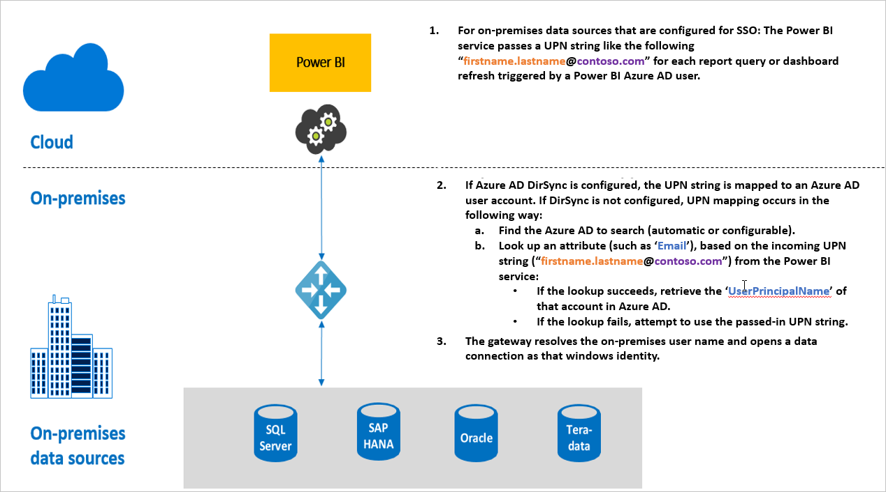

# Overview of single sign-on (SSO) for gateways in Power BI

You can get seamless single sign-on connectivity, enabling Power BI reports and dashboards to update from on-premises data, by configuring your On-premises data gateway either with Kerberos constrained delegation or Security Assertion Markup Language (SAML). The On-premises data gateway facilitates SSO using DirectQuery, which it uses to connect to on-premises data sources.

We currently support the following data sources:

* SQL Server ([Kerberos](service-gateway-sso-kerberos.md))
* SAP HANA ([Kerberos](service-gateway-sso-kerberos.md) and [SAML](service-gateway-sso-saml.md)
* SAP BW ([Kerberos](service-gateway-sso-kerberos.md)
* Teradata ([Kerberos](service-gateway-sso-kerberos.md))
* Spark ([Kerberos](service-gateway-sso-kerberos.md))
* Impala ([Kerberos](service-gateway-sso-kerberos.md))
* SSO is also possible for [other data sources](desktop-directquery-data-sources.md#single-sign-on-sso-for-directquery-sources) without using a data gateway

When a user interacts with a DirectQuery report in the Power BI Service, each cross-filter, slice, sorting, and report editing operation can result in queries executing live against the underlying on-premises data source.  When SSO is configured for the data source, queries execute under the identity of the user interacting with Power BI (that is, through the web experience or Power BI mobile apps). Thereby, each user sees precisely the data for which they have permissions in the underlying data source – with single sign-on configured, there is no shared data caching across different users.

## Query steps when running SSO

A query that runs with SSO consists of three steps, as shown in the following diagram.

> [!NOTE]
> SSO for Oracle is not enabled yet, but is under development and coming soon.

Here are additional details about those steps:

1. For each query, the **Power BI service** includes the *user principal name* (UPN) when sending a query request to the configured gateway.

2. The gateway needs to map the Azure Active Directory UPN to a local Active Directory identity.

   a.  If Azure AD DirSync (also known as *Azure AD Connect*) is configured, then the mapping works automatically in the gateway.

   b.  Otherwise, the gateway can look up and map the Azure AD UPN to a local user by performing a lookup against the local Active Directory domain.

3. The gateway service process impersonates the mapped local user, opens the connection to the underlying database and sends the query. The gateway does not need to be installed on the same machine as the database.

## Next steps

Now that you understand the basics of SSO, read more detailed information about Kerberos and SAML:

* [Single sign-on (SSO) - Kerberos](service-gateway-sso-kerberos.md)
* [Single sign-on (SSO) - SAML](service-gateway-sso-saml.md)
