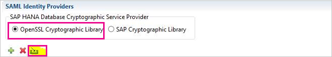
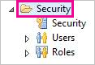
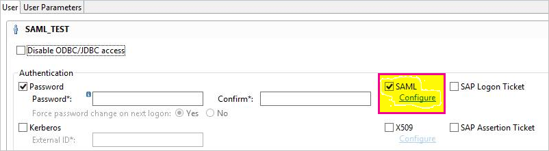
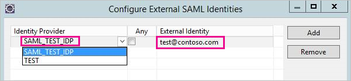
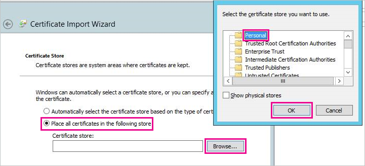
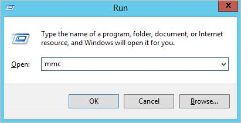
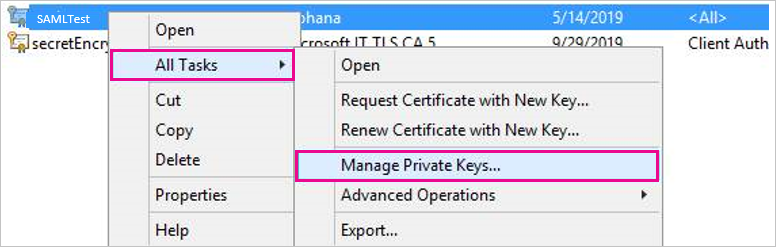
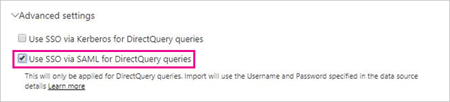

# Use Security Assertion Markup Language (SAML) for single sign-on (SSO) from Power BI to on-premises data sources

Use [Security Assertion Markup Language (SAML)](https://www.onelogin.com/pages/saml) to enable seamless single sign-on connectivity. Enabling SSO makes it easy for Power BI reports and dashboards to refresh data from on-premises sources.

## Supported data sources

We currently support SAP HANA with SAML. For more information about setting up and configuring single sign-on for SAP HANA using SAML, see the topic [SAML SSO for BI Platform to HANA](https://wiki.scn.sap.com/wiki/display/SAPHANA/SAML+SSO+for+BI+Platform+to+HANA) in the SAP HANA documentation.

We support additional data sources with [Kerberos](service-gateway-sso-kerberos.md).

Note that for HANA it is **highly** recommended that encryption be enabled before establishing a SAML SSO connection (that is, you should configure the HANA server to accept encrypted connections and also configure the gateway to use encryption when communicating with your HANA server). The HANA ODBC driver is **not** able to encrypt SAML assertions by default, and without encryption turned on the signed SAML assertion will be sent from the Gateway to the HANA server "in the clear" and be vulnerable to interception and reuse by third parties.

## Configuring the gateway and data source

To use SAML, you must establish a trust relationship between the HANA server(s) for which you want to enable SSO and the gateway, which serves as the SAML Identity Provider (IdP) in this scenario. There are various ways to establish this relationship, such as importing the gateway IdP's x509 certificate into the HANA server(s) trust store, or by having the gateway's X509 certificate signed by a root Certification Authority (CA) trusted by the HANA server(s). We describe the latter approach in this guide, but you may use another approach if it is more convenient.

Also note that while this guide uses OpenSSL as the HANA server's cryptographic provider, it is also possible to use the SAP Cryptographic Library (also known as CommonCryptoLib or sapcrypto) instead of OpenSSL to complete the setup steps where we establish the trust relationship. Refer to the official SAP documentation for further information.

The following steps describe how to establish a trust relationship between a HANA server and the gateway IdP by signing the gateway IdP's X509 certificate using a Root CA trusted by the HANA server.

1. Create the Root CA's X509 certificate and private key. For example, to create the Root CA's X509 certificate and private key in .pem format:

   ```
   openssl req -new -x509 -newkey rsa:2048 -days 3650 -sha256 -keyout CA_Key.pem -out CA_Cert.pem -extensions v3_ca
   ```

   Add the certificate (for example, CA_Cert.pem) to the HANA server's Trust Store so that the HANA server will trust any certificates signed by the Root CA you have just created. The location of your HANA server's Trust Store can be found by examining the **ssltruststore** configuration setting. If you have followed the SAP Documentation covering how to configure OpenSSL, your HANA server may already trust a Root CA you that can reuse. See [How to Configure Open SSL for SAP HANA Studio to SAP HANA Server](https://archive.sap.com/documents/docs/DOC-39571) for details. If you have multiple HANA servers that you want to enable SAML SSO for, make sure that each of the servers trusts this Root CA.

1. Create the gateway IdP's X509 certificate. For example, to create a certificate-signing request (IdP_Req.pem) and a private key (IdP_Key.pem) that are valid for a year, execute the following command:

   ```
   openssl req -newkey rsa:2048 -days 365 -sha256 -keyout IdP_Key.pem -out IdP_Req.pem -nodes
   ```

   Sign the certificate-signing request using the Root CA you've configured your HANA server(s) to trust. For example, to sign IdP_Req.pem using CA_Cert.pem and CA_Key.pem (the certificate and key of the Root CA), execute the following command:

   ```
   openssl x509 -req -days 365 -in IdP_Req.pem -sha256 -extensions usr_cert -CA CA_Cert.pem -CAkey CA_Key.pem -CAcreateserial -out IdP_Cert.pem
   ```

The resulting IdP certificate will be valid for a year (see the -days option). Now, import your IdP's certificate in HANA Studio to create a new SAML Identity Provider.

1. In SAP HANA Studio, right-click your SAP HANA server, then navigate to **Security** > **Open Security Console** > **SAML Identity Provider** > **OpenSSL Cryptographic Library**.

    

1. Select **Import**, navigate to IdP_Cert.pem,and import it.

1. In SAP HANA Studio, select the **Security** folder.

    

1. Expand **Users** then select the user you want to map your Power BI user to.

1. Select **SAML** then **Configure**.

    

1. Select the identity provider you created in step 2. For **External Identity**, enter the Power BI user's UPN (typically the email address the user logs in to Power BI with), then select **Add**. Note that if you've configured your gateway to use the *ADUserNameReplacementProperty* configuration option, you should enter the value that will replace the Power BI user's original UPN. For example, if you set *ADUserNameReplacementProperty* to **SAMAccountName** you should enter the user's **SAMAccountName**.

    

Now that you have the certificate and identity configured, you convert the certificate to a pfx format and configure the gateway machine to use the certificate.

1. Convert the certificate to the pfx format by running the following command. Note that this command sets "root" as the pfx file's password.

    ```
    openssl pkcs12 -export -out samltest.pfx -in IdP_Cert.pem -inkey IdP_Key.pem -passin pass:root -passout pass:root
    ```

1. Copy the pfx file to the gateway machine:

    1. Double-click samltest.pfx, then select **Local Machine** > **Next**.

    1. Enter the password, then select **Next**.

    1. Select **Place all certificates in the following store,** then **Browse** > **Personal** > **OK**.

    1. Select **Next** , then **Finish**.

    

1. Grant the gateway service account access to the private key of the certificate:

    1. On the gateway machine, run the Microsoft Management Console (MMC).

        

    1. Under **File** , select **Add/Remove Snap-in**.

        

    1. Select **Certificates** > **Add** , then select **Computer account** > **Next**.

    1. Select **Local Computer** > **Finish** > **OK**.

    1. Expand **Certificates** > **Personal** > **Certificates** , and find the certificate.

    1. Right-click the certificate and navigate to **All Tasks** > **Manage Private Keys**.

        

    1. Add the gateway service account to the list. By default, the account is **NT SERVICE\PBIEgwService.** You can find out what account is running gateway service by running **services.msc** and find **On-premises data gateway service**.

        

Finally, follow these steps to add the certificate thumbprint to the gateway configuration.

1. Run the following PowerShell command to list the certificates on your machine.

    ```powershell
    Get-ChildItem -path cert:\LocalMachine\My
    ```
1. Copy the thumbprint for the certificate you created.

1. Navigate to the gateway directory, which defaults to C:\Program Files\On-premises data gateway.

1. Open PowerBI.DataMovement.Pipeline.GatewayCore.dll.config, and find the \*SapHanaSAMLCertThumbprint\* section. Paste in the thumbprint you copied.

1. Restart the gateway service.

## Running a Power BI report

Now you can use the **Manage Gateway** page in Power BI to configure the data source, and under its **Advanced Settings** , enable SSO. Then you can publish reports and datasets binding to that data source.



## Troubleshooting

After configuring SSO, you might see the following error in the Power BI portal: "The credentials provided cannot be used for the SapHana source." This error indicates that the SAML credential was rejected by SAP HANA.

Authentication traces provide detailed information for troubleshooting credential issues on SAP HANA. Follow these steps to configure tracing for your SAP HANA server.

1. On the SAP HANA server, turn on the authentication trace by running the following query.

    ```
    ALTER SYSTEM ALTER CONFIGURATION ('indexserver.ini', 'SYSTEM') set ('trace', 'authentication') = 'debug' with reconfigure 
    ```

1. Reproduce the issue you have been facing.

1. In HANA Studio, open the administration console, and go to the **Diagnosis Files** tab.

1. Open the latest indexserver trace and search for SAMLAuthenticator.cpp.

    You should find a detailed error message that indicates the root cause, like the following example.

    ```
    [3957]{-1}[-1/-1] 2018-09-11 21:40:23.815797 d Authentication   SAMLAuthenticator.cpp(00091) : Element '{urn:oasis:names:tc:SAML:2.0:assertion}Assertion', attribute 'ID': '123123123123123' is not a valid value of the atomic type 'xs:ID'.
    [3957]{-1}[-1/-1] 2018-09-11 21:40:23.815914 i Authentication   SAMLAuthenticator.cpp(00403) : No valid SAML Assertion or SAML Protocol detected
    ```

1. Once the troubleshooting is complete, turn off the authentication trace by running the following query.

    ```
    ALTER SYSTEM ALTER CONFIGURATION ('indexserver.ini', 'SYSTEM') UNSET ('trace', 'authentication');
    ```

## Next steps

For more information about the **on-premises data gateway** and **DirectQuery**, check out the following resources:

* [What is an on-premises data gateway?](/data-integration/gateway/service-gateway-getting-started)
* [DirectQuery in Power BI](desktop-directquery-about.md)
* [Data sources supported by DirectQuery](desktop-directquery-data-sources.md)
* [DirectQuery and SAP BW](desktop-directquery-sap-bw.md)
* [DirectQuery and SAP HANA](desktop-directquery-sap-hana.md)
