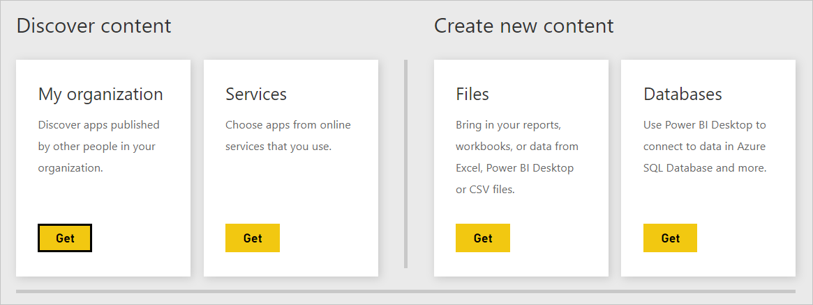
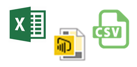
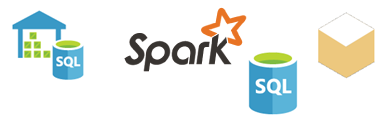

# Data sources for the Power BI service
Data is at the heart of Power BI. Whenever you're exploring data, creating charts and dashboards, asking questions with Q&A, all of those visualizations and answers you see are really getting their underlying data from a dataset. But where does that dataset come from? Well, from a data source.

In this article, we're going to go over the different types of data sources you can connect to from the Power BI service. Keep in-mind, there are many other types of data sources you can get data from, too. But those might require first using Power BI Desktop or Excel's advanced data query and modeling features. We'll go into more about that later. For now, let's look at the different types of data sources you can connect to right from your Power BI service site.

You can get data from any of these data sources in Power BI by clicking **My Workspace** > **Get Data**.

## Files

**Excel** (.xlsx, xlxm) � Excel is unique in that a workbook can have both data you've entered into worksheets yourself, and you can query and load data from external data sources by using Power Query (Get & Transform in Excel 2016) or Power Pivot. You can import data that is in tables in worksheets (the data *must* be in a table), or import data that is loaded into a data model. To learn more, see [Get data from Excel](service-get-data-from-files.md).

**Power BI Desktop** (.pbix) -  You can use Power BI Desktop to query and load data from external data sources, extend your data model with measures and relationships, and create reports. You can import your Power BI Desktop file into your Power BI site. Power BI Desktop is best for more advanced users who have a good understanding of their data sources, data query and transformation, and data modeling concepts. To learn more, see [Connect to data in Power BI Desktop](desktop-connect-to-data.md).

**Comma Separated Value** (.csv) -  Files are simple text files with rows of data. Each row can contain one or more values, each separated by a comma. For example, a .csv containing name and address data can have a number of rows where each row has values for first name, last name, street address, city, state, and so on. You cannot import data into a .csv file, but many applications, like Excel, can save simple table data as a .csv file.

For other file types like XML Table (.xml) or text (.txt) files, you can use Get & Transform to query, transform, and load that data into an Excel or Power BI Desktop file first. You can then import the Excel or Power BI Desktop file into Power BI.

Where you store your files makes a big difference, too. OneDrive for Business provides the greatest amount of flexibility and integration with Power BI. If you keep your files on your local drive, that's ok, but if you need to refresh your data, a few extra steps are involved. More details are provided in the linked articles.

## Content packs

Content packs contain all of the data and reports you need already prepared for you. In Power BI, there are two types of content packs; those from services like Google Analytics, Marketo, or Salesforce, and those created and shared by other users in your organization.

**Services** � There are literally dozens of services with content packs for Power BI, and more are being added all the time. Most services require you to have an account. To learn more, see [Connect to services](consumer/end-user-connect-to-services.md).

**Organizational** � If you and other users in your organization have a Power BI Pro account, you can create, share, and use content packs. To learn more, see [Organizational content packs](service-organizational-content-pack-introduction.md).

## Databases

**Databases in the Cloud** � From the Power BI service, you can connect live to Azure SQL Database, Azure SQL Data Warehouse, Spark on Azure HD Insight, and SQL Server Analysis Services using DirectQuery. Connections from Power BI to these databases are live, that is, when you've connected to say an Azure SQL Database, and you begin exploring its data by creating reports in Power BI, anytime you slice your data or add another field to a visualization, a query is made right to the database. To learn more, see [Azure and Power BI](service-azure-and-power-bi.md).

**Databases on-premises** � From the Power BI service, you can connect directly to SQL Server Analysis Services Tabular model databases. A Power BI Enterprise gateway is required. If you're unsure how to connect to your organization's tabular model database, check with your administrator or IT department. To learn more, see [SQL Server Analysis Tabular data in Power BI](sql-server-analysis-services-tabular-data.md).

For other types of databases in your organization, you'll need to first use Power BI Desktop or Excel to connect to, query, and load data into a data model. You can then import your file into Power BI where a dataset is created. If you setup scheduled refresh, Power BI will use connection information from the file along with refresh settings you configure to connect directly to the datasource and query for updates. Those updates are then loaded into the dataset in Power BI. To learn more, see [Connect to data in Power BI Desktop](desktop-connect-to-data.md).

## What if my data comes from a different source?
There are literally hundreds of different data sources you can use with Power BI. But regardless of where you get your data from, that data has to be in a format the Power BI service can use to create reports and dashboards, answer questions with Q & A, and so on.

Some data sources already have their data in a format ready for the Power BI service, like content packs from service providers like Google Analytics, and Twilio. SQL Server Analysis Services Tabular model databases are ready, too. And you can connect live to databases in the cloud like Azure SQL Database and Spark on HDInsight.

In other cases, it might be necessary to query and load the data you want into a file. For example, let's say you have logistics data in a data warehouse database on a server in your organization. In the Power BI service, you cannot connect directly to that database and begin exploring its data (unless it is a tabular model database). You can, however, use Power BI Desktop or Excel to query and load that logistics data into a data model you then save as a file. You can then import that file into Power BI where a dataset is created.

You're probably thinking �But that logistics data on that database changes every day. How do I make sure my dataset in Power BI is refreshed?� Connection information from the Power BI Desktop or Excel file is imported into the dataset along with the data. If you setup scheduled refresh or do a manual refresh on the dataset, Power BI will use the connection information from the dataset, along with a couple other settings, to connect directly to the database, query for updates, and load those updates into the dataset. A Power BI gateway will likely be required to secure any data transfer between your on-premises server and Power BI. Any visualizations in reports and dashboards are refreshed automatically.

You see, just because you cannot connect to your data source right from the Power BI service doesn't mean you can't get that data into Power BI. It just might take a few more steps and maybe some help from your IT department. See [Data sources in Power BI Desktop](desktop-data-sources.md) to learn more.

## Some more details
You'll see the terms dataset and data source used a lot in Power BI. They're often use synonymously, but they really are two different things, albeit related.

A ***dataset*** is automatically created in Power BI when you use Get Data to connect to and import data from a content pack, file, or you connect to a live data source. A dataset contains information about the data source, data source credentials, and in many cases, a sub-set of data copied from the data source. In most cases, when you create visualizations in reports and dashboards, you're looking at data in the dataset.

A ***data source*** is where the data in a dataset really comes from. For example, an online service like Google Analytics or QuickBooks, a database in the cloud like Azure SQL Database, or a database or file on a local computer or server in your own organization.

### Data refresh
If you save your files on your local drive, or a drive somewhere in your organization, a Power BI gateway might be required in-order to refresh the dataset in Power BI. And, the computer where the file is saved must be on when a refresh happens. You can also re-import your file, or use Publish from Excel or Power BI Desktop, but those are not automated processes.

If you save your files on OneDrive for Business or SharePoint � Team Sites, and then connect to or import them into Power BI, your dataset, reports, and dashboard will always be up-to-date. Because both OneDrive and Power BI are in the cloud, Power BI can connect directly to your saved file, about once every hour, and check for updates. If any are found, the dataset and any visualizations are refreshed automatically.

Content packs from services are automatically updated. In most cases, once a day. You can manually refresh, but whether or not you'll see any updated data will depend on the service provider. Content packs from others in your organization will depend on the data sources used and how the person who created the content pack setup refresh.

Azure SQL Database, Azure SQL Data Warehouse, and Spark on Azure HDInsight are unique in that they are data sources in the Cloud. Because the Power BI service is also in the cloud, Power BI can connect to them live, using DirectQuery. What you see in Power BI is always in-sync and there's no need to setup refresh.

SQL Server Analysis Services is unique in that when you connect to it from Power BI, it's a live connection just like an Azure database in the cloud, but the database itself is on a server in your organization. This type of connection requires a Power BI gateway, which is usually configured by an IT department.

Data refresh is a super important part of Power BI, and much too deep to cover here. If you want to get a thorough understanding, be sure to checkout [Data Refresh in Power BI](refresh-data.md).

## Considerations and Limitations
For all data sources used in the Power BI service, the following considerations and limitations apply. There are other limitations that apply to specific features, but the following list apply to the Power BI service overall:

* **Dataset size limit** - there is a 1 GB limit for each dataset in the Power BI service.
* **Row limit** - the maximum number of rows in your dataset (when not using DirectQuery) is 2 billion, with three of those rows reserved (resulting in a usable maximum of 1,999,999,997 rows); the maximum number of rows when using DirectQuery is 1 million rows.
* **Column limit** - the maximum number of columns allowed in a dataset, across all tables in the dataset, is 16,000 columns. This applies to the Power BI service and to datasets used in Power BI Desktop. Power BI uses an internal row number column per table included in the dataset, which means the maximum number of columns is 16,000 minus one for each table used in the dataset.

