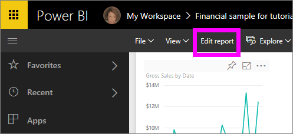

# Tutorial: Get started with the Power BI service
This tutorial helps you get started with the *Power BI service*. The Power BI service is cloud based. It supports light report editing and collaboration for teams and organizations. You can connect to data sources in the Power BI service, but modeling is more limited than in Power BI Desktop. For an understanding of how the Power BI service fits in with the other Power BI offerings, we recommend reading [What is Power BI](power-bi-overview.md).

In this tutorial, you complete the following steps:

> [!div class="checklist"]
> * Find getting started content for the Power BI service.
> * Sign in to your Power BI online account, or sign up, if you don't have one yet.
> * Open the Power BI service.
> * Get some data and open it in report view.
> * Use that data to create visualizations and save it as a report.
> * Create a dashboard by pinning tiles from the report.
> * Add another visualization to your dashboard by using the Q&A natural language tool.
> * Clean up resources by deleting the dataset, report, and dashboard.

> [!TIP]
> Prefer a free self-paced training course instead? [Enroll in our Analyzing and Visualizing Data course on EdX](http://aka.ms/edxpbi).

## Sign up for the Power BI service
If you don't have a Power BI account, [sign up for a free Power BI Pro trial](https://app.powerbi.com/signupredirect?pbi_source=web) before you begin.

After you have an account, enter *app.powerbi.com* in your browser to open the Power BI service. 

## Step 1: Get data

Often when you want to create a Power BI report, you start in Power BI Desktop. This time, we're going to start from scratch creating a report in the Power BI service.

Here's an example of getting data from a CSV file. Want to follow along with this tutorial? [Download the Financial Sample CSV file](http://go.microsoft.com/fwlink/?LinkID=521962).

1. [Sign in to Power BI](http://www.powerbi.com/). Don’t have an account? No worries, you can sign up for a free trial.
2. Power BI opens in your browser. Select **Get data** at the bottom of the left navigation bar.

    The **Get Data** page opens.   

3. Under the **Create new content** section, select **Files**. 
   
   
4.  Select **Local file**.
   
    

5. Browse to the file on your computer, and choose **Open**.

5. For this tutorial, we'll select **Import** to add the Excel file as a dataset, which we can then use to create reports and dashboards. If you select **Upload**, the entire Excel workbook is uploaded to Power BI, where you can open and edit it in Excel online.
   
   
6. When your dataset is ready, select **Datasets**, then select **Create report** next to the dataset **Financial sample** to open the report editor. 

    

    The report canvas is blank. We see the **Filters**, **Visualizations**, and **Fields** panes on the right.

    

7. Notice there's an option for **Reading view** on the top navigation bar. Because you have this option, that means you're currently in Editing view. 

    

    While in Editing view, you can create and modify your reports, because you're the *owner* of the report. That is, you're a *creator*. When you share your report with colleagues, they can only interact with the report in Reading view; your colleagues are *consumers*. Learn more about [Reading view and Editing view](consumer/end-user-reading-view.md).
    
    A great way to get familiar with the report editor is to [take a tour](service-the-report-editor-take-a-tour.md).
 

## Step 2: Start exploring your dataset
Now that you've connected to data, start exploring.  When you've found something interesting, you can create a dashboard to monitor it and see how it changes over time. Let's see how that works.
    
1. In the report editor, we start in the **Fields** pane on the right side of the page to build a visualization. Select the  **Gross Sales** and **Date** checkboxes.
   
   

    Power BI analyzes the data and creates a visualization. If you selected **Date** first, you see a table. If you selected **Gross Sales** first, you see a column chart. 

2. Switch to a different way of displaying your data. Let's see this data as a line chart. Select the line chart icon from the **Visualizations** pane.
   
   

3. This chart looks interesting, so let's *pin* it to a dashboard. Hover over the visualization and select the pin icon. When you pin this visualization, it's stored on your dashboard and kept up-to-date so you can track the latest value at a glance.
   
   

4. Because this report is new, you're prompted to save it before you can pin a visualization to a dashboard. Give your report a name (for example, *Sales over time*), and then select **Save and continue**. 
   
   
   
5. Pin the line chart to a new dashboard and name it *Financial sample for tutorial*. 
   
   
   
6. Select **Pin**.
   
    A success message (near the top-right corner) lets you know the visualization was added as a tile to your dashboard.
   
    

7. Select **Go to dashboard** to see the line chart that you pinned as a tile to your new dashboard. Make your dashboard even better by adding more visualization tiles and [renaming, resizing, linking, and repositioning your tiles](service-dashboard-edit-tile.md).
   
   
   
8. Select the new tile on your dashboard to return to the report. Power BI returns you to the report editor in Reading view. To switch back to Editing view, select **Edit report** from the top navigation bar. After you're in Editing view, you can continue to explore and pin tiles. 

## Step 3:  Continue the exploration with Q&A (natural language querying)
1. For a quick exploration of your data, ask a question in the Q&A box. The Q&A question box is located at the top of your dashboard (**Ask a question about your data**) and in the top navigation bar in your report (**Ask a question**). For example, type *what segment had the most revenue* in the Q&A box.
   
   

2. Q&A searches for an answer and presents it in the form of a visualization. Select the pin icon  to show this visualization on your dashboard.
3. Pin the visualization to the **Financial Sample for tutorial** dashboard.
   
    

4. Return to your dashboard, where you see the new tile.

   

## Clean up resources
Now that you've finished the tutorial, you can delete the dataset, report, and dashboard. 

1. In the left navigation bar, select **My Workspace**.
2. Select the **Datasets** tab and locate the dataset you imported for this tutorial.  
3. Select the ellipsis (...) > **Delete**.

    

    When you delete the dataset, Power BI also deletes the report and the dashboard. 

## Next steps

> [!div class="nextstepaction"]
> [Connect to the online services you use with Power BI](service-connect-to-services.md)

