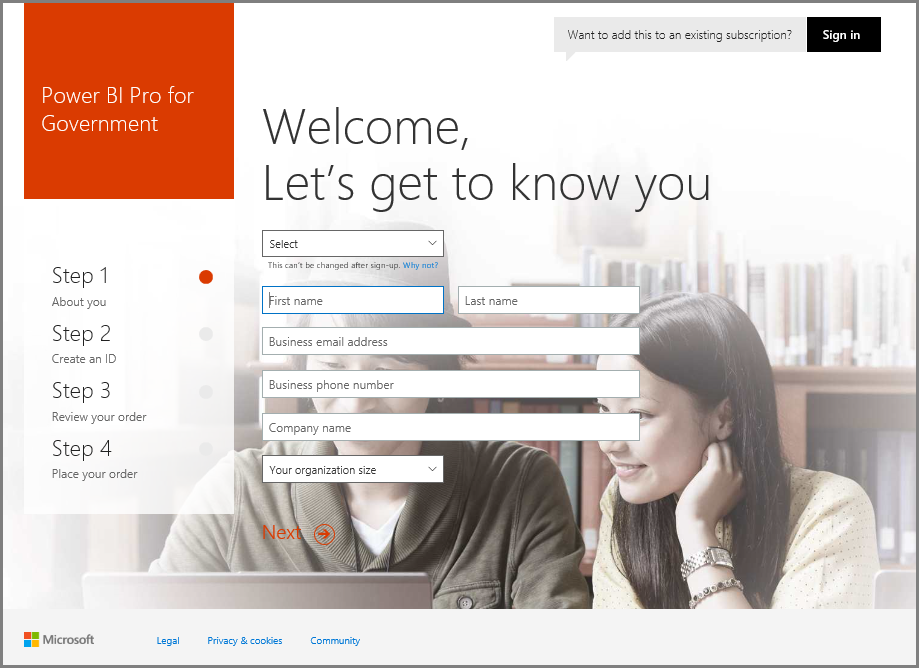

# Enroll your US Government organization in the Power BI service
The **Power BI service** has a version available for United States Government customers as part of the **Office 365 US Government Community** subscriptions. The **Power BI service** version discussed in this article is specifically designed for US Government customers, and is separate and different from the commercial version of the **Power BI service**.

For more information about the **Power BI service** for US Government, including its features and limitations, check out [Power BI for United States Government customers - Overview](service-govus-overview.md).

> [!NOTE]
> This article is intended for administrators who have authority to sign up their US Government organization for Power BI. If you are an end-user, contact your administrator about getting a subscription to Power BI for US Government.
> 
> 

## Select the right sign-up process for your US Government organization
Your US Government organization might be new to the **Office Government Cloud**, or might already have a subscription. The following sections detail the sign-up steps based on where you are with the Office Government Cloud and Power BI, and are different based on your existing subscription.

Once you have signed up for Power BI US Government some features may not work until your sales or support representative completes your onboarding process. To find out about these features see the [Power BI for United States Government customers - Overview](service-govus-overview.md). To complete the onboarding process to enable these features, contact your sales or support representative.

### US Government organizations that are new Office Cloud customers
If your organization is a new **Office Government Cloud** customer, follow these steps:

> [!NOTE]
> These steps should be performed by the portal administrator.
>

1. Go to [https://products.office.com/government/office-365-web-services-for-government](https://products.office.com/government/office-365-web-services-for-government).

>[!NOTE]
>If you don't want to sign up for Office Government Cloud at this time, please reach out to your sales representative.
>

2. Select Office G3 and complete the form for an Office trial
3. Once you are an Office Cloud customer continue on with the steps below for "Existing Office Government Cloud customers"

### Existing Office Government Cloud customers
If your organization is an existing **Office Government Cloud** customer, but you don't have a **Power BI** subscription (Free or otherwise), follow these steps:

> [!NOTE]
> These steps should be performed by the portal administrator.
> 
> 

1. Log in to your existing Office Government Cloud account and go to the admin portal
2. Select **Billing**.
3. Select **Purchase Service**.
4. Select the Power BI Pro Government Option and choose between **Try** and **Buy Now**
5. Complete your order
6. Assign users to the account.
   
   
7. Log in to the **Power BI service** for US Government customers at [https://app.powerbigov.us](https://app.powerbigov.us)

## Additional Signup Information
The below is additional information for signing up for **Power BI US Government** in various licensing migration cases.

### Direct Power BI Trial to Pro Customer Onboarding
* Click and follow through the Billing > Purchase Service > Power BI Pro Gov and select purchase and not Trial
* Fill in the necessary and get the licenses
* Remove the Power BI Pro Trial or remove the old licenses and Assign the new ones to the users
* Log in to [https://app.powerbigov.us](https://app.powerbigov.us)

### Reseller Power BI Trial to Pro Customer Onboarding
Go to **Billing > Subscriptions** and select **Power BI Pro for Government** subscription. There you will see:

* Available
* Assigned
* Assign to users links
* If you still have the Trial assigned:
  * Click on **Assigned** under the Trial subscription and remove the users you want to add to paid
  * Go to the Paid subscription and assign those users

### Whitelisting Instructions
*Whitelisting* is a process that the Power BI engineering team uses to move customers from the commercial cloud environment into the secure, Government cloud environment. This ensures that features available in the US Government cloud work as expected. All existing (or new) US Government customers that purchase US Government **Power BI** services for the first time *must* initiate the following whitelisting process. The process must be done prior to setup or migration to US Government **Power BI** services. 

To have your tenant *whitelisted* for the US Government cloud, contact the Microsoft account team for assistance with whiteplisting. Note that only administrators can make this request. The process for *whitelisting* takes approximately three weeks, during which the Power BI engineering team makes appropriate changes to ensure your tenant operates properly in the US Government cloud.

Customers migrating from Power BI **Free** licenses to **Power BI US Government** (and by definition, migrating to the associated **Pro** license features described earlier in this article) will encounter the issues described in the following section of this article, until their tenant is *whitelisted* by the Power BI engineering team.

### Mixed Free and Pro licenses in US Government tenants
If you have both Free and US Government Pro licenses in your tenant, both Free and (US Government) Pro licenses remain present, but one or the other license types will not work properly. If your tenant successfully goes through the *whitelisting* process, then the following occurs:

* Any Free license users will no longer be able to log in to Power BI using **Power BI Desktop**, and will experience functionality gaps described in the following section.
* All clients assigned to US Government Pro licenses will work as expected, including use of gateways, Power BI Desktop, and Mobile apps.

When using a mix of Free and Pro licenses in a US Government tenant, and going through the *whitelisting* process, the following can be expected:

**Before _whitelisting_**:

* Users with Free licenses are running in commercial cloud
* Pro US Government licenses show up in the portal, and the administrator can assign those licenses to users. Pro US Government users will not lose data from their Free licenses once the admin assigns a US Government Pro license. The assigned users have access Power BI Pro features for US Government customers, but the following bullet list functionality gaps will exist until the tenant is successfully *whitelisted*:
  
  * Gateway, Mobile, and Power BI Desktop can’t authenticate
  * You cannot access Azure commercial data sources
  * PBIX files must be manually uploaded from the commercial Power BI service
  * Power BI mobile apps are not available

**After _whitelisting_**:

* Free users running in the commercial Power BI service can continue to run, but the they will stop authenticating as expected.
* Pro users running in the US Government cloud can use the **Power BI for US Government customers** service as expected.

To identifying users in your tenant that are running the Free license of Power BI, administrators can run the licensing report, after which Free license users show up as **Power BI Standard**.

## Next steps
There are all sorts of things you can do with Power BI. For more information and learning, including an article that shows you how to sign up for the service, check out the following resources:

* [Overview of Power BI for US Government](service-govus-overview.md)
* [Guided Learning for Power BI](guided-learning/gettingstarted.yml?tutorial-step=1)
* [Get started with the Power BI service](service-get-started.md)
* [What is Power BI Desktop?](desktop-what-is-desktop.md)

