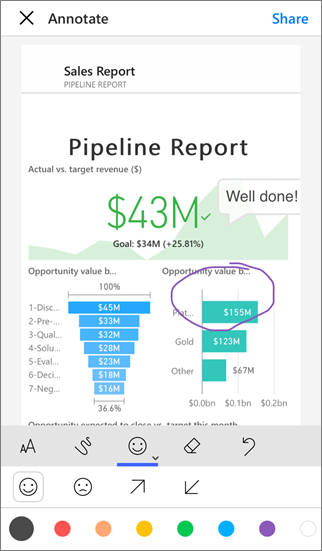

# Ways to share your work in Power BI

You've created dashboards and reports. Maybe you collaborated on them with your coworkers, too. Now you want others to have access to them. What's the best way to distribute them?

In this article, we compare these options for collaborating and sharing in Power BI:

* Collaborating with coworkers to create meaningful reports and dashboards in *workspaces*.
* Bundling those dashboards and reports into *apps* and publishing them to a larger group or your whole organization.
* Sharing dashboards or reports with a few people, from the service or the Power BI mobile apps.
* Printing reports.
* Embed reports in secure portals or public websites.

No matter which option you choose, to share a dashboard you need a [Power BI Pro license](service-features-license-type.md), or the content needs to be in a [Premium capacity](service-premium.md). License requirements vary for the colleagues who view your dashboards, depending on the option you choose. The following sections spell out details. 

*Apps in the Power BI service*

## Collaborate with coworkers in a workspace

When teams work together, they need access to the same documents so they can quickly collaborate. Workspaces in Power BI provide the place where teams come together to share the ownership and management of dashboards, reports, datasets, and workbooks that matter to them. Sometimes Power BI users organize their workspaces based on organizational structures, other times they create them for specific projects. Still other organizations use several workspaces to store different versions of reports or dashboards they use. 

Workspaces provide roles that determine what permissions your coworkers have. You can use those roles to determine who can manage the entire workspace, or provide content into it.

Some users naturally put content in their My Workspace and share it out. Workspaces are better for collaboration than My Workspace because they provide co-ownership of content. You and your entire team can easily make updates or give others access. My Workspace is best used by individuals for one-off or personal content.

Let’s imagine you have a finished dashboard you need to share with your colleagues. What's the best way to give them access to the dashboard? The answer depends on a number of factors. If a specific colleague needs to own the dashboard and keep it up-to-date, or needs access to all the content in the workspace, it may be best to add them to the workspace. If your colleague just needs to see that dashboard and not all the content in the workspace, you again can choose from a set of alternatives. If the dashboard is part of a bigger set of content you need to distribute to many colleagues, then publishing an app is likely the best choice. However, if the colleague just needs that one dashboard, then sharing the dashboard could be the best path forward.

Read more about [creating workspaces](service-create-workspaces.md).

**Did you know?** Power BI has a new workspace experience. Read [Create the new workspaces](service-create-the-new-workspaces.md) to see how workspaces are changing. 

## Distribute data and insights by creating an app

Say you want to distribute your dashboard to a broad audience. You and your coworkers have created a *workspace*, then created and refined dashboards, reports, and datasets in the workspace. Now you select the dashboards and reports you want and publish them as an app &#151; either to a group or to your whole organization.

Apps are easy to find and install in the Power BI service ([https://powerbi.com](https://powerbi.com)). You can send your business users a direct link to the app, or they can search for it in AppSource. If your Power BI administrator gives you permissions, you can install an app automatically in your coworkers' Power BI accounts. Read more about [publishing your apps](service-create-distribute-apps.md).

After they install an app, they can view it in their browser or mobile device.

For your users to view your app, either they need to have a Power BI Pro license, too, or the app needs to be stored in a Power BI Premium capacity. Read [What is Power BI Premium?](service-premium.md) for details.

You can publish apps to those outside your organization, too. They can view and interact with the app content, but can’t share it with others.

## Share dashboards and reports

Let's say you've finalized a dashboard and a report in your own My Workspace or in a workspace and you want a few other people to have access to it. One way to get it to them is to *share* it. 

You need a Power BI Pro license to share your content, and those you share it with do too, or the content needs to be in a workspace in a [Premium capacity](service-premium.md). When you share a dashboard or report, recipients can view it and interact with it, but can't edit it. They see the same data that you see in the dashboard and reports unless row-level security (RLS) is applied to the underlying dataset. The coworkers you share it with can share with their coworkers, if you allow them to. 

You can share with people outside your organization, too. They can view and interact with the dashboard or report too, but can't share it. 

More about [sharing dashboards and reports](service-share-dashboards.md) from the Power BI service. You can also add a filter to a link and [share a filtered view of your report](service-share-reports.md).

## Annotate and share from the Power BI mobile apps

In the Power BI mobile apps for iOS and Android devices, you can annotate a tile, report, or visual and then share it with anyone via email.

You're sharing a snapshot of the tile, report, or visual, and your recipients see it exactly as it was when you sent the mail. The mail also contains a link to the dashboard or report. If they have a Power BI Pro license, or the content is in a [Premium capacity](service-premium.md), and you've shared the object with them already, they can open it. You can send snapshots of tiles to anyone &#151; not just coworkers in the same email domain.

More about [annotating and sharing tiles, reports, and visuals](consumer/mobile/mobile-annotate-and-share-a-tile-from-the-mobile-apps.md) from the iOS and Android mobile apps.

You can also [share a snapshot of a tile](consumer/mobile/mobile-windows-10-phone-app-get-started.md) from the Power BI app for Windows 10 devices.

## Print or save as PDF or other static file

You can print or save as PDF (or other static file format) an entire dashboard, dashboard tile, report page, or visualization from the Power BI service. Reports can only be printed one page at a time -- you can't print the entire report at once. More about [printing or saving as a static file](consumer/end-user-print.md).

## Embed reports in secure portals or public websites

You can embed Power BI reports in portals or websites where your users expect to see them.  

The **Embed in SharePoint Online** and the **Embed** option in the Power BI service allows you to embed reports for your internal users securely. The Embed in SharePoint Online option works with the Power BI web part for SharePoint Online and provides a single sign-on experience with control over how the report is embedded. The Embed option works with any portal or website that supports embedding content using a URL or an iFrame. Whichever option you choose, they both ensure that all permissions and data security are enforced before a user can see content. The person viewing the report needs the appropriate license. More about [Embed in SharePoint Online](service-embed-report-spo.md) and the [Embed](service-embed-secure.md) option in Power BI.

With **Publish to web**, you can publish Power BI reports to the whole Internet by embedding interactive visualizations in blog posts, websites, social media, and other online communications on any device. Anyone on the Internet can view your reports, and you have no control over who can see what you've published. They don't need a Power BI license. Publishing to the web is available only for reports that you can edit. You can't publish reports to the web if they're shared with you or if they're in an app. More about [publishing to the web](service-publish-to-web.md).

>[!Warning]
>Use [Publish to web](service-publish-to-web.md) only to share content publicly, not for internal sharing.

## Next steps

* [Share dashboards with coworkers and others](service-share-dashboards.md)
* [Create and publish an app in Power BI](service-create-distribute-apps.md)
* [Embed report in a secure portal or website](service-embed-secure.md)

Have feedback? Go to the [Power BI Community site](https://community.powerbi.com/) with your suggestions.

More questions? [Try the Power BI Community](http://community.powerbi.com/)
