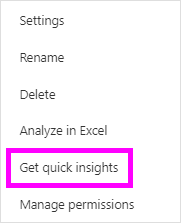
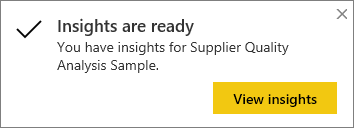
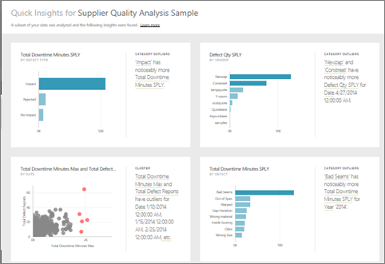
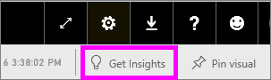

# Automatically generate data insights with Power BI
Have a new dataset and not quite sure where to start?  Need to build a dashboard quickly?  Want to look for insights you may have missed?

Run quick insights to generate interesting interactive visualizations based on your data. Quick insights can be run on an entire dataset (quick insights) or on a specific dashboard tile (scoped insights). You can even run insights on an insight!

> [!NOTE]
> Insights does not work with DirectQuery - it only works with data uploaded to Power BI.
> 

The insights feature is built on a growing [set of advanced analytical algorithms](service-insight-types.md) developed in conjunction with Microsoft Research that we’ll continue to use to allow more people to find insights in their data in new and intuitive ways.

## Run quick insights on a dataset
Watch Amanda run quick insights on a dataset, open an insight in Focus mode, pin one of these insights as a tile on her dashboard, and then get insights for a dashboard tile.

<iframe width="560" height="315" src="https://www.youtube.com/embed/et_MLSL2sA8" frameborder="0" allowfullscreen></iframe>

Now it's your turn. Explore insights using the [Supplier Quality Analysis sample](sample-supplier-quality.md).

1. From the **Datasets** tab, select the ellipses (...) and choose **Get insights**.
   
    
   
    
2. Power BI uses [various algorithms](service-insight-types.md) to search for trends in your dataset.
   
    
3. Within seconds, your insights are ready.  Select **View insights** to display visualizations.
   
    
   
    > [!NOTE]
    > Some datasets can't generate insights because the data isn't statistically significant.  To learn more, see [Optimize your data for insights](service-insights-optimize.md).
   > 
    
1. The visualizations display in a special **Quick Insights** canvas with up to 32 separate insight cards. Each card has a chart or graph plus a short description.
   
    

## Interact with the insight cards
  

1. Hover over a card and select the pin icon to add the visualization to a dashboard.
2. Hover over a card, select the ellipses (...) and choose **View insights**. This opens the insight fullscreen.
   
    
3. In Focus mode you can:
   
   * Filter the visualizations.  To display the filters, in the top right corner, select the arrow to expand the Filters pane.
        
   * Pin the insight card to a dashboard by selecting the pin   icon or **Pin visual**.
   * Run insights on the card itself. This is often referred to as **scoped insights**. In the top-right corner, select the lightbulb icon   or **Get insights**.
     
       
     
     The insight displays on the left and new cards, based solely on the data in that single insight, display along the right.
     
       
4. To return to the original insights canvas, in the top-left corner, select **Exit Focus mode**.

## Run insights on a dashboard tile
Instead of searching for insights against an entire dataset, narrow your search to the data used to create a single dashboard tile. This too is often referred to as **scoped insights**.

1. Open a dashboard.
2. Hover over a tile. select the ellipses (...), and choose **View insights**. The tile opens in [Focus mode](service-focus-mode.md) with the insights cards displayed along the right.    
   
        
4. Does one insight pique your interest? Select that insight card to dig further. The selected insight appears on the left and new insight cards, based solely on the data in that single insight, display along the right.    
6. Continue digging into your data, and when you find an interesting insight, pin it to your dashboard by selecting **Pin visual** from the top-right corner.

## Next steps
If you own a dataset, [optimize it for Quick Insights](service-insights-optimize.md)

Learn about the [types of Quick Insights available](service-insight-types.md)

More questions? [Try the Power BI Community](http://community.powerbi.com/)

