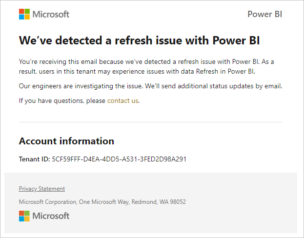
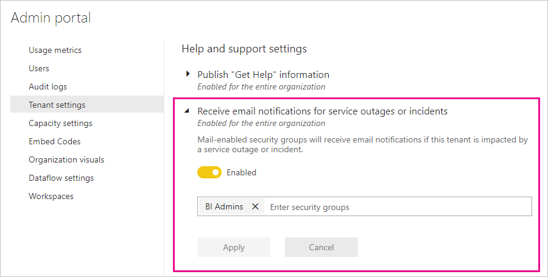

# Service interruption notifications

It's crucial to have insight into the availability of your mission critical business applications. Power BI provides incident notification so you can optionally receive emails if there's a service disruption or degradation. While Power BI’s 99.9% service level agreement (SLA) makes these occurrences rare, we want to ensure that you're kept informed. The following screenshot shows the type of email you'll receive if you enable notifications:

At this time, we send emails for the following _reliability scenarios_:

- Open report reliability
- Model refresh reliability
- Query refresh reliability

Examples of these notifications include when users experience an extended delay in operations like opening reports, dataset refresh, or query executions. After an incident is resolved, you receive a follow-up email.

> [!NOTE]
> This feature is currently available only for dedicated capacities in Power BI Premium. It's not available for shared or embedded capacity.

## Enable notifications

A Power BI tenant administrator enables notifications in the admin portal:

1. Identify or create an email-enabled security group that should receive notifications.

1. In the admin portal, select **Tenant settings**. Under **Help and support settings**, expand **Receive email notifications for service outages or incidents**.

1. Enable notifications, enter a security group, and select **Apply**.

    

> [!NOTE]
> Power BI sends notifications from the account no-reply-powerbi@microsoft.com. Ensure that this account is whitelisted so that notifications don't end up in a spam or junk folder.

## Next steps

[Power BI Pro and Power BI Premium support options](service-support-options.md)

More questions? [Try the Power BI Community](http://community.powerbi.com/)