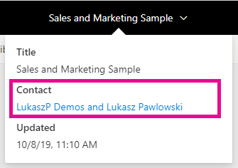
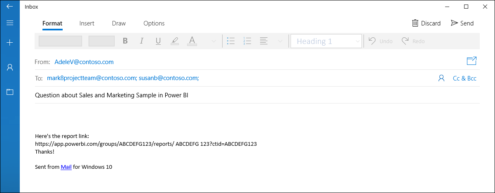
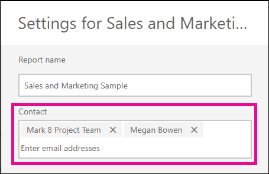
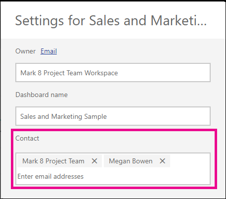

# Set contact information for reports and dashboards in the Power BI service
This article teaches you how to set contact information for a dashboard or report in the Power BI service.

> [!NOTE]
> Contact information can be set for items in a classic or new workspace. You can't set contact information for items in your My Workspace. The info card is shown when viewing a report or dashboard in the [new look](service-new-look.md).

You can add multiple users or groups to the contact for an item. They can be:
* A person
* An Office 365 Group
* An email enabled security group
* A distribution list

By default the person who creates a new report or dashboard is the contact for it. If you set a value, it overrides the default. You can of course remove all the people or groups from the contact list. When you do this, for classic workspaces, the Office 365 Group for the workspace will be shown. For new workspace experience workspaces, the [workspace contact list](service-create-the-new-workspaces.md#workspace-contact-list) will be used. If the workspace contact list is not set, then workspace admins are shown.

The contact information is shown to people viewing the item. 

 

When you click the list of contacts, an email is created so you can ask questions or get help. 

 
 
The contact list information is also used in other places. For example, it is shown in some error scenarios in the error dialog box. Automated email messages related to the item, like access requests, are sent to the contact list. 

> [!NOTE]
> When publishing an app, the contact information set on individual items is set to the person who published or updated the app. You can set the app support URL so app users get the help they need.

## Set contact information for a report
1. In your workspace, select the **Reports** tab.
2. Locate the desired report and select the **Settings** icon.
3. Locate the **Contact** input field and set a value.

     

## Set contact information for a dashboard
1. In your workspace, select the **Dashboards** tab.
2. Locate the desired dashboard and select the **Settings** icon
3. Locate the **Contact** input field and set a value.

     

## Limitations and considerations
* The contact is set automatically for new items created in the Power BI service. Existing items will show the workspace default.
* You can set any user or group in the contact list, but they will not be granted permission to the item automatically. Use sharing or give user who need it access to the workspace through a role. 

## Next steps

More questions? [Try the Power BI Community](http://community.powerbi.com/)
