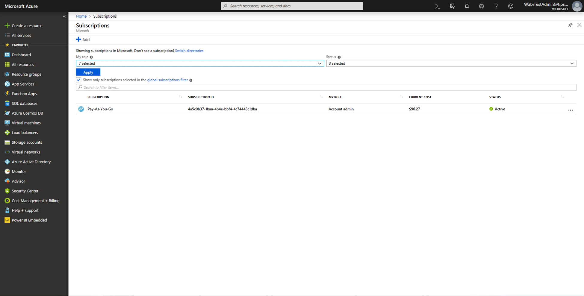

# Azure Machine Learning integration in Power BI (Preview)

Numerous organizations use **Machine Learning** models for better insights and predictions about their business. The ability to visualize and invoke insights from these models, in your reports and dashboards and other analytics, can help disseminate these insights to the business users who need it the most.  Power BI now makes it simple to incorporate the insights from models hosted on the Azure Machine Learning service, using straightforward point-and-click gestures.

To use this capability, a data scientist can simply grant access to the Azure ML model to the BI analyst using the Azure portal.  Then, at the start of each session, Power Query discovers all the Azure ML models to which the user has access and exposes them as dynamic Power Query functions.  The user can then invoke those functions by accessing them from the ribbon in Power Query Editor, or by invoking the M function directly. Power BI also automatically batches the access requests when invoking the Azure ML model for a set of rows to achieve better performance.

This functionality is currently only supported for Power BI dataflows, and for Power Query online in the Power BI service.

To learn more about dataflows, see [Self-service data prep in Power BI](service-dataflows-overview.md).

To learn more about Azure Machine Learning, please see:

- Overview:  [What is Azure Machine Learning service?](https://docs.microsoft.com/azure/machine-learning/service/overview-what-is-azure-ml)
- Quick Starts and Tutorials for Azure Machine Learning:  [Azure Machine Learning Documentation](https://docs.microsoft.com/azure/machine-learning/)

## Granting access to the Azure ML model to a Power BI user

To access an Azure ML model from Power BI, the user must have **Read** access to the Azure subscription.  In addition:

- For Machine Learning Studio models, **Read** access to Machine Learning Studio web service
- For Machine Learning Service models, **Read** access to the Machine Learning service workspace

The steps in this article describe how to grant a Power BI user access to a model hosted on the Azure ML service, so they can access this model as a Power Query function.  For further details, please see [Manage access using RBAC and the Azure portal](https://docs.microsoft.com/azure/role-based-access-control/role-assignments-portal).

1. Sign in to the [Azure portal](https://portal.azure.com).

2. Go to the **Subscriptions** page. You can find the **Subscriptions** page through the **All Services** list in the left navigation menu of the Azure portal.

    

3. Select your subscription.

    

4. Select **Access Control (IAM)**, and then select the **Add** button.

    

5. Select **Reader** as the Role. Select the Power BI user to whom you wish to grant access to the Azure ML model.

    

6. Select **Save**.

7. Repeat steps three through six to grant **Reader** access to the user for the specific Machine Learning Studio web service, *or* the Machine Learning service workspace hosting the model.

## Schema discovery for Machine Learning Service models

Data scientists primarily use Python to develop, and even deploy, their machine learning models for the Machine Learning Service.  Unlike the Machine Learning Studio, which helps automate the task of creating a schema file for the model, in the case of the Machine Learning Service, the data scientist must explicitly generate the schema file using Python.

This schema file must be included in the

## Invoking the Azure ML model in Power BI

You can invoke any Azure ML model to which you have been granted access, directly from the Power Query Editor in your dataflow. To access the Azure ML models, select the **Edit** button for the entity that you want to enrich with insights from your Azure ML model, as shown in the following image.

Selecting the **Edit** button opens the Power Query Editor for the entities in your dataflow.

Select the **AI Insights** button in the ribbon, and then select the _Azure Machine Learning Models_ folder from the left navigation menu. All the Azure ML models to which you have access are listed here as Power Query functions. Also, the input parameters for the Azure ML model are automatically mapped as parameters of the corresponding Power Query function.

To invoke an Azure ML model, you can specify any of the selected entity's columns as an input from the drop-down. You can also specify a constant value to be used as an input by toggling the column icon to the left of the input dialog.

Select **Invoke** to view the preview of the Azure ML model's output as a new column in the entity table. You will also see the model invocation as an applied step for the query.

If the model returns multiple output parameters, they are grouped together as a record in the output column. You can expand the column to produce individual output parameters in separate columns.

Once you save your dataflow, the model is automatically invoked when the dataflow is refreshed, for any new or updated rows in the entity table.

## Next Steps

This article provided an overview of integrating Machine Learning into the Power BI service. The following articles might also be interesting and useful. 

* [Tutorial: Invoke a Machine Learning Studio model in Power BI (Preview)](service-tutorial-invoke-machine-learning-model.md)
* [Tutorial: Using Cognitive Services in Power BI](service-tutorial-using-cognitive-services.md)
* [Cognitive Services in Power BI (Preview)](service-cognitive-services.md)

For more information about dataflows, you can read these articles:
* [Create and use dataflows in Power BI](service-dataflows-create-use.md)
* [Using computed entities on Power BI Premium (Preview)](service-dataflows-computed-entities-premium.md)
* [Using dataflows with on-premises data sources (Preview)](service-dataflows-on-premises-gateways.md)
* [Developer resources for Power BI dataflows (Preview)](service-dataflows-developer-resources.md)
* [Dataflows and Azure Data Lake integration (Preview)](service-dataflows-azure-data-lake-integration.md)

