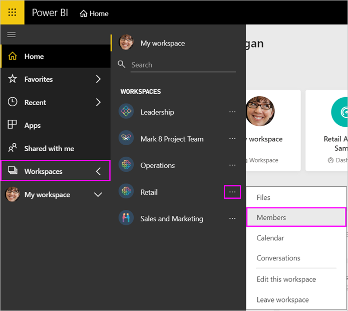

# Manage your app workspace in Power BI and Office 365

As creator or owner of an [app workspace in Power BI](service-create-distribute-apps.md) or in Office 365, you manage some aspects of the workspace in Power BI. Other aspects you manage in Office 365.

> [!NOTE]
> The new workspace experience preview will change the relationship between Power BI workspaces and Office 365 groups. You won't automatically be creating an Office 365 group every time you create one of the new workspaces. Read about [creating the new workspaces](service-create-the-new-workspaces.md).

In **Power BI** you can:

* Add or remove app workspace members, including making a workspace member an owner.
* Edit the app workspace name.
* Delete the app workspace.

In **Office 365** you can:

* Add or remove your app workspace's group members, including making a member an owner.
* Edit the group name, image, description, and other settings.
* See the group email address.
* Delete the group.

You need a [Power BI Pro license](service-features-license-type.md) to be an owner or member of an app workspace. Your app users need a Power BI Pro license, too, unless your app workspace is in a Power BI Premium capacity. Read [What is Power BI Premium?](service-premium-what-is.md) for details.

## Edit your app workspace in Power BI

1. In the Power BI service, select **Workspaces**, then the ellipsis next to your workspace name, and finally **Edit this workspace**.

   

   > [!NOTE]
   > You only see **Edit this workspace** if you’re an app workspace owner.

1. Here you can rename the workspace, add or remove members, or delete the workspace.

   

1. Select **Save** or **Cancel**.

## Edit Power BI app workspace properties in Office 365

You can also edit aspects of an app workspace directly in Outlook for Office 365.

### Edit the members of the app workspace group

1. In the Power BI service, select **Workspaces**, then the ellipsis next to your workspace name, and finally **Members**.

   

   This opens the Outlook for Office 365 group view of your app workspace. You may need to sign into your corporate account.

1. Select the role next to a teammate's name to make the person a **Member** or an **Owner**. Select the **X** to remove the person from the group.

   

### Add an image and set other workspace properties

When you distribute your app from the app workspace, the image you add here will be the image for your app. See the [Add an image to your Office 365 app workspace (optional)](service-create-workspaces.md#add-an-image-to-your-office-365-app-workspace-optional) section of the **Create the new workspaces** article.

1. In the Outlook for Office 365 view of your app workspace, go to the **About** tab and select **Edit**.

    
1. You can edit the name, description, and language for group-related notifications. You can also add an image, and set other properties here.

   

1. Select **Save** or **Discard**.

## Next steps

* [Publish an app in Power BI](service-create-distribute-apps.md)

* More questions? [Try the Power BI Community](http://community.powerbi.com/)
