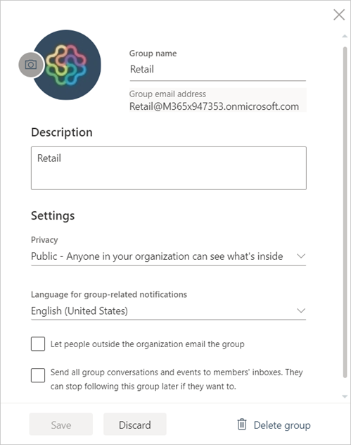

# Manage your app workspace in Power BI and Office 365
As creator or admin of an [app workspace in Power BI](service-create-distribute-apps.md) or in Office 365, you manage some aspects of the workspace in Power BI. Other aspects you manage in Office 365. 

> [!NOTE]
> The new workspace experience preview will change the relationship between Power BI workspaces and Office 365 groups. You won't automatically be creating an Office 365 group every time you create one of the new workspaces. Read about [creating the new workspaces (preview)](service-create-the-new-workspaces.md)

**In Power BI** you can:

* Add or remove app workspace members, including making a workspace member an admin.
* Edit the app workspace name.
* Delete the app workspace.

**In Office 365** you can:

* Add or remove your app workspace's group members, including making a member an admin.
* Edit the group name, image, description, and other settings.
* See the group email address.
* Delete the group.

You need a [Power BI Pro license](service-features-license-type.md) to be an admin or member of an app workspace. Your app users need a Power BI Pro license, too, unless your app workspace is in a Power BI Premium capacity. Read [What is Power BI Premium?](service-premium.md) for details.

## Edit your app workspace in Power BI
1. In the Power BI service, select the arrow next to **Workspaces** > select the ellipsis (**…**) next to your workspace name > **Edit workspace**. 
   
   
   
   > [!NOTE]
   > You only see **Edit workspace** if you’re an app workspace admin.
   > 
   > 
2. Here you can rename, add or remove members, or delete the app workspace. 
   
   
3. Select **Save** or **Cancel**.

## Edit Power BI app workspace properties in Office 365
1. In the Power BI service, select the arrow next to **Workspaces** > select the ellipsis (**…**) next to your workspace name > **Members**. 
   
   
   
   This opens the Outlook for Office 365 group view of your app workspace.
   
   You may need to sign into your corporate account.
2. Tap the ellipsis (**…**) next to a member's name to make the member an admin or delete the member from the app workspace. 
   
   

## Add an image and set other workspace properties in the Office 365 group
When you distribute your app from the app workspace, the image you add here will be the image for your app. See the [Add an image to your app](service-create-workspaces.md#add-an-image-to-your-office-365-app-workspace-optional) section of the article [Create the new workspaces](service-create-workspaces.md).

1. In the Outlook for Office 365 view of your app workspace, select the group image to edit group workspace properties.
   
   
2. You can edit the name, description, and language, add an image, and set other properties here.
   
   
3. Select **Save** or **Discard**.

## Next steps
* [Publish apps with dashboards and reports in Power BI](service-create-distribute-apps.md)
* More questions? [Try the Power BI Community](http://community.powerbi.com/)

