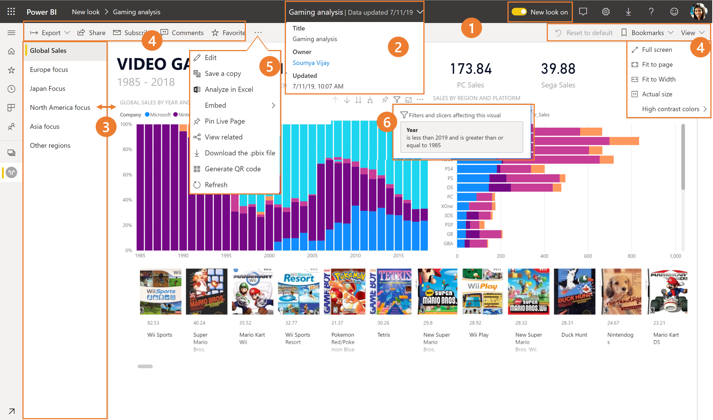
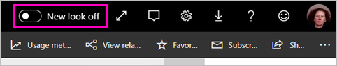
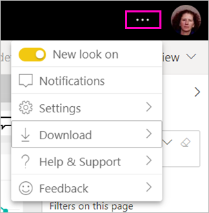
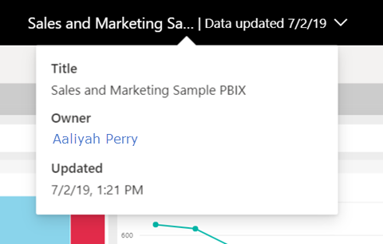
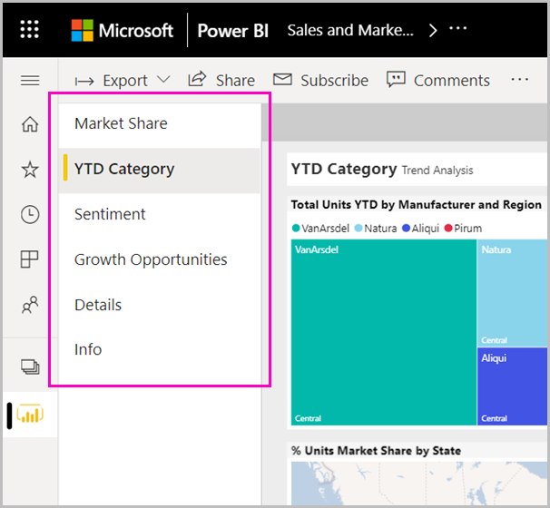
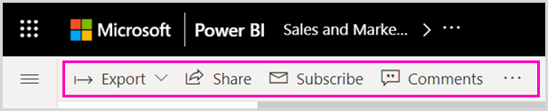
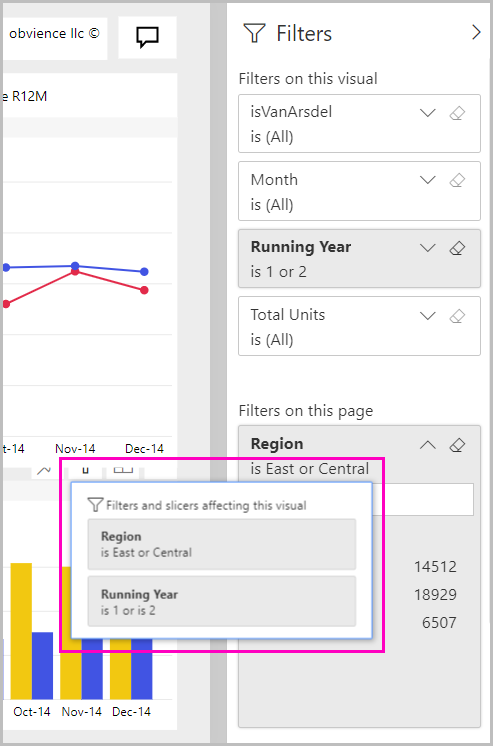

# Navigate the 'new look' of the Power BI service

The Power BI service has a new look. We’ve made it easier for you to view reports. The new look is a modern experience that’s simpler and builds on your familiarity with other Microsoft products. Across the Power BI service, we’ve made report content the main point of focus by switching to a lighter color theme and updating icons. Here's an overview of what’s changed in the new look. See the numbered sections for details:

## Quick tour of the changes

This animation demonstrates the changes to the way reports look, in action.

## 1. Opt in to the new look

Any Power BI service user can opt in to the new look. Just slide **New look off** to **New look off**.

If you need to go back to the old look, select the ellipsis menu in the upper-right corner.

## 2. View report details 

See details such as last refresh date and contact information quickly, right in the top banner.  Open the menu to view additional details about the report. You can even send an email to the report owner.

## 3. Vertical list of pages 
Report page names are now in a list in a vertical pane. They're prominent, hard to miss, and similar to navigation in Word and PowerPoint. You can increase or decrease the rest of the report area by resizing the vertical pane.

## 4. Simplified action bar 

The updated action bar across the top features the most relevant commands, front and center for report consumers. It's easier to export, subscribe, collaborate with others, and delve deeper through filters and bookmarks.

## 5. Where are the report commands?

We didn't remove any of the functionality from the old look. You can find the additional commands such as edit, save a copy, and so on, by expanding the ellipsis (the ... menu) in the action bar. Also, you can access the usage metrics from the content list.

### Where are File menu actions?

Looking for **File** menu actions? The actions that used to be on the **File** menu are also on the ellipsis (...) menu now. 

## 6. New filter experience

Recent updates such as viewing applied filters and the new filters pane are available by default with the new look. Even if the report designers haven't upgraded to the new filters experience, you see the new filters pane.

## Dashboard 'new look' experience 

Dashboards also have a simplified action bar, just like reports and apps, for a consistent experience, while retaining the functional differences. Here's a walkthrough of actions in a dashboard.
 

## No changes to edit mode 

We’ve kept the authoring experience similar to that in Desktop. The new look changes only apply to the reading view.

