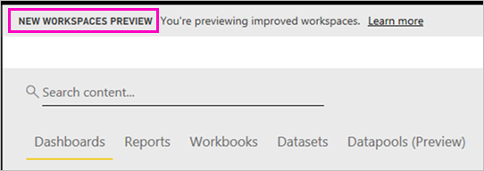
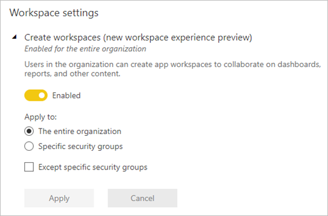

# Organize work in the new workspaces (preview) in Power BI

Workspaces are places to collaborate with colleagues to create collections of dashboards and reports. Then you can bundle those collections into *apps* and distribute them to your whole organization or to specific people or groups. Power BI is introducing a new workspace experience as a preview. 

With the new workspaces preview, you can now:

- Assign workspace roles to user groups: security groups, distribution lists, Office 365 groups, and individuals.
- Create a workspace in Power BI without creating an Office 365 group.
- Use more granular workspaces roles for more flexible permissions management in a workspace.

Read about how to [create one of the new workspaces](service-create-the-new-workspaces.md).
 
When you create one of the new workspaces, you're not creating an underlying, associated Office 365 group. All the workspace administration is in Power BI, not in Office 365. You can still add an Office 365 group to the workspace to continue managing user access to content through Office 365 groups. However, you can additionally use security groups, distribution lists, and add individuals directly within Power BI, giving you a flexible way to manage workspace access. Because workspace administration is now in Power BI, Power BI admins decide who in an organization can create workspaces. In **Workspace settings** in the admin portal, admins can allow everybody or nobody in an organization to create workspaces. They can also limit creation to members of specific security groups.

Read more about the [Power BI admin portal](service-admin-portal.md).

## Roll out new workspaces

During the preview period, old and new workspaces can coexist side by side, and you can create either. When the preview for new workspaces ends and they're generally available, old workspaces can still exist for a time. You won't be able to create them, and you'll need to prepare to migrate your workspaces to the new workspaces infrastructure. Don’t worry, you'll have several months to complete migration.

## Roles in the new workspaces

You add user groups or individuals to the new workspaces as members, contributors, or admins. Everyone in a user group gets the role you’ve defined. If an individual is in several user groups, they get highest level of permission provided by the role.  See [Roles in the new workspaces](#roles-in-the-new-workspaces) later in this article for an explanation of the different roles.

Everyone you add to a workspace needs a Power BI Pro license. In the workspace, these users can all collaborate on dashboards and reports that you plan to publish to a wider audience, or even to your entire organization. If you want to distribute content to others inside your organization, you can assign Power BI Pro licenses to those users or place the workspace in a Power BI Premium capacity.

Roles let you manage who can do what in a workspace, so teams can collaborate. New workspaces allow you to assign roles to individuals, and to user groups: security groups, Office 365 groups, and distribution lists. 

When you assign roles to a user group, the individuals in the group have access to content. If you nest user groups, all the contained users have permission. A user who's in several user groups with different roles gets the highest level of permission granted them. 

The new workspaces offer three roles: admins, members, and contributors.

**Admins can:**

- Update and delete the workspace. 
- Add/remove people, including other admins.
- Do everything members can do.

**Members can:** 

- Add members or others with lower permissions.
- Publish and update an app.
- Share an item or share an app.
- Allow others to reshare items.
- Do everything contributors can do.

**Contributors can:** 

- Create, edit, and delete content in the workspace. 
- Publish reports to the workspace, delete content.
- Can’t give new people access to content. They can’t share new content, but can share with someone with whom the workspace, item, or app is already shared. 
- Can’t modify the members of the group.
 
We’re building Request Access workflows throughout the service so users who don’t have access can request it. Request Access workflows currently exist for dashboards, reports, and apps.

## Convert old workspaces to new workspaces

During the preview period, you can't automatically convert your old workspaces to new ones. You can however create a new workspace and publish your content to the new location. 

When the new workspaces are generally available (GA), you can opt in to migrate the old ones automatically. At some point after GA, you'll have to migrate them.

## How are the new workspaces different from current workspaces?

With the new workspaces, we're redesigning some features. Here are the changes you can expect to be permanent along with the preview. 

* Creating workspaces won't create corresponding entities in Office 365 like current workspaces do. (You can still add an Office 365 group to your workspace by assigning it a role). 
* In current workspaces, you can add only individuals to the members and admin lists. In the new workspaces, you can add multiple AD security groups, distribution lists, or Office 365 groups to these lists to allow for easier user management. 
- You can create an organizational content pack from a current workspace. You can't create one from the new workspaces.
- You can consume an organizational content pack from a current workspace. You can’t consume one from the new workspaces.
- During the preview period, some features aren't enabled yet for new workspaces. See the next section, [Planned new workspace features](service-new-workspaces.md#planned-new-workspace-preview-features), for details.

## Limitations and considerations

Limitations to be aware of:

- Workspaces can contain a maximum of 1,000 datasets, or 1,000 reports per dataset. 
- A person with a Power BI Pro license can be a member of a maximum 250 workspaces.

## Planned new workspace preview features

As we launch the preview, we're still developing some other new workspace preview features, but they aren't available yet:

- No **Leave workspace** button.
- Usage metrics aren't supported yet.
- How Premium works: You can assign and create workspaces in a Premium capacity, but to move a workspace between capacities, go to the workspace’s settings.
- SharePoint web part embedding isn't supported yet.
- No **OneDrive** button for Office 365 groups in Get Data/Files.

## Workspace features that work differently

Some features work differently from current workspaces in the new workspaces. These differences are intentional, based on feedback we’ve received from customers, and will enable a more flexible approach to collaboration with workspaces:

- Members can or can't reshare: replaced by the Contributor role
- Read-only workspaces: Instead of granting users read-only access to a workspace, you'll assign users to a forthcoming Viewer role, which allows similar read-only access to the content in a workspace.

## Known issues

Because this feature is a preview, there are some limitations that you should be aware of. The following issues are known, and fixes are under development:

- Free users or user groups added as recipients of subscriptions to emails may not receive the emails, though they should. The issue occurs when one of the new workspaces is in a Premium capacity, but the My Workspace of the user creating the subscription isn't in a Premium capacity. If the My Workspace is in a Premium capacity, then free users and user groups will receive the emails.
- After a workspace is moved from a Premium capacity to shared capacity, in some cases, free users and user groups will continue to receive emails, though they shouldn't. The issue occurs when the My Workspace of the user creating the subscription is in a Premium capacity.

## Next steps
* [Create the new workspaces (preview) in Power BI](service-create-the-new-workspaces.md)
* [Create the current workspaces](service-create-workspaces.md)
* [Install and use apps in Power BI](service-create-distribute-apps.md)
* Questions? [Try asking the Power BI Community](http://community.powerbi.com/)
