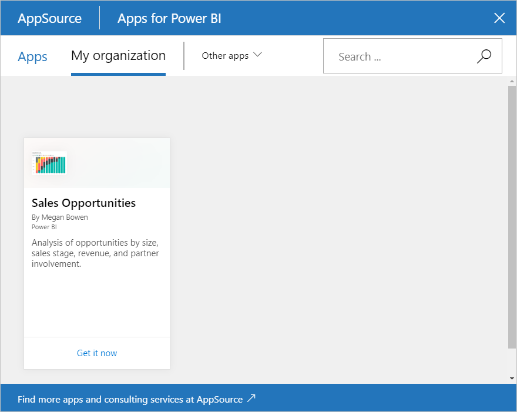

# Create and publish a Power BI organizational content pack (tutorial)
> [!NOTE]
> Have you heard about the new *apps* yet? Apps are the new way to distribute content to large audiences in Power BI. We recommend using apps instead of organizational content packs or read-only workspaces. Learn [more about apps](service-install-use-apps.md).
> 
> 

In this tutorial you create an organizational content pack, give access to a specific group, and publish it to your organization's content pack library on Power BI.

Creating content packs is different from sharing dashboards or collaborating on them in a group. Read [How should I collaborate on and share dashboards and reports?](service-how-to-collaborate-distribute-dashboards-reports.md) to decide on the best option for your situation.

> **Note:** Creating an organizational content pack requires a [Power BI Pro account](https://powerbi.microsoft.com/pricing) for you and your colleagues.
> 
> 

Imagine you're the Release Manager at Contoso and you're getting ready for a new product launch.  You've created a dashboard with reports that you'd like to share with the other employees managing the launch. You want a way to package up the dashboard and reports as a solution for your colleagues to use. 

Want to follow along? In the [Power BI service](https://powerbi.com), go to **Get Data > Samples > Opportunity Analysis Sample** > **Connect** to get your own copy. 

1. In the left navigation pane, select the **Opportunity Analysis Sample** dashboard.
2. From the top navigation bar, select the cog icon  > **Create content pack**.    
   
3. In the **Create Content Pack** window, enter the following information.  
   
   Keep in mind that your organization's content pack library could end up with hundreds of content packs published for the organization or for groups. Take time to give your content pack a meaningful name, to add a good description, and to select the right audience.  Use words that will make your content pack easy to find via search.
   
   a.  Select **Specific Groups** and enter the full email addresses for individuals, [Office 365 groups](https://support.office.com/article/Create-a-group-in-Office-365-7124dc4c-1de9-40d4-b096-e8add19209e9), distribution groups, or security groups. For example:
   
   salesmgrs@contoso.com; sales@contoso.com
   
   For this tutorial, try using your own or your group's email address.
   
   b.  Name the content pack **Sales Opportunities**.
   
   > **Tip:** Consider including the name of the dashboard in the name of the content pack. That way, your colleagues will find the dashboard more easily after they connect to your content pack.
   > 
   > 
   
   c.  Recommended: Add a **description**. This helps coworkers more easily find the content packs that they need. Besides a description, add keywords your coworkers might use to search for this content pack. Include contact information in case your coworkers have a question or need help.
   
   d.  **Upload an image or logo** to make it easier for group members to find the content pack &#151; it's faster to scan for an image than it is to find text. We used an image of the Opportunity Count 100% column chart tile in the screen shot below.
   
   e.  Select the **Opportunity Analysis Sample** dashboard to add it to the content pack.  Power BI automatically adds the associated report and dataset. You can add others, if you want.
   
   > **Note:**  Only the dashboards, reports, datasets, and workbooks that you can edit are listed. Thus, any that were shared with you aren't in the list.
   > 
   > 
   
       
   
   f. If you have Excel workbooks, you see them under Reports, with an Excel icon. You can add them to the content pack, too.
   
     
   
   > **Note**: If members of the group can't view the Excel workbook, you may need to [share the workbook with them in OneDrive for Business](https://support.office.com/en-us/article/Share-documents-or-folders-in-Office-365-1fe37332-0f9a-4719-970e-d2578da4941c).
   > 
   > 
4. Select **Publish** to add the content pack to the group's organizational content pack library.  
   
   You see a success message when it publishes successfully. 
5. When members of your group go to **Get Data > My Organization**, they tap in the search box and type "Sales Opportunities".
   
    
6. They see your content pack.  
    
   
   > **Tip:** The URL displayed in your browser is an unique address for this content pack.  Want to tell your coworkers about this new content pack?  Paste the URL into an email.
   > 
   > 
7. They select **Connect**, and now they can [view and work with your content pack](service-organizational-content-pack-copy-refresh-access.md). 

## See also
* [Intro to organizational content packs](service-organizational-content-pack-introduction.md)  
* [Manage, update, and delete organizational content packs](service-organizational-content-pack-manage-update-delete.md)  
* [Create a group in Power BI](service-create-distribute-apps.md)  
* [What is OneDrive for Business?](https://support.office.com/en-us/article/What-is-OneDrive-for-Business-187f90af-056f-47c0-9656-cc0ddca7fdc2)
* More questions? [Try the Power BI Community](http://community.powerbi.com/)

