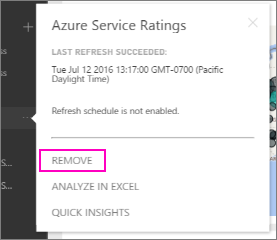

# Remove your connection to a Power BI organizational content pack
A coworker created a content pack. You discovered it in AppSource and added it to your Power BI workspace. Now you don't need it any longer.  How do you remove it?

To remove a content pack, you remove its dataset.  

* In the left navigation pane, select the ellipsis to the right of the dataset and select **Remove \> Yes**.  
  
  

Removing the dataset also removes all associated reports and dashboards. However, removing your connection to the content pack doesn't delete the content pack from your organization's AppSource.  You can always return to AppSource and add the content pack back to your workspace. You can only [delete a content pack from AppSource](service-organizational-content-pack-manage-update-delete.md) if you're the one who created it.

## Next steps
* [Introduction to organizational content packs](service-organizational-content-pack-introduction.md) 
* [Create and distribute an app in Power BI](service-create-distribute-apps.md) 
* [Power BI basic concepts](service-basic-concepts.md)  
* More questions? [Try the Power BI Community](http://community.powerbi.com/)

