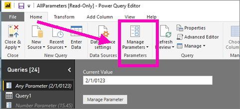
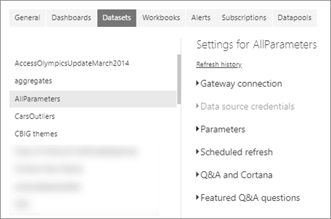

# Edit parameter settings in the Power BI service
Query parameters are added in Power BI Desktop by report creators. Parameters allow them to make parts of reports depend on one or more parameter *value*. For example, a report creator may create a parameter that restricts the data to a single countryregion or a parameter that defines acceptable formats for fields like dates, time, and text.

## Review and edit parameters in Power BI service

Once the parameters are defined in Desktop, when that [report is published to Power BI service](desktop-upload-desktop-files.md), the parameter settings and selections travel with that report. Some parameter settings can be reviewed and edited in Power BI service -- not the parameters that restrict the available data, but the parameters that define and describe acceptable values.

1. In Power BI service, select the cog icon  to open **Settings**.

2. Select the tab for **Datasets** and highlight a dataset in the list. 
    
    

3. Expand **Parameters**.  If the selected dataset has no parameters, you'll see a message with a link to Learn more about query parameters. But if the dataset does have parameters, expanding the **Parameters** heading will reveal those parameters. 

    

    Review the parameter settings and make changes if needed. Greyed out fields are not editable. 

## Next steps
An ad-hoc way to add simple parameters is by [modifying the URL](service-url-filters.md).