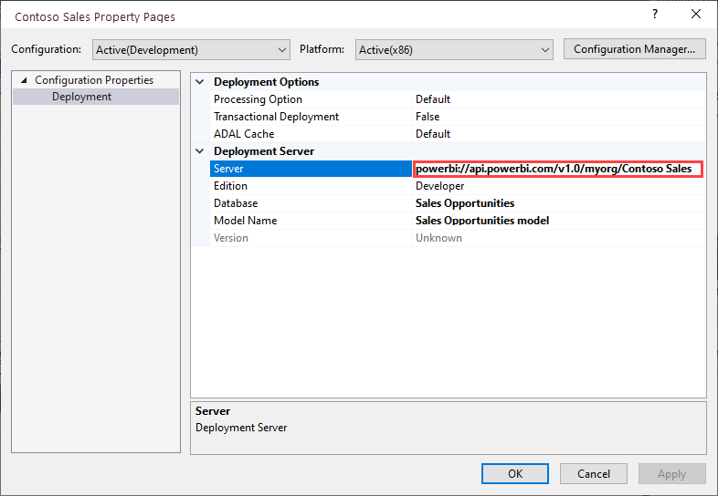
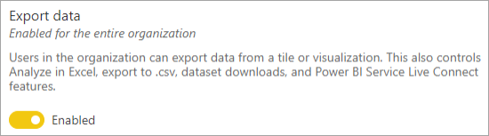

# Dataset connectivity and management with the XMLA endpoint in Power BI Premium (Preview) 

Power BI Premium workspaces support open-platform connectivity from Microsoft and third-party client applications and tools by using an *XMLA endpoint*.

By default, **read-only** connectivity using the endpoint is enabled for the Datasets workload in a capacity. Data visualization applications and tools can be used to query dataset model data, metadata, events, and schema. **Read\write** operations can be enabled for the Datasets workload on a capacity, providing additional dataset management, governance, advanced semantic modeling, debugging, and monitoring. With read\write enabled, Power BI Premium workspaces have parity with Azure Analysis Services and SQL Server Analysis Services enterprise grade tools and processes.

## Dataset modeling and management tools

These are some of the most common tools used with Azure Analysis Services and SQL Server Analysis Services. These same tools are now supported in Power BI Premium workspaces with the XMLA endpoint:

**Visual Studio with Analysis Services projects** – Also known as SQL Server Data Tools, or simply **SSDT**, is an enterprise grade model authoring tool for Analysis Services tabular models. Analysis Services projects extensions are supported on all Visual Studio 2017 and later editions, including the free Community edition. To learn more, see [Tools for Analysis Services](https://docs.microsoft.com/analysis-services/tools-and-applications-used-in-analysis-services).

**SQL Server Management Studio (SSMS)** - Supports DAX, MDX, and XMLA queries. Perform fine-grain refresh operations and scripting of dataset metadata using the [Tabular Model Scripting Language](https://docs.microsoft.com/analysis-services/tmsl/tabular-model-scripting-language-tmsl-reference) (TMSL). Requires version 18.4 or above. Download [here](https://docs.microsoft.com/sql/ssms/download-sql-server-management-studio-ssms).

**SQL Server Profiler** – Installed with SSMS, this tool provides tracing and debugging of dataset events. While officially deprecated for SQL Server, Profiler continues to be included in SSMS and remains supported for Analysis Services and now, Power BI Premium. To learn more, see [SQL Server Profiler for Analysis Services](https://docs.microsoft.com/analysis-services/instances/use-sql-server-profiler-to-monitor-analysis-services).

**Analysis Services Deployment Wizard** – Installed with SSMS, this tool provides deployment of an SSDT tabular model project to a Power BI Premium workspace. It can be run interactively or from the command line for automation. To learn more, see [Analysis Services Deployment Wizard](https://docs.microsoft.com/analysis-services/deployment/deploy-model-solutions-using-the-deployment-wizard).

**PowerShell cmdlets** – Analysis Services cmdlets can be used to automate dataset management tasks, like refresh operations. To learn more, see [Analysis Services PowerShell Reference](https://docs.microsoft.com/analysis-services/powershell/analysis-services-powershell-reference). Version **XXX** of the [SqlServer PowerShell module](https://www.powershellgallery.com/packages/SqlServer/) required.

**Power BI Report Builder** - A tool for authoring paginated reports. Create a report definition that specifies what data to retrieve, where to get it, and how to display it. You can preview your report in Report Builder, and then publish your report to the Power BI service. To learn more, see [Power BI Report Builder](https://docs.microsoft.com/power-bi/report-builder-power-bi).

**Tabular Editor** - An open-source tool for BI professionals to create, maintain, and manage tabular models using an intuitive, lightweight editor. A hierarchical view shows all objects in your tabular model. Objects are organized by display folders with support for multi-select property editing and DAX syntax highlighting. To learn more, see [tabulareditor.github.io](https://tabulareditor.github.io/).

**DAX Studio** – An open-source tool for DAX authoring, diagnosis, performance tuning, and analysis. Features include object browsing, integrated tracing, query execution breakdowns with detailed statistics, DAX syntax highlighting and formatting. To learn more, see [daxstudio.org](https://daxstudio.org/).

**ALM Toolkit** - An open-source schema compare tool for Power BI datasets used for application lifecycle management (ALM) scenarios. Perform deployment across environments and retain incremental refresh historical data. Diff and merge metadata files, branches and repos. Reuse common definitions between datasets. To learn more, see [alm-toolkit.com](http://alm-toolkit.com/).

**Microsoft Excel** – Excel PivotTables are one of the most common tools used to summarize, analyze, explore, and present summary data from Power BI datasets. Click-to-Run version of Office 16.0.11326.10000 or above is required.

**Third party** - Includes client data visualization applications and tools that can connect to, query, and consume datasets in Power BI Premium. Most tools require the latest versions of MSOLAP client libraries, but some may use ADOMD.

## XMLA Protocol

Power BI Premium uses the [XML for Analysis](https://docs.microsoft.com/bi-reference/xmla/xml-for-analysis-xmla-reference) (XMLA) protocol for communications between client applications and the engine that manages your Power BI workspaces and datasets. These communications are through what are commonly referred to as XMLA endpoints. XMLA is the same communication protocol used by the Microsoft Analysis Services engine, which under the hood, runs Power BI's semantic modeling, governance, lifecycle, and data management.

### Client libraries

Client applications don't communicate directly with the XMLA endpoint. Instead, they use *client libraries* as an abstraction layer. These are the same client libraries applications use to connect to Azure Analysis Services and SQL Server Analysis Services. Microsoft client applications like Excel, SQL Server Management Studio (SSMS), and SQL Server Data Tools (SSDT) install all three client libraries and update them along with regular application updates. Developers can also use the client libraries to build custom applications. In some cases, particularly with third-party applications, if not installed with the application, it may be necessary to install newer versions of the client libraries. Client libraries are updated monthly. To learn more, see [Client libraries for connecting to Analysis Services](https://docs.microsoft.com/azure/analysis-services/analysis-services-data-providers).

## Supported write operations

Dataset metadata is exposed through the client libraries based on the Tabular Object Model (TOM) for developers to build custom applications. This enables Visual Studio and open-source community tools like Tabular Editor to provide additional modeling capabilities supported by the Analysis Services engine, but not yet supported in Power BI Desktop. Additional functionality enabled in Power BI Premium also includes:

- [Calculation groups](https://docs.microsoft.com/analysis-services/tabular-models/calculation-groups) for calculation reusability and simplified consumption of complex models.

- [Metadata translations](https://docs.microsoft.com/analysis-services/tabular-models/translations-in-tabular-models-analysis-services) to support multi-language reports and datasets.

- [Perspectives](https://docs.microsoft.com/analysis-services/tabular-models/perspectives-ssas-tabular) to define focused, business-domain specific views of dataset metadata.

Object level security (OLS) is not yet supported in Power BI data models.

## Dataset optimization for write operations

When using the XMLA endpoint for dataset management with write operations, it's recommended you enable the dataset for large models. This reduces the overhead of write operations, which can make them considerably faster. For datasets over 1 GB in size (after compression), the difference can be significant. To learn more, see [Large models in Power BI Premium](service-premium-large-models.md).

## Enable XMLA Read\Write for a capacity

By default, a Premium capacity has the XMLA Endpoint property setting enabled for read-only. This means applications can only query a dataset. For applications to perform a write operation, the XMLA Endpoint property must be enabled for read\write. The XMLA Endpoint property setting for a capacity is configured in the **Datasets workload**. The XMLA Endpoint setting applies to *all workspaces* in the capacity.

### To enable read\write for a capacity

1. In the Admin portal, click **Capacity settings** > **Power BI Premium** > capacity name.
2. Expand **Workloads**, in the **XMLA Endpoint** setting, select **Read Write**.

    

## Connecting to a Premium workspace

Workspaces assigned to a dedicated capacity have a connection string in URL format, `powerbi://api.powerbi.com/v1.0/[tenant name]/[workspace name]`.

Applications connecting to the workspace use the URL as it were an Analysis Services server name. For example, `powerbi://api.powerbi.com/v1.0/contoso.com/Sales Workspace`.

Users with UPNs in the same tenant (not B2B) can replace the tenant name with `myorg`. For example, `powerbi://api.powerbi.com/v1.0/myorg/Sales Workspace`.

### To get the workspace connection string

In the **workspace Settings** > **Premium** > **Workspace Connection**, and then click **Copy**.

## Deploy model projects from Visual Studio (SSDT)

To deploy a tabular model project authored in Visual Studio to a Power BI Premium workspace, you must first set the workspace connection URL in the project Deployment Server properties. After you deploy from Visual Studio, the model will be created as a Power BI dataset in the workspace.

### To set the Deployment Server property

In Visual Studio, in **Solution Explorer**, right-click the project > **Properties**. In the **Server** property, paste the workspace URL connection string.

### Data-source credentials deployment prompt

When deploying to an Azure Analysis Services or SQL Server Analysis Services server, data source credentials are often prompted for as part of the deployment operation. This is not the case when deploying to a Power BI workspace. Instead, credentials are set in the **Dataset Settings** page in the Power BI Service.

The deployment Processing Option property is observed during deployment. This means if a data source has not yet had credentials set in the Power BI service, even if the metadata deployment succeeds, processing operations as part of the deployment can fail.

## Connect with SSMS

Using SSMS to connect to a workspace is just like connecting to an Azure or SQL Server Analysis Services server. The only difference is you specify the workspace URL in server name, and you must use Active Directory - Universal with MFA Support authentication.

### To connect to a workspace by using SSMS

1. In SQL Server Management Studio, click **Connect** > **Connect to Server**.

2. In **Server Type**, select **Analysis Services**. In **Server name**, enter the workspace URL. In **Authentication**, select **Active Directory - Universal with MFA Support**, and then in **User name**, enter your organizational user ID.

    

When connected, the workspace is shown as an Analysis Services server, and datasets in the workspace are shown as databases.  

## Connection requirements

#### Initial catalog

With some tools, such as SQL Server Profiler, you may need to specify an *Initial Catalog*. Specify a dataset (database) in your workspace. In **Connect to Server**, click **Options**. In the **Connect to Server** dialog, on the **Connection Properties** tab, in **Connect to database**, enter the dataset name.

#### Duplicate workspace names

New workspaces in Power BI impose UI validation to disallow creation or renaming workspaces with duplicate names. 

Workspaces that have not been migrated can result in duplicate names. When connecting to a workspace with the same name as another workspace, you may get the following error: 

**Cannot connect to powerbi://api.powerbi.com/v1.0/[tenant name]/[workspace name].** 

To get around this error, in addition to the workspace name, specify the ObjectIDGuid, which can be copied from the workspace objectID in the URL. Append the objectID to the connection URL. For example, 'powerbi://api.powerbi.com/v1.0/myorg/Contoso Sales - 9d83d204-82a9-4b36-98f2-a40099093830'.

#### Duplicate dataset name

When connecting to a dataset with the same name as another dataset in the same workspace, append the dataset guid to the dataset name. You can get both dataset name and guid when connected to the workspace in SSMS.

#### Delay in datasets shown

When connecting to a workspace, changes from new, deleted, and renamed datasets can take up to a few minutes to appear.

#### Unsupported datasets

The following datasets are not accessible by the XMLA endpoint. These datasets will not appear under the workspace in SSMS or in other tools:

- Datasets based on a live connection to an Azure Analysis Services or SQL Server Analysis Services model. 
- Datasets based on a live connection to a Power BI dataset in another workspace. To learn more, see Intro to datasets across workspaces.
- Datasets with Push data by using the REST API.
- Excel workbook datasets.

### Security requirements

In addition to the XMLA Endpoint property being enabled read\write, the tenant-level **Export data** setting in the Power BI Admin Portal, also required for Analyze in Excel, must be enabled.

Access through the XMLA endpoint will honor security group membership set at the workspace/app level.

Workspace contributors and above have write access to the dataset and are therefore equivalent to Analysis Services database admins. They can for example deploy new datasets from SSDT, and execute TMSL scripts in SSMS.

Operations that require Analysis Services server admin permissions (rather than database admin) such as server-level traces and user impersonation using the EffectiveUserName connection-string property are not supported in Power BI at this time.

Other users who have the Build permission on a dataset are equivalent to Analysis Services database readers. They can connect to and browse datasets for data consumption and visualization. Row-level security (RLS) rules are honored and they cannot see internal dataset metadata.

### Model roles

Dataset metadata issued through the XMLA endpoint can create, modify or delete model roles from a dataset, including setting RLS filters. Model roles in Power BI are used only for RLS. Use the Power BI security model to control permissions beyond RLS.

The following limitations apply when working with model roles through the XMLA endpoint:

- In the current version, you cannot set model role membership. Instead, this can be done in the RLS page for a dataset in the Power BI service.
- The only permission on a model role that can be set for Power BI datasets is the Read permission. The Build permission on a dataset is required for read access through the XMLA endpoint, regardless of the existence of model roles. Use the Power BI security model to control permissions beyond RLS. 
- Object-level security (OLS) rules are not currently supported in Power BI.

### Setting data-source credentials

Dataset metadata issued through the XMLA endpoint can create data sources, but cannot set data-source credentials. Instead, credentials can be set in the dataset settings page in the Power BI Service.

### Service principals

During the public preview, you cannot yet connect with the XMLA endpoint using a [service principal](https://docs.microsoft.com/azure/active-directory/develop/app-objects-and-service-principals) for automation scenarios.

## Dataset refreshes

The XMLA endpoint enables a wide range of scenarios for fine-grain refresh capabilities using SSMS, automation with PowerShell and [Azure Automation](https://docs.microsoft.com/azure/automation/automation-intro), [Azure Functions](https://docs.microsoft.com/azure/azure-functions/functions-overview) using TOM, etc. You can, for example, refresh certain [incremental refresh](service-premium-incremental-refresh.md) historical partitions without having to reload all historical data.

Refresh operations through the XMLA endpoint are not limited to [48 refreshes per day](refresh-data#data-refresh), and the [scheduled refresh timeout](refresh-troubleshooting-refresh-scenarios#scheduled-refresh-timeout) is not imposed.

## Dynamic Management Views (DMV)

Analysis Services [DMVs](https://docs.microsoft.com/analysis-services/instances/use-dynamic-management-views-dmvs-to-monitor-analysis-services) provide visibility of dataset metadata, lineage, and resource usage. DMVs available for querying in Power BI through the XMLA endpoint are limited to, at most, those that require database-admin permissions. Some DMVs for example are not accessible because they require Analysis Services server-admin permissions.

## Power BI Desktop authored datasets

### Enhanced metadata

XMLA write operations on datasets authored in Power BI Desktop and published to a Premium workspace depend on enhanced metadata being enabled. To learn more, see [Enhanced dataset metadata](https://go.microsoft.com/fwlink/?linkid=2116856). **NEED LINK**

> [!CAUTION]
> At this time, a write operation on a dataset authored in Power BI Desktop will prevent it from being downloaded back as a PBIX file. Be sure to retain your original PBIX file.

### Data-source declaration

Power BI Desktop declares data sources inline in Power Query M expressions. To learn more, see [Query overview in Power BI Desktop](desktop-query-overview.md). Power Query M inline data-source declaration is not supported by Azure Analysis Services or SQL Server Analysis Services. Instead, traditional authoring tools for Analysis Services like Visual Studio create metadata using structured and provider data sources. To learn more, see [Understanding providers](https://docs.microsoft.com/azure/analysis-services/analysis-services-datasource#understanding-providers). Structured and provider data sources are supported by Power BI Premium through the XMLA endpoint.

### Power BI Desktop in Live connect mode

Power BI Desktop can connect to a Power BI Premium datasets as though they are an Azure Analysis Services or SQL Server Analysis Services model. In this case, Power BI Desktop uses the XMLA endpoint. However, it's recommended Power BI Desktop users instead use the Live connect feature created specifically for Power BI datasets. Using the Live connect provides an improved discover experience showing the endorsement level of datasets, and users don't need to keep track of workspace URLs; they can simply type in the name of the dataset. To learn more, see [Connect to datasets in the Power BI service from Power BI Desktop](desktop-report-lifecycle-datasets.md).

## Audit logs

When client applications and tools connect to a workspace, access through XMLA endpoints is logged in the Power BI audit logs with the following operations. To learn more, see [Auditing Power BI](service-admin-auditing.md).

|Operation friendly name   |Operation name   |
|---------|---------|
|Connected to Power BI dataset from an external application      |  ConnectFromExternalApplication        |
|Requested Power BI dataset refresh from an external application      | RefreshDatasetFromExternalApplication        |
|Created Power BI dataset from an external application      |  CreateDatasetFromExternalApplication        |
|Edited Power BI dataset from an external application     |  EditDatasetFromExternalApplication        |
|Deleted Power BI dataset from an external application      |  DeleteDatasetFromExternalApplication        |

## See also

More questions? [Try asking the Power BI Community](https://community.powerbi.com/)
