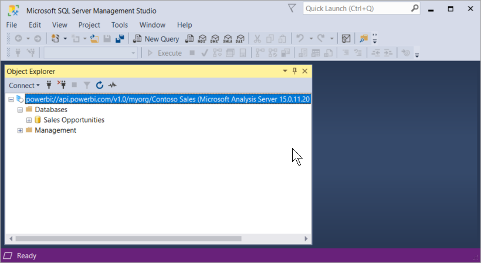

# Client application and tool connectivity (Preview)

Power BI Premium workspaces and datasets support *read-only* connections from Microsoft and third-party tools and client applications. 

> [!NOTE]
> This article is intended only to introduce read-only connectivity to Power BI Premium workspaces and datasets. It *is not* intended to provide in-depth information about programmability, specific tools and applications, architecture, and workspace and dataset management. Subjects described here require a solid understanding of Analysis Services tabular model database architecture, administration. To learn more, be sure to checkout the [See also](#see-also) section later in this article.

## Protocol

Power BI Premium uses the [XML for Analysis](https://docs.microsoft.com/bi-reference/xmla/xml-for-analysis-xmla-reference) (XMLA) protocol for communications between client applications and the engine that manages your workspaces and datasets. These communications are through what are commonly referred to as XMLA endpoints. XMLA is the same communication protocol used by the Microsoft Analysis Services engine, which under the hood, runs Power BI's semantic modeling, governance, lifecycle, and data management. 

The vast majority of client applications and tools do not explicitly communicate with the engine by using XMLA endpoints. Instead, they use client libraries such as MSOLAP, ADOMD, and AMO as an intermediary between the client application and the engine, which communicates exclusively by using XMLA.

## Supported tools

These tools support read-only access to Power BI Premium workspaces and datasets:

**SQL Server Management Studio (SSMS)** - Supports DAX, MDX, XMLA, and TraceEvent queries. Requires version 18.0 (Preview). Download [here](https://docs.microsoft.com/sql/ssms/download-sql-server-management-studio-ssms). 

**SQL Server Profiler** - Included with SSMS 18.0 (Preview), this tool provides tracing and debugging of server events. You can capture and save data about each event to a file or table to analyze later. While officially deprecated for SQL Server, Profiler continues to be included in SSMS and remains supported for Analysis Services and Power BI Premium. To learn more, see [SQL Server Profiler](https://docs.microsoft.com/sql/tools/sql-server-profiler/sql-server-profiler).

**DAX Studio** - Open-source, community tool for executing and analyzing DAX queries against Analysis Services. Requires version 2.8.2 or higher. To learn more, see [daxstudio.org](https://daxstudio.org/).

**Excel PivotTables** - Click-to-Run version of Office 16.0.11326.10000 or above is required.

**Third-party data visualization tools** - Includes client applications and tools that can connect to and consume datasets in Power BI Premium. Most tools require the latest versions of MSOLAP client libraries, but some may use ADOMD.

## Client libraries

Client libraries may be necessary for client applications and tools to connect to Power BI Premium workspaces. The same client libraries used by client applications and tools to connect to Analysis Services are also supported in Power BI Premium. Microsoft client applications like Excel, SQL Server Management Studio (SSMS), and SQL Server Data Tools (SSDT) install all three client libraries and update them along with regular application updates. In some cases, particularly with third-party applications and tools, you may need to install newer versions of the client libraries. Client libraries are updated monthly. To learn more, see [Client libraries for connecting to Analysis Services](https://docs.microsoft.com/azure/analysis-services/analysis-services-data-providers).

## Connecting to a Premium workspace

You can connect to workspaces assigned to Premium dedicated capacities. Workspaces assigned to a dedicated capacity have a connection string in URL format. 

To get the workspace connection string, in Power BI, in **Workspace Settings**, on the **Premium** tab, in **Workspace Connection**, click **Copy**.

Use the following URL format to address a workspace as though it were an Analysis Services server name:   
`powerbi://api.powerbi.com/v1.0/[tenant name]/[workspace name]` 

For example, `powerbi://api.powerbi.com/v1.0/contoso.com/Sales Workspace`
> [!NOTE]
> '[workspace name]` is case sensitive and can include spaces. 

### To connect in SSMS

In **Connect to Server** > **Server Type**, select **Analysis Services**. In **Server name**, enter the URL. In **Authentication**, select **Active Directory - Universal with MFA Support**, and then in **User name**, enter your organization user ID. 

When connected, the workspace is shown as an Analysis Services server, and datasets in the workspace are shown as databases.

Some tools, such as SQL Server Profiler, you may need to specify an *Initial Catalog*. This is a dataset (database) in your workspace. In **Connect to Server**, click **Options**. In the **Connect to Server** dialog, on the **Connection Properties** tab, in **Connect to database**, enter the dataset name.

## Audit logs 

When client applications and tools connect to a workspace, access through XMLA endpoints is logged in the Power BI audit logs under the **GetWorkspaces** operation. To learn more, see [Auditing Power BI](service-admin-auditing.md).

## Known issues

### Duplicate workspace name

When connecting to a workspace with the same name as another workspace, you may get the following error: **Cannot connect to powerbi://api.powerbi.com/v1.0/myorg/Contoso Sales.**

To get around this error, in addition to the workspace name, specify the ObjectIDGuid, which can be copied from the workspace objectID in the URL. Append the objectID to the connection URL. For example, `powerbi://api.powerbi.com/v1.0/myorg/Contoso Sales - 9d83d204-82a9-4b36-98f2-a40099093830'

### Duplicate dataset name

When connecting to a dataset with the same name as another dataset in the same workspace, append the dataset guid to the dataset name. You can get both dataset name *and* guid in SSMS when connected to the workspace. 

### Delay in datasets shown

When connecting to a workspace, changes from new, deleted, and renamed datasets can take up to 5 minutes to appear. 

## See also

[Analysis Services Reference](https://docs.microsoft.com/bi-reference/#pivot=home&panel=home-all)   
[SQL Server Management Studio](https://docs.microsoft.com/sql/ssms/sql-server-management-studio-ssms)   
[SQL Server Analysis Services Tabular Protocol](https://docs.microsoft.com/openspecs/sql_server_protocols/ms-ssas-t/b98ed40e-c27a-4988-ab2d-c9c904fe13cf)   
[Dynamic Management Views (DMVs)](https://docs.microsoft.com/sql/analysis-services/instances/use-dynamic-management-views-dmvs-to-monitor-analysis-services)   

More questions? [Try asking the Power BI Community](https://community.powerbi.com/)
