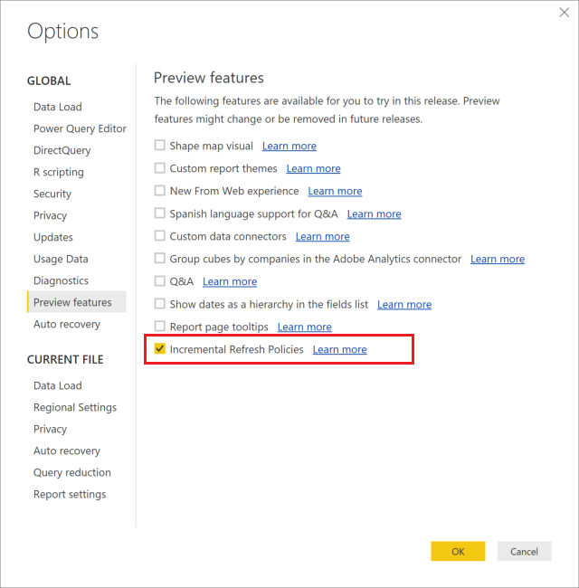
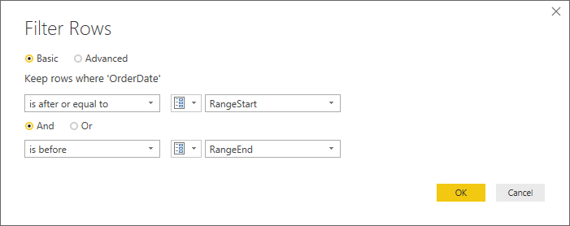
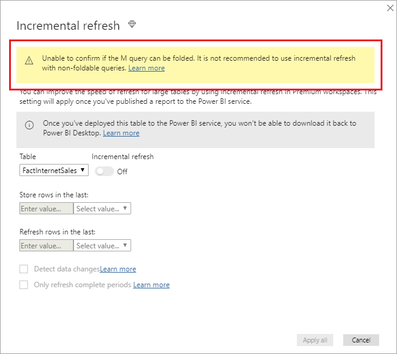
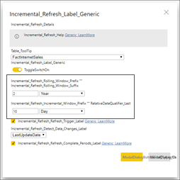
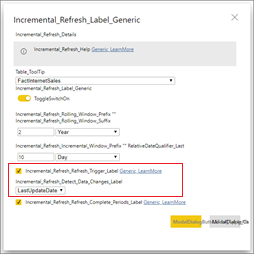
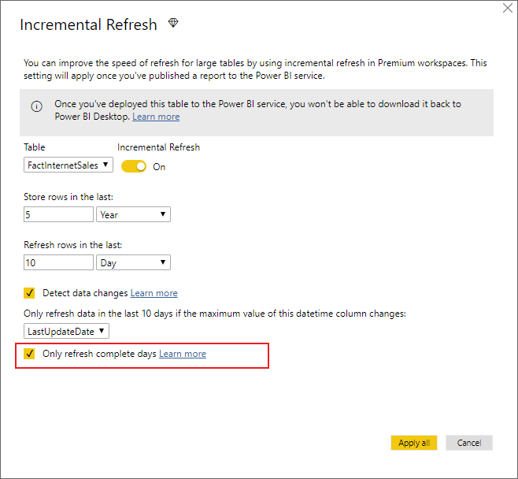
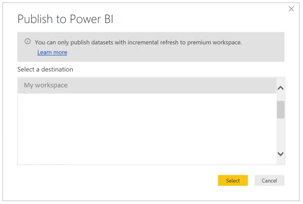

# Incremental refresh in Power BI Premium

Incremental refresh enables very large datasets in the Power BI Premium service with the following benefits:

- **Refreshes are faster** - Only data that has changed needs to be refreshed. For example, refresh only the last five days of a ten-year dataset.

- **Refreshes are more reliable** - It's no longer necessary to maintain long-running connections to volatile source systems.

- **Resource consumption is reduced** - Less data to refresh reduces overall consumption of memory and other resources.

## Configure incremental refresh

Incremental refresh policies are defined in Power BI Desktop and applied when published to the Power BI service.

To start, enable incremental refresh in **Preview features**.



### Filter large datasets in Power BI Desktop

Large datasets with potentially billions of rows may not fit into a Power BI Desktop model because the PBIX file is limited by the memory resources available on the desktop computer. Such datasets are therefore commonly filtered upon import. This type of filtering applies whether using incremental refresh or not. For incremental refresh, you filter by using Power Query date/time parameters.

#### RangeStart and RangeEnd parameters

For incremental refresh, datasets are filtered by using Power Query date/time parameters with the reserved, case-sensitive names **RangeStart** and **RangeEnd**. These parameters are used to filter the data imported into Power BI Desktop, and also to dynamically partition the data into ranges once published to the Power BI service. The parameter values are substituted by the service to filter for each partition. Once published, the parameter values are overridden automatically by the Power BI service. There's no need to set them in dataset settings in the service. Once published, the parameter values are overridden automatically by the Power BI service. 

To define the parameters with default values, in the Power Query Editor, select **Manage Parameters**.


With the parameters defined, you can then apply the filter by selecting the **Custom Filter** menu option for a column.


Ensure rows are filtered where the column value *is after or equal to* **RangeStart** and *before* **RangeEnd**.



> [!TIP]
> While the data type of the parameters must be date/time, it's possible to convert them to match the requirements of the datasource. For example, the following Power Query function converts a date/time value to resemble an integer surrogate key of the form *yyyymmdd*, which is common for data warehouses. The function can be called by the filter step.
>
> `(x as datetime) => Date.Year(x)*10000 + Date.Month(x)*100 + Date.Day(x)`

Select **Close and Apply** from the Power Query Editor. You should have a subset of the dataset in Power BI Desktop.

#### Filter date column updates

The filter on the date column is used to dynamically partition the data into ranges in the Power BI service. Incremental refresh isn't designed to support cases where the filtered date column is updated in the source system. An update is interpreted as an insertion and a deletion, not an actual update. If the deletion occurs in the historical range and not the incremental range, it won’t get picked up. This can cause data refresh failures due to partition-key conflicts.

#### Query folding

It's important the partition filters are pushed to the source system when queries are submitted for refresh operations. To push filtering down means the datasource should support query folding. Most data sources that support SQL queries support query folding. However, data sources like flat files, blobs, web, and OData feeds typically do not. In cases where the filter is not supported by the datasource back-end, it cannot be pushed down. In such cases, the mashup engine compensates and applies the filter locally, which may require retrieving the full dataset from the data source. This can cause incremental refresh to be very slow, and the process can run out of resources either in the Power BI service or in the on-premises data gateway if used.

Given the various levels of query folding support for each datasource, it's recommended that verification is performed to ensure the filter logic is included in the source queries. To make this easier, Power BI Desktop attempts to perform this verification for you. If unable to verify, a warning is displayed in the incremental refresh dialog when defining the incremental refresh policy. SQL based data sources such as SQL, Oracle, and Teradata can rely on this warning. Other data sources may be unable to verify without tracing queries. If Power BI Desktop is unable to confirm, the following warning is displayed.

 

### Define the refresh policy

Incremental refresh is available on the context menu for tables, except for Live Connection models.


#### Incremental refresh dialog

The incremental refresh dialog is displayed. Use the toggle to enable the dialog.


> [!NOTE]
> If the Power Query expression for the table doesn't refer to the parameters with reserved names, the toggle is disabled.

The header text explains the following:

- Incremental refresh is supported only for workspaces on Premium capacities. Refresh policies are defined in Power BI Desktop, and they are applied by refresh operations in the service.

- If you're able to download the PBIX file containing an incremental-refresh policy from the Power BI service, it cannot be opened in Power BI Desktop. While this may be supported in the future, keep in mind these datasets can grow to be so large that they are impractical to download and open on a typical desktop computer.

#### Refresh ranges

The following example defines a refresh policy to store data for five full calendar years plus data for the current year up to the current date, and incrementally refresh ten days of data. The first refresh operation loads historical data. Subsequent refreshes are incremental, and (if scheduled to run daily) perform the following operations:

- Add a new day of data.

- Refresh ten days up to the current date.

- Remove calendar years that are older than five years prior to the current date. For example, if the current date is January 1 2019, the year 2013 is removed.

The first refresh in the Power BI service may take longer to import all five full calendar years. Subsequent refreshes may be finished in a fraction of the time.



> [!NOTE]
> Definition of these ranges might be all you need, in which case you can go straight to the publishing step below. The additional dropdowns are for advanced features.

### Advanced policy options

#### Detect data changes

Incremental refresh of ten days is more efficient than full refresh of five years. However, it's possible to do even better. If you select the **Detect data changes** checkbox, you can select a date/time column used to identify and refresh only the days where the data has changed. This assumes such a column exists in the source system, which is typically for auditing purposes. **This should not be the same column used to partition the data with the RangeStart/RangeEnd parameters.** The maximum value of this column is evaluated for each of the periods in the incremental range. If it has not changed since the last refresh, there is no need to refresh the period. In the example, this could further reduce the days incrementally refreshed from ten to around two.



> [!TIP]
> The current design requires that the column to detect data changes is persisted and cached into memory. You may want to consider one of the following techniques to reduce cardinality and memory consumption.
>
> Persist only the maximum value of this column at time of refresh, perhaps using a Power Query function.
>
> Reduce the precision to a level that is acceptable given your refresh-frequency requirements.
>
> We plan to allow the definition of custom queries for data-change detection at a later date. This could be used to avoid persisting the column value altogether.

#### Only refresh complete periods

Let's say your refresh is scheduled to run at 4:00 AM every morning. If data appears in the source system during those 4 hours, you may not want to account for it. Some business metrics -- such as barrels per day in the oil and gas industry -- make no sense with partial days.

Another example is refreshing data from a financial system where data for the previous month is approved on the 12th calendar day of the month. You could set the incremental range to 1 month and schedule the refresh to run on the 12th day of the month. With this option checked, it would for example refresh January data on February 12th.



> [!NOTE]
> Refresh operations in the service run under UTC time. This can determine the effective date and affect complete periods. We plan to add the ability to override the effective date for a refresh operation.

## Publish to the service

Since incremental refresh is a Premium only feature, the publish dialog only allows selection of a workspace on Premium capacity.



You can now refresh the model. The first refresh may take longer to import the historical data. Subsequent refreshes can be much quicker because they use incremental refresh.

## Query timeouts

The [troubleshooting refresh](https://docs.microsoft.com/power-bi/refresh-troubleshooting-refresh-scenarios) article explains that refresh operations in the Power BI service are subject to timeouts. Queries can also be limited by the default timeout for the data source. Most relational sources allow overriding timeouts in the M expression. For example, the expression below uses the [SQL Server data-access function](https://msdn.microsoft.com/query-bi/m/sql-database) to set it to 2 hours. Each period defined by the policy ranges submits a query observing the command timeout setting.

```
let
    Source = Sql.Database("myserver.database.windows.net", "AdventureWorks", [CommandTimeout=#duration(0, 2, 0, 0)]),
    dbo_Fact = Source{[Schema="dbo",Item="FactInternetSales"]}[Data],
    #"Filtered Rows" = Table.SelectRows(dbo_Fact, each [OrderDate] >= RangeStart and [OrderDate] < RangeEnd)
in
    #"Filtered Rows"
```
