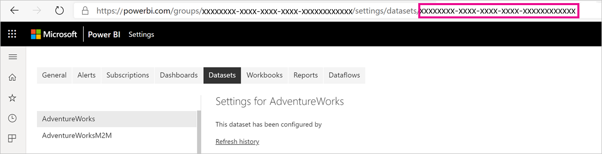
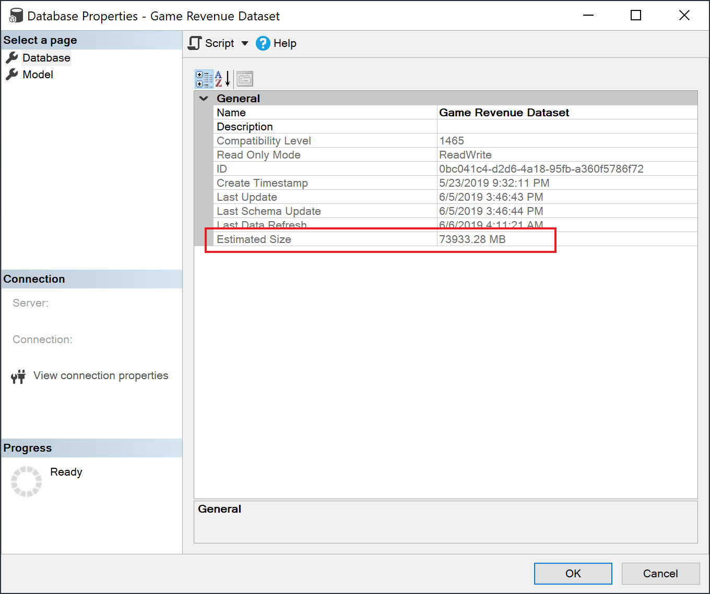

# Large models in Power BI Premium (preview)

Power BI datasets can store data in a highly compressed, in-memory cache for optimized query performance. This enables fast user interactivity over large datasets. The large models feature allows datasets in Power BI Premium to grow beyond 10 GB in size. The size of the dataset is instead limited by the Power BI Premium capacity size. This is similar to how Azure Analysis Services works in terms of model size limitations. For more information on capacity sizes in Power BI Premium, see Capacity nodes. You can set up large models for all Premium P SKUs and Embedded A SKUs; but they work only with the [new workspaces](service-create-the-new-workspaces.md).

Large models do not affect the PBIX upload size, which is still limited to 10 GB. Instead, datasets grow beyond 10 GB in the service on refresh. You can use incremental refresh to configure a dataset to grow beyond 10 GB.

## Enable large models

To create a dataset that grows beyond 10 GB, follow these steps:

1. Create a dataset in Power BI Desktop and configure an [incremental refresh](service-premium-incremental-refresh.md).

1. Publish the dataset to the Power BI Premium service.

1. Enable the dataset for large models by running the PowerShell cmdlets below. These cmdlets cause Power BI to store the dataset on Azure Premium Files and not to enforce the 10 GB limit.

1. Invoke a refresh to load historical data based on the incremental refresh policy. The first refresh could take a while to load the history. Subsequent refreshes should be faster because they are incremental.

### PowerShell cmdlets

In the current version of large models, enable the dataset for Premium Files storage using PowerShell cmdlets. You must have capacity admin and workspace admin privileges to run the PowerShell cmdlets.

1. Find the dataset ID (GUID). On the **Datasets** tab for the workspace, under the dataset settings, you can see the ID in the URL.

    

1. From a PowerShell admin prompt, install the [MicrosoftPowerBIMgmt](/powershell/module/microsoftpowerbimgmt.data/) module.

    ```powershell
    Install-Module -Name MicrosoftPowerBIMgmt
    ```

1. Run the following cmdlets to sign in and check the dataset storage mode.

    ```powershell
    Login-PowerBIServiceAccount

    (Get-PowerBIDataset -Scope Organization -Id <Dataset ID> -Include actualStorage).ActualStorage
    ```

    The response should be the following. The storage mode is ABF (Analysis Services backup file), which is the default.

    ```
    Id                   StorageMode

    --                   -----------

    <Dataset ID>         Abf
    ```

1. Run the following cmdlets to set the storage mode to Premium Files and check it.

    ```powershell
    Set-PowerBIDataset -Id <Dataset ID> -TargetStorageMode PremiumFiles

    (Get-PowerBIDataset -Scope Organization -Id <Dataset ID> -Include actualStorage).ActualStorage
    ```

    The response should be the following. The storage mode is now set to Premium Files.

    ```
    Id                   StorageMode
    
    --                   -----------
    
    <Dataset ID>         PremiumFiles
    ```

You can check the status of dataset conversions to and from Premium Files by using the [Get-PowerBIWorkspaceMigrationStatus](/powershell/module/microsoftpowerbimgmt.workspaces/get-powerbiworkspacemigrationstatus) cmdlet.

## Dataset eviction

Power BI uses dynamic memory management to evict inactive datasets from memory. Power BI evicts datasets so it can load other datasets to address user queries. Dynamic memory management allows the sum of dataset sizes to be significantly greater than the memory available on the capacity, but a single dataset must fit into memory. For more info on dynamic memory management, see [How capacities function](service-premium-what-is.md#how-capacities-function).

You should consider the impact of eviction on large models. Despite relatively fast dataset load times, there could still be a noticeable delay for users if they have to wait for large evicted datasets to be reloaded. For this reason, in its current form, the large models feature is recommended primarily for capacities dedicated to enterprise BI requirements rather than those mixed with self-service BI requirements. Capacities dedicated to enterprise BI requirements are less likely to frequently trigger eviction and need to reload datasets. Capacities for self-service BI on the other hand can have many small datasets that are more frequently loaded in and out of memory.

## Checking dataset size

After loading historical data, you can use [SSMS](https://docs.microsoft.com/sql/ssms/download-sql-server-management-studio-ssms) through the [XMLA endpoint](service-premium-connect-tools.md) to check the estimated dataset size in the model properties window.



You can also check the dataset size by running the following DMV queries from SSMS. Sum the DICTIONARY\_SIZE and USED\_SIZE columns from the output to see the dataset size in bytes.

```sql
SELECT * FROM SYSTEMRESTRICTSCHEMA
($System.DISCOVER_STORAGE_TABLE_COLUMNS,
 [DATABASE_NAME] = '<Dataset Name>') //Sum DICTIONARY_SIZE (bytes)

SELECT * FROM SYSTEMRESTRICTSCHEMA
($System.DISCOVER_STORAGE_TABLE_COLUMN_SEGMENTS,
 [DATABASE_NAME] = '<Dataset Name>') //Sum USED_SIZE (bytes)
```

## Current feature restrictions

Keep in mind the following restrictions when using large models:

- **Bring your own key BYOK encryption** : Datasets enabled for Premium Files are not encrypted by [BYOK](service-encryption-byok.md).
- **Multi-geo support** : Datasets enabled for Premium Files will fail on capacities where [multi-geo](service-admin-premium-multi-geo.md) is also enabled.

- **Download to Power BI Desktop** : If a dataset is stored on Premium Files, [downloading as a .pbix](service-export-to-pbix.md) file will fail.
- **Supported regions** : Large models are supported by the following regions.
  - Australia East
  - Australia Southeast
  - Central US
  - East Asia
  - East US
  - East US 2
  - Japan East
  - Japan West
  - Korea Central
  - Korea South
  - North Central US
  - North Europe
  - South Central US
  - Southeast Asia
  - UK South
  - UK West
  - West Europe
  - West US
  - West US 2