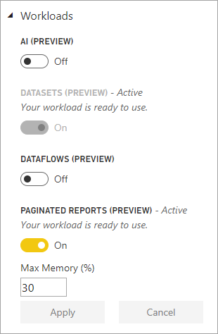
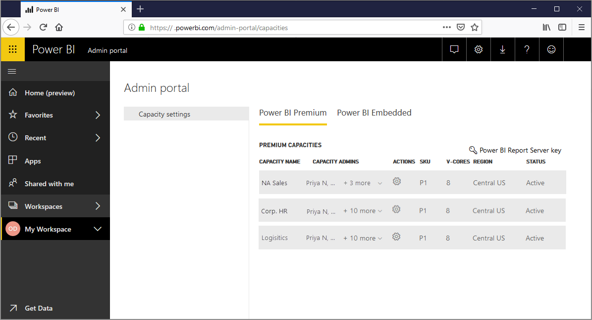
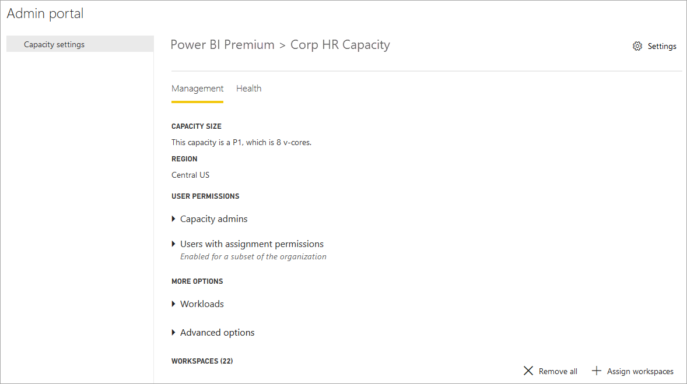
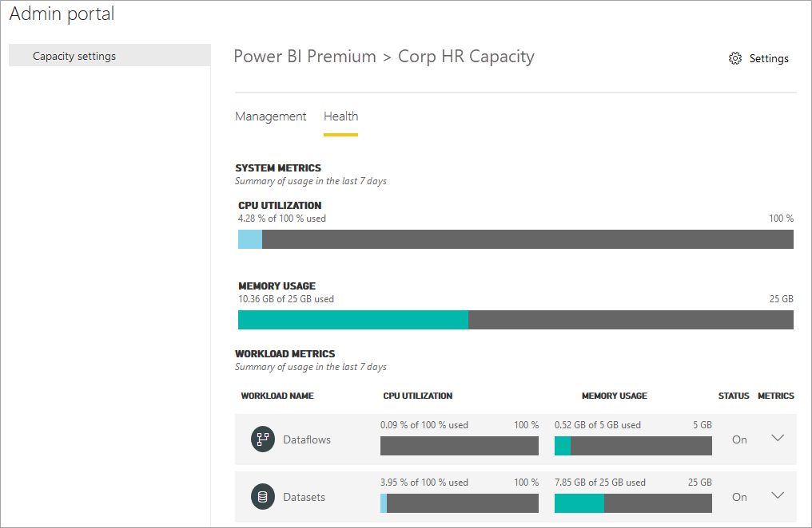
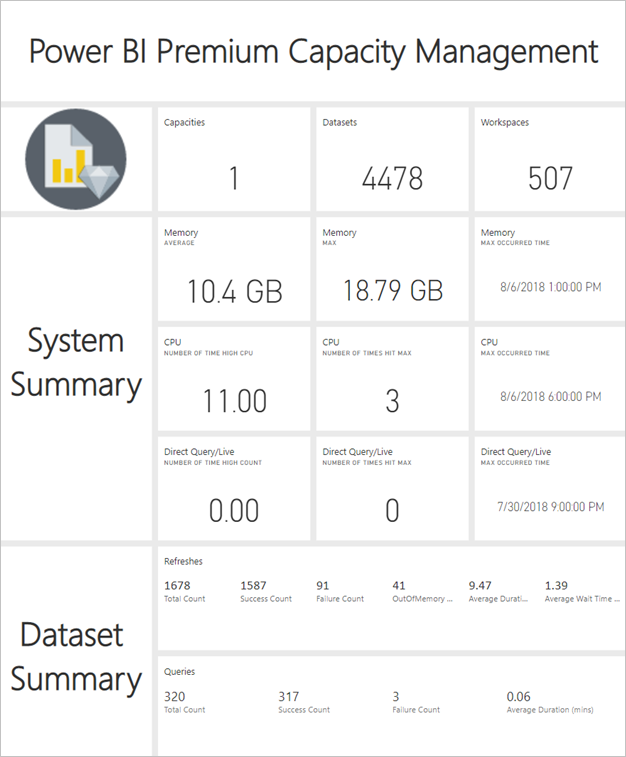
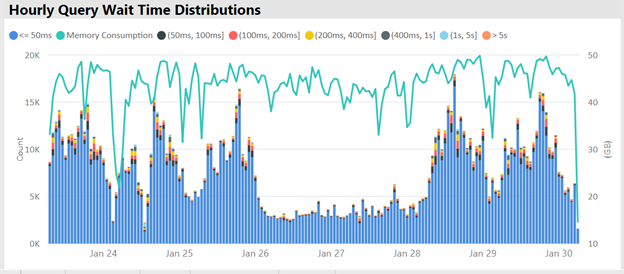
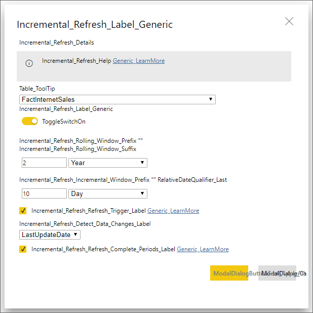
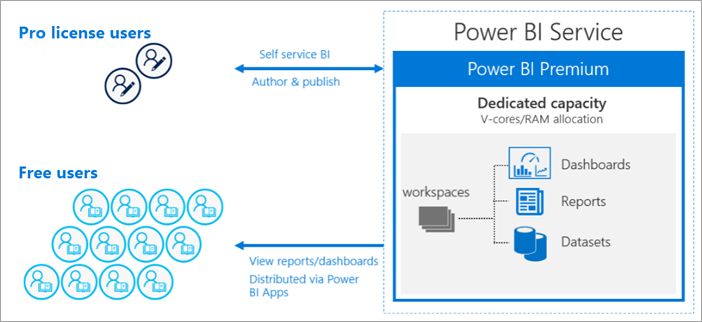
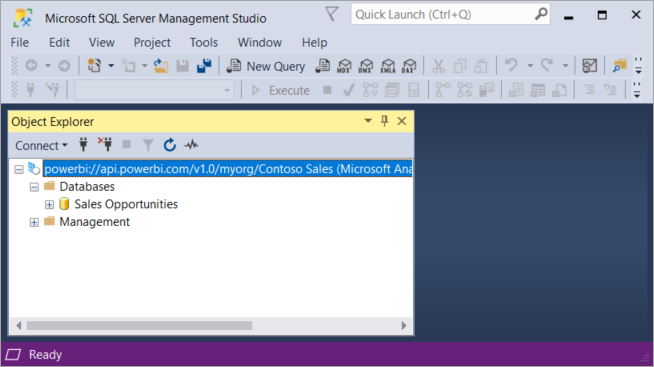

# What is Power BI Premium?

Power BI Premium provides dedicated and enhanced resources to run the Power BI service for your organization. For example:

- Greater scale and performance
- Flexibility to license by capacity
- Unify self-service and enterprise BI
- Extend on-premises BI with Power BI Report Server
- Support for data residency by region (Multi-Geo)
- Share data with anyone without purchasing a per-user license

This article is not meant to provide in-depth details about every feature of Power BI Premium - in fact, it just touches the surface. Where necessary, links to additional articles with more detailed information are provided.

## Subscriptions and licensing

Power BI Premium is a tenant-level Office 365 subscription available in two SKU (Stock-Keeping Unit) families:

- **EM** SKUs (EM1-EM3) for embedding, requiring a yearly commitment, billed monthly.
- **P** SKUs (P1-P3) for embedding and enterprise features, requiring a monthly or yearly commitment, billed monthly, and includes a license to install Power BI Report Server on-premises.

An alternative approach is to purchase an **Azure Power BI Embedded** subscription, which has a single **A** (A1-A6) SKU family for embedding and capacity testing purposes only. All SKUs deliver v-cores to create capacities, but the EM SKUs are restricted for smaller scale embedding. EM1, EM2, A1 and A2 SKUs with less than four v-cores do not run on dedicated infrastructure.

While the focus of this article is on the P SKUs, much of what is described is also relevant to the A SKUs. In contrast to the Premium subscription SKUs, Azure SKUs require no time commitment and are billed hourly. They deliver full elasticity enabling scale up, scale down, pause, resume and delete. 

Azure Power BI Embedded is largely out of scope for this article, but it is described in the [Testing Approaches](service-premium-capacity-optimize.md#testing-approaches) section of the Optimizing Premium capacities article as a practical and economic option to test and measure workloads. To learn more about Azure SKUs, see [Azure Power BI Embedded Documentation](https://azure.microsoft.com/services/power-bi-embedded/).

### Purchasing

Power BI Premium subscriptions are purchased by administrators in the Microsoft 365 admin center. Specifically, only Office 365 Global administrators or Billing Administrators can purchase SKUs. When purchased, the tenant receives a corresponding number of v-cores to assign to capacities, known as *v-core pooling*. For example, purchasing a P3 SKU provides the tenant with 32 v-cores. To learn more, see [How to purchase Power BI Premium](service-admin-premium-purchase.md).

## Dedicated capacities

With Power BI Premium, you get *dedicated capacities*. In contrast to a shared capacity where workloads run on computational resources shared with other customers, a dedicated capacity is for exclusive use by an organization. It's isolated with dedicated computational resources which provide dependable and consistent performance for hosted content. 

Workspaces reside within capacities. Each Power BI user has a personal workspace known as **My Workspace**. Additional workspaces can be created to enable collaboration and deployment, and these are known as **App Workspaces**. By default workspaces, including personal workspaces, are created in the shared capacity. When you have Premium capacities, both My Workspaces and App workspaces can be assigned to Premium capacities.

### Capacity nodes

As described in the [Subscriptions and Licensing](#subscriptions-and-licensing) section, there are two Power BI Premium SKU families: **EM** and **P**. All Power BI Premium SKUs are available as capacity *nodes*, each representing a set amount of resources consisting of processor, memory, and storage. In addition to resources, each SKU has operational limits on the number of DirectQuery and Live Connection connections per second, and the number of parallel model refreshes.

Processing is achieved by a set number of v-cores, divided equally between backend and frontend.

**Backend v-cores** are responsible for core Power BI functionality, including query processing, cache management, running R services, model refresh, natural language processing (Q&A), and server-side rendering of reports and images. Backend v-cores are assigned a fixed amount of memory which is primarily used to host models, also known as active datasets.

**Frontend v-cores** are responsible for the web service, dashboard and report document management, access rights management, scheduling, APIs, uploads and downloads, and generally for everything related to the user experiences.

Storage is set to **100 TB per capacity node**.

The resources and limits of each Premium SKU (and equivalently sized A SKU) are described in the following table:

| Capacity Nodes | Total v-cores | Backend v-cores | RAM (GB) | Frontend v-cores | DirectQuery/Live Connection (per sec) | Model Refresh Parallelism |
| --- | --- | --- | --- | --- | --- | --- |
| EM1/A1 | 1 | 0.5 | 2.5 | 0.5 | 3.75 | 1 |
| EM2/A2 | 2 | 1 | 5 | 1 | 7.5 | 2 |
| EM3/A3 | 4 | 2 | 10 | 2 | 15 | 3 |
| P1/A4 | 8 | 4 | 25 | 4 | 30 | 6 |
| P2/A5 | 16 | 8 | 50 | 8 | 60 | 12 |
| P3/A6 | 32 | 16 | 100 | 16 | 120 | 24 |
| | | | | | | |

### Capacity workloads

Capacity workloads are services made available to users. By default, Premium and Azure capacities support only a dataset workload associated with running Power BI queries. The dataset workload cannot be disabled. Additional workloads can be enabled for [AI (Cognitive Services)](https://powerbi.microsoft.com/blog/easy-access-to-ai-in-power-bi-preview/), [Dataflows](service-dataflows-overview.md#dataflow-capabilities-on-power-bi-premium), and [Paginated reports](paginated-reports-save-to-power-bi-service.md). These workloads are supported in Premium subscriptions only. 

Each additional workload allows configuring the maximum memory (as a percentage of total available memory) that can be used by the workload. Default values for maximum memory are determined by SKU. You can maximize your capacity's available resources by enabling only those additional workloads when they're used. And you can change memory settings only when you have determined default settings are not meeting your capacity resource requirements. Workloads can be enabled and configured for a capacity by capacity admins by using **Capacity settings** in the [Admin portal](service-admin-portal.md) or by using the [Capacities REST APIs](https://docs.microsoft.com/rest/api/power-bi/capacities).  

To learn more, see [Configure workloads in a Premium capacity](service-admin-premium-workloads.md). 

### How capacities function

At all times, the Power BI service makes the best use of capacity resources while not exceeding limits imposed on the capacity.

Capacity operations are classified as either *interactive* or *background*. Interactive operations include rendering requests and responding to user interactions (filtering, Q&A querying, etc.). Generally, import model querying is memory resource-intensive, while querying DirectQuery and Live Connection models is CPU-intensive. Background operations include dataflow and import model refreshes, and dashboard query caching.

It's important to understand that interactive operations are always prioritized over background operations to ensure the best possible user experience. If there are insufficient resources, background operations are added to a queue for processing when resources free up. Background operations, like dataset refreshes, can be stopped mid-process by the Power BI service and added to a queue.

Import models must be fully loaded into memory so they can be queried or refreshed. The Power BI service manages memory usage by using sophisticated algorithms to ensure maximum use of available memory, and can cause over-committing the capacity: While it's possible for a capacity to store many import models (up to 100 TB per Premium capacity), when their combined disk storage exceeds the supported memory (and additional memory is required for querying and refresh), then they cannot all be loaded into memory at the same time.

Import models are therefore loaded into and removed from memory according to usage. An import model is loaded when it is queried (interactive operation) and not yet in memory, or when it's to be refreshed (background operation).

The removal of a model from memory is known as *eviction*. It's an operation Power BI can perform quickly depending on the size of the models. If the capacity is not experiencing any memory pressure, models are simply loaded into memory and remain there. However, when insufficient memory is available to load a model, the Power BI service will first need to free-up memory. It frees memory by detecting models that have become inactive by seeking models which have not been used in the last three minutes \[[1](#endnote-1)\], and then evicting them. If there are no inactive models to evict, the Power BI service seeks to evict models loaded for background operations. A last resort, after 30 seconds of failed attempts \[[1](#endnote-1)\], is to fail the interactive operation. In this case, the report user is notified of failure with a suggestion to try again shortly. In some cases, models may be unloaded from memory due to service operations.

It's important to stress that dataset eviction is a normal and expected behavior. It strives to maximize memory usage by loading and unloading models whose combined sizes can exceed available memory. This is by design, and completely transparent to report users. High eviction rates do not necessarily mean the capacity is insufficiently resourced. They can, however, become a concern if query or refresh responsiveness is suffering because of high eviction rates.

Refreshes of import models are always memory intensive as models must be loaded into memory. Additional memory is required for processing. A full refresh can use approximately double the amount of memory required by the model. This ensures the model can be queried even when being processed, because queries are sent to the existing model, until the refresh has completed and the new model data is available. Incremental refresh will require less memory and could complete faster, and so can substantially reduce pressure on capacity resources. Refreshes can also be CPU-intensive for models, especially those with complex Power Query transformations, or calculated tables/columns that are complex or are based on large tables.

Refreshes, like queries, require the model be loaded into memory. If there is insufficient memory, the Power BI service will attempt to evict inactive models, and if this is not possible (as all models are active), the refresh job is queued. Refreshes are typically CPU-intensive, even more so than queries. For this reason, there are capacity limits on the number of concurrent refreshes, set to 1.5 x the number of backend v-cores, rounded up. If there are too many concurrent refreshes, a scheduled refresh will be queued. When these situations occur, it takes longer for the refresh to complete. On-demand refreshes such as those triggered by a user request or an API call will retry three times \[[1](#endnote-1)\]. If there still aren't enough resources, the refresh will then fail.

Table notes:   
\[1\] Subject to change.

### Regional support

When creating a new capacity, Office 365 Global administrators and Power BI service administrators can specify a region where workspaces assigned to the capacity will reside. This is known as Multi-Geo. With Multi-Geo, organizations can meet data residency requirements by deploying content to datacenters in a specific region, even if it's different than the region in which the Office 365 Subscription resides. To learn more, see [Multi-Geo support for Power BI Premium](service-admin-premium-multi-geo.md).

### Capacity management

Managing Premium capacities involves creating or deleting capacities, assigning admins, assigning workspaces, configuring workloads, monitoring, and making adjustments to optimize capacity performance. 

Office 365 Global administrators and Power BI service administrators can create Premium capacities from available v-cores, or modify existing Premium capacities. When a capacity is created, capacity size and geographic region are specified, and at least one capacity admin is assigned. 

When capacities are created, most administrative tasks are completed in the [Admin portal](service-admin-portal.md).

Capacity admins can assign workspaces to the capacity, manage user permissions, and assign other admins. Capacity admins can also configure workloads, adjusting memory allocations, and if necessary, restart a capacity, resetting operations in case of a capacity overload.

Capacity admins can also make sure a capacity is running smoothly. They can monitor capacity health right in the Admin portal or by using the Premium capacity metrics app.

To learn more about creating capacities, assigning admins, and assigning workspaces, see [Managing Premium capacities](service-premium-capacity-manage.md). To learn more about roles, see [Administrator roles related to Power BI](service-admin-administering-power-bi-in-your-organization.md#administrator-roles-related-to-power-bi).

### Monitoring

Monitoring Premium capacities provides administrators with an understanding of how capacities are performing. Capacities can be monitored by using the Admin portal and the [Power BI Premium Capacity Metrics app](https://app.powerbi.com/groups/me/getapps/services/capacitymetrics).

Monitoring in the portal provides a quick view with high-level metrics indicating loads placed and the resources utilized by your capacity, averaged, over the past seven days. 

The **Power BI Premium Capacity Metrics** app, however, provides the most in-depth information into how your capacities are performing. The app provides a high-level dashboard.

From the app's dashboard you can click a metric cell to open an in-depth report. Reports provide in-depth metrics and filtering capability to drill-down on the most important information you need to keep your capacities running smoothly.

To learn more about monitoring capacities, see [Monitoring in the Power BI Admin portal](service-admin-premium-monitor-portal.md) and [Monitoring with the Power BI Premium Capacity Metrics app](service-admin-premium-monitor-capacity.md).

### Optimizing capacities

Making the best use of your capacities is critical to assuring users get the performance and you're getting the most value for your Premium investment. By monitoring key metrics, administrators can determine how best to troubleshoot bottlenecks and take necessary action. To learn more, see [Optimizing Premium capacities](service-premium-capacity-optimize.md) and [Premium capacity scenarios](service-premium-capacity-scenarios.md).

### Capacities REST APIs

The Power BI REST APIs include a collection of [Capacities APIs](https://docs.microsoft.com/rest/api/power-bi/capacities). With the APIs, admins can programmatically manage many aspects of your Premium capacities, including enabling and disabling workloads, assigning workspaces to a capacity, and more.

## Large datasets

Depending on the SKU, Power BI Premium supports uploading Power BI Desktop (.pbix) model files up to a maximum of **10 GB** in size. When loaded, the model can then be published to a workspace assigned to a Premium capacity. The dataset can then be refreshed to up to **12 GB** in size.

### Size considerations

Large models can be resource-intensive. You should have at least a P1 SKU for any models larger than 1 GB. Although publishing large models to workspaces backed by A SKUs up to A3 could work, refreshing them will not.

The following table describes recommended SKUs for various .pbix sizes:

   |SKU  |Size of .pbix   |
   |---------|---------|
   |P1    | < 3 GB        |
   |P2    | < 6 GB        |
   |P3, P4, P5    | up to 10 GB   |

The Power BI Embedded A4 SKU is equal to the P1 SKU, A5 = P2 and A6 = P3. Note that publishing large models to A and EM SKUs might return errors that aren't specific to the model size limitation error in the shared capacity. Refresh errors for large models in A and EM SKUs are likely to point to timeouts. 

Your .pbix files represent data in a *highly compressed state*. The data will likely expand several times when loaded in memory, and from there it may expand several more times during data refresh.

Scheduled refresh of large datasets can take a long time and be resource-intensive. It's important to not schedule too many overlapping refreshes. It's  recommended [incremental refresh](service-premium-incremental-refresh.md) is configured, because it's faster, more reliable, and consumes fewer resources.

The initial report load of large datasets can take a long time if it has been a while since the last time the dataset was used. A loading bar for longer-loading reports displays the load progress.

While the per-query memory and time constraints are much higher in Premium capacity, it's recommended you use filters and slicers to limit visuals to display only what is necessary.

## Incremental refresh

Incremental refresh provides an integral part of having and maintaining large datasets in Power BI Premium. Incremental refresh has many benefits, for example, Refreshes are faster because only data that has changed needs to be refreshed. Refreshes are more reliable because it's unnecessary to maintain long-running connections to volatile data sources. Resource consumption is reduced because less data to refresh reduces overall consumption of memory and other resources. Incremental refresh policies are defined in **Power BI Desktop**, and applied when published to the Power BI service. 

To learn more, see [Incremental refresh in Power BI Premium](service-premium-incremental-refresh.md).

## Paginated reports

Paginated reports, supported on P1-P3 and A4_A6 SKUs, are based on Report Definition Language (RDL) technology in SQL Server Reporting Services. While based on RDL technology, it's not the same as Power BI Report Server, which is a downloadable reporting platform you can install on-premises, also included with Power BI Premium. Paginated reports are formatted to fit well on a page that can be printed or shared. Data is displayed in a table, even if the table spans multiple pages. By using the free [**Power BI Report Builder**](https://go.microsoft.com/fwlink/?linkid=2086513) Windows Desktop application, users author paginated reports and publish them to the service.

In Power BI Premium, Paginated reports are a workload that must be enabled for a capacity by using the Admin portal. Capacity admins can enable and then specify the amount of memory as a percentage of the capacity's overall memory resources. Unlike other types of workloads, Premium runs paginated reports in a contained space within the capacity. The maximum memory specified for this space is used whether or not the workload is active. The default is 20%. 

To learn more, see [Paginated reports in Power BI Premium](paginated-reports-report-builder-power-bi.md). To learn more about enabling the Paginated reports workload, see [Configure workloads](service-admin-premium-workloads.md).

## Power BI Report Server
 
Included with with Power BI Premium, Power BI Report Server is an *on-premises* report server with a web portal. You can build your BI environment on-premises and distribute reports behind your organization’s firewall. Report Server gives users access to rich, interactive, and enterprise reporting capabilities of SQL Server Reporting Services. Users can explore visual data and quickly discover patterns to make better, faster decisions. Report Server provides governance on your own terms. If and when the time comes, Power BI Report Server makes it easy to migrate to the cloud, where your organization can take full advantage of all Power BI Premium functionality.

To learn more, see [Power BI Report Server](report-server/get-started.md).

## Unlimited content sharing

With Premium, anyone, whether they’re inside or outside your organization can view your Power BI content including paginated and interactive reports without purchasing individual licenses. 

Premium enables widespread distribution of content by Pro users without requiring Pro licenses for recipients who view the content. Pro licenses are required for content creators. Creators connect to data sources, model data, and create reports and dashboards that are packaged as workspace apps. 

To learn more, see [Power BI licensing](service-admin-licensing-organization.md).

## Microsoft and third-party tool connectivity (Preview)

Under the hood, the enterprise proven Microsoft Analysis Services Vertipaq engine powers Power BI datasets. Analysis Services provides  programmability, client application, and tool support through client libraries and APIs that support the open-standard XMLA protocol. Currently, Power BI Premium datasets support *read-only* operations from Microsoft and third-party client applications and tools through XMLA endpoints.  

Microsoft tools like SQL Server Management Studio and SQL Server Profiler, and third-party apps such as DAX Studio and data visualization applications, can connect to and query Premium datasets by using XMLA, DAX, MDX, DMVs, and Trace events.

To learn more, see [Connect to datasets with client applications and tools](service-premium-connect-tools.md).

## Acknowledgements

Peter Myers, Data Platform MVP and independent BI expert with [Bitwise Solutions](https://www.bitwisesolutions.com.au/), and the Microsoft Power BI Customer Advisory Team (CAT) are major contributors to this article.

## Next steps

> [!div class="nextstepaction"]
> [Managing Premium capacities](service-premium-capacity-manage.md)

More questions? [Try asking the Power BI Community](https://community.powerbi.com/)

||||||
