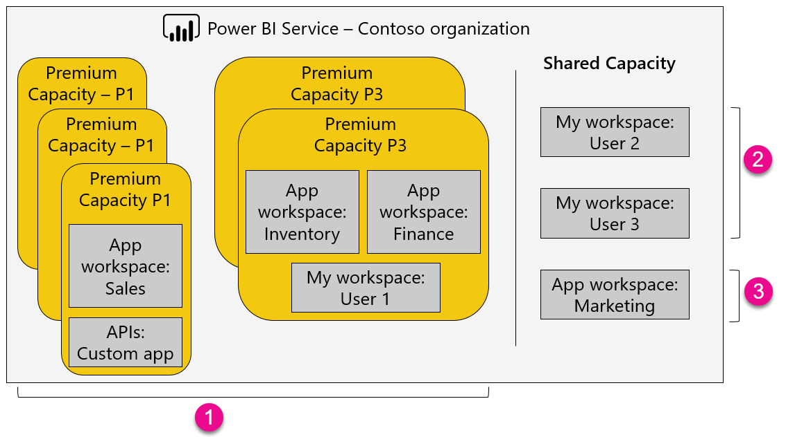

# What is Microsoft Power BI Premium?

Microsoft Power BI Premium provides resources dedicated to running the Power BI service for your organization. It gives you more dependable performance and enables larger data volumes. Premium also enables widespread distribution of content without requiring you to purchase per-user Pro licenses for content consumers. For purchasing information, see [How to purchase Power BI Premium](service-admin-premium-purchase.md).

<iframe width="560" height="315" src="https://www.youtube.com/embed/lNQDkN0GXzU?rel=0&amp;showinfo=0" frameborder="0" allowfullscreen></iframe>

## Premium capacity and shared capacity

You take advantage of Power BI Premium by assigning workspaces to a *Premium capacity*. Premium capacity is a dedicated resource for your organization. Workspaces not assigned to a premium capacity are in a *shared capacity*. With shared capacity, your workloads run on computational resources shared by other customers.

The following image shows the relationship between Premium capacity and shared capacity, using the Contoso organization as an example.

| Area | Description |
| --- | --- |
| **(1)** Items within a Premium capacity | <ul><li>Accessing app workspaces (as members or admins) and publishing apps requires a Power BI Pro license.<li>Sharing an app requires a Pro license, but consuming an app doesn't.<li>All dashboard recipients, regardless of the license they're assigned, can set data alerts.<li>REST APIs for embedding use a service account with a Pro license, rather than a user account.</ul> |
| **(2)** My workspace in shared capacity | <ul><li>Sharing and consuming an app both require a Pro license.</ul> |
| **(3)** App workspaces in shared capacity | <ul><li>Any app usage requires a Pro license.</ul>|
| | |

In shared capacity, Power BI puts more limits on individual users to ensure quality of experience for all users. By default, your workspace is in a shared capacity, including your personal *My workspace* and App workspaces.

The following table provides a summary of the differences between shared capacity and Premium capacity.

|  | Shared capacity | Power BI Premium capacity |
| --- | --- | --- |
| **Refresh rate** |8/day |48/day |
| **Isolation with dedicated hardware** | | |
| **Enterprise Distribution to** _**all users**_ | | |
| Apps and sharing | |1 |
| Embedded API and controls | |2 |
| **Publish Power BI reports on-premises** | | |
| | | |

*1 For more information, see [Features by license type](service-features-license-type.md).*  
*2 Future enhancements coming to Power BI Premium.*

To learn more about assigning workspaces to a premium capacity, see [Manage Power BI Premium](service-admin-premium-manage.md).

<a name="premiumskus"/>

### Premium capacity nodes

Power BI Premium is available in node configurations with different v-core capacities. For more information about specific SKU offerings and costs, see [Power BI pricing](https://powerbi.microsoft.com/pricing/). A [cost calculator](https://powerbi.microsoft.com/calculator/) is also available. For information regarding embedded analytics capacity planning, see [Planning a Power BI Enterprise Deployment whitepaper](https://aka.ms/pbienterprisedeploy). To summarize:

* P nodes can be used for embedded or service deployments.

* EM nodes can be used for embedded deployments only. EM nodes do not have access to premium capabilities, such as sharing apps to users that don't have a Power BI Pro license.

>[!NOTE]
>Links in this table only work properly for users who are in the Office 365 Global Administrator role. Others receive a 404 error.

| Capacity Node | Total v-cores *(Backend + frontend)* | Backend V-Cores | Frontend V-Cores | DirectQuery/live connection limits | Max page renders at peak hour | Availability |
| --- | --- | --- | --- | --- | --- | --- |
| [EM1 (month to month)](https://portal.office.com/SubscriptionDetails?OfferId=4004702D-749C-4F74-BF47-3048F1833780&adminportal=1) |1 v-core |0.5 v-cores, 2.5-GB RAM |0.5 v-cores |3.75 per second |150-300 |Available |
| [EM2 (month to month)](https://portal.office.com/SubscriptionDetails?OfferId=4004702D-749C-4F74-BF47-3048F1833780&adminportal=1) |2 v-cores |1 v-core, 5-GB RAM |1 v-core |7.5 per second |301-600 |Available |
| [EM3 (month to month)](https://portal.office.com/SubscriptionDetails?OfferId=4004702D-749C-4F74-BF47-3048F1833780&adminportal=1) |4 v-cores |2 v-cores, 10-GB RAM |2 v-cores | |601-1,200 |Available |
| [P1](https://portal.office.com/SubscriptionDetails?OfferId=b3ec5615-cc11-48de-967d-8d79f7cb0af1&adminportal=1) |8 v-cores |4 v-cores, 25-GB RAM |4 v-cores |30 per second |1,201-2,400 |Available ([month to month](https://portal.office.com/SubscriptionDetails?OfferId=E4C8EDD3-74A1-4D42-A738-C647972FBE81&adminportal=1) is also available) |
| [P2](https://portal.office.com/SubscriptionDetails?OfferId=062F2AA7-B4BC-4B0E-980F-2072102D8605&adminportal=1) |16 v-cores |8 v-cores, 50-GB RAM |8 v-cores |60 per second |2,401-4,800 |Available |
| [P3](https://portal.office.com/SubscriptionDetails?OfferId=40c7d673-375c-42a1-84ca-f993a524fed0&adminportal=1) |32 v-cores |16 v-cores, 100-GB RAM |16 v-cores |120 per second |4,801-9600 |Available |
| | | | | | | |

* The frontend v-cores are responsible for the web service, dashboard and report document management, access rights management, scheduling, APIs, uploads and downloads, and generally for everything that relates to the user experience.

* The backend v-cores are responsible for the heavy lifting: query processing, cache management, running R servers, data refresh, natural language processing, real-time feeds, and server-side rendering of reports and images. With the backend v-cores, a certain amount of memory is reserved as well. Having sufficient memory becomes especially important when dealing with large data models or with a large number of active datasets.

## Power BI Report Server

Power BI Premium also includes the capability to run Power BI Report Server on-premises in your organization. To learn more, see [Get started with Power BI Report Server](report-server/get-started.md).

## Next steps

[Power BI Premium FAQ](service-premium-faq.md)
[How to purchase Power BI Premium](service-admin-premium-purchase.md)
[Managing Power BI Premium](service-admin-premium-manage.md)
[Microsoft Power BI Premium whitepaper](https://aka.ms/pbipremiumwhitepaper)
[Planning a Power BI Enterprise Deployment whitepaper](https://aka.ms/pbienterprisedeploy)
[Administering Power BI in your organization](service-admin-administering-power-bi-in-your-organization.md)

More questions? [Try asking the Power BI Community](https://community.powerbi.com/)
