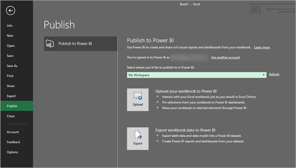
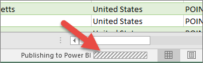

# Publish to Power BI from Excel 2016
With Excel 2016, you can publish your Excel workbooks right to your [Power BI](https://powerbi.microsoft.com) site, where you can create highly interactive reports and dashboards based on your workbook’s data. You can then share your insights with others in your organization.

Before we go any further, there are few things to keep in mind:

* Before you can publish to Power BI, your workbook must be saved to OneDrive for Business.
* The account you use to sign in to Office, OneDrive for Business, and Power BI must be the same account.
* You cannot publish an empty workbook or a workbook that doesn’t have any Power BI supported content.
* You cannot publish encrypted or password protected workbooks, or workbooks with Information Protection Management.
* Publishing to Power BI requires modern authentication be enabled (default). If disabled, the Publish option is not available from the File menu.

## To publish your Excel workbook
In Excel, select **File** > **Publish**.

### Local file publishing
Starting in the February 2017 update, Excel 2016 supports publishing of local Excel files. They do not need to be saved to OneDrive for Business or SharePoint Online.

> [!IMPORTANT]
> Only Excel 2016 with an Office 365 subscription will see the experience to publish with local files. Excel 2016 standalone installation will still have the "Publish" only behavior which requires the excel workbook be saved to OneDrive for Business or SharePoint Online.
> 
> 

When you select **Publish**, you will be able to select the workspace you want to publish to. This can be your personal or group workspace that you have access to.

you’ll get two options on how to get your workbook into Power BI.

Once published, it is kept as a copy in Power BI, separate from the local file. If you want to update the file in Power BI, you need to publish the updated version again. You can refresh the data and set scheduled refresh on the workbook or the dataset in Power BI.

### Publishing from Excel Standalone
If your workbook isn’t already saved to OneDrive, you’ll need to save it there first. Select Save to Cloud and choose a location in OneDrive for Business.

Once your workbook is saved to OneDrive, when you select **Publish**, you’ll get two options on how to get your workbook into Power BI.

#### Upload your workbook to Power BI
When you choose this option, your workbook will appear in Power BI just like it would in Excel Online. But, unlike Excel Online, you’ll have some great features to help you pin elements from your worksheets to dashboards.

You can’t edit your workbook in when open in Power BI, but if you need to make some changes, you can select **Edit**, and then choose to edit your workbook in Excel Online or open it in Excel on your computer. Any changes you make are saved to the workbook on OneDrive.

WWhen you upload a workbook, Power BI will create a corresponding dataset for it. You can use this dataset to create a Power BI report if needed. Your workbook will appear in Workbooks, in your workspace navigation pane. 

Choose this option if you only have data in worksheets, or you have PivotTables and Charts you want to see in Power BI.
Using Upload from Publish to Power BI in Excel is pretty much the same as using Get Data > File > OneDrive for Business > Connect, Manage and View Excel in Power BI from Power BI in your browser.

#### Export workbook data to Power BI
When you choose this option, any supported data in tables and/or a data model are exported into a new dataset in Power BI. If you have any Power View sheets, those will be re-created in Power BI as reports.

You can continue editing your workbook. When your changes are saved, they’ll be synchronized with the dataset in Power BI, usually within about an hour. If you need more immediate gratification, you can just select Publish again, and your changes are exported right then and there. Any visualizations you have in reports and dashboards will be updated, too.

Choose this option if you’ve used Get & Transform data or Power Pivot to load data into a data model, or if your workbook has Power View sheets with visualizations you want to see in Power BI.

Using Export from Publish to Power BI in Excel is pretty much the same as using Get Data > File > OneDrive for Business > Export Excel data into Power BI from Power BI in your browser.

## Publishing
When you choose either option, Excel will sign in to Power BI with your current account, and then publish your workbook to your Power BI site. Keep an eye on the status bar in Excel. It shows how things are going.

When complete, you can go to Power BI right from Excel.

## Next steps
[Excel data in Power BI](service-excel-workbook-files.md)  
More questions? [Try the Power BI Community](http://community.powerbi.com/)

