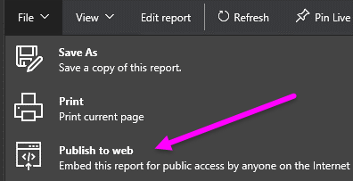
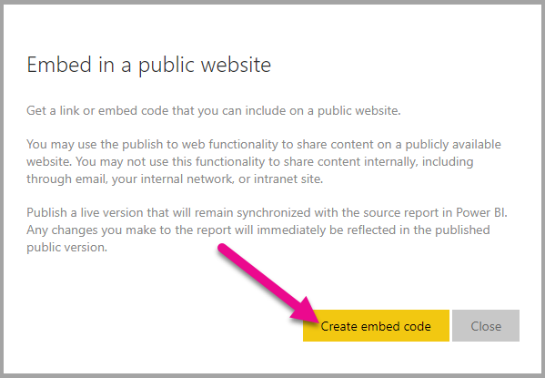
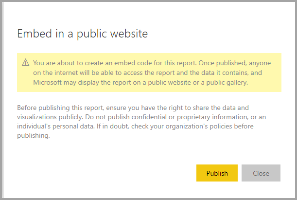
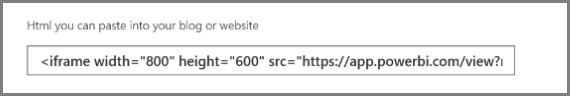
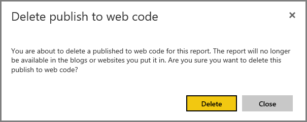

# Publish to web from Power BI

With Power BI **Publish to web**, you can easily embed interactive Power BI visualizations online, such as in blog posts, websites, through emails or social media, on any device.

You can also easily edit, update, refresh, or unshare your published visuals.

> [!WARNING]
> When you use **Publish to web**, the report or visual you publish can be viewed by anyone on the Internet. There is no authentication used when viewing these reports. Only use Publish to web with reports and data that the anyone on the Internet (unauthenticated members of the public) should be able to see. This includes detail level data that is aggregated in your reports. Before publishing this report, ensure you have the right to share the data and visualizations publicly. Do not publish confidential or proprietary information. If in doubt, check your organization's policies before publishing. To embed your content securely in an internal portal or website, use the Embed or Embed in SharePoint Online options. This ensures all permissions and data security is enforced when your users are viewing your internal data.

## How to use Publish to Web

**Publish to web** is available on reports in your personal or group workspaces that you can edit.  You cannot use Publish to web with reports that were shared with you, or reports that rely on row level security to secure the data. See the **Limitations** section below for a complete list of cases where Publish to web isn't supported. Review the **Warning** earlier in this article before using Publish to web.

You can watch how this feature works in the following *short video*. Then, follow the steps below to try it yourself.

<iframe width="560" height="315" src="https://www.youtube.com/embed/UF9QtqE7s4Y" frameborder="0" allowfullscreen></iframe>

The following steps describe how to use **Publish to web**.

1. On a report in your workspace that you can edit, select **File  > Publish to web**.

   

2. Review the content on the dialog, and select **Create embed code** as shown in the following dialog.

   

3. Review the warning, shown in the following dialog, and confirm that the data is okay to embed in a public website. If so, select **Publish**.

   

4. A dialog appears that provides a link that can be sent in email, embedded in code (such as an iFrame), or that you can paste directly into your web page or blog.

   

5. If you’ve previously created an embed code for the report, the embed code quickly appears. You can only create one embed code for each report.

   

## Tips and Tricks for View modes

When you embed content within a blog post, you typically need to fit it within a specific size of the screen.  You can also adjust the height and the width in the iFrame tag as needed, but you may also need to ensure your report fits within the given area of the iFrame, so you also need to set an appropriate View Mode when editing the report.

The following table provides guidance about the View Mode, and how it will appear when embedded.

| View Mode | How it looks when embedded |
| --- | --- |
|  |**Fit to page** will respect the page height and width of your report. If you set your page to 'Dynamic' ratios like 16:9 or 4:3 your content will scale to fit within the iFrame, you provided. When embedded in an iFrame, using **Fit to page** can result in **letterboxing**, where a gray background is shown in areas of the iFrame after the content as scaled to fit within the iFrame. To minimize letterboxing, set your iFrame height/width appropriately. |
|  |**Actual size** will ensure the report preserves its size as set on the report page. This can result in scrollbars being present in your iFrame. Set the iFrame height and width to avoid the scrollbars. |
|  |**Fit to width** ensures the content fits within the horizontal area for your iFrame. A border will still be shown, but the content will scale to use all the horizontal space available. |

## Tips and tricks for iFrame height and width

The embed code you receive after you Publish to web will look like the following:

You can edit the width and height manually to ensure it's precisely how you want it to fit onto the page into which you're embedding it.

To achieve a more perfect fit, you can try adding 56 pixels to the height dimension of the iFrame. This accommodates the current size of the bottom bar. If your report page uses the Dynamic size, the table below provides some sizes you can use to achieve a fit without letterboxing.

| Ratio | Size | Dimension (Width x Height) |
| --- | --- | --- |
| 16:9 |Small |640 x 416 px |
| 16:9 |Medium |800 x 506 px |
| 16:9 |Large |960 x 596 px |
| 4:3 |Small |640 x 536 px |
| 4:3 |Medium |800 x 656 px |
| 4:3 |Large |960 x 776 px |

## Managing embed codes

Once you create a **Publish to web** embed code, you can manage the codes you create from the **Settings** menu of the Power BI service. Managing embed codes includes the ability to remove the destination visual or report for a code (rendering the embed code unusable), or getting the embed code again.

1. To manage your **Publish to web** embed codes, open the **Settings** gear and select **Manage embed codes**.

   

2. The list of embed codes you’ve created appears, as shown in the following image.

   

3. For each **Publish to web** embed code in the list, you can either retrieve the embed code, or delete the embed code and thus make any links to that report or visual no longer work.

   

4. If you select **Delete**, you’re asked if you’re sure you want to delete the embed code.

   

## Updates to reports, and data refresh

After you create your **Publish to web** embed code and share it, the report is updated with any changes you make. However, it’s important to know that it can take a while for update to be visible to your users. Updates to a report or visual take approximately one hour to be reflected in Publish to web embed codes.

When you initially use **Publish to web** to get an embed code, the embed code link is immediately active and can be viewed by anyone who opens the link.  After the initial Publish to web action, subsequent updates to reports or visuals to which a Publish to web link points can take approximately one hour to be visible to your users.

To learn more, see the **How it works** section later in this article. If you need your updates to be immediately available, you can delete the embed code and create a new one.

## Data refresh

Data refreshes are automatically reflected in your embedded report or visual. It can take approximately 1 hour for refreshed data to be visible from embed codes. You can disable automatic refresh by selecting **don't refresh** on the schedule for the dataset used by the report.  

## Custom visuals

Custom visuals are supported in **Publish to web**. When you use Publish to web, users with whom you share your published visual do not need to enable custom visuals to view the report.

## Limitations

**Publish to web** is supported for the vast majority of data sources and reports in the Power BI service, however, the following are **not currently supported or available** with Publish to web:

- Reports using row level security.
- Reports using any Live Connection data source, including Analysis Services Tabular hosted on-premises, Analysis Services Multidimensional, and Azure Analysis Services.
- Reports shared to you directly or through an organizational content pack.
- Reports in a group in which you are not an edit member.
- "R" Visuals are not currently supported in Publish to web reports.
- Exporting Data from visuals in a report, which has been published to the web
- ArcGIS Maps for Power BI visuals
- Reports containing report-level DAX measures
- Single sign-on data query models
- [Secure confidential or proprietary information](#publish-to-web-from-power-bi)
- The automatic authentication capability provided with the **Embed** option doesn't work with the Power BI JavaScript API. For the Power BI JavaScript API, use the [user owns data](developer/embed-sample-for-your-organization.md) approach to embedding. Learn more about [user owns data](developer/embed-sample-for-your-organization.md).

## Tenant setting

Power BI administrators can enable or disable the publish to web feature. They may also restrict access to specific groups. Your ability to create an embed code changes based on this setting.

|Feature |Enabled for entire organization |Disabled for entire organization |Specific security groups   |
|---------|---------|---------|---------|
|**Publish to web** under report's **File** menu.|Enabled for all|Not visible for all|Only visible for authorized users or groups.|
|**Manage embed codes** under **Settings**|Enabled for all|Enabled for all|Enabled for all  * **Delete** option only for authorized users or groups. * **Get codes** enabled for all.|
|**Embed codes** within admin portal|Status will reflect one of the following: * Active * Not supported * Blocked|Status will display **Disabled**|Status will reflect one of the following: * Active * Not supported * Blocked  If a user is not authorized based on the tenant setting, status will display as **infringed**.|
|Existing published reports|All enabled|All disabled|Reports continue to render for all.|

## Understanding the embed code status column

When viewing the **Manage embed codes** page for your **Publish to web** embed codes, a status column is provided. Embed codes are active by default, but you may encounter any of the states listed below.

| Status | Description |
| --- | --- |
| **Active** |The report is available for Internet users to view and interact with. |
| **Blocked** |The content of the report violates the [Power BI Terms of Service](https://powerbi.microsoft.com/terms-of-service). It has been blocked by Microsoft. Contact support if you believe the content was blocked in error. |
| **Not supported** |The report's data set is using row level security, or another unsupported configuration. See the **Limitations** section for a complete list. |
| **Infringed** |The embed code is outside of the defined tenant policy. This typically occurs when an embed code was created and then the publish to web tenant setting was changed to exclude the user that owns the embed code. If the tenant setting is disabled, or the user is no longer allowed to create embed codes, existing embed codes will show the status of **Infringed**. |

## How to report a concern with Publish to web content

To report a concern related to **Publish to web** content embedded in a website or blog, use the **Flag** icon in the bottom bar, shown in the following image. You’ll be asked to send an email to Microsoft explaining the concern. Microsoft will evaluate the content based on the Power BI Terms of Service, and take appropriate action.

To report a concern, select the **flag** icon in the bottom bar of the Publish to web report you see.

## Licensing and Pricing

You need to be a Microsoft Power BI user to use **Publish to web**. The consumers of your report (the readers, viewers) do not need to be Power BI users.

## How it works (technical details)

When you create an embed code using **Publish to web**, the report is made visible to users on the Internet. It’s publicly available so you can expect viewers to easily share the report through social media in the future. As users view the report, either by opening the direct public URL or viewing it embedded in a web page or blog, Power BI caches the report definition and the results of the queries required to view the report. This approach ensures the report can be viewed by thousands of concurrent users without any impact on performance.

The cache is long-lived, so if you update the report definition (for example, if you change its View mode) or refresh the report data, it can take approximately one hour before changes are reflected in the version of the report viewed by your users. It is therefore recommended that you stage your work ahead of time, and create the **Publish to web** embed code only when you’re satisfied with the settings.

## Next steps

- [SharePoint Online report web part](service-embed-report-spo.md) 

- [Embed report in a secure portal or website](service-embed-secure.md)

More questions? [Try the Power BI Community](http://community.powerbi.com/)
