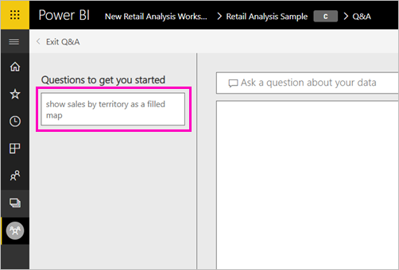
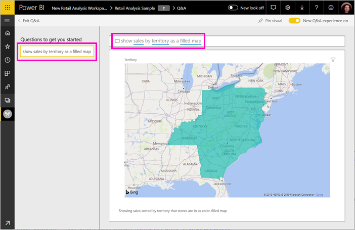

# Create featured questions for Power BI Q&A
If you own a dataset, you can add your own featured questions to that dataset. Power BI Q&A will show those questions to colleagues who consume reports based on that dataset.  Featured questions give your colleagues ideas about the types of questions they can ask about the dataset. The featured questions you add are up to you -- add popular questions, questions that display interesting results, or questions that may be hard to phrase.

Watch Will add some featured questions to Power BI Q&A and then use those featured questions to explore his dataset. Then follow the step-by-step instructions below the video to try it out yourself.

<iframe width="560" height="315" src="https://www.youtube.com/embed/E1mIAyEXuF4" frameborder="0" allowfullscreen></iframe>

> [!NOTE]
> Q&A featured questions are available for use in the [Microsoft Power BI app for iOS on iPads, iPhones, and iPod Touch devices](consumer/mobile/mobile-apps-ios-qna.md) and Power BI Desktop Q&A Preview. Creating the questions is only available in Power BI service (app.powerbi.com).
> 

## Create a featured question

This article uses the [Retail Analysis Sales sample](sample-datasets.md).

1. On the dashboard, select the Q&A question box.   Notice that Q&A is already being helpful by displaying a list of terms that appear in the dataset.
2. To add to this list, select the gear icon in the top right corner of Power BI.  
   
3. Select **Settings** &gt; **Datasets** &gt; **Retail Analysis sample** &gt; **Featured Q&A Questions**.  
4. Select **Add a question**.
   
   
5. Type your question in the text box and select **Apply**.   Optionally, add another question by selecting **Add a question**.  
   
6. Navigate back to the Power BI dashboard for Retail Analysis Sample, and place your cursor in the Q&A question box.   
   
7. The new featured question, **Sales by territory as a map**, is first in the list. Select it.  
8. The answer displays as a filled map visualization.  
   

## Next steps

[Q&A for consumers](consumer/end-user-q-and-a.md)  
[Use Q&A in dashboards and reports](power-bi-tutorial-q-and-a.ms)  
[Power BI - Basic Concepts](consumer/end-user-basic-concepts.md)  
More questions? [Try the Power BI Community](http://community.powerbi.com/)

