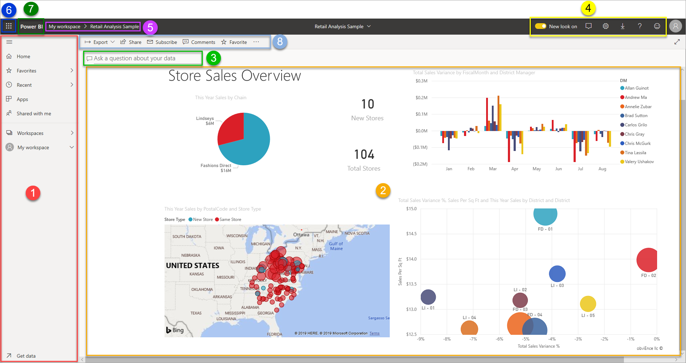
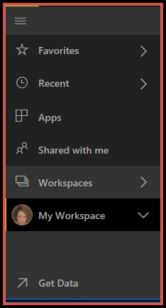
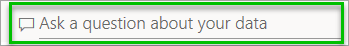
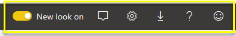
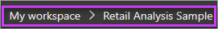
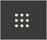
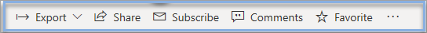
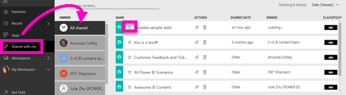
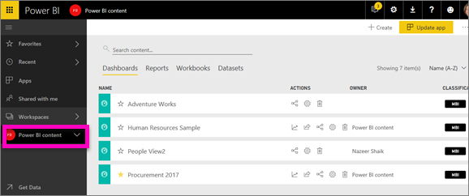
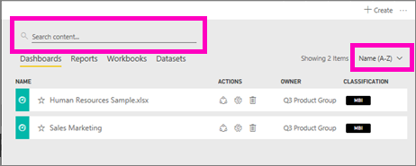

# Quickstart - Getting around in Power BI service

When you open the Power BI service, you'll see a ***dashboard*** displayed. Dashboards are something that differentiates Power BI service from Power BI Desktop.
In this quickstart you will do X...

ADD LINK TO FREE ACCOUNT
If you're not signed up for Power BI, [sign up for a free trial](https://app.powerbi.com/signupredirect?pbi_source=web) before you begin.

The main features of your Power BI service UI are the following:

1. navigation pane (left nav)
2. canvas (in this case, dashboard with tiles)
3. Q&A question box
4. icon buttons, including help and feedback
5. dashboard title (navigation path, aka breadcrumbs)
6. Office 365 app launcher
7. Power BI home button
8. Labeled icon buttons

We'll dig into these later, but first let's review some Power BI concepts.

Or, you might want to watch this video first before reading the rest of this article.  In the video, Will reviews the basic concepts and gives a tour of Power BI service.

<iframe width="560" height="315" src="https://www.youtube.com/embed/B2vd4MQrz4M" frameborder="0" allowfullscreen></iframe>

## Prerequisites
x
y

## My Workspace
We've covered workspaces and building blocks. Let's take another look at the Power BI interface and review the pieces that make up the landing page for Power BI service.

### 1. **Navigation pane** (left nav)
Use the navigation pane to locate and move between your workspaces and the Power BI building blocks: dashboards, reports, workbooks, and datasets.  

  

* Select **Get Data** to [add datasets, reports, and dashboards to Power BI](service-get-data.md).
* Expand and collapse the navbar with this icon .
* Open or manage your favorite content by selecting **Favorites**.
* View and open your most-recently visited content by selecting **Recent**
* View, open, or delete an app by selecting **Apps**.
* Did a colleague share content with you? Select **Shared with me** to search and sort that content to find what you need.
* Display and open your workspaces by selectig **Workspaces**.

Single-click

* an icon or heading to open in content view
* an arrowright (>) to open a flyout menu for Favorites, Recent, and Workspaces. 
* a chevron icon () to display the **My Workspace** scrollable list of dashboards, reports, workbooks, and datasets.
* a dataset to explore it

### 2. **Canvas** 
Because we've opened a dashboard, the canvas area displays visualization tiles. If, for example, we had opened the report editor, the canvas area would display a report page. 

Dashboards are composed of [tiles](service-dashboard-tiles.md).  Tiles are created in report Editing view, Q&A, other dashboards, and can be pinned from Excel, SSRS, and more. A special type of tile called a [widget](service-dashboard-add-widget.md) is added directly onto the dashboard. The tiles that appear on a dashboard were specifically put there by a report creator/owner.  The act of adding a tile to a dashboard is called *pinning*.

For more information, see **Dashboards** (above).

### 3. **Q&A question box**
One way to explore your data is to ask a question and let Power BI Q&A give you an answer, in the form of a visualization. Q&A can be used to add content to a dashboard or report.

Q&A looks for an answer in the dataset(s) connected to the dashboard.  A connected dataset is one that has at least one tile pinned to that dashboard.

As soon as you start to type your question, Q&A takes you to the Q&A page. As you type, Q&A helps you ask the right question and find the best answer with rephrasings, autofill, suggestions, and more. When you have a visualization (answer) you like, pin it to your dashboard. For more information, see [Q&A in Power BI](power-bi-q-and-a.md).

### 4. **Icon buttons** 
The icons in the upper right corner are your resource for settings, notifications, downloads, getting help, and providing feedback to the Power BI team. Select the double arrow to open the dashboard in **Full screen** mode.  

### 5. **Dashboard title** (navigation path aka breadcrumbs)
It's not always easy to figure out which workspace and dashboard are active, so Power BI creates a navigation path for you.  In this example we see the workspace (My workspace) and the dashboard title (Retail Analysis Sample).  If we opened a report, the name of the report would be appended to the end of the navigation path.  Each section of the path is an active hyperlink.  

Notice the "C" icon after the dashboard title. This dashboard has a [data classification tag](service-data-classification.md) of "confidential." The tag identifies the sensitivity and security level of the data. If your Admin has turned on data classifcation, every dashboard will have a default tag set. Dashboard owners should change the tag to match their dashboard's proper security level.

### 6. **Office 365 app launcher**
With the app launcher, all your Office 365 apps are easily available with one click. From here you can quickly launch your email, documents, calendar, and more. 

### 7. **Power BI home**
Selecting this opens your [featured dashboard](service-dashboard-featured.md) (if you've set one), otherwise it opens the last dashboard you viewed.

   

### 8. **Labeled icon buttons**
This area of the screen contains additional options for interacting with the content (in this case, with the dashboard).  Besides the labeled icons you can see, selecting the ellipses reveals options for duplicating, printing, refreshing the dashboard and more.

   

## Next steps
[Get started with Power BI](service-get-started.md)  
[Navigation: Getting around in Power BI service](service-the-new-power-bi-experience.md)
[Power BI videos](videos.md)  
[Report editor - take a tour](service-the-report-editor-take-a-tour.md)

More questions? [Try asking the Power BI Community](http://community.powerbi.com/)

## The left navigation pane

## Common tasks

Watch Amanda take you on a tour of the Power BI service navigation experience.  Then follow the step-by-step instructions below the video to explore for yourself.

<iframe width="560" height="315" src="https://www.youtube.com/embed/G26dr2PsEpk" frameborder="0" allowfullscreen></iframe>

## View content (dashboards, reports, workbooks, datasets, workspaces, apps)
Let's start by looking at how the basic content (dashboards, reports, datasets, workbooks) is organized. Before this, all of your content was listed in the left navigation pane. Now, you still have that option, but the default is to display by content type within the context of a workspace. Select a workspace from the left navigation pane (left navpane) and the tabs for the associated content (dashboards, reports, workbooks, datasets) fill the Power BI canvas to the right.

If you have Power BI Free, you'll only see one workspace -- **My Workspace**.

### Favorite dashboards, reports, and apps
**Favorites** lets you quickly access content that is most important to you.  

1. With the dashboard or report open, select **Favorite** from the upper right corner.
   
   
   
   **Favorite** changes to **Unfavorite** and the star icon becomes yellow.
   
   

2. For an app, select **Apps** from the left navpane, hover over the app and choose the star to set it as a favorite.

2. To display a list of all the content that you have added as favorites, in the left navpane, select the arrow to the right of **Favorites**. Because the left navpane is a permanent feature of Power BI service, you have access to this list from anywhere in Power BI service.
   
    
   
    From here you can select a dashboard, report, or app to open it.

3. To open the **Favorites** pane, in the left navpane, select **Favorites** or select the Favorites icon .
   
   
   
   From here you can open, find the content, unfavorite, or share content with colleagues.

1. Another way to mark either a dashboard or report as a favorite is from the **Dashboards** or **Reports** workspace tab.  Just open the workspace to display the content view, and select the star icon to the left of the name.
   
   

To learn more, see [Favorites](service-dashboard-favorite.md)

### Recents
Quickly get to the content that you've most recently accessed by visiting the **Recents** pane. This includes content from across all of your workspaces.

  

Similar to Favorites, you can quickly access your recents from anywhere in Power BI service by selecting the arrow next to **Recents** in the left navpane.

  

To learn more, see [Recents in Power BI](service-recent.md)

### Apps
An app is a collection of dashboards and reports built to deliver key metrics, all in one place. You can have apps internal to your organization, and also [apps for external services](service-connect-to-services.md) such as Google Analytics and Microsoft Dynamics CRM. 

To learn more, see **App workspaces** (below) and [What are Power BI apps](service-install-use-apps.md).

### Shared with me
**Shared with me** is the location for all content that colleagues have shared with you.  Filter by dashboard owner, use the search field to find what's relevant, and sort the items by date.  And for shared content you visit frequently, it's even easier to favorite it right from the **Shared with me** view.

To learn more, see [Shared with me](service-shared-with-me.md)

### Working with workspaces
Next in the left nav is *workspaces*. Workspaces can be thought of as *containers* for Power BI content. There are two types of workspaces: **My Workspace** and App workspaces.

If you are not a member of an app workspace or an admin, you may not see any app workspaces in your left nav. And if you are a Power BI Free customer, you will not see any app workspaces.

#### My Workspace
**My Workspace** stores all the content that you own. Think of it as your personal sandbox or work area for your own content. You can share content from My Workspace with colleagues. Within My Workspace, your content is organized into 4 tabs: Dashboards, Reports, Workbooks, and Datasets.

#### App workspaces
Apps and app workspaces are a feature of Power BI Pro. If you are someone who authors dashboards and reports for others, you'll use app workspaces to do this. An app workspace is the place where you'll create the app, so to create an app, you'll first need to create the app workspace. They're the evolution of group workspaces ' staging areas and containers for the content in the app.  You and your colleagues can collaborate on dashboards, reports, and other content that you plan to distribute to a wider audience, or even your entire organization.

To learn more, visit [Create and distribute an app in Power BI](service-create-distribute-apps.md#app-workspaces).

As with **My Workspace**, your content is organized into 4 tabs: Dashboards, Reports, Workbooks, and Datasets.

Switch workspaces by selecting **Workspaces** in the left navpane.

### Search and sort content
The content view makes it easier to search, filter and sort your content. To search for a dashboard, report or workbook, type in the search area. Power BI filters to only the content that has your search string as part of the name.

You can also sort the content by name or owner.  

To learn more, see [Power BI navigation: search, sort, filter](service-navigation-search-filter-sort.md)

## Next steps
Power BI service [Basic concepts](service-basic-concepts.md)    

Have questions or feedback? [Visit the Power BI community forum](http://community.powerbi.com/t5/Navigation-Preview-Forum/bd-p/NavigationPreview)

> [!div class="nextstepaction"]
> [Azure Windows virtual machine tutorials](./tutorial-manage-vm.md)