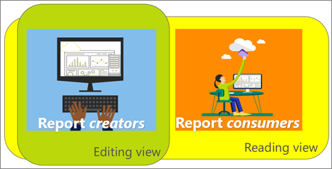
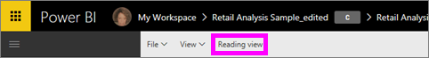

# Reading View and Editing View in Power BI service reports
In Power BI service (not Power BI Desktop) there are two modes for viewing and interacting with reports: Reading view and Editing view. Reading view is available to all users and is especially designed for data *consumers* while Editing view is only available to report *creators* and owners. 

## Report Reading view

 Reading view is your way to explore and interact with the report -- it's a fun and safe way to play with and get to know your data. Reading view is designed for report *consumers*; those who open reports from Apps or who have reports [shared with them](service-share-dashboards.md). Reading view ensures that every single consumer of a specific report is seeing the same report, the same visualizations, with the same filters applied.  Consumers can interact with the reports, but cannot save changes.

>**NOTE**: In certain circumstances, report consumers may see different data because of row level security and data permissions. 

## Report Editing view

Editing view is only available to those who created the report or who [co-own a report as a member or admin of an app workspace](service-create-distribute-apps.md).

Editing view is designed for report *creators*. This is where creators import and connect to datasets, explore the data, and build reports and dashboards. In Editing view *creators* can dig even deeper into their data by adding and removing fields, changing visualization type, creating new visualizations, and adding and deleting visualizations and pages from the report. They can then share the reports they create with colleagues.

## Reading view versus Editing view
This chart does not list all the report capabilities of Power BI service! It lists only those report tasks that are not available in **both** Reading view and Editing view. 

|Task  | Reading view  | Editing view |
|-------------------------|-------|-------|
|**Reports, as a whole**  |
||||
| [Create or edit a report](service-report-create-new.md) | No  | Yes |
| [Share a report](service-share-reports.md)| Yes | Yes, and can also manage permissions, including giving others *owner* permissions. |
| [Create persistent (permanent) visual-level, drilthrough, page-level, and report-level filters from Filters pane](power-bi-report-add-filter.md) | No  | Yes |
| [Use report Filters pane](power-bi-how-to-report-filter.md) | Yes, can use the existing filters but changes aren't saved with the report. | Yes |
| [Use the report Analytics pane](service-analytics-pane.md) | No | Yes |
| [Report **View** options](power-bi-report-display-settings.md) | Yes, with some exceptions. | Yes, all, including gridlines, snap, and lock. |
| [Create a refresh schedule](refresh-data.md) | No  | Yes |
| [Subscribe to a report](service-report-subscribe.md) | Yes | No |
| [Q&A - ask questions in reports](power-bi-q-and-a.md) | No  | Yes |
| [View Usage metrics ](service-usage-metrics.md) | Yes, on the report canvas. | Yes, in the report list (content view) |
| [View related](service-related-content.md) | Yes, on the report canvas. | Yes, in the report list (content view) |
| [Save a report](service-report-save.md) | Yes, but only using **Save as**. | Yes |
| [Delete a report](service-delete.md) | No  | Yes |
|**Report pages** |
||||
| [Add or rename a report page](power-bi-report-add-page.md)  | No  | Yes  |
| [Duplicate a report page](power-bi-report-copy-paste-page.md) | No  | Yes |
| [Delete report page](service-delete.md) | no | yes |
|**Working with report visualizations**|
||||
| [Add visualizations to a report](power-bi-report-add-visualizations-i.md) | No  | Yes |
| [Add text boxes, and shapes to a report](power-bi-reports-add-text-and-shapes.md) | No  | Yes |
| [Use the report Formatting pane](service-the-report-editor-take-a-tour.md) | No | Yes |
| [Set visual interactions](service-reports-visual-interactions.md) | No  | Yes |
| [Show data used to create the visualization](service-reports-show-data.md) | No  | Yes |
| [Configure drilling](power-bi-visualization-drill-down.md) | No  | Yes |
| [Change the visualization being used](power-bi-report-change-visualization-type.md) | No | Yes|
| [Delete a visualization, text box, or shape](service-delete.md)| No | Yes |

## Navigating between Editing view and Reading view
Remember, only the report creator and owner(s) will be able to open a report in Editing view.

1. By default, a report usually opens in Reading view. You can tell you're in Reading view if you see an option for **Edit report**. If **Edit report** is greyed out, you do not have permissions to open the report in Editing view.

   

2. If **Edit Report** is not greyed out, select it to open the report in Editing view. 
   
   
   
   The report is now in Editing view and uses the same [display settings](power-bi-report-display-settings.md) you last used in Reading view.

2. To return to Reading view, select **Reading view** from the top navigation bar.
   
    

### Next steps
There are so many ways to interact with a report in Reading view, slicing and dicing your data to discover insights and get answers to questions.  The next topic, [Interact with a report in Reading view](service-interact-with-a-report-in-editing-view.md), describes some of these in detail.    
Back to [reports in Power BI](service-reports.md)    
More questions? [Try the Power BI Community](http://community.powerbi.com/) 

