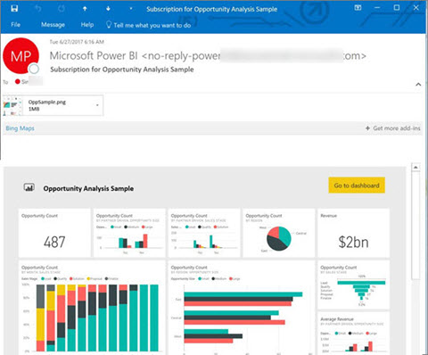
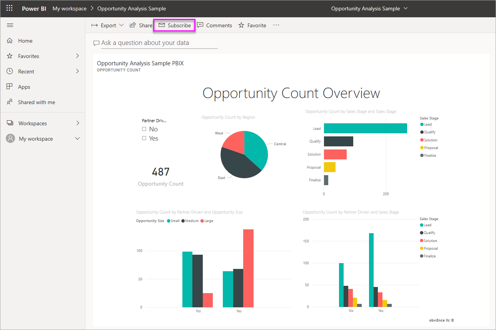
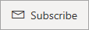
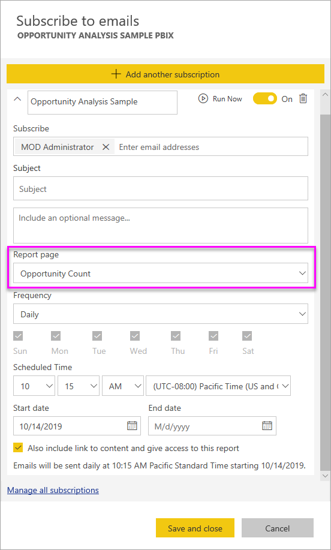
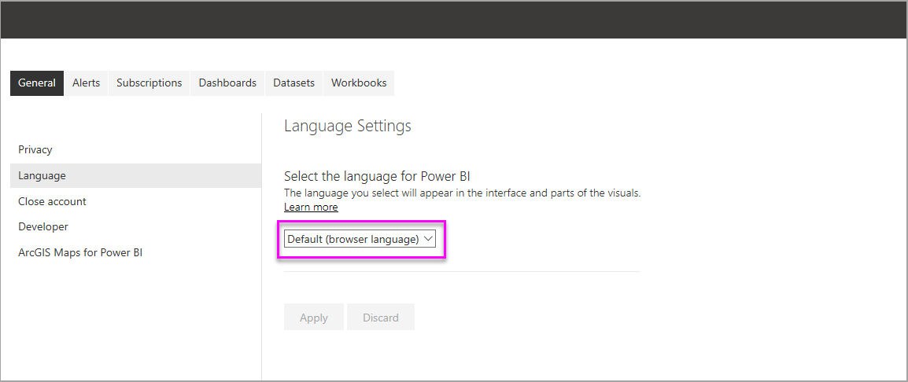
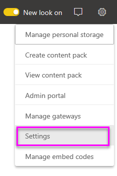

# Subscribe yourself and others to reports and dashboards in the Power BI service

You can subscribe yourself and your colleagues to the report pages, dashboards, and paginated reports that matter most to you. Power BI emails a snapshot to your inbox. You tell Power BI how often you want to receive the emails: daily, weekly, or once a day after the initial data refresh.  If you choose daily or weekly, you can choose the time you'd like to have the subscription run.  In all, you can set up to 24 different subscriptions per day, for every report page and dashboard.

 

You can only create subscriptions in the Power BI service. You receive an email with a snapshot of the report page or dashboard, with a link to open the report or dashboard. On mobile devices with Power BI apps installed, selecting this link launches the Power BI app, instead of opening the report or dashboard in the Power BI web site.

## Requirements

- **Creating** a subscription can be done by - 
- Users with a Power BI Pro license
2. Users viewing content in a Premium Workspace or App may also subscribe to content located there, even without a pro license.

- You don't need edit permissions to the content (dashboard or report) to create a subscription for yourself, but you must have edit permissions to create one for someone else. 

## Subscribe to a dashboard, report page, or paginated report

Whether you're subscribing to a dashboard, report, or paginated report, the process is similar. The same button allows you to subscribe to Power BI service dashboards and reports.

Subscribing to paginated reports is a little different. See [Subscribe yourself and others to a paginated report in the Power BI service](paginated-reports-subscriptions.md) for details.
 
.

1. Open the dashboard or report.
2. From the top menu bar, select **Subscribe** or select the envelope icon .
   
   

3. Use the yellow slider to turn the subscription on and off.  Setting the slider to **Off** doesn't delete the subscription. To delete the subscription, select the trashcan icon.

4. Your email is already in the **Subscribe** box. You can add other email addresses to the subscription as well, but only in the same domain. If the report or dashboard is hosted in [Premium capacity](service-premium-what-is.md), you can subscribe other individual email addresses and group aliases. If the report or dashboard isn't hosted in Premium capacity, you can subscribe other individuals, but they too must have Power BI Pro licenses. See [Considerations and troubleshooting](#considerations-and-troubleshooting) below for details. 

5. Fill in the email **Subject** and **Message** details. 

5. Select a **Frequency** for your subscription: **Daily**, **Weekly**, or **After Data Refresh (Daily)**.  To receive the subscription email only on certain days, select **Weekly** and select the days you'd like to receive it.  For example, if you'd like to receive the subscription email only on weekdays, select **Weekly** and uncheck the boxes for **Sat** and **Sun**.  

6. If you choose **Daily** or **Weekly**, you can also choose a **Scheduled Time** for the subscription.  You have it run on the hour, or at 15, 30, or 45 minutes past.  Select morning (AM) or afternoon/evening (PM). You can also specify the time zone.

7. By default, the start date for your subscription is the date you create it. You have the option to select an end date. If you don't set an end date, the end date is automatically one year after the start date. You can change it to any date in the future (up to the year 9999) at any time before the subscription ends. When a subscription reaches an end date, it stops until you re-enable it. You'll receive notification(s) before the scheduled end date to ask if you'd like to extend it.    

    In the screenshot below, notice that when you subscribe to a report, you're actually subscribing to a report *page*.  To subscribe to more than one page in a report, select **Add another subscription** and select a different page. 
      
     

7. Select **Save and close**. Those subscribed receive an email and snapshot of the dashboard or report page for the frequency and time you selected. In all, you may create up to 24 subscriptions per report or dashboard, and can provide unique recipients, times, and frequencies for each subscription.  All subscriptions set to **After Data Refresh** for your dashboard or report will still only send an email after the first scheduled refresh.   
      
   > [!TIP]
   > Want to send the email from a subscription right away or on-demand at any time? Select **Run Now** for the subscriptions for the dashboard or report you want to send. You'll see a notification that an e-mail is on its way to everyone for that particular subscription.  You may do this as often as you like. It doesn't count against your limit of 24 scheduled subscription runs per day per report or dashboard. It does NOT trigger a data refresh of the underlying dataset. 
   > 
   > 
   
## Email languages

The email and snapshot use the language set in Power BI settings (see [Supported languages and countries/regions for Power BI](supported-languages-countries-regions.md)). If no language is defined, Power BI uses the language according to the locale setting in your current browser. To see or set your language preference, select the cog icon  > **Settings > General > Language**. 

## Manage your subscriptions
Only the person who created the subscription can manage it.  There are two paths to the screen for managing your subscriptions.  The first is by selecting **Manage all subscriptions** from the **Subscribe to emails** dialog (see screenshots below step 4 above). The second is by selecting the Power BI cog icon  from the top menubar and choosing **Settings**.

The particular subscriptions displayed depend on which workspace is currently active.  To see all of your subscriptions at once for all workspaces, be sure that **My Workspace** is active. For help understanding workspaces, see [Workspaces in Power BI](service-create-workspaces.md).

A subscription ends if the Pro license expires, the owner deletes the dashboard or report, or the user account used to create the subscription is deleted.

## Considerations and troubleshooting

* Dashboards with over 25 pinned tiles, or 4 pinned live report pages, may not render fully in subscription e-mails sent to users.  Subscriptions to dashboards over these number of tiles aren't blocked. However, they're considered unsupported if you encounter issues. Consider modifying them accordingly to fall within a supported range.
* On rare occasions, e-mail subscriptions may take longer than fifteen minutes to be delivered to their recipients. If this happens, we recommend running your data refresh and e-mail subscription at different times to ensure timely delivery. If the issue persists, contact Power BI support.
* For dashboard email subscriptions, if any tiles have row-level security (RLS) applied, those tiles don't display.  
* For report email subscriptions, if the dataset uses RLS, you can create a subscription for yourself. You can't subscribe others to a report with row-level security (RLS) applied.
* Report page subscriptions are tied to the name of the report page. If you subscribe to a report page and then rename it, you have to re-create your subscription.
* Your organization may configure certain settings in Azure Active Directory that limit the ability to use email subscriptions in Power BI.  These limitations include, but aren't limited to, having multi-factor authentication or IP range restrictions when accessing resources.
* Currently, email subscriptions for reports/dashboards using live connection datasets aren't supported when subscribing users other than yourself.
* Email subscriptions don't support most [custom visuals](power-bi-custom-visuals.md).  The one exception is those custom visuals that have been [certified](power-bi-custom-visuals-certified.md).  
* Email subscriptions don't support R-powered custom visuals at this time.  
* Email subscriptions are sent with the report's default filter and slicer states. Any changes to the defaults that you make after subscribing don't show up in the email.    
* For dashboards subscriptions specifically, certain types of tiles aren't yet supported.  These include: streaming tiles, video tiles, custom web content tiles.     
* If you share a dashboard with a colleague outside of your tenant, you can't also create a subscription for that colleague. So if you are aaron@xyz.com, you can share with anyone@ABC.com, but you can't yet subscribe anyone@ABC.com and they can't subscribe to shared content.      
* Power BI automatically pauses refresh on datasets associated with dashboards and reports that haven't been visited in more than two months.  However, if you add a subscription to a dashboard or report, it doesn't pause even if it goes unvisited.    
* If you aren't receiving the subscription emails, ensure that your User Principal Name (UPN) can receive emails. [The Power BI team is working on relaxing this requirement](https://community.powerbi.com/t5/Issues/No-Mail-from-Cloud-Service/idc-p/205918#M10163), so stay tuned. 
* If your dashboard or report is in Premium capacity, you can use group email aliases for subscriptions, instead of subscribing colleagues one email address at a time. The aliases are based on the current active directory. 

## Next steps

- [Subscribe yourself and others to a paginated report in the Power BI service](paginated-reports-subscriptions.md)
- More questions? [Try asking the Power BI Community](http://community.powerbi.com/)    
- [Read the blog post](https://powerbi.microsoft.com/blog/introducing-dashboard-email-subscriptions-a-360-degree-view-of-your-business-in-your-inbox-every-day/)
