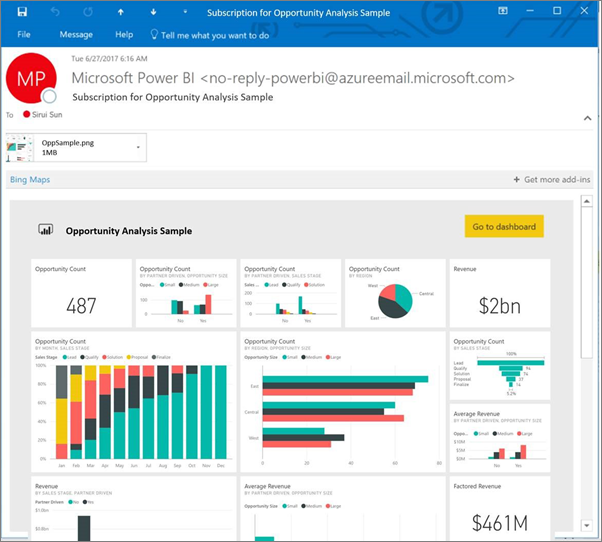

# Subscribe to a Power BI report or dashboard
It's never been easier to stay up-to-date on your most important dashboards and reports. Subscribe to report pages and dashboards that matter most to you, and Power BI will email a snapshot to your inbox. You tell Power BI how often you want to receive the emails: from once a day to once a week. 

The email and snapshot will use the language set in Power BI settings (see [Supported languages and countries/regions for Power BI](supported-languages-countries-regions.md)). If no language is defined, Power BI uses the language according to the locale setting in your current browser. To see or set your language preference, select the cog icon  **> Settings > General > Language**. 

> [!NOTE]
> Subscriptions can only be created in Power BI service. When you receive the email it will include a link to "go to report/dashboard". On mobile devices with Power BI apps installed, selecting this link launches the app (as opposed to the default action of opening the report or dashboard on the Power BI website).
> 
> 

Watch Sirui set up an email subscription for a report. Then follow the step-by-step instructions below the video to try it out yourself.

<iframe width="560" height="315" src="https://www.youtube.com/embed/saQx7G0pxhc" frameborder="0" allowfullscreen></iframe>

## Requirements
**Creating** a subscription is a Power BI Pro feature and you must have view or edit permissions to the content (dashboard or report).

## Subscribe to a dashboard

1. Open the dashboard.
2. From the top menubar, select **Subscribe** or select the envelope icon .
   
   
3. Use the yellow slider to turn the subscription on and off.  Setting the slider to Off will not delete the subscription. To delete the subscription, select the trashcan icon.
   
   
4. Select **Save and close** to save the subscription. You will receive an email snapshot of the dashboard each time any of the underlying datasets change. If the dashboard refreshes more than once a day, you will only receive the email snapshot after the first refresh.
   
   
   
   > [!TIP]
   > Want to see the email right away? Trigger an email by refreshing one of the datasets associated with the dashboard. (If you don't have edit permissions to the dataset, you will have to ask someone who has those permissions to do this for you.) To find out which datasets are being used to create the dashboard, from the dashboard, select the **View related** icon  to open **Related content** and then select the refresh icon  . 
   > 
   > 
   
   

## Subscribe to a report page
1. Open the report in [Reading view](service-reading-view-and-editing-view.md).
2. From the top menubar, select **Subscribe**.
   
   
3. You can subscribe to one report page at a time. Select the particular report page from the dropdown.
   
   
   
   Continue to add report pages.
4. Use the yellow slider to turn the subscription for each page on and off.  Setting the slider to Off will not delete the subscription. To delete the subscription, select the trashcan icon.
   
   
5. Select **Save and close** to save the subscription. You will receive an email snapshot of each report page when the report is refreshed. If the report doesn't refresh, you will not receive a snapshot email that day.  If the report refreshes more than once a day, you will only receive the email snapshot after the first refresh.
   
   
   
   > [!TIP]
   > Want to see the email right away? Trigger an email by opening your dataset and selecting **Refresh now**. If you don’t have edit permissions to the dataset, you will have to ask someone who has those permissions to do this for you.
   > 
   > 
   > 
   > 

## How the email schedule for reports is determined
The following table describes how frequently you will receive an email. It all depends on the connection method of the dataset upon which the dashboard or report is based (DirectQuery, Live connection, imported to Power BI, or Excel file in OneDrive or SharePoint Online) and on the subscription options available and selected (daily, weekly, or none).

|  | **DirectQuery** | **Live Connect** | **Scheduled refresh (import)** | **Excel file in OneDrive/SharePoint Online** |
| --- | --- | --- | --- | --- |
| **How often does the report/dashboard get refreshed?** |Every 15m |Power BI checks every 15 minutes, and if the dataset has changed, the report is refreshed. |User selects none, daily, or weekly. Daily can be up to 8 times a day. Weekly is actually a weekly schedule that the user creates and sets refresh for as few as once a week and as often as daily. |Once every hour |
| **How much control does the user have over the subscription email schedule?** |Options are: daily or weekly |No options: users is sent an email if the report refreshes, but no more than once per day. |If the refresh schedule is daily, options are daily and weekly.  If the refresh schedule is weekly only option is weekly. |No options: user is sent an email whenever the dataset is updated, but no more than once per day. |

## Manage your subscriptions
There are 2 paths to the screen for managing your subscriptions.  The first is by selecting **Manage all subscriptions** from the **Subscribe to emails** dialog (see step 3 above). The second is by selecting the Power BI cog icon  from the top menubar and choosing **Settings**.

The particular subscriptions displayed will depend on which workspace is currently active.  To see all of your subscriptions at once for all workspaces, be sure that **My Workspace** is active. For help understanding workspaces, see [Workspaces in Power BI](service-create-distribute-apps.md).

A subscription will end if the Pro license expires, the dashboard or report is deleted by the owner, the user account used to create the subscription is deleted.

## Considerations and troubleshooting
* At the current time, subscribe is not available for dashboards or reports that come from content packs or Power BI apps. But there is a workaround...make a copy of the report/dashboard and add subscriptions to that version instead.
* Report page subscriptions are tied to the name of the report page. If you subscribe to a report page, and rename it, you will have to re-create your subscription
* For email subscriptions on live connection datasets, you will only get emails when the data changes. So, if a refresh occurs but no data changes, Power BI will not send you an email.
* Email subscriptions do not support most [custom visuals](power-bi-custom-visuals.md).  The one exception is those custom visuals that have been [certified](power-bi-custom-visuals-certified.md).  
* Email subscriptions are sent with the report's default filter and slicer states. Any changes to the defaults that you make before subscribing will not show up in the email.    
* E-mail subscriptions are not yet supported on reports pages created by the Power BI Desktop live connect to service feature.    
* For dashboards subscriptions specifically, certain types of tiles are not yet supported.  These include: streaming tiles, video tiles, custom web content tiles.     
* If you share a dashboard with a colleague outside of your tenant, they will not be able to subscribe to the dashboard or its associated report pages. So if you are aaron@xyz.com, you can share with anyone@ABC.com.  But anyone@ABC.com cannot subscribe to the shared content.    
* Subscriptions may fail on dashboards or reports with extremely large images due to email size limits.    
* Power BI automatically pauses refresh on datasets associated with dashboards and reports that have not been visited in more than 2 months.  However, if you add a subscription to a dashboard or report, it will not be paused even if it goes unvisited.    
* If you are not receiving the subscription emails, ensure that your User Principal Name (UPN) is able to receive emails. [The Power BI team is working on relaxing this requirement](https://community.powerbi.com/t5/Issues/No-Mail-from-Cloud-Service/idc-p/205918#M10163), so stay tuned. 
* Sent reports and dashboards use your Power BI language setting. The default language is English. To see or set your language preference, select the cog icon  **> Settings > General > Language**.

## Next steps
* More questions? [Try asking the Power BI Community](http://community.powerbi.com/)    
* [Read the blog post](https://powerbi.microsoft.com/blog/introducing-dashboard-email-subscriptions-a-360-degree-view-of-your-business-in-your-inbox-every-day/)

