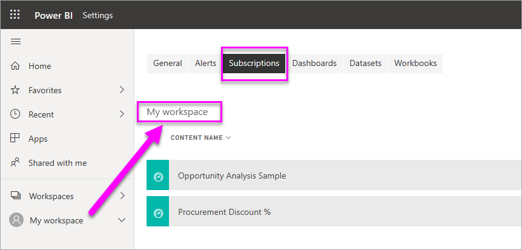

# Subscribe yourself and others to a report or dashboard in Power BI service
It's never been easier to stay up-to-date on your most important dashboards and reports. Subscribe yourself and your colleagues to report pages and dashboards that matter most to you, and Power BI will email a snapshot to your inbox. You tell Power BI how often you want to receive the emails: daily, weekly, or once a day after the initial data refresh.  If you choose daily or weekly, you can choose the time(s) you'd like to have the subscription run.  In all, you can set up to 24 subscriptions per day, per report or dashboard.

The email and snapshot will use the language set in Power BI settings (see [Supported languages and countries/regions for Power BI](supported-languages-countries-regions.md)). If no language is defined, Power BI uses the language according to the locale setting in your current browser. To see or set your language preference, select the cog icon  > **Settings > General > Language**. 

Subscriptions can only be created in Power BI service. When you receive the email, it includes a link to "go to report or dashboard". On mobile devices with Power BI apps installed, selecting this link launches the app (as opposed to the default action of opening the report or dashboard on the Power BI website).

## Requirements
- **Creating** a subscription is a Power BI Pro feature.
- You don't need edit permissions to the content (dashboard or report) to create a subscription for yourself, but you must have edit permissions to create one for someone else. 
- As of January 2019, you no longer must have a dataset refresh to set up and run a subscription.  It runs independent of any scheduled refreshes you have set up.  

## Subscribe to a dashboard or a report page
Whether you're subscribing to a dashboard or report, the process is similar. The same button allows you to subscribe to Power BI service dashboards and reports.
 
.

1. Open the dashboard or report.
2. From the top menu bar, select **Subscribe** or select the envelope icon .
   
   

3. Use the yellow slider to turn the subscription on and off.  Setting the slider to Off doesn't delete the subscription. To delete the subscription, select the trashcan icon.

4. Fill in the email message details. Your email is pre-populated but you can add others to the subscription as well. Only email addresses in the same domain can be added (see **Considerations and troubleshooting** below for more details). If the report or dashboard is hosted in [Premium capacity](service-premium.md), you'll be able to subscribe others using individual email addresses and group aliases. If the report or dashboard is not hosted in Premium capacity, you can still subscribe others using their individual email addresses, but they too must have Power BI Pro licenses.

5. Select a Frequency for your subscription.  You may choose Daily, Weekly, or After Data Refresh (Daily).  To receive the subscription email only on certain days, select Weekly and select which days you'd like to receive it.  For example, if you'd like to receive the subscription email only on weekdays, select Weekly for your frequency and uncheck the boxes for Sat/Sun.  

6. If you choose Daily or Weekly for your frequency, you can also choose a Scheduled Time for the subscription.  You have the option to choose the top of the hour and either 15, 30, or 45 minutes past.  You can select whether it should run in the morning (AM) or afternoon/evening (PM).  You can also choose the timezone you'd like the subscription time to adhere to when it runs.

7. By default, the start time for your subscription will be the date you create it. You have the option to select an end date.  However, if you don't enter an end date, the end date is automatically set to end one year after your start date.  When a subscription reaches an end date, it stops until you re-enable it.  You can change it to any date in the future (up to the year 9999) at any time before the subscription ends.  You will receive notification(s) before the scheduled end date to ask if you'd like to extend it.    

    In the screenshots below, notice that when you subscribe to a report, you're actually subscribing to a report *page*.  To subscribe to more than one page in a report, select **Add another subscription** and select a different page. 
      
     

7. Select **Save and close**. Those subscribed receive an email and snapshot of the dashboard or report page for the frequency and time you selected. In all, you may create up to 24 subscriptions per report or dashboard, and can provide unique recipients, times, and frequencies for each subscription.  All subscriptions that have the frequency set to After Data Refresh for your dashboard or report will still only send an email after the first scheduled refresh.   
   
    
   
   > [!TIP]
   > Want to see the email right away? Trigger an email by refreshing one of the datasets associated with the dashboard or the dataset associated with the report. If you don't have edit permissions to the dataset, you have to ask someone who has those permissions to do this for you. To find out which datasets are being used, select the **View related** icon  to open **Related content** and then select the refresh icon  . 
   > 
   > 
   
   

## Manage your subscriptions
Only the person who created the subscription can manage it.  There are two paths to the screen for managing your subscriptions.  The first is by selecting **Manage all subscriptions** from the **Subscribe to emails** dialog (see screenshots below step 4 above). The second is by selecting the Power BI cog icon  from the top menubar and choosing **Settings**.

The particular subscriptions displayed will depend on which workspace is currently active.  To see all of your subscriptions at once for all workspaces, be sure that **My Workspace** is active. For help understanding workspaces, see [Workspaces in Power BI](service-create-distribute-apps.md).

A subscription will end if the Pro license expires, the dashboard or report is deleted by the owner, or the user account used to create the subscription is deleted.

## Considerations and troubleshooting
* For dashboard email subscriptions, if any tiles have row level security (RLS) applied, those tiles will not display.  For report email subscriptions, if the dataset uses RLS, you will not be able to create a subscription.
* Report page subscriptions are tied to the name of the report page. If you subscribe to a report page, and rename it, you will have to re-create your subscription
* Your organization may configure certain settings in Azure Active Directory that limit the ability to use email subscriptions in Power BI.  These limitations include, but aren't limited to, having multi-factor authentication or IP range restrictions when accessing resources.
* Currently, email subscriptions for reports/dashboards using live connection datasets aren't supported when subscribing users other than yourself.
* Email subscriptions do not support most [custom visuals](power-bi-custom-visuals.md).  The one exception is those custom visuals that have been [certified](power-bi-custom-visuals-certified.md).  
* Email subscriptions do not support R-powered custom visuals at this time.  
* If any dashboard tiles have row level security (RLS) applied, those tiles will not display.
* You can't subscribe other users to a report that has row level security (RLS) applied.
* Email subscriptions are sent with the report's default filter and slicer states. Any changes to the defaults that you make after subscribing will not show up in the email.    
* For dashboards subscriptions specifically, certain types of tiles are not yet supported.  These include: streaming tiles, video tiles, custom web content tiles.     
* If you share a dashboard with a colleague outside of your tenant, you will not be able to also create a subscription for that colleague. So if you are aaron@xyz.com, you can share with anyone@ABC.com, but you cannot yet subscribe anyone@ABC.com and they cannot subscribe to shared content.      
* Subscriptions may fail on dashboards or reports with extremely large images due to email size limits.    
* Power BI automatically pauses refresh on datasets associated with dashboards and reports that have not been visited in more than two months.  However, if you add a subscription to a dashboard or report, it will not be paused even if it goes unvisited.    
* If you aren't receiving the subscription emails, ensure that your User Principal Name (UPN) can receive emails. [The Power BI team is working on relaxing this requirement](https://community.powerbi.com/t5/Issues/No-Mail-from-Cloud-Service/idc-p/205918#M10163), so stay tuned. 
* If your dashboard or report is in Premium capacity, you can use group email aliases for subscriptions, instead of subscribing colleagues one email address at a time. The aliases are based on the current active directory. 

## Next steps
* More questions? [Try asking the Power BI Community](http://community.powerbi.com/)    
* [Read the blog post](https://powerbi.microsoft.com/blog/introducing-dashboard-email-subscriptions-a-360-degree-view-of-your-business-in-your-inbox-every-day/)

