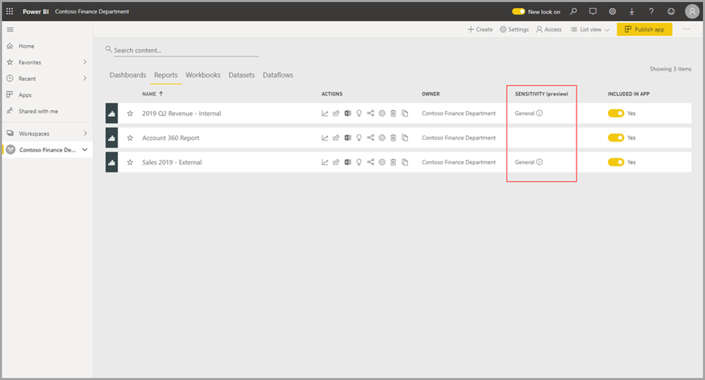
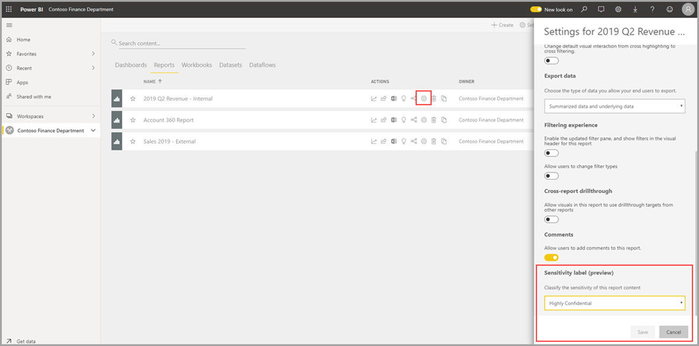
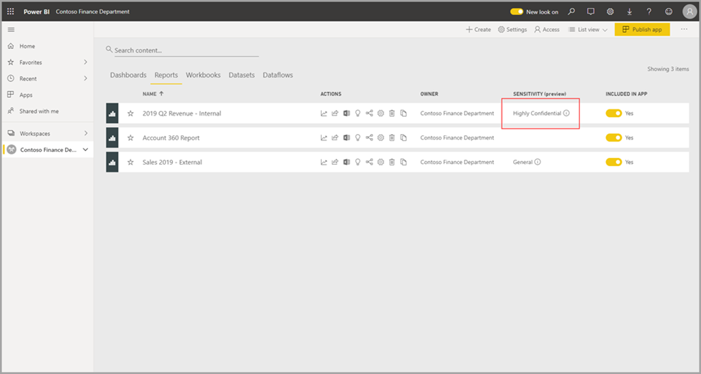

# Apply data sensitivity labels in Power BI (preview)

When Microsoft Information Protection is enabled in the Power BI service, you can protect your dashboards, reports, datasets, and dataflows against unauthorized access and leakage by applying data sensitivity labels to them. Labeling your data correctly with data sensitivity labels ensures that only authorized people can access your data.

When data protection is enabled, sensitivity labels appear in the sensitivity column in the list view of dashboards, reports, datasets, and dataflows.

> [!NOTE]
> To apply sensitivity labels to Power BI dashboards, reports, datasets, and dataflows, you need a Power BI Pro license and edit permissions on the report. In addition, you must belong to a security group that has permissions to apply data sensitivity labels to Power BI artifacts.

## Applying sensitivity labels
To set or change a sensitivity label, click the report settings icon on the workspace list item and then go to the data sensitivity section in the settings side pane. Choose the appropriate sensitivity label and save the settings.

The updated sensitivity label appears in the sensitivity column. 

##Data protection in exported files

When you [export data from a visual report](https://docs.microsoft.com/power-bi/consumer/end-user-export) that has a sensitivity label, the sensitivity label is inherited by the generated file. The sensitivity label will be visible in the file, and access to the file will be restricted to those who have sufficient permissions.

## Next steps

This article described how to apply data sensitivity labels in Power BI. The following articles provide more details about data protection in Power BI. 

* [Overview of data protection in Power BI](service-security-data-protection-overview.md)
* [Enable data sensitivity labels in Power BI](service-security-enable-data-sensitivity-labels.md)
* [Using Microsoft Cloud App Security controls in Power BI](service-security-using-microsoft-cloud-app-security-controls.md)