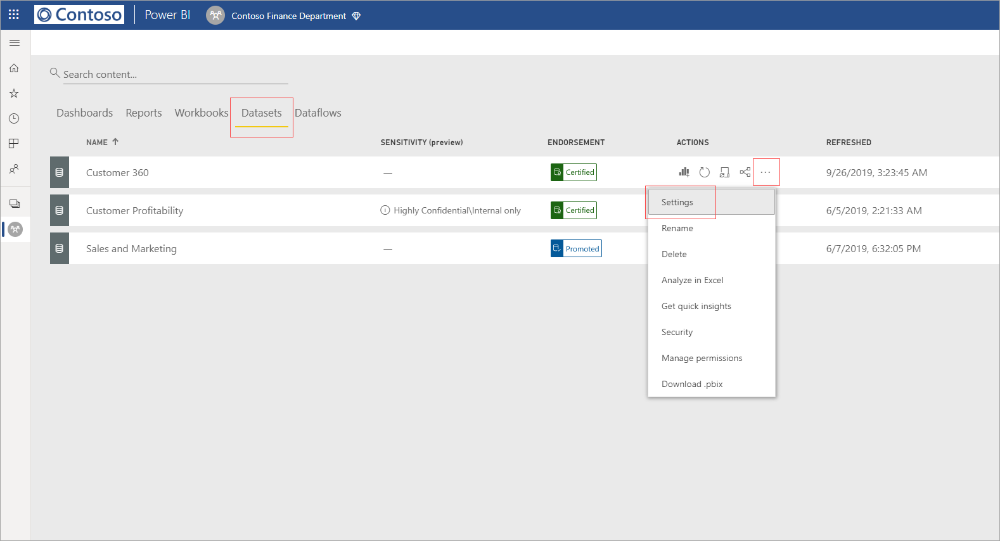

# Apply data sensitivity labels in Power BI (preview)

When Microsoft Information Protection is enabled in the Power BI service, you can protect your dashboards, reports, datasets, and dataflows against unauthorized access and leakage by applying data sensitivity labels to them. Labeling your data correctly with data sensitivity labels ensures that only authorized people can access your data.

When data protection is enabled, sensitivity labels appear in the sensitivity column in the list view of dashboards, reports, datasets, and dataflows.

> [!NOTE]
> To apply sensitivity labels to Power BI dashboards, reports, datasets, and dataflows, you need a Power BI Pro license and edit permissions on the report. In addition, you must belong to a security group that has permissions to apply data sensitivity labels to Power BI artifacts.

## Applying sensitivity labels

In order to apply sensitivity labels in Power BI, you and your organization must have the following requirements in place:

1.	Your organization has defined sensitivity labels in the Microsoft Security and Compliance center.
2.	You must belong to a security group that has permissions to apply data sensitivity labels, as described in the article titled [apply data sensitivity labels in Power BI (preview)](service-security-apply-data-sensitivity-labels.md).
3.	You must have a Power BI Pro license and edit permissions. 
4.	Your organization must have one of the following Microsoft Information Protection licenses:
    * APPI1
    * APP2
    * OFFICE E3/ E5
    * M365 E3/ E5
    * EMS E3/ E5

To set or change a sensitivity label on a report, click the report settings icon on the workspace list item and then go to the data sensitivity section in the settings side pane. Choose the appropriate sensitivity label and save the settings.

The updated sensitivity label appears in the sensitivity column. 

You can also set sensitivity labels on a dashboard, which follows the same process as described for reports. 

You can also set sensitivity labels on a dataset or dataflow. The following image shows how to set a sensitivity label on a dataset, the steps for dataflows are similar.

## Data protection in exported files

When you [export data from a visual report](https://docs.microsoft.com/power-bi/consumer/end-user-export) that has a sensitivity label, the sensitivity label is inherited by the generated file. The sensitivity label will be visible in the file, and access to the file will be restricted to those who have sufficient permissions.

## Considerations and limitations

Applying data sensitivity labels has the following considerations:

* Only reports, dashboards, datasets and dataflows support sensitivity labels
* Not all export scenarios support sensitivity labels
* Favorites, shared with me, and recants do not currently support sensitivity labels
* Only encryption policy is enforced from SCC
* Sensitivity labels are enforced by external policies only, and applied only on files that are downloaded and exported from Power BI; they are not applied within Power BI.

* Sensitivity labels are supported for dashboards, reports, datasets and dataflows.
* Sensitivity labels applied in a workspace are be applied on .xlsx, .pptx and .pdf files when exported data from the workspace, or from app view. 
* Sensitivity labels are currently not available for SSRS reports and workbooks.  
* You cannot currently delete a label from a Power BI resource once the label is set.
* The sensitivity label on a Power BI resource is visible only in workspace list view; labels are not currently visible in favorites, shared with me, recants, or app views.
* The sensitivity label *file Encryption policy*, configured in Microsoft Security and Compliance center, applies only on files that are exported from Power BI; it is *not* enforced within Power BI.
* Your organization must have a  require Microsoft Information Protection license to set labels in Power BI.

## Next steps

This article described how to apply data sensitivity labels in Power BI. The following articles provide more details about data protection in Power BI. 

* [Overview of data protection in Power BI](service-security-data-protection-overview.md)
* [Enable data sensitivity labels in Power BI](service-security-enable-data-sensitivity-labels.md)
* [Using Microsoft Cloud App Security controls in Power BI](service-security-using-microsoft-cloud-app-security-controls.md)