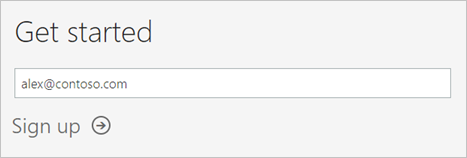
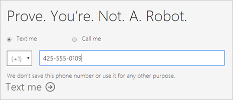

# Signing up for Power BI as an individual

Power BI can be your personal report and visualization tool, and can also serve as the analytics and decision engine behind group projects, divisions, or entire corporations. This article explains how to sign up for a Power BI trial as an individual. If you're a Power BI administrator, see [Power BI licensing in your organization](service-admin-licensing-organization.md).

## Supported email addresses

Before you start the sign-up process, it's important to understand the types of email addresses that you can use in Power BI:

* Power BI requires that you use a work or school email address to sign up. You cannot sign up using email addresses provided by consumer email services or telecommunication providers. This includes outlook.com, hotmail.com, gmail.com and others.

* After you sign up, you can [invite guest users](https://docs.microsoft.com/azure/active-directory/active-directory-b2b-what-is-azure-ad-b2b) to see your Power BI content with any email address, including personal accounts.

* You can sign-up for Power BI with .gov or .mil addresses, but this requires a different process. For more information, see [Enroll your US Government organization in the Power BI service](service-govus-signup.md).

## Sign up for a trial

Follow these steps to sign up for a Power BI Pro trial. See the next section, [Trial expiration](#trial-expiration), to understand your options when this trial expires.

1. Go to the [sign-up page](https://app.powerbi.com/signupredirect?pbi_source=web) in Power BI.

1. Enter your email address then select **Sign up**.

    

1. If you get a message like the following, choose an option to receive a verification code, then continue to the next step in this procedure.

    

    If you get a message like the following, complete the steps to sign in and use Power BI.

    

1. Enter the code that you received then select **Sign up**.

    

1. Check your email for a message like the following.

    

1. On the next screen, enter your information and the verification code from the email. Select a region, review the policies that are linked from this screen, then select **Start**.

    

1. You're then taken to https://app.powerbi.com, and you can begin using Power BI.

    

## Trial expiration

When your Power BI pro trial expires, your license is changed to a Power BI (free) license. When this happens, you no longer have access to features that require a Power BI Pro license. For more information, see [Features by license type](service-features-license-type.md).

If a Power BI (free) license is sufficient, no action is required. If you want to take advantage of Power BI Pro features, contact your IT administrator about purchasing a Power BI Pro license.

## Troubleshooting the sign-up process

In most cases, you can sign up for Power BI by following the process just described. That said, there are issues that can prevent you from signing up. We cover these issues and workarounds in the following table.
|                                                                                                                                                                                                                          **Symptom / Error Message**                                                                                                                                                                                                                           |                                                                                                                                                                                                                                                                                                                                                **Cause and Workaround**                                                                                                                                                                                                                                                                                                                                                |
|--------------------------------------------------------------------------------------------------------------------------------------------------------------------------------------------------------------------------------------------------------------------------------------------------------------------------------------------------------------------------------------------------------------------------------------------------------------------------------|------------------------------------------------------------------------------------------------------------------------------------------------------------------------------------------------------------------------------------------------------------------------------------------------------------------------------------------------------------------------------------------------------------------------------------------------------------------------------------------------------------------------------------------------------------------------------------------------------------------------------------------------------------------------------------------------------------------------|
| <strong>Personal email addresses (e.g. nancy@gmail.com)</strong> You receive a message like the following during signup:    *You entered a personal email address: Please enter your work email address so we can securely store your company's data.*    or    *That looks like a personal email address. Enter your work address so we can connect you with others in your company. And don't worry. We won't share your address with anyone.* |                          Power BI does not support email addresses provided by consumer email services or telecommunications providers.    To complete signup, try again using an email address assigned by your work or school.    If you still can't sign up and are willing to complete a more advanced setup process, you can [register for a new Office 365 trial subscription and use that email address to sign up](service-admin-signing-up-for-power-bi-with-a-new-office-365-trial.md).    You can also have an existing user [invite you as a guest](service-admin-azure-ad-b2b.md).                           |
|            **Self-service sign-up disabled** You receive a message like the following during sign-up:    *We can't finish signing you up. Your IT department has turned off signup for Microsoft Power BI. Contact them to complete signup.*    or    *That looks like a personal email address. Enter your work address so we can connect you with others in your company. And don't worry. We won't share your address with anyone.*             |                             Your organization's IT administrator has disabled self-service sign-up for Power BI.    To complete signup, contact your IT administrator and ask them to [follow the instructions to enable sign-up](service-admin-licensing-organization.md#enable-or-disable-individual-user-sign-up-in-azure-active-directory).    You may also experience this problem if you [signed up for Office 365 through a partner](service-admin-syndication-partner.md).                              |
|                                                                                          **Email address is not an Office 365 ID** You receive a message like the following during signup:    *We can't find you at contoso.com.  Do you use a different ID at work or school?    Try signing in with that, and if it doesn't work, contact your IT department.*                                                                                           | Your organization uses IDs to sign in to Office 365 and other Microsoft services that are different from your email address.  For example, your email address might be Nancy.Smith@contoso.com but your ID is nancys@contoso.com.    To complete sign-up, use the ID that your organization has assigned to you for signing in to Office 365 or other Microsoft services.  If you don't know what this is, contact your IT administrator.    If you still can't sign up and are able to complete a more advanced setup process, you can [register for a new Office 365 trial subscription and use that email address to sign up](service-admin-signing-up-for-power-bi-with-a-new-office-365-trial.md). |

## Next steps

[Purchasing Power BI Pro](service-admin-purchasing-power-bi-pro.md)  
[Power BI Service agreement for individual users](https://powerbi.microsoft.com/terms-of-service/)  

More questions? [Try asking the Power BI Community](http://community.powerbi.com/)