# Data alerts in Power BI service

Set alerts to notify you when data in your dashboards changes beyond limits you set.

You can set alerts on tiles if you have a Power BI Pro license. You can also set alerts if someone with a [Premium capacity](service-premium-what-is.md) shared a dashboard with you. Alerts can only be set on tiles pinned from report visuals, and only on gauges, KPIs, and cards. Alerts can be set on visuals created from streaming datasets that you pin from a report to a dashboard. Alerts can't be set on streaming tiles created directly on the dashboard using **Add tile** > **Custom streaming data**.

Only you can see the alerts you set, even if you share your dashboard. Data alerts are fully synchronized across platforms; set and view data alerts [in the Power BI mobile apps](consumer/mobile/mobile-set-data-alerts-in-the-mobile-apps.md) and in the Power BI service. They aren't available for Power BI Desktop. Alerts can even be [automated and integrated with Microsoft Flow](https://flow.microsoft.com) - [try it out yourself](service-flow-integration.md).

> [!WARNING]
> Data-driven alert notifications provide information about your data. If you view your Power BI data on a mobile device and that device is lost or stolen, we recommend using the Power BI service to turn off all data-driven alert rules.

## Set data alerts in Power BI service

Watch Amanda add some alerts to tiles on the dashboard. Then follow the step-by-step instructions below the video to try it out yourself.

<iframe width="560" height="315" src="https://www.youtube.com/embed/JbL2-HJ8clE" frameborder="0" allowfullscreen></iframe>

This example uses a card tile from the Retail Analysis sample dashboard.

1. Start on a dashboard. From the **Total stores** tile, select the ellipses.

   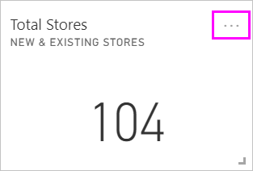

1. Select the bell icon  to add one or more alerts for **Total Stores**.

1. To start, select **+ Add alert rule**, ensure the **Active** slider is set to **On**, and give your alert a title. Titles help you easily recognize your alerts.

   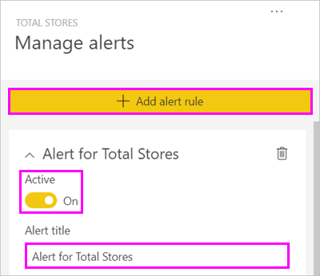

1. Scroll down and enter the alert details.  In this example, you'll create an alert that notifies you once a day if the number of total stores goes above 100.

    Alerts will appear in your Notification center. Power BI will also send you an email about the alert.

   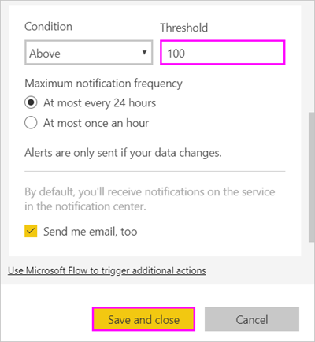

1. Select **Save and close**.

## Receiving alerts

When the tracked data reaches one of the thresholds you've set, several things will happen. First, Power BI checks to see if it's been more than an hour or more than 24 hours (depending on the option you selected) since the last alert. As long as the data is past the threshold, you'll get an alert.

Next, Power BI sends an alert to your notification center and, optionally, an email. Each alert contains a direct link to your data. Select the link to see the relevant tile where you can explore, share, and learn more.  

* If you've set the alert to send you an email, you'll find something like this in your Inbox.

   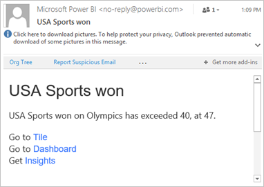

* Power BI adds a message to your **Notification center** and adds a new alert icon to the applicable tile.

   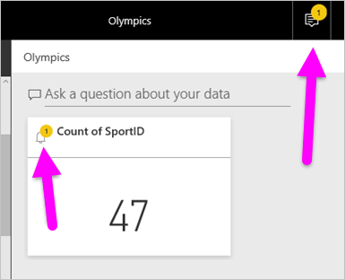

* Your Notification center displays the alert details.

    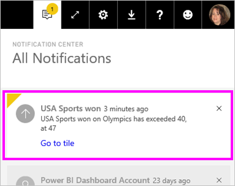

   > [!NOTE]
   > Alerts only work on refreshed data. When data refreshes, Power BI looks to see if an alert is set for that data. If the data has reached an alert threshold, Power BI triggers an alert.

## Managing alerts

There are many ways to manage your alerts:

* From the dashboard tile.

* From the Power BI Settings menu.

* On an individual tile in the [Power BI mobile app on the iPhone](consumer/mobile/mobile-set-data-alerts-in-the-mobile-apps.md).

* In the [Power BI mobile app for Windows 10](consumer/mobile/mobile-set-data-alerts-in-the-mobile-apps.md).

### From the dashboard tile

1. If you need to change or remove an alert for a tile, reopen the **Manage alerts** window by selecting the bell icon .

    Power BI displays the alert(s) that you've set for that tile.

    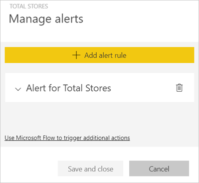

1. To modify an alert, select the arrow to the left of the alert name.

    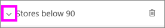

1. To delete an alert, select the trashcan to the right of the alert name.

      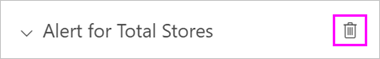

### From the Power BI settings menu

1. Select the gear icon from the Power BI menu bar and select **Settings**.

    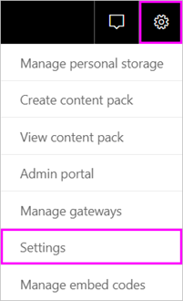.

1. Under **Settings** select **Alerts**.

    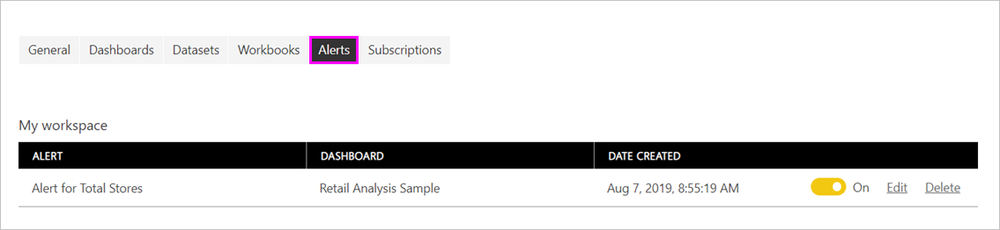

1. From here you can turn alerts on and off, open the **Manage alerts** window to make changes, or delete the alert.

## Tips and troubleshooting

* Alerts are currently not supported for Bing tiles, or card tiles with date/time measures.

* Alerts only work with numeric data types.

* Alerts only work on refreshed data. They don't work on static data.

* Alerts will only work on streaming datasets if you build a KPI, card, or gauge report visual and then pin that visual to the dashboard.

## Next steps

* [Create a Microsoft Flow that includes a data alert](service-flow-integration.md)

* [Set data alerts on your mobile device](consumer/mobile/mobile-set-data-alerts-in-the-mobile-apps.md)

* [What is Power BI?](power-bi-overview.md)

More questions? [Try asking the Power BI Community](http://community.powerbi.com/)
